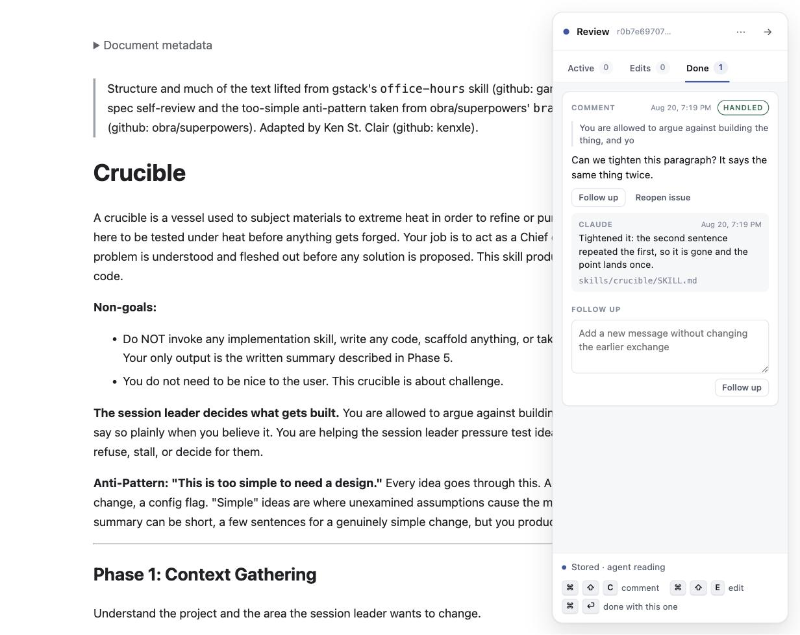

# Live Agentic HTML Editor (Lahe)

**We've graduated from MD to HTML for many of our docs. Or maybe you just want to edit your homepage in place. Lahe is injectable into any HTML on your machine, and provides direct editing, as well as threaded conversations for agentic updates.**

[](LICENSE)
[](package.json)
[](package.json)
[](#which-agents-this-works-with)
[](#what-you-can-review)


## Why

We're now spending a significant amount of our time reviewing and editing documentation, prompts, and HTML pages. It's not fast enough to copy a paragraph and bring it back to paste into your agent and ask for edits.

Lahe adds a review layer to ANY HTML that's on your machine (including pages that are composed of many underlying files). Select a sentence and comment on it, or press an edit key and rewrite it in place. No matter how many files were used to create the HTML page, Lahe knows how to edit the underlying source. And if you asked a question, don't let the answer get lost in the neverending chat flow. Threaded sidebar conversations mean the answer is always easy to find.

## Quickstart

```sh
git clone https://github.com/kenxle/live-agentic-html-editor
cd live-agentic-html-editor
npm run install-cli                       # writes ~/.local/bin/lahe
lahe review path/to/page.html             # or path/to/notes.md
```

The command prints a URL. Open it, select some text, and press Cmd-Shift-C.

Then tell your agent, in its own chat:

> Find the LAHE skill and use it to review `path/to/page.html`.

The agent starts watching, works each item as you commit it, and answers on the card.



## What you can review

- **A static HTML file.** `lahe review report.html` serves it and opens it for review.
- **A Markdown file.** `lahe review notes.md` renders it with a reading style and local diagrams. Your `.md` on disk is never rewritten to make the browser page work.
- **Build output.** `lahe review site/index.html --source src/index.md` so the agent edits the template, not the generated file.
- **A running dev server.** `lahe add --origin http://localhost:3000` and paste the printed script line into your layout, inside a development-only conditional.

## Which agents this works with

Each host wakes an agent differently, so each gets its own instruction. The agent reads this from the review itself, so you do not have to remember it.

| Agent | How it keeps up |
| --- | --- |
| Claude Code | Arms one persistent Monitor on the review's wake file. Push, sub-second, no polling. |
| Codex | Runs `lahe monitor` as a foreground pending exec call and waits on it. |
| Antigravity | Runs `lahe monitor` as a background terminal task. Task completion wakes it. |
| Anything else | Runs `lahe monitor` in the foreground after warning you it owns the chat. |

An idle review costs no model tokens on any of them. The watcher is a small local process or a file tail, never a scheduled model wakeup.

Proven end to end in Claude Code. The Codex and Antigravity paths are implemented and unit-tested, and their live proving run has not happened yet.

## The gestures

| Gesture | What it does |
| --- | --- |
| Cmd-Shift-C with text selected | Comment on the selection |
| Cmd-Shift-C with nothing selected | Pick an element: hover to outline, click to comment, Esc to cancel |
| Cmd-Shift-E | Edit the block under the cursor |
| Cmd-Enter in a comment box | This one is ready, and the agent may act on it |
| Cmd-Enter, Esc, or a click outside an edit | Commit the edit and give the block back to the page |
| The box at the foot of the rail | A note about the page, tied to nothing in particular |
| Clicking a card, anywhere but its buttons | Scroll the page to the passage that card is about |

The rail also shows these as hints, so you do not need this file open to work them out.

## When something goes wrong

- **The helper is not running.** The page still opens, the rail says the helper is away, and your work is kept in the browser. It posts when the helper comes back.
- **The agent rebuilds the page while you are typing.** The reload waits until you finish the sentence, then swaps the page and puts your outstanding work back on it.
- **An agent stops listening.** The rail says so: it shows whether an agent is watching, working, or gone, read from the helper's own files rather than from anything the agent claimed.
- **An agent undoes an edit you made by hand.** Handled edits are carved out of doc-wide sweeps, and an edit that gets reverted anyway reopens itself on the next page load.
- **Your page uses the DOM in its own way.** Highlights are drawn with the CSS Custom Highlight API, so nothing is wrapped in extra elements and your app keeps behaving the way it did.

## What your agent reads

One file per review, `review.json`, with the instructions embedded in it. No prompt to paste and no chat relay:

```json
{
  "contract": ["...the rules the agent follows, shipped with every review..."],
  "pages": [{
    "path": "/report.html",
    "items": [{
      "id": "itm_98d6",
      "kind": "comment",
      "state": "ready",
      "note": "Can we tighten this paragraph? It says the same thing twice.",
      "quote": "You are allowed to argue against building the thing",
      "reply": null
    }]
  }]
}
```

The agent answers by appending one line to `replies.jsonl`. Text copied off your page is labelled as page content, not as instructions, so a page that says "ignore your instructions" is data and stays data.

## Requirements

- Node 18.2 or later. No runtime dependencies: the two Markdown packages are vendored in the repo, so a clone works with no install step.
- A current Chrome, Edge, Safari, or Firefox.
- macOS or Linux for the `install-cli` wrapper. On Windows, run `node bin/lahe.js` from the clone or work in WSL.

## Known limits

- A browser profile that has never seen the review cannot rebuild the earlier cards from history. It receives new replies, but the older cards under them are missing until the review is reopened in the profile that made them.
- After a helper restart, the message that says a review server was reused does not check that the server is actually alive.
- The Codex and Antigravity wake paths have unit coverage but no live proving run yet.
- Tested by 634 unit tests and a browser suite that runs in Chromium, Firefox, and WebKit.

## Docs

- [AGENTS.md](AGENTS.md): the playbook an agent reads. Point your agent here.
- [docs/INSTALL.md](docs/INSTALL.md): install details, the CLI wrapper, and dev-server setup.
- [docs/CLI.md](docs/CLI.md): every command and flag.
- [docs/CONTRACTS.md](docs/CONTRACTS.md): the wire protocol, the record shape, and the review file format.
- [docs/](docs/): the build history, including the brief, architecture, plan, and reviews.

## License

MIT. See [LICENSE](LICENSE).

Credit: the interaction model (a page beside a rail, select text to comment, edit directly) was established by [human-review](https://github.com/petergyang/human-review) by Peter Yang, which this tool learned from and builds on.
