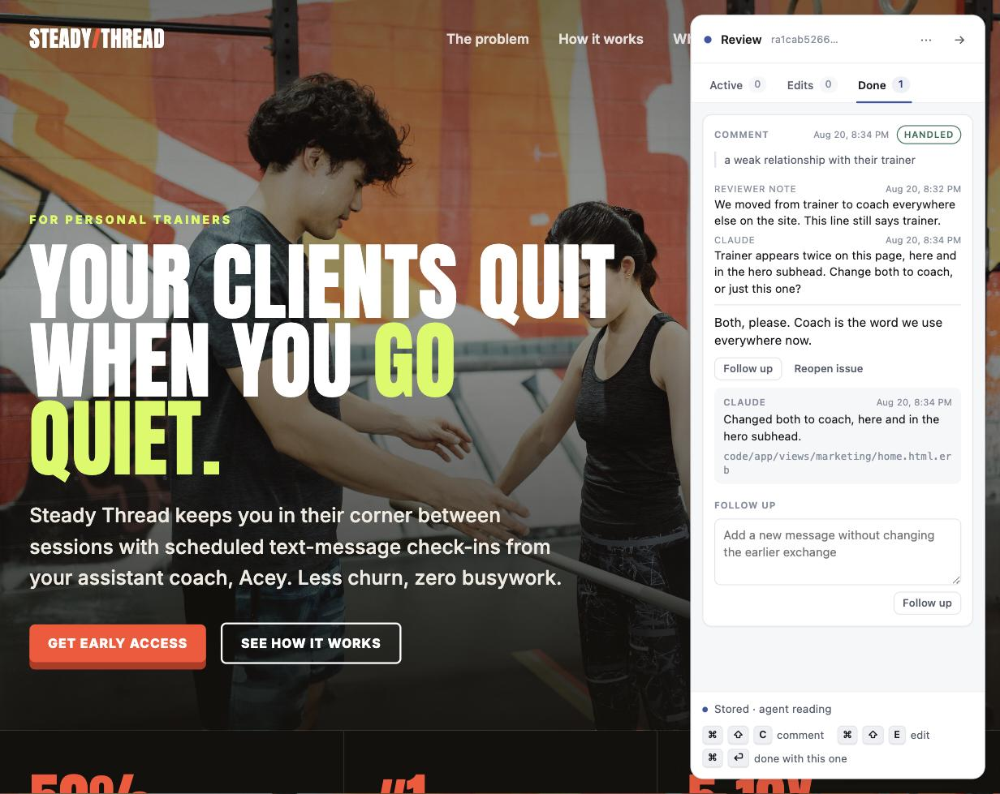

# Live Agentic HTML Editor (Lahe)

**We've graduated from MD to HTML for many of our docs. Or maybe you just want to edit your homepage in place. Lahe is injectable into any HTML on your machine, and provides direct editing, as well as threaded conversations for agentic updates.**

[](LICENSE)
[](package.json)
[](package.json)
[](#which-agents-this-works-with)
[](#features)



## Why

We're now spending a significant amount of our time reviewing and editing documentation, prompts, and HTML pages. It's not fast enough to copy a paragraph and bring it back to paste into your agent and ask for edits.

Lahe adds a live review layer to any HTML that's on your machine (including pages that are composed of many underlying files). Select a sentence and comment on it, or press an edit key and rewrite it in place.

No matter how many files were used to create the HTML page, Lahe knows how to edit the underlying source. And if you asked a question, don't let the answer get lost in the neverending chat flow. Threaded sidebar conversations mean the answer is always easy to find.

## Features

**Leaving feedback**

- **Comment for an agentic rewrite.** Select a passage, say what is wrong, and let the agent write the fix.
- **Comment on any object, not just text.** Press Cmd-Shift-C with nothing selected to pick an element: hover to outline it, click to comment. Diagrams, images, charts, a whole section.
- **Edit to use your own words.** Type the correction into the page. Your exact words reach the source file, not a paraphrase with added em dashes.
- **Ask questions and get threaded answers.** Ask a question and the answer arrives on the same card, no need to go back to the chat window. An exchange from ten minutes ago is threaded and easy to find, not lost in the neverending scroll of the chat window.
- **Drafted until sent.** A half-typed thought is private to your browser until you hit Cmd-Enter.
- **Hotkeys for speed.** Comment, edit, and send without reaching for the mouse.

- **Hand-made edits are protected.** If a doc-wide change would clobber your carefully crafted text, it stops at text you placed by hand and asks. If an edit gets reverted anyway, the item reopens itself.

**Working with the source**

- **Many source files, one page to review.** A page built from templates, includes, or partials is reviewed as a single built page. The agent edits the underlying files.
- **Markdown or HTML.** A `.md` file (or multiple) is rendered for editing, diagrams included. Your prompt is assembled from multiple underlying modular files? No worries, live edit the rendered output as a single page and let your agent edit the underlying template files.

**Many reviews, many agents**

- **One agent, many reviews.** A single agent can handle multiple review sessions, each with their own conversations.
- **A review can follow you across pages.** Click through a site and each page shows only the edits you left on that page. The agent keeps all of it across pages.
- **Several agents at once, without collisions.** Every review has a session owner. Three agents on three documents never see each other's items, and a watcher only ever wakes for its own session.
- **Clean handovers.** Just ask a different agent to take over a live or a closed session. Start with Claude and switch to Codex, no problem.

**Staying in sync**

- **Local server, hot updates.** The agent lands a change and the page updates itself.
- **Smart reloads wait for you.** A reload holds while you are typing a comment or mid-edit, then swaps the page and puts your outstanding work in when you're in between comments.
- **Live status.** The rail says whether an agent is watching, working, or gone.
- **Unread answers are pointed out.** The agent flags replies you should actually read, so a routine confirmation stays quiet and a real answer does not.

**No lost work!**

- **Several fallbacks for saving your feedback.** Save to browser storage on every keystroke. Queue in an outbox that survives a reload or a hard kill. Retries with backoff while the helper is away. Append to a durable event log on disk. And "Copy review" and "Export review to file" if nothing else is working or you want to carry it out by hand.
- **Session restarts.** Prior sessions can be revived or picked up after a crash, without losing what is unanswered.
- **Multi-tab detection.** You have 10^1000 tabs open and you opened the same page twice? The second tab says so, and lets you move control to the tab you are actually using.

**Under the hood**

- **No service in the middle.** There is no Lahe account, no Lahe server, and no telemetry. Your feedback goes to the agent you already use, the same place it would go if you pasted it into the chat, and nowhere else.
- **Zero model tokens while you are quiet.** A push model taps agents only when you send a comment, so a document left open overnight doesn't burn your tokens on no-ops.
- **Your app keeps working normally.** Highlighting a passage does not add anything to your page, so your own buttons, layout, and scripts behave exactly as they did.
- **Clone and go.** Clone the repo and ask your agent to finish the setup. All the instructions are packaged within.

## Quickstart

Clone it, and hand the rest to your agent:

```sh
git clone https://github.com/kenxle/live-agentic-html-editor
```

> Set up Live Agentic HTML Editor from `./live-agentic-html-editor`, following its `AGENTS.md`, then use it to review `path/to/page.html`.

Your agent installs the command, opens the review, and starts watching. Open the URL it prints, select some text, and press Cmd-Shift-C. It works each item as you commit it and answers on the card.

If your agent already has the Lahe skill installed, that first line is all it needs:

> Use Lahe to review `path/to/page.html`.

**Or set it up yourself**

```sh
cd live-agentic-html-editor
npm run install-cli                       # writes ~/.local/bin/lahe
lahe review path/to/page.html             # or path/to/notes.md
```

## Which agents this works with

Each host wakes an agent differently, so each gets its own instruction. The agent reads this from the review itself, so you do not have to remember it.

| Agent | How it keeps up |
| --- | --- |
| Claude Code | Arms one persistent Monitor on the review's wake file. Push, sub-second, no polling. |
| Codex | Runs `lahe monitor` as a foreground pending exec call and waits on it. |
| Antigravity | Runs `lahe monitor` as a background terminal task. Task completion wakes it. |
| Anything else | Runs `lahe monitor` in the foreground after warning you it owns the chat. |

An idle review costs no model tokens on any of them. The watcher is a small local process or a file tail, never a scheduled model wakeup.

## The gestures

| Gesture | What it does |
| --- | --- |
| Cmd-Shift-C with text selected | Comment on the selection |
| Cmd-Shift-C with nothing selected | Pick an element: hover to outline, click to comment, Esc to cancel |
| Cmd-Shift-E | Edit the block under the cursor |
| Cmd-Enter in a comment box | This comment is ready, send it to the agent |
| Cmd-Enter, Esc, or a click outside an edit | Commit the edit and give the block back to the page |
| The box at the foot of the rail | A note about the page, tied to nothing in particular |
| Clicking a card, anywhere but its buttons | Scroll the page to the passage that card is about |

The rail also shows these as hints, so you do not need this file open to work them out.

## When something goes wrong

- **The helper is not running.** The page still opens, the rail says the helper is away, and your work is kept in the browser. It posts when the helper comes back.
- **The agent rebuilds the page while you are typing.** The reload waits until you finish the sentence, then swaps the page and puts your outstanding work back on it.
- **An agent stops listening.** The rail says so: it shows whether an agent is watching, working, or gone, read from the helper's own files rather than from anything the agent claimed.
- **An agent undoes an edit you made by hand.** Handled edits are carved out of doc-wide sweeps, and an edit that gets reverted anyway reopens itself on the next page load.

## Requirements

- Node 18.2 or later. No runtime dependencies: the two Markdown packages are vendored in the repo, so a clone works with no install step.
- A current Chrome, Edge, Safari, or Firefox.
- macOS or Linux for the `install-cli` wrapper. On Windows, run `node bin/lahe.js` from the clone or work in WSL.

## Docs

- [AGENTS.md](AGENTS.md): the playbook an agent reads. Point your agent here.
- [docs/INSTALL.md](docs/INSTALL.md): install details, the CLI wrapper, and dev-server setup.
- [docs/CLI.md](docs/CLI.md): every command and flag.
- [docs/CONTRACTS.md](docs/CONTRACTS.md): the wire protocol, the record shape, and the review file format.
- [docs/](docs/): the build history, including the brief, architecture, plan, and reviews.

## License

MIT. See [LICENSE](LICENSE).
