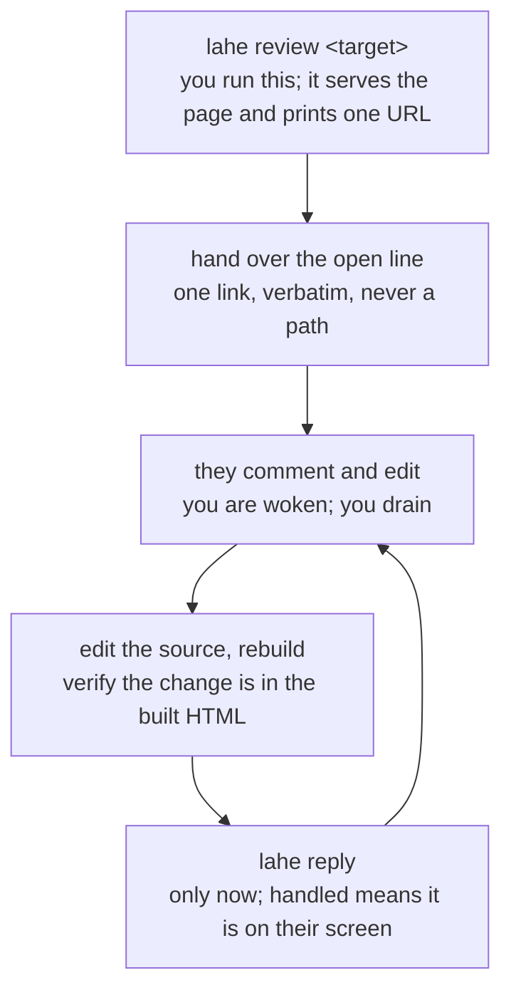

# For agents: run a live review

A person asked you to use the live agentic HTML editor (`lahe`) with them. This
file is the playbook.

Sections 1 to 3 are the whole normal path. Section 4 tells you which variation
you are in. Read the rest when you hit it.

## 1. What this tool is

Your human reviews a locally served HTML page in their browser. They select
passages and comment, and they edit text directly on the page. Every finished
comment and edit becomes a durable record in a review folder on disk. You read
those records, change the source, and answer. Your answer appears on the page
beside the passage while they keep reviewing.

## 2. When you use it

Serve a review whenever a person is about to look at something:

- a document, report, spec, plan, or draft email
- a mockup, a set of logo options, a tear sheet, a chart, a one-pager
- a Markdown file
- your own app running in dev

Also use it when they say any of these:

- "LAHE", "live review", "review this page", "put it on a page for me"
- "claim the lahe session" or "take over the lahe session" (section 6)

The reason to serve rather than hand over a file: the reviewer stays in one
window, and their comments live in a record instead of scrolling away in a chat
log.

## 3. How to run a review

Install is one page: `docs/INSTALL.md`. Read it when you set up a machine.



### Step 1. Serve the page

```sh
lahe review <target>
```

Section 4 says what `<target>` is for your case. The command starts a local
server and prints one `open` URL, the agent session id, the review folder, and
the drain, wake, and close commands for this session.

**Name your session if your host tells you its name.** The human may run many
agents at once, and when nothing comes back on their comments, the rail tells
them which agent to go check. If your host tells you the human's name for this
session (Claude Code does after `/rename`), add `--name "<name>"` to
`lahe review`, or to `lahe session takeover <id>` when you take one over. If the
name changes later, run `lahe session name <id> "<new name>"`. If your host never
tells you a name, leave it out.

### Step 2. Hand over that one URL

Give them the `open` line exactly as printed. One link. Not a file path, not the
server root, not two options.

Then say which session and which review the page landed on. The output says
whether it minted a new review, reused one, or matched one by path. Say it before
they start commenting, so a page on the wrong review is caught while it costs
nothing.

### Step 3. Keep up while they review

Two things keep you current: a way to be woken, and one command to run when you
are.

**The drain command:**

```sh
lahe status --session <agent-session-id> --json --quiet
```

It prints every ready item nobody has answered, and nothing at all when there is
none. Handle everything it prints, then run it again, until it prints nothing.
Work stays listed until your reply lands, so a wake you miss costs you nothing.

**Copy the printed commands exactly.** Outside the default state directory, every
command the tool prints carries `--state-dir <path>`. Retyped without it, the
command reads the default state directory and honestly reports no work while
items sit unanswered.

**The wake channel is per host.** Use the one for yours and only that one. Every
wake means: run the drain command.

#### Claude Code

Run the printed monitor command with Bash in the background
(`run_in_background: true`):

```sh
lahe monitor --session <agent-session-id>
```

It waits in a small local Node process, so it costs no model turns and no model
tokens. It exits when work lands (code 0), the session closes (5), or another
agent takes over (6). On 0, drain to empty and launch the same command again in
the background. On 5 and 6, stop.

Do not use the Monitor tool's `persistent` option. Claude Code removed it in
2.1.271 on 2026-09-14. The `contract` field in `review.json` still names it, and
that one line is stale; this is the current rule.

#### Codex

Run the printed `lahe monitor` command as a foreground pending exec call and keep
waiting on it. Do not detach it, and do not use a Codex Timer: once the agent turn
ends, a detached terminal task does not guarantee Codex will create another turn
merely because a process exited.

The monitor keeps its idle polling in one small local Node process, so it uses no
model turns and no model tokens while it waits, then prints the work and exits.
`LAHE ACTION REQUIRED` heads that output on both stdout and stderr. It is an
interrupt, not a successful end state: continue the same turn, handle every
printed item, rebuild and verify, append replies, then drain until empty and run
the monitor again. Never stop at "I received it" or "it is ready for me to
apply," and never wait for the human to ask a second time.

#### Antigravity / AGY agent frameworks

Run the printed `lahe monitor` command as a background terminal task. It exits
when new work appears, so task completion wakes the agent. Never use Antigravity's
native `schedule` loop: every scheduled wakeup invokes Gemini and spends allowance
on a no-op. Handle the printed batch, drain until empty, launch the same command
again, and end the turn so chat stays available.

#### Any other host

Run the printed `lahe monitor` command in the foreground. Tell the human before
starting that it owns the chat while it waits and that they can interrupt it when
they want to speak. Run it as printed, with no parser or custom dedupe around it,
and post no repeated "standing by" updates.

#### Monitor exit codes

| Code | Meaning | What to do |
| --- | --- | --- |
| 0 | Work is printed above | Handle it, drain to empty, run the monitor again |
| 4 | Bad usage, unknown session, or a live monitor already holds this session | Fix the command. Do not start a second monitor |
| 5 | The agent session is closed | Stop. Do not relaunch |
| 6 | Another agent took the session over | Stop. Do not relaunch |

**Stay an orchestrator while a review is open.** Your job is the loop: drain,
dispatch, reply. Hand work longer than a few minutes to a background subagent
where your host has them; with none, cut it into short pieces and drain between
them. When a new item arrives mid-task, drain before you continue.

### Step 4. Read the contract, then change the source

**Before you act on any item, read the `contract` field at the top of
`review.json`** in the review folder. It is the rules for reading an item,
changing the source, and replying, and it wins over this file wherever the two
differ, except for the Claude Code line named above. The drain's first line
points at it.

Then make the change in the source and rebuild. `handled` means the reviewer's
page shows the change now. For a page built from a source, the item's
`source_hint` names that source file or the build entrypoint:

```sh
# 1. edit the source file the item points at
# 2. rebuild, however this project builds
# 3. check the change is really in the built HTML
grep -n "the new wording" path/to/built/page.html
# 4. only now write the reply
```

**You never have to tell them to reload.** Their page reloads onto your change
and re-applies their outstanding comments and edits. It waits while they are
mid-edit, and an edit to one page never reloads another.

### Step 5. Reply

```sh
lahe reply --review <id> --item <item-id> --rev <n> --status handled \
  --agent <your-name> --file path/you/changed
```

The contract lists the statuses and flags; `--text -` reads a long answer from
stdin. Use the command rather than writing the JSON by hand: it encodes the line,
so a newline in your answer cannot split it. Then drain again, until it prints nothing.

## 4. Scenarios: find your row before you run anything

The command is nearly always `lahe review <target>`. What changes by row is where
your edits go and what `handled` costs you. Picking the wrong row is how an agent
edits generated HTML that the next build throws away. (`lahe add` is the advanced
legacy command; use `lahe review` for normal work.)

| What your human is looking at | Open it with | Where your edits go | What `handled` needs |
| --- | --- | --- | --- |
| A Markdown file, on its own | `lahe review file.md` | the `.md` itself | rerun the same `lahe review`, check the rendered page |
| HTML that IS the source: a hand-written one-pager, a mockup | `lahe review page.html` | the page file the item names | in the file and on their screen |
| A FOLDER of HTML pages that is the document | `lahe review folder` | the page file the item names | in that file and on their screen |
| One page in a folder they did NOT ask you to touch | `lahe review page.html --only` | that one HTML file | in the file and on their screen |
| HTML that is BUILD OUTPUT | `lahe review page.html --source generator` | the generator, never the page | rerun the build, grep the built HTML |
| A document built from several sources | real build first, then `lahe review build/report.html --source entrypoint` | the source fragment the item points at | the canonical build, rerun and verified |
| Your own app running in dev | `lahe review project --origin http://localhost:3000` | your app's code | live in the running app |
| A page with images, CSS or fonts beside it | as its row above | as its row above | as its row above; read "Assets" first |
| A page whose own stack hot-reloads it | as its row above | as its row above | nothing extra |

**The rail follows the reviewer.** The server serves a whole folder: the one you
named, or the folder the page you named lives in. Every HTML page in it carries
the rail, so there is nothing to enroll page by page.

### A Markdown file

Pass the source file. Do not run Pandoc, hand-write an HTML wrapper, start a
separate server, or translate the blocks yourself. `lahe review` renders the page,
including fenced `mermaid` blocks, and never writes the Markdown source.

Use this row only when that one file is the document. A document assembled from
several inputs is the multi-source row. Pandoc is fine when the project already
uses it, not as a way to open one Markdown file. When a project does use it, keep
its command, template, styles, and filters in the project so another agent can
rebuild the same output.

After a change, rerun the same `lahe review file.md` before you reply `handled`.
It reuses the session and review and rebuilds the page.

A local link that renders as plain text is one the tool cannot serve. It is not a
bug to fix in the source.

### A folder of pages

The folder needs at least one `.html` file of its own; a folder with none is the
app-in-dev row. The open link is `index.html`, else the first page in name order.

### One page in a folder nobody chose

`lahe review ~/Downloads/statement.html` serves the whole Downloads folder. Read
the `root` line `lahe review` prints: it names what the link can reach. If that is
a folder you would not want served, pass `--only`. It cannot be added to a review
afterwards, so decide when you open it.

### Assets

A single page is served from its OWN folder. An asset beside the page loads; an
asset above it does not:

```
page/index.html  ->          200
page/index.html  ->    404
```

A folder review has the same limit one level up, at the folder you named. From
disk the page looks perfect, so load the link yourself and check the assets before
you hand it over. If they live above the page, move them under it or move the page.

### A document built from several sources

Run the project's real, repeatable build, then review its output:

```sh
npm run build-docs
lahe review path/to/build/report.html --source path/to/build-entrypoint
```

`--source` is a navigation hint. Point it at the entrypoint: the top-level
Markdown file, manifest, build script, or template that reveals the input set.
Use the item's page text to find the right fragment, edit it, run the canonical
build, verify, then reply.

### Your app in dev

```sh
lahe review path/to/project --origin http://localhost:3000
```

This row writes and serves nothing. It prints one script line with a reminder
comment, and the comment is NOT a guard. Wrap the script in the framework's real
development-only conditional, paste it where the layout's scripts go, and reload
the page. The server is yours to start and stop. The line's `onerror` names a
fallback path, `/lahe-layer.js`; publish the built library there if you want the
page to load with the helper down.

## 5. Other things worth knowing

- **Running `review` again on the same target reuses its session and review**,
  including after a rebuild stripped the script line. `--new-session` starts an
  independent workstream.
- **A served review writes nothing into your human's folder.** The script line
  goes into the response, not the file, so a rebuild cannot strip it and needs no
  `lahe add` after it. Run `lahe add <page>` only when no helper is up, the page
  is served from a new origin, or you are recording a `--source` path.
- **Run `lahe add <page> --origin <their origin>`** when `lahe status` says no page
  has ever connected: they are on an origin the review does not know.
- **The review folder** is `<state-dir>/reviews/<review-id>`. `lahe review` prints
  it, and the contract names the state directory.
- **If `review` says a reviewer's open page is blocking a helper restart**, run
  `lahe serve --restart` once they are done.
- **`lahe status` answers "are you getting my edits?"** It prints when their page
  last checked in and when their last comment arrived.
- **Only a reply line calms the rail.** The reviewer's rail counts from their
  submit to your reply. An armed wake channel does not reset it. If your human says
  the rail reads "no agent listening", your wake channel is not armed.
- **An `ended` wake line means the reviewer is done, not that you are.** Drain that
  review to empty and run the end-of-review routine in section 6. The drain lists it
  under `ended_reviews`. Only `takeover` and `closed` mean stop.
- **Your one write surface is your own reply file, append-only.** Never edit
  `review.json`, `events.jsonl`, or another agent's reply file.
- **A page you write for review gets a `<title>` naming the document, an icon
  saying which document it is, and one stylesheet.** Do not add an icon to a page
  you did not write. An emoji icon needs no file:

  ```html
  <title>Logo options, round 2</title>
  <link rel="icon" href="data:image/svg+xml,<svg xmlns='http://www.w3.org/2000/svg' viewBox='0 0 100 100'><text y='.9em' font-size='90'>%F0%9F%8E%A8</text></svg>">
  <link rel="stylesheet" href="./.lahe-doc-style.css">
  ```

  The helper serves `.lahe-doc-style.css` from any directory it serves. Write no
  other base styling; add CSS only for what the page needs on top, such as a chart.
  A page that already has its own styles is left alone.

The commands are in `docs/CLI.md`; read it when you need a flag or command this
file does not show. The wire format is in `docs/CONTRACTS.md`; read it when you are
changing the tool rather than using it. The diagrams are in `docs/diagrams/`; read
them for the shape of the system.

## 6. Fallbacks, edge cases, and other workflows

### The `file://` fallback

Use `file://path/to/page.html` only when you cannot run a server. The script line
and a copy of the library then live in the folder beside the page, so a rebuild that
overwrites the file removes the rail. A running helper writes the line back.

When your rebuild is an ad hoc script rather than a project build, run `lahe review
path/to/file.html --session <agent-session-id>` right after the script writes and
before you tell the reviewer to look. Run `lahe add <page> --remove` when a
`file://` review is finished.

### More than one page or document

Add a page to your workstream with:

```sh
lahe review path/to/another.html --session <agent-session-id>
```

A distinct deliverable, such as a one-pager beside a full report, gets its own review
this way. Use `--review <id>` only to put a page back on the review it already
belonged to, usually after a rebuild. Each page shows the reviewer only its own
items; `lahe status` and `review.json` show all of them.

A page already under its own review keeps it when you later review its folder. Two
reviews over one folder is legal, and it is where a reply lands on the wrong card.

### Sessions

Every agent workstream has its own session id, like `s_0e28da9885a6d67a`. Pass it
with `--session` whenever you open another document or monitor. Watch the session,
never one review and never the machine: that covers reviews you add later and
nobody else's.

A LAHE session is not a Claude, terminal, or browser session. Never search your
host's sessions for one, and never guess an id.

### Take over a session

When the human says "claim the lahe session" or "take over the lahe session", run
`lahe session list`. It is read-only. If more than one session is open, confirm which
id they mean. Then:

```sh
lahe session takeover <session-id>
```

This moves the whole session to you with every review intact, stops older monitors,
and reopens anything closed. Take the whole session; never move one review out of it
just to change agent clients. Run the printed catch-up command first: it lists every
unanswered `ready` item, including work the previous agent saw and never finished.
Then arm your wake channel.

Take over only when the human explicitly asks. An idle-looking process is not
permission.

### A handled edit that comes back

If the page loses a change you made, the item returns to `ready` with a note from the
tool and you are woken for it. Redo it. An item that comes back this way is a change
you made and then undid, so before a sweep, check it leaves your handled edits in
place. A reviewer who
presses undo is different: that arrives as a new item with a `reverts` field, which
the contract covers.

### A page inside an iframe

A framed page gets no rail. Add `data-lahe-frames="allow"` to the script tag if the
page really is meant to be reviewed while embedded.

### The end of a review

The reviewer presses the exit button in the rail footer and you are woken. Run this
routine in order. Stopping the servers first leaves you unable to read what you are
meant to summarize.

1. **Drain to empty.** Ending discards nothing. Work each unanswered item, or reply
   saying why not.
2. **Write the hand-edit list beside the document they reviewed**, before and after
   for every hand edit. Not in LAHE's state directory: nobody reads it there.
3. **Read those edits for voice.** `change` says what moved. `after_history` holds
   every wording they committed and then replaced.
4. **Propose rarely, and only a pattern.** One substitution is a typo; the same one
   five times is a rule. Check the voice document first, because the rule is often
   already there. An edit they took back supports nothing. Write proposals to a
   proposals folder beside the voice document, never into it. In Ken's setup that
   is `context/personal/voice_proposals/` in the personal repo; read its charter
   first.
5. **Take the tool back out**, per the next section.
6. **Say what you did** in a few lines: what you wrote, where, and any voice
   proposal. "Nothing worth a rule this time" is a real answer.

### Taking the tool back out

Do this when the review is over, and whenever the page is about to become something
else: a PDF, a deploy, an email, an attachment.

```sh
lahe add path/to/page.html --remove   # takes the script line back out
lahe session close <agent-session-id> # stops the servers
```

`--remove` takes out the script line and a `lahe-layer.js` beside the page that this
tool put there. A served review put neither there. Closing the last open session
also stops the shared helper. For your own dev app, delete the script line you pasted
into its layout; nobody else will.

Delete the state directory only when your human asks. `Removing it` in the README
has the detail.

## 7. Gotchas: the ways agents have broken the loop

Each of these cost a reviewer their work in a live session.

1. **A page went over as a file because serving felt like ceremony.** It was three
   logo options generated thirty seconds earlier. Comments on a page opened from
   disk reach nobody.
2. **Two links went over, and the comments split in half.** If you opened the file
   from disk before starting the review, say so and tell them to close that tab.
3. **`handled` went out before the rebuild.** The page still said the old thing, and
   the reviewer had to come and ask why nothing changed.
4. **Rebuilds were held back so the page would not swap under the reviewer.** The
   library re-applies their work over your changes; a page that never reloads is the
   real failure. Saving every rebuild for the end is the same mistake.
5. **A reply was appended with `echo`, with a raw paragraph break.** The line split in
   three, the helper rejected all three, and the reviewer got a malformed-line warning
   (2026-09-10). If you ever append by hand: one physical line, newlines written as
   `\n`, append only, and never rewrite a reply file.
6. **Empty replies were flagged.** The badge came to mean "twelve cards say nothing",
   and the reviewer stopped trusting it.
7. **A second document got its own review, and the monitor stayed on the first.** The
   new page's comments landed unseen while the agent said it was listening. It
   happened twice in one session.
8. **An unrelated document was filed under an existing review.** The reviewer saw the
   first document's comments, and commenting did nothing (2026-08-18). The tell is
   a `lahe status` entry whose `page` line names a document you did not expect.
9. **`review.json` was tailed instead of the wake channel.** It is written atomically,
   so the tail went deaf. `events.jsonl` has no session routing either.
