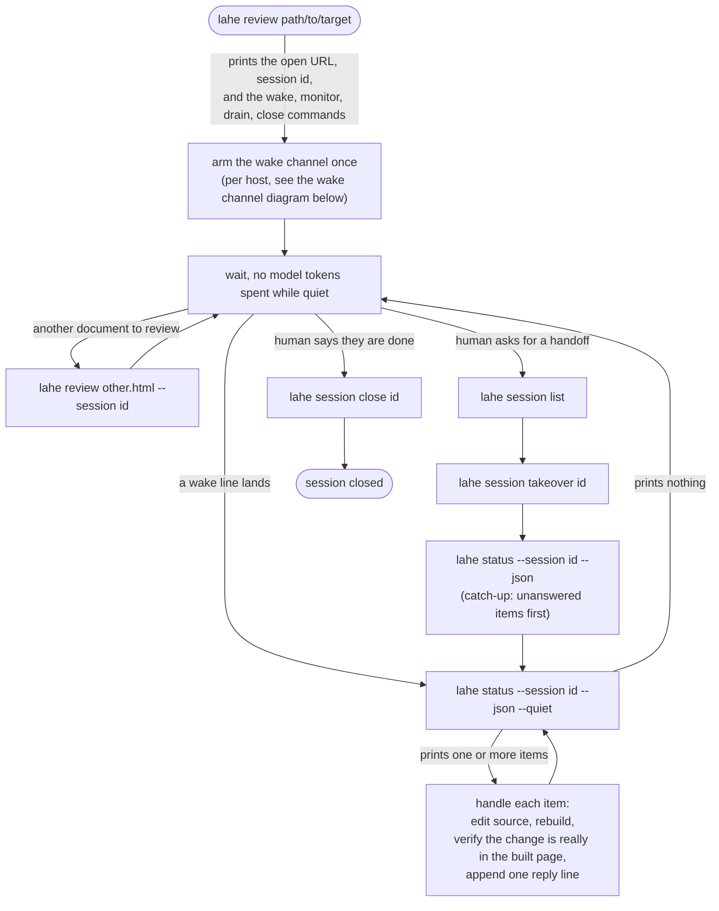
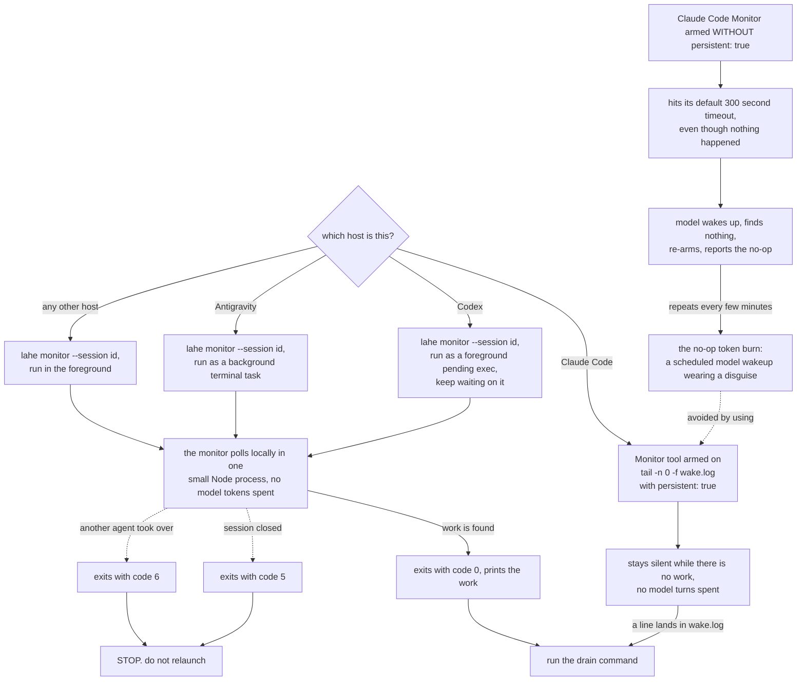

# The agent's loop

This is the loop an agent actually moves through, with the commands written
on the arrows instead of listed in prose. The second diagram below is the
wake channel in detail: how an agent hears about new work without spending
model tokens while nothing is happening, and what its three exit codes mean.

The wake channel itself differs by host, and it is the part where prose alone
has failed before: a monitor that quietly times out and relaunches is the
exact no-op token burn the wake channel exists to prevent.

## Whether one diagram could hold all of this

The spec set a hard condition: the workflow diagram may absorb the wake
channel only if it legibly carries all four of the wake feed being silent
versus a timer that is not, the per-host fan, the three exit codes, and the
timeout failure drawn as its own branch. Testing that against one drawing, the
per-host fan alone (four hosts, each with its own arming command) already
uses most of the width a flowchart can hold and stay readable, and the
failure branch needs its own lane so it reads as a warning rather than a
normal step. Cramming the main loop's five branches into the same picture
made both parts harder to read, not easier. So this file keeps two diagrams:
the loop above, and the wake channel below carrying all four required pieces.

## What to notice

- The main loop never has the agent stop and report that a wake arrived; the
  interrupt is a reason to keep working through drain, not a stopping point.
- On Claude Code, `persistent: true` is the one setting that keeps the
  Monitor tool from defaulting to a 300 second timeout. Without it, the
  Monitor times out on its own and looks exactly like new work landing, which
  is the no-op token burn shown in the lower diagram.
- Exit codes 5 and 6 both mean stop, but for different reasons: 5 is the
  reviewer ending the session on purpose, 6 is another agent explicitly
  taking it over. Either way, relaunching the monitor is wrong.
