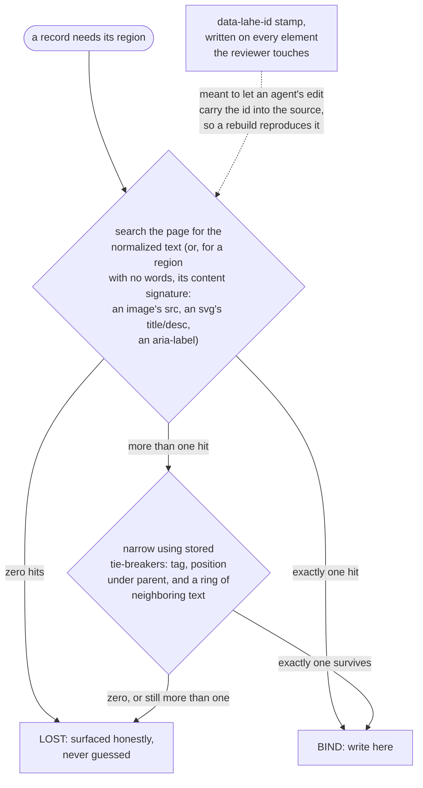

# Finding the region again

In this repo, an "anchor" is how a saved comment or edit finds its spot on the page again. It has nothing to do with `&lt;a&gt;` tags. The word is overloaded on purpose: renaming the concept would touch 224 mentions across `src/`, a module called `anchor.js`, five test files, decision D9 in the architecture doc, and field names shipped in `review.json`. That is a real refactor, not a docs tweak, so the name stays and this page just says the collision out loud.

The picture below is a ladder. Every rung is a way of finding the element again from what it looks like now, on a page that may have been rewritten since the comment was made. The rule that runs the whole thing: a rung may only place a write when it finds exactly one candidate. Anything else, including two candidates that both look perfect, is a refusal, not a guess.

## What to notice

- **Tie-breakers corroborate, they never overrule.** Tag, position under the parent, and the context ring only narrow a tie among candidates that already matched on content. A position-only match after the content moved is exactly the wrong-element bug this rule exists to prevent: two identical list items that swapped places would otherwise get each other's edit.
- **The content signature is not a fallback rung tried after text fails.** It is chosen once, at the moment the comment or edit is made: an element with words is anchored by its words, and an element with none (an image, an icon, a diagram) is anchored by what it IS instead. A region that had text and later loses it does not fall through to the signature; it falls through to LOST, because the signature was never taken for it.
- **The stamp is drawn off to the side because it is still being built.** The amended decision (D9, amended 2026-08-26) describes `data-lahe-id` as the fastest and surest rung on the ladder. As of this diagram, that rung is work in progress rather than committed behavior: the committed `resolve()` re-finds a region from text and the content signature, and does not consult a stamp. Someone is actively wiring the stamp up, so this is a diagram that will need a second pass, not a defect to go fix. When the stamp becomes a real rung, redraw it into the main ladder above the text rung.
- **Nothing depends on the stamp existing.** Even once it is wired in, a page that cannot be written to, an element the agent never touched, or a rebuild that dropped the attribute all fall straight through to the text and signature rungs. The stamp is meant to be the fastest rung, never the only one.
- **LOST is an honest answer, not a bug.** A record that cannot be placed uniquely is surfaced as lost, on the page and in `review.json`, rather than being silently dropped or bound to the nearest thing that looks right.
