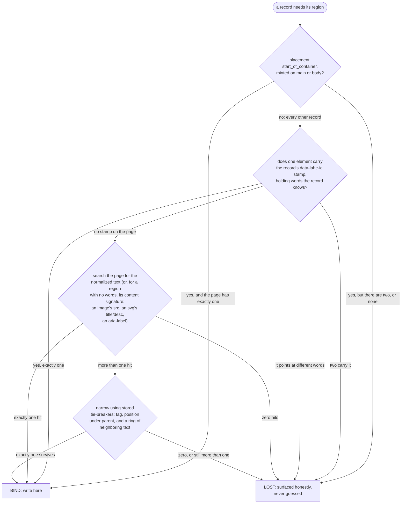

# Finding the region again

In this repo, an "anchor" is how a saved comment or edit finds its spot on the page again. It has nothing to do with `&lt;a&gt;` tags. The word is overloaded on purpose: renaming the concept would touch 224 mentions across `src/`, a module called `anchor.js`, five test files, decision D9 in the architecture doc, and field names shipped in `review.json`. That is a real refactor, not a docs tweak, so the name stays and this page just says the collision out loud.

The picture below is a ladder. Every rung is a way of finding the element again from what it looks like now, on a page that may have been rewritten since the comment was made. The rule that runs the whole thing: a rung may only place a write when it finds exactly one candidate. Anything else, including two candidates that both look perfect, is a refusal, not a guess.

```mermaid
flowchart TD
  Start(["a record needs its region"]) --> Container{"placement start_of_container,<br/>minted on main or body?"}
  Container -- "yes, and the page has exactly one" --> Bind
  Container -- "yes, but there are two, or none" --> Lost
  Container -- "no: every other record" --> Stamp{"does one element carry<br/>the record's data-lahe-id stamp,<br/>holding words the record knows?"}

  Stamp -- "yes, exactly one" --> Bind["BIND: write here"]
  Stamp -- "two carry it" --> Lost
  Stamp -- "it points at different words" --> Lost
  Stamp -- "no stamp on the page" --> Text{"search the page for the<br/>normalized text (or, for a region<br/>with no words, its content signature:<br/>an image's src, an svg's title/desc,<br/>an aria-label)"}

  Text -- "zero hits" --> Lost
  Text -- "exactly one hit" --> Bind
  Text -- "more than one hit" --> Narrow{"narrow using stored<br/>tie-breakers: tag, position<br/>under parent, and a ring of<br/>neighboring text"}

  Narrow -- "exactly one survives" --> Bind
  Narrow -- "zero, or still more than one" --> Lost["LOST: surfaced honestly,<br/>never guessed"]
```

## What to notice

- **Tie-breakers corroborate, they never overrule.** Tag, position under the parent, and the context ring only narrow a tie among candidates that already matched on content. A position-only match after the content moved is exactly the wrong-element bug this rule exists to prevent: two identical list items that swapped places would otherwise get each other's edit.
- **The content signature is not a fallback rung tried after text fails.** It is chosen once, at the moment the comment or edit is made: an element with words is anchored by its words, and an element with none (an image, an icon, a diagram) is anchored by what it IS instead. A region that had text and later loses it does not fall through to the signature; it falls through to LOST, because the signature was never taken for it.
- **The stamp is the top rung, and it is real.** `data-lahe-id` is written onto every element the reviewer touches (D9, amended 2026-08-26). The agent carries that attribute into the source when it edits the element, so the next build reproduces it and the page finds the element with certainty. `anchor.js` `stampVerdict` asks first: exactly one element carrying the stamp, and still holding words the record knows, binds. Two elements carrying it, or one carrying words the record has never held, is a refusal with its own reason on the card ("two elements carry this id", "the stamp points at different words"), not a fall-through to the text rung.
- **Nothing depends on the stamp existing.** A page that cannot be written to, an element the agent never touched, or a rebuild that dropped the attribute all fall straight through to the text and signature rungs. The stamp is meant to be the fastest rung, never the only one.
- **A bind climbs back to the saved tag when an inline wrapper holds all the words.** After BIND finds a match, if the tag it landed on differs from the tag the record was minted on, it climbs through parents that hold exactly the same words and takes the first one with the saved tag (`
<em>A</em>
`: a record minted on the `
` binds the `
`, not the `<em>` that happens to hold the same words). This step corroborates the bind found by text; it never counts toward uniqueness, and it stops the moment an ancestor holds any other words.
- **The empty-container rung comes first, and it serves one kind of record.** A free-writing sitting on an empty page is anchored on the page's one `main` (or `body`) with `placement: start_of_container`. That anchor is found by its tag alone: once the agent places the notes, the container's words are the whole page, and a text compare would call it lost. The caller passes the record's `placement` to `anchor.resolve`, and the rung answers only when it is `start_of_container` and the reference was minted on a container. An `after_anchor` record whose anchor is gone never reaches it, so it stays LOST, even on a page the agent emptied.
- **The tag climb accepts the anchor's new tag too.** A free-writing record that changed its anchor's type (`anchor_tag_after`) passes that tag to `anchor.resolve`, and the climb above stops at either the minted tag or the new one. Without it, `
<em>A</em>
` retagged to `<h2><em>A</em></h2>` would bind the `<em>`.
- **LOST is an honest answer, not a bug.** A record that cannot be placed uniquely is surfaced as lost, on the page and in `review.json`, rather than being silently dropped or bound to the nearest thing that looks right.
