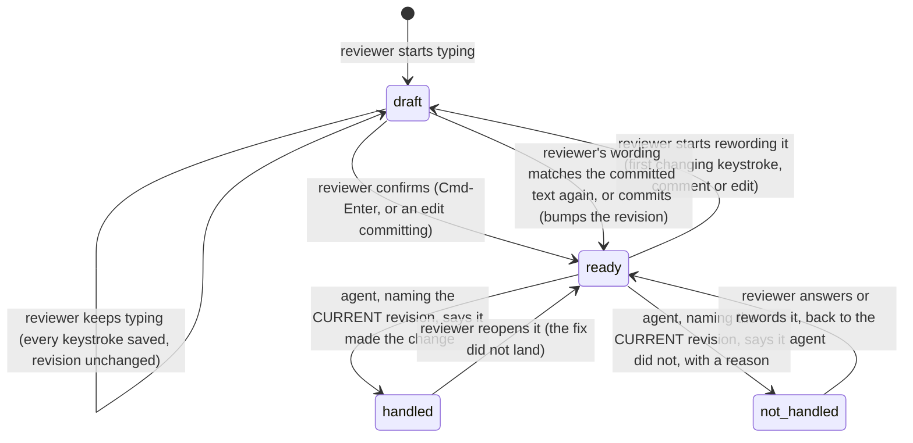

# Item lifecycle

Every comment you leave and every edit you make is one "item," and at any moment it sits in exactly one of four states. This diagram is `src/shared/lifecycle.js`'s transition table drawn as a picture; every arrow below also names who is allowed to draw it, because that rule is the whole reason the diagram exists.

## The four states, in plain words

- **draft**: the reviewer is still typing. It is saved so nothing is lost, but no agent can see it yet.
- **ready**: the reviewer hit Cmd-Enter, or an edit committed. An agent may now act on it.
- **handled**: an agent said it made the change.
- **not_handled**: an agent said it did not, and left a reason the reviewer reads on the card.

## What to notice

- **Every arrow names an actor.** The reviewer is the only one who can move an item from `draft` to `ready`, or take it back from `ready` to `draft`. An agent can never do either. An agent may only move an item OUT of `ready` (to `handled` or `not_handled`), and only for the exact revision it named. If the reviewer reworded the comment after the agent read it, the agent's reply names a revision that no longer applies, and the move is refused rather than silently swallowing the rewording.
- **Rewording a ready item takes it off the agent's desk first.** The reviewer's first changing keystroke moves it from `ready` back to `draft`, for both a comment and an edit. Nothing about it reaches an agent while it sits there, the same as any other draft. Typing the wording back to match what was last committed puts it back to `ready` with nothing changed; committing new wording also puts it back to `ready`, and that is the one move that bumps the revision.
- **The helper never moves anything on its own.** It is not listed as an actor anywhere in the table. It only records moves the reviewer or the agent tell it about, and projects the result.
- **`question` is a reply status, not a state.** An agent asking a question leaves the item exactly where it is, in `ready`, because the work is still outstanding; the question and its answer live on the card.
- **A `handled` reply does not always move the item.** For a hand edit, the helper reads the built page first. When the item's `after` text is not in that page, the agent's answer is folded (its words land on the card) and the item stays exactly where it was, in `ready`, carrying `handled_not_on_page: true`. It is still on the reviewer's card and still on the agent's drain list, and the card says the change has not reached the page. A comment is never checked, because there is nothing to look for, and a page that cannot be read answers "cannot tell", which is treated as present. See `src/service/handled_check.js`.
- **`reopened` is a transition, not a fifth box.** It is just the `handled` to `ready` arrow above, drawn for the case where the reviewer decides a fix did not actually land.
- **A failed transition throws, on purpose.** `src/shared/lifecycle.js` fails loudly rather than ignoring an illegal move, so a bug in a reply handler shows up immediately instead of quietly retiring the wrong item.
- **Deletion is not on this diagram** because it is not a lifecycle transition, but it is worth knowing: a reviewer can delete their own outstanding work from `draft`, `ready`, or `not_handled`. A `handled` item cannot be deleted, because the agent already changed the source and the record is the only thing saying so; the reviewer takes a handled change back a different way (undo), which asks the agent to remove it rather than erasing the history that it happened.
