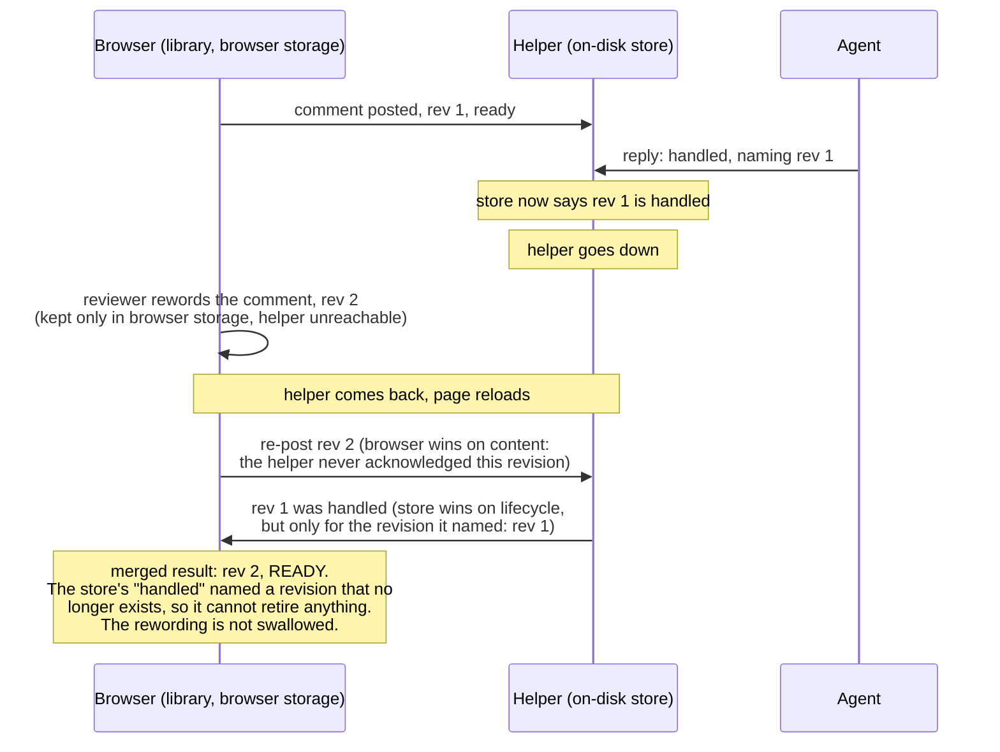

# Merge on load

When the browser and the helper's store reconnect, they can disagree about one item, and this diagram shows how that gets resolved. The rule (decision D5 in the architecture doc, and `src/shared/merge.js`) is short: the browser wins on content until the helper has acknowledged it, and the store wins on lifecycle, but only for the revision it is actually talking about. The worked case below is the one the rule exists to protect: an offline reword that must not get swallowed by a stale "handled."

## What to notice

- **Two different fields, two different winners.** Content (the words, the region it is tied to) comes from the browser as long as the helper has not acknowledged that revision. Lifecycle (ready, handled, not_handled) comes from the store, but strictly per revision: a "handled" naming rev 1 can only ever retire rev 1.
- **Why the reword survives.** The agent's reply named rev 1. By the time the merge runs, the item is at rev 2. `src/shared/lifecycle.js`'s revision rule refuses a reply that names an old revision, so "handled" never applies to the reviewer's new words, and the card stays outstanding.
- **This is a general merge rule, not a special case for this scenario.** `src/shared/merge.js` runs the same comparison (by revision, then by acknowledgment) for every item on every load or reconnect. The offline-reword case is simply the clearest example of why the per-revision half of the rule has to exist.
- **A full history version of this same case lives in `docs/features/20260812.01_live_agentic_html_editor/02_architecture_live_agentic_html_editor.md` under decision D5.** That copy is history and is not rewritten; this file is the current, standalone version other docs should link to.
