# Module map

This is `src/shared/manifest.js` drawn as a picture. It shows the four folders under `src/`, what each one is for, and which way the dependencies point. Use it to decide where a new file belongs, before you write it.

```mermaid
flowchart TD
    subgraph SHARED["shared slash - the wire-protocol kernel"]
        SH_CORE["markers.js, normalize.js, record.js<br/>the one spelling of a marked node,<br/>the one normalizer, the item record shape"]
        SH_RULES["lifecycle.js, merge.js, regions.js, uniqueness.js<br/>the four states and who may move them,<br/>the browser-vs-store merge rule,<br/>region labels, D9's uniqueness check"]
        SH_MISC["gestures.js, epoch.js, elapsed.js, failures.js, protocol.js<br/>gesture vocabulary, the write-epoch rule,<br/>elapsed-time wording, failure codes,<br/>routes and headers"]
        SH_FIXT["record_fixtures.js<br/>sample records for builders to code against"]
        SH_FORMAT["review_format.js<br/>FROZEN<br/>the human-readable format; ships inside<br/>the browser bundle so copy/export work<br/>with no helper running"]
        SH_MANIFEST["manifest.js<br/>FROZEN, Node only<br/>this file: one owner per src file,<br/>plus the layer's load order"]
    end

    subgraph LAYER["layer slash - runs in the browser, drawn in load order"]
        direction TB
        L1["listeners.js<br/>the listener registry, loads first"]
        L2["selection.js<br/>FROZEN<br/>the caret accessor"]
        L3["store.js, anchor.js, pointing.js<br/>browser storage on every keystroke;<br/>mint and resolve a region; where a comment<br/>points when its words are gone"]
        L4["protect.js, highlight.js<br/>the three protection layers while a block<br/>is being edited; the page highlight API"]
        L5["overlay.js, tab_active.js, tab_done.js,<br/>tab_edits.js, export.js<br/>the rail: chrome, each tab's contents,<br/>copy and export"]
        L6["sync.js, comments.js, editing.js<br/>post and reply-poll loop; comment boxes;<br/>per-block edit state"]
        L7["replay.js, inject.js, index.js<br/>the four-branch replay compare;<br/>remount and CSP checks; boots the library last"]
        L1 --> L2 --> L3 --> L4 --> L5 --> L6 --> L7
    end

    subgraph SERVICE["service slash - runs in the helper process"]
        SV_CORE["routes.js, auth.js, log.js<br/>the router, the per-request check block,<br/>the events.jsonl appender"]
        SV_SESS["agent_sessions.js, wake_feed.js,<br/>watchers.js, static_servers.js<br/>session lifecycle and heartbeat,<br/>the wake feed a host tails, liveness checks,<br/>session-owned static servers"]
        SV_STORE["state_dir.js, reviews.js, review_writer.js,<br/>projection.js, replies.js<br/>on-disk layout, review creation and tokens,<br/>the single writer of review.json,<br/>log-to-projection, reply folding"]
        SV_MISC["markdown.js, markdown_links.js, tab_icon.js,<br/>heal.js, source_stamp.js<br/>Markdown rendering, link rewriting,<br/>fallback tab icon, putting the script line<br/>back after a rebuild, helper-version check"]
        SV_INDEX["index.js<br/>serve"]
    end

    subgraph CLI["cli slash - the command surface"]
        CLI_INDEX["index.js<br/>the command dispatcher"]
        CLI_CMDS["serve, review, session,<br/>add, status, monitor"]
        CLI_INDEX --> CLI_CMDS
    end

    LAYER --> SHARED
    SERVICE --> SHARED
    CLI --> SERVICE

    classDef frozen fill:#f5d0d0,stroke:#a33,stroke-width:2px;
    class SH_FORMAT,SH_MANIFEST,L2 frozen;
```

## What to notice

- **What each folder is for.** `shared/` is the one place a wire-protocol field name or item-record shape gets spelled out. Both `layer/` and `service/` import from it instead of each defining their own copy. `layer/` is the code that runs in the reviewer's browser. `service/` is the code that runs in the local helper process. `cli/` is the set of commands (`serve`, `review`, `session`, `add`, `status`, `monitor`) a person or an agent types.
- **Which way dependencies point.** Both `layer/` and `service/` depend on `shared/`. Neither depends on the other. If you find yourself wanting `layer/` code to call `service/` code directly, or the reverse, that is a sign the shared piece belongs in `shared/` instead.
- **Why `layer/` is an ordered list, not a cloud.** The browser has no module loader, so the whole library ships as one concatenated file (`dist/lahe-layer.js`). The order files are glued in is the order they can depend on each other: a file may only use something a file above it in the list already registered. `manifest.js` writes that order down, and the diagram's chain (`listeners.js` through `index.js`) is that same order.
- **The three frozen files**, shaded red above: `manifest.js`, `review_format.js`, and `layer/selection.js`. A change to any of them goes through the orchestrator rather than through whichever builder happens to be touching nearby code, because other files depend on their exact shape.
- **No framework.** `dependencies` in `package.json` stays empty on purpose, so the tool runs from a `git clone` with no install step. The helper is built from Node's own core modules plus the global `fetch`. The layer is standard DOM APIs. Playwright is a devDependency (test tooling, not something the shipped tool needs). `marked`, `mermaid`, and the Heroicons SVG are vendored under `vendor/` rather than installed. The convention above (one owner per file, dependencies point one way, `layer/` load-ordered) is this repo's own rule, not something borrowed from a framework, and it is enforced by `manifest.js` itself plus the completeness check in `npm run lint`.

## What got grouped, and why

`layer/` is close to 30 files, which is too many to draw as separate boxes and still read. The six groups above (L1 through L7) follow the manifest's own load order and cluster files that do one job together: boot and wiring, caret/anchoring, protection and highlighting, the rail's chrome and tabs, the sync/comment/edit loop, and replay plus injection. `service/` got a similar treatment, grouped by job (routing and logging, session lifecycle, on-disk store and projection, Markdown/heal/version misc) rather than manifest order, since the helper has no load-order constraint the way the browser bundle does.
