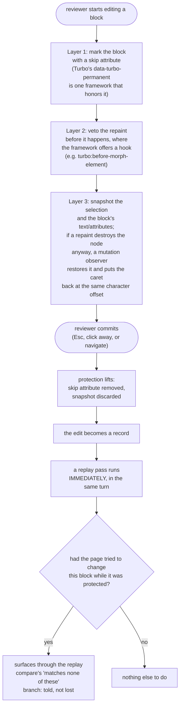

# Protecting a block while it is being edited

While the reviewer is actively editing a block, the library owns it: the page must not be allowed to repaint that block out from under the reviewer's cursor. There are three layers doing this, not one, and that is the whole point. An archived round-2 review found that restoring the caret after a repaint cannot work on its own: the repaint destroys the text node the selection lives in before any observer even fires, so by the time a restore runs there is nothing left to restore into.

## What to notice

- **Three layers because one alone is not enough.** Layer 1 (the skip attribute) only works if the framework chooses to honor it. Layer 2 (the pre-morph veto) only exists where the framework offers a cancelable hook before it repaints. Layer 3 (snapshot plus mutation-observer restore) is the framework-free fallback: it catches every repaint that honors neither of the first two, standard DOM mutation with no cooperating framework at all.
- **Layer 3 restores by character offset, not by node identity.** The repaint has already destroyed the original text node by the time the observer callback runs, so the caret is necessarily placed in a new node. The restore is judged by whether the text reads right and the caret lands at the same offset, never by whether it is "the same node," because it never is.
- **The replay pass on commit is not optional and not delayed.** `protect.release()` calls into replay's commit pass synchronously (deferred only by one microtask when a write epoch is still open), specifically so a change the page tried to make to the block while it was protected is not silently swallowed. Before this was wired up, lifting protection with no immediate pass meant an agent's landed change under the reviewer's fingers just vanished.
- **The write-epoch rule is what stops this from looping.** Every mutation the library makes to the page happens inside `epoch.write(...)`. A mutation observer checks whether an epoch is currently open before deciding to schedule another replay pass, so replay's own writes (and the restore's own writes) do not retrigger replay chasing its own tail.
- **An agent's change lands as information, not as a loss.** The point of running replay right away is that a suppressed page change is never dropped: it comes back through the same "matches none of these" branch that any live conflict goes through, so the reviewer sees both versions and picks, rather than the agent's work quietly disappearing.
