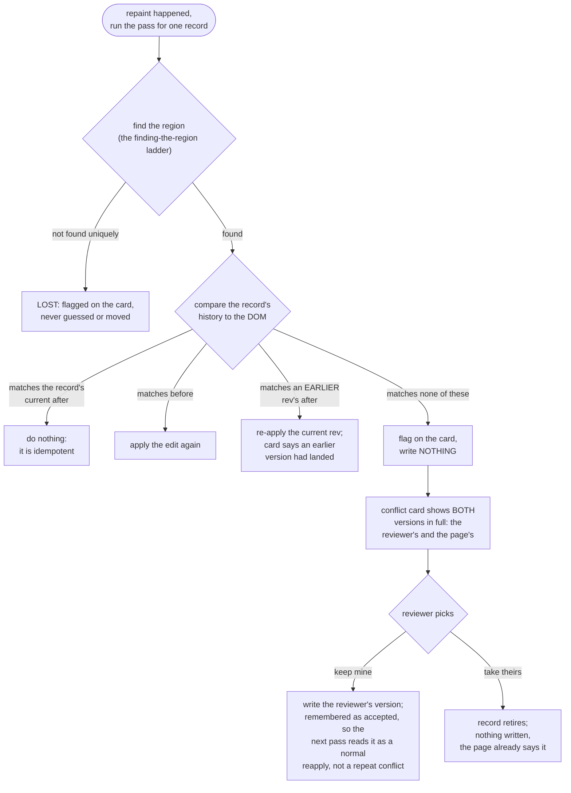
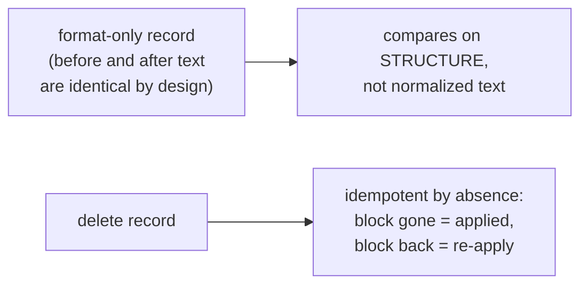

# The four-way compare after a repaint

Live pages repaint themselves: dev servers hot-reload, frameworks rewrite parts of the page, and the agent's own landed changes arrive as a refresh. After any repaint, a single pass walks every committed record and compares its stored history against what the page says now. This one compare (`src/layer/replay.js`, function `compare`) is the whole mechanism that lets a reviewer keep editing live while an agent edits the source underneath them, without either one clobbering the other.

The compare runs per record, not per page: each record answers for its own region, in one of four ways.

Two record kinds compare on their own terms rather than on plain text:

## What to notice

- **The conflict card never picks a default.** "Keep mine" and "take theirs" are drawn with equal weight, because branch four's whole point is that the decision belongs to the reviewer, not the tool.
- **"Keep mine" is remembered, not just written once.** The choice is stored as an accepted page state on the record. Without that, the very next repaint would render the page's own source again, re-raise the same conflict, and the reviewer's answer would only ever last one pass.
- **A handled item is never stamped lost.** If an agent already said it made the fix, a failed re-anchor on that item means the fix rewrote the very passage the item pointed at, which is the fix working, not the feedback going missing.
- **The same pass runs for both directions of editing.** When the agent lands a change and the page reloads itself, that reload is just another repaint: the agent's change is the new page, the reviewer's outstanding records are re-applied on top of it, and a genuine collision between the two is exactly the "matches none of these" branch, surfaced rather than fought over silently.
- **On commit, this pass runs immediately**, not on the next scheduled tick, so a change the page tried to make while a block was protected surfaces right away instead of vanishing. See `docs/diagrams/protected_region.md` for that half.
