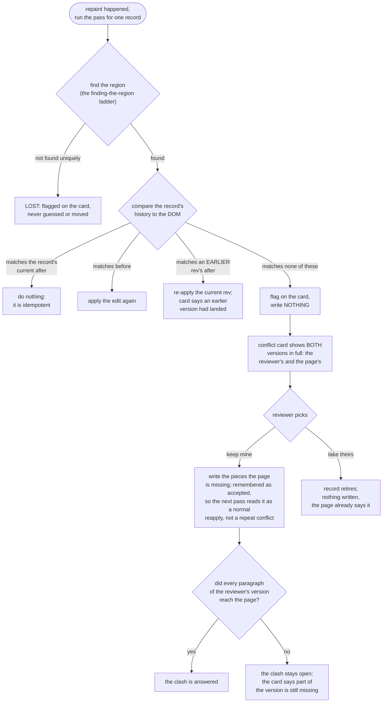
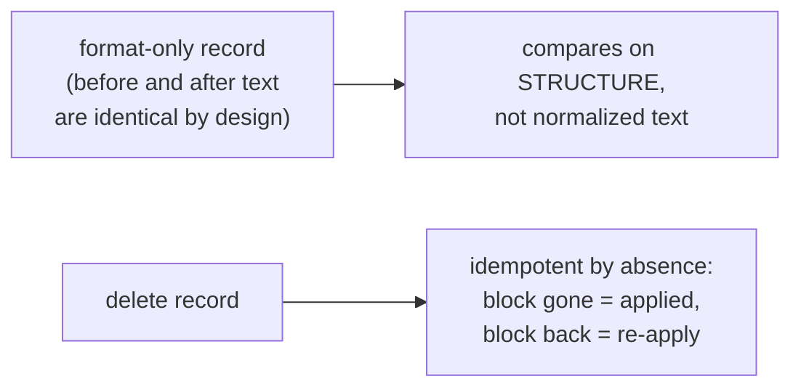
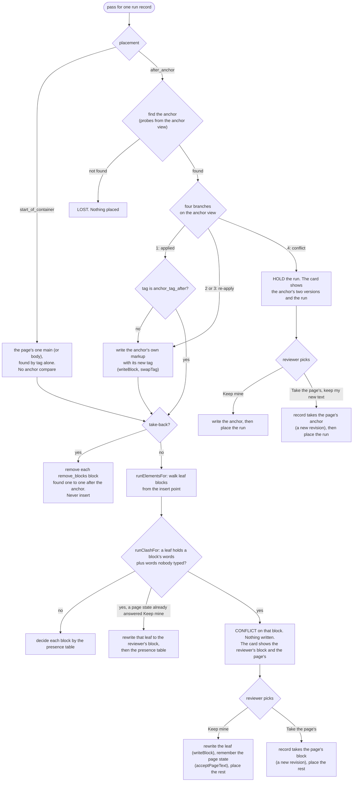

# The four-way compare after a repaint

Live pages repaint themselves: dev servers hot-reload, frameworks rewrite parts of the page, and the agent's own landed changes arrive as a refresh. After any repaint, a single pass walks every committed record and compares its stored history against what the page says now. This one compare (`src/layer/replay.js`, function `compare`) is the whole mechanism that lets a reviewer keep editing live while an agent edits the source underneath them, without either one clobbering the other.

The compare runs per record, not per page: each record answers for its own region, in one of four ways.

```mermaid
flowchart TD
  A(["repaint happened,<br/>run the pass for one record"]) --> Anchor{"find the region<br/>(the finding-the-region ladder)"}
  Anchor -- "not found uniquely" --> Lost["LOST: flagged on the card,<br/>never guessed or moved"]
  Anchor -- "found" --> Cmp{"compare the record's<br/>history to the DOM"}

  Cmp -- "matches the record's<br/>current after" --> Idem["do nothing:<br/>it is idempotent"]
  Cmp -- "matches before" --> Reapply["apply the edit again"]
  Cmp -- "matches an EARLIER<br/>rev's after" --> Earlier["re-apply the current rev;<br/>card says an earlier<br/>version had landed"]
  Cmp -- "matches none of these" --> Conflict["flag on the card,<br/>write NOTHING"]

  Conflict --> Card["conflict card shows BOTH<br/>versions in full: the<br/>reviewer's and the page's"]
  Card --> Choice{"reviewer picks"}
  Choice -- "keep mine" --> KeepMine["write the pieces the page<br/>is missing; remembered as accepted,<br/>so the next pass reads it as a normal<br/>reapply, not a repeat conflict"]
  KeepMine --> Partial{"did every paragraph<br/>of the reviewer's version<br/>reach the page?"}
  Partial -- "yes" --> Done["the clash is answered"]
  Partial -- "no" --> Held["the clash stays open;<br/>the card says part of<br/>the version is still missing"]
  Choice -- "take theirs" --> TakeTheirs["record retires;<br/>nothing written,<br/>the page already says it"]
```

Two record kinds compare on their own terms rather than on plain text:

```mermaid
flowchart LR
  FO["format-only record<br/>(before and after text<br/>are identical by design)"] --> FOCmp["compares on STRUCTURE,<br/>not normalized text"]
  Del["delete record"] --> DelCmp["idempotent by absence:<br/>block gone = applied,<br/>block back = re-apply"]
```

## What to notice

- **A new conflict is told on the page, not only on the card.** Branch four writes nothing, so the reviewer's words vanish from where they were typing. `src/layer/conflict_toast.js` raises one sticky toast ("Your edit clashed with a change to the page") once per record and rev, held while presenting, and clicking it opens the rail on the card. Resolving takes it away.
- **A split is branch one, not branch four.** When the after has paragraph or line breaks and the source carries them as separate blocks, the anchored block plus the blocks right after it are read in order against the after split on its breaks. The first piece must be the anchored block, and only as many consecutive blocks as the after has pieces are read. When the text search bound the container holding all those blocks, replay takes the one block inside it where the run starts. Branch two never writes across blocks. See `docs/features/20260922.06_split_not_conflict/NOTES.md`.
- **A write never says the reviewer's words twice.** Before branch two or three writes a multi-paragraph after into the one anchored block, replay asks whether the block right after it already says the after's second paragraph. When it does, the write would leave those words merged into the anchored block and still standing below, so nothing is written and the record is flagged instead. The split compare reads past curly quotes and em dashes for the same reason: a Markdown rebuild's typography is not a reason to rewrite the paragraph. See `docs/features/20260922.08_no_duplicate_text/NOTES.md`.
- **The conflict card never picks a default.** "Keep mine" and "take theirs" are drawn with equal weight, because branch four's whole point is that the decision belongs to the reviewer, not the tool.
- **"Keep mine" writes only what the page is missing, and does not claim a press that fell short.** The press follows the same rule an ordinary write follows: when the page already carries some of the reviewer's paragraphs in blocks of their own, only the missing ones are written, or the words would stand twice. If a piece could not be placed, the press does not resolve the clash. The card says part of the version is still missing, and the conflict stays open rather than leaving the reviewer with a page missing a paragraph and nothing saying so.
- **"Keep mine" is remembered, not just written once.** The choice is stored as an accepted page state on the record. Without that, the very next repaint would render the page's own source again, re-raise the same conflict, and the reviewer's answer would only ever last one pass.
- **A handled item is never stamped lost.** If an agent already said it made the fix, a failed re-anchor on that item means the fix rewrote the very passage the item pointed at, which is the fix working, not the feedback going missing.
- **The same pass runs for both directions of editing.** When the agent lands a change and the page reloads itself, that reload is just another repaint: the agent's change is the new page, the reviewer's outstanding records are re-applied on top of it, and a genuine collision between the two is exactly the "matches none of these" branch, surfaced rather than fought over silently.
- **On commit, this pass runs immediately**, not on the next scheduled tick, so a change the page tried to make while a block was protected surfaces right away instead of vanishing. See `docs/diagrams/protected_region.md` for that half.

## A run record (free writing)

A record with free-writing fields (`new_blocks`, `anchor_after_html`, `anchor_tag_after`, `placement`, or a take-back's `remove_blocks`) takes its own path in `applyRun`. Every other record takes the path above, unchanged. The anchor compare is the same four branches, read on the **anchor view**: the anchor's own after in place of the whole sitting, so the run's words are never written into the anchor. Then the run is placed block by block.

```mermaid
flowchart TD
  S(["pass for one run record"]) --> P{"placement"}
  P -- "start_of_container" --> Cn["the page's one main (or body),<br/>found by tag alone.<br/>No anchor compare"]
  P -- "after_anchor" --> A{"find the anchor<br/>(probes from the anchor view)"}
  A -- "not found" --> L["LOST. Nothing placed"]
  A -- "found" --> V{"four branches<br/>on the anchor view"}
  V -- "1: applied" --> T{"tag is anchor_tag_after?"}
  V -- "2 or 3: re-apply" --> W["write the anchor's own markup<br/>with its new tag<br/>(writeBlock, swapTag)"]
  V -- "4: conflict" --> H["HOLD the run. The card shows<br/>the anchor's two versions and the run"]
  T -- "no" --> W
  T -- "yes" --> R
  W --> R
  Cn --> R{"take-back?"}
  R -- "yes" --> Rm["remove each remove_blocks block<br/>found one to one after the anchor.<br/>Never insert"]
  R -- "no" --> Walk["runElementsFor: walk leaf blocks<br/>from the insert point"]
  Walk --> Cl{"runClashFor: a leaf holds a block's words<br/>plus words nobody typed?"}
  Cl -- "no" --> Row["decide each block by the presence table"]
  Cl -- "yes, a page state already answered Keep mine" --> KB["rewrite that leaf to the reviewer's block,<br/>then the presence table"]
  Cl -- "yes" --> HB["CONFLICT on that block. Nothing written.<br/>The card shows the reviewer's block and the page's"]
  HB --> Cb{"reviewer picks"}
  Cb -- "Keep mine" --> KB2["rewrite the leaf (writeBlock), remember the page state<br/>(acceptPageText), place the rest"]
  Cb -- "Take the page's" --> TB["record takes the page's block<br/>(a new revision), place the rest"]
  H --> Ch{"reviewer picks"}
  Ch -- "Keep mine" --> KM["write the anchor, then place the run"]
  Ch -- "Take the page's, keep my new text" --> TT["record takes the page's anchor<br/>(a new revision), then place the run"]
```

The presence table, as `placeRun` applies it:

| Found in the walk | What replay does |
|---|---|
| whole, one to one | swap a wrong tag (and say so on the card, `REPLAY_RUN_WRONG_TAG`); rewrite the markup when bold or italic is missing |
| joined (a leaf whose words are exactly two or more new blocks, nothing else) or split | leave it |
| inside a leaf that also holds words the reviewer never typed (the clash, checked before anything is written) | write nothing, anchor included; flag the record with `REPLAY_NEITHER_MATCHES` and the conflict card, which shows the reviewer's block and the page's. Keep mine rewrites the leaf and remembers the page state; Take the page's makes the page's block the record's (a new revision). Either answer then places the rest |
| missing, an earlier revision's block is there one to one | rewrite that block in place to the current words (branch three for the run) |
| missing, five or more words, a whole leaf elsewhere on the page | write nothing; the card says it is already further down (`REPLAY_RUN_PLACED_ELSEWHERE`) |
| missing otherwise | insert it after the last present block before it (or at the insert point), with its own tag and markup |

- **A forged block writes nothing.** When any block's tag is outside the six writable ones or `cleanBlock` refuses its markup, the whole record writes nothing, anchor included.
- **A taken-back run is never replayed again**, even while the original record is still outstanding in the store.
- **The page check reads a handled run block by block** (`runCheckReason`) from the page's markup with the string twin of the walk: a missing block reopens as undone, a wrong tag with the tag note, lost bold or italic with the formatting note, in that order.
