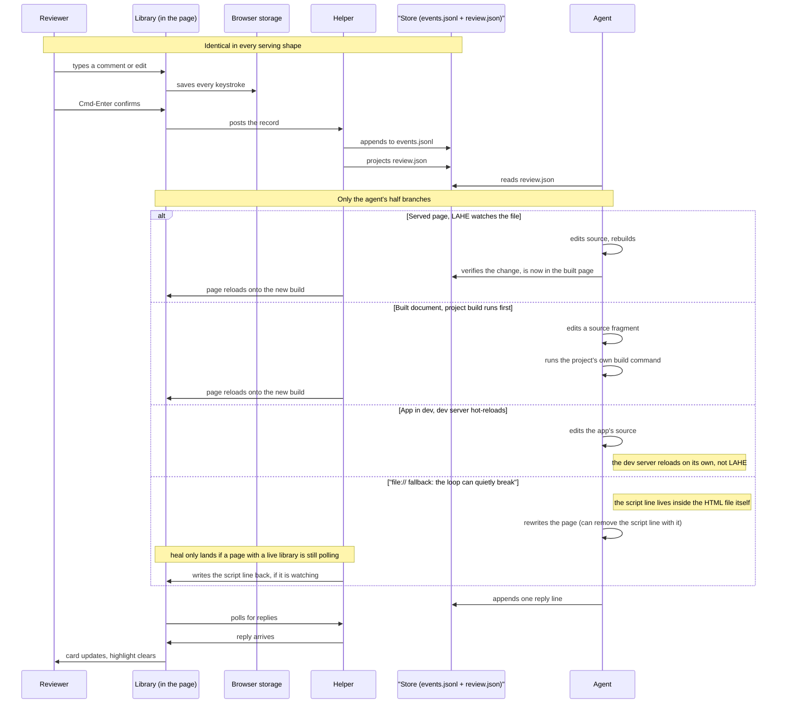

# One comment, end to end

This is one comment or edit, traced from the reviewer's keystroke to the
reviewer seeing the agent's answer. The first half is identical no matter how
the page is served. Only the agent's half branches, on two questions: what the
agent edits, and how the reviewer's page gets the change back.

## What to notice

- Five sequences that are mostly identical would drift. This is one shared
  spine with a labeled fan on the agent's side, because everything up to
  "agent reads review.json" happens the same way regardless of how the page
  is served.
- The `file://` branch is marked because it is the one path where the loop
  can quietly break. There is no server putting the script line into a
  response, so the line is written into the HTML file itself. An agent that
  rewrites the whole page takes the line out with it, and the only way it
  comes back is if a page with a live library is still polling the helper
  when the rewritten file reappears.
- There is a sixth path with no agent loop at all: the library works with no
  helper running. Everything stays in the browser, and the copy and export
  buttons on the rail carry the reviewer's feedback out by hand. No work is
  lost, there is just nothing to drain.
