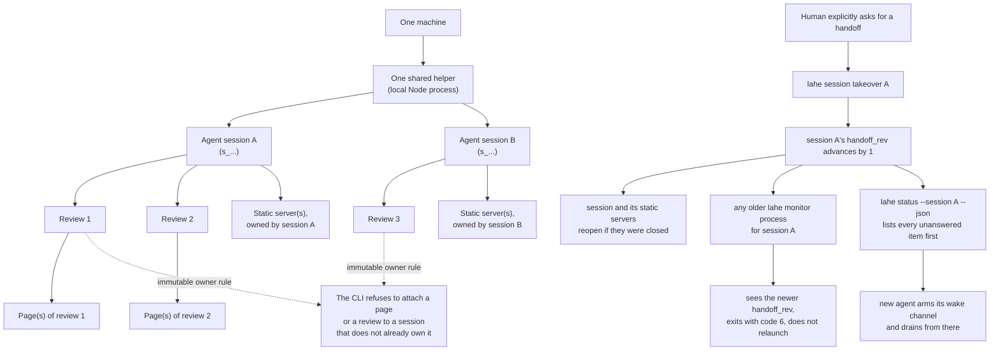

# Session ownership and handoff

One helper runs per machine, but many agent sessions can use it at once. This
is what each session owns, the rule that keeps sessions from stepping on each
other, and what happens when a human explicitly hands a session to a new
agent.

## What to notice

- Ownership nests: a session owns reviews, a review owns pages, and a session
  separately owns the static servers that serve those pages. Closing session A
  stops only session A's static servers; session B's keep answering.
- The immutable-owner rule is not about people, it is about the session
  record. A review remembers the session that created it, and no later
  command can move it to a different session by accident.
- Takeover does not delete anything and does not require the old agent to
  cooperate. It advances a fence number that every running monitor checks on
  its own next look, which is what makes an old monitor for the same session
  stop itself with exit code 6 instead of continuing to act on stale
  context.
