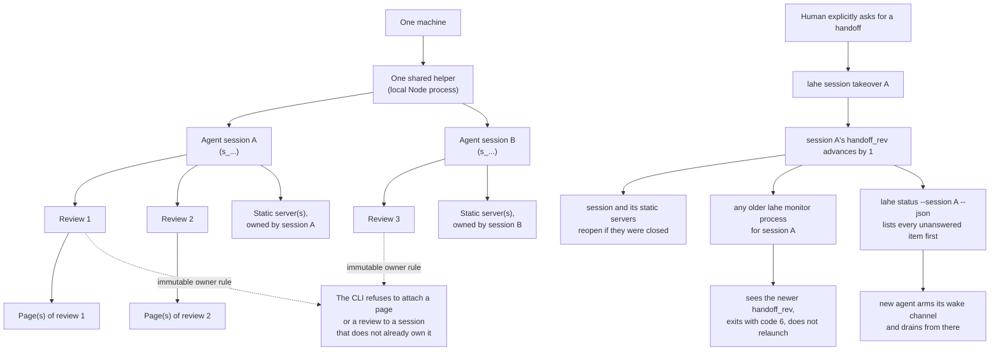
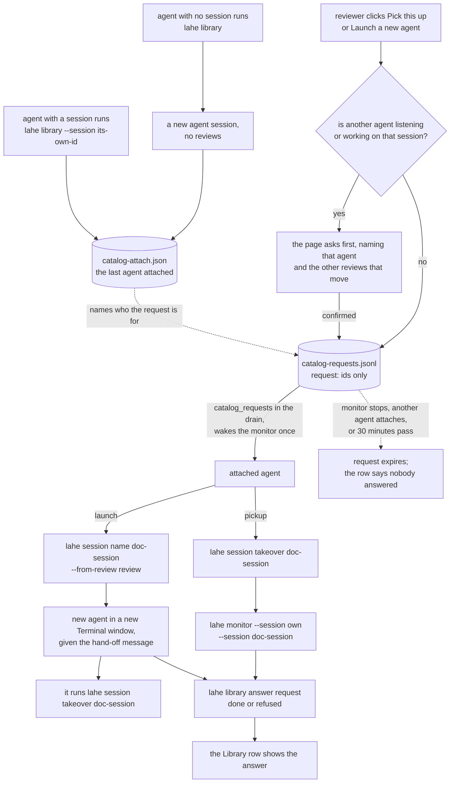
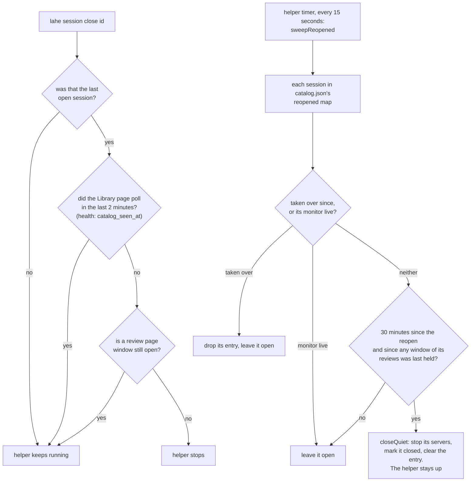

# Session ownership and handoff

One helper runs per machine, but many agent sessions can use it at once. This
is what each session owns, the rule that keeps sessions from stepping on each
other, and what happens when a human explicitly hands a session to a new
agent.

```mermaid
flowchart TD
    Machine["One machine"] --> Helper["One shared helper<br/>(local Node process)"]

    Helper --> SessA["Agent session A<br/>(s_...)"]
    Helper --> SessB["Agent session B<br/>(s_...)"]

    SessA --> RevA1["Review 1"]
    SessA --> RevA2["Review 2"]
    RevA1 --> PageA1["Page(s) of review 1"]
    RevA2 --> PageA2["Page(s) of review 2"]
    SessA --> StaticA["Static server(s),<br/>owned by session A"]

    SessB --> RevB1["Review 3"]
    SessB --> StaticB["Static server(s),<br/>owned by session B"]

    Refuse["The CLI refuses to attach a page<br/>or a review to a session<br/>that does not already own it"]
    RevA1 -.->|"immutable owner rule"| Refuse
    RevB1 -.->|"immutable owner rule"| Refuse

    Human["Human explicitly asks for a handoff"] --> Takeover["lahe session takeover A"]
    Takeover --> Fence["session A's handoff_rev advances by 1"]
    Fence --> Reopen["session and its static servers<br/>reopen if they were closed"]
    Fence --> OldMonitor["any older lahe monitor process<br/>for session A"]
    OldMonitor --> Exit6["sees the newer handoff_rev,<br/>exits with code 6, does not relaunch"]
    Fence --> Catchup["lahe status --session A --json<br/>lists every unanswered item first"]
    Catchup --> NewAgent["new agent arms its wake channel<br/>and drains from there"]
```

## What to notice

- Ownership nests: a session owns reviews, a review owns pages, and a session
  separately owns the static servers that serve those pages. Closing session A
  stops only session A's static servers; session B's keep answering.
- The helper also stops a session's static servers when no browser window has
  been open on that session's pages for two minutes. The session stays open,
  and `lahe review` brings a page back. Session B's open windows never keep
  session A's servers running.
- The immutable-owner rule is not about people, it is about the session
  record. A review remembers the session that created it, and no later
  command can move it to a different session by accident.
- Takeover does not delete anything and does not require the old agent to
  cooperate. It advances a fence number that every running monitor checks on
  its own next look, which is what makes an old monitor for the same session
  stop itself with exit code 6 instead of continuing to act on stale
  context.
- Two credentials exist, and neither can do the other's job. Each review has
  its own token, which only a page of that review holds. The Library page has
  one Library token, minted in memory at each helper start, which can list,
  open, star, and queue a request, but cannot post to any review.

## Hand-over from the Library

The Library page never takes a session over itself. Pick this up and Launch a
new agent queue a request for the agent attached to the Library, and that
agent does the takeover (or starts a new agent that does).

An agent attaches one of two ways. With no LAHE session, it runs plain
`lahe library`, which starts a new session (no reviews) and attaches it.
With one, it passes `--session`. Plain `lahe library` never reuses the
attached session, because the command cannot tell one agent from another.

```mermaid
flowchart TD
    Bare["agent with no session runs<br/>lahe library"] --> Mint["a new agent session,<br/>no reviews"]
    Mint --> AttachFile[("catalog-attach.json<br/>the last agent attached")]
    Attach["agent with a session runs<br/>lahe library --session its-own-id"] --> AttachFile
    Click["reviewer clicks Pick this up<br/>or Launch a new agent"] --> Watched{"is another agent listening<br/>or working on that session?"}
    Watched -->|"yes"| Confirm["the page asks first, naming that agent<br/>and the other reviews that move"]
    Watched -->|"no"| Queue
    Confirm -->|"confirmed"| Queue[("catalog-requests.jsonl<br/>request: ids only")]
    AttachFile -.->|"names who the request is for"| Queue
    Queue -->|"catalog_requests in the drain,<br/>wakes the monitor once"| Agent["attached agent"]
    Agent -->|"pickup"| Take["lahe session takeover doc-session"]
    Take --> Both["lahe monitor --session own<br/>--session doc-session"]
    Agent -->|"launch"| Name["lahe session name doc-session<br/>--from-review review"]
    Name --> NewAgent["new agent in a new Terminal window,<br/>given the hand-off message"]
    NewAgent --> Take2["it runs lahe session takeover doc-session"]
    Both --> Answer["lahe library answer request<br/>done or refused"]
    NewAgent --> Answer
    Answer --> Row["the Library row shows the answer"]
    Queue -.->|"monitor stops, another agent attaches,<br/>or 30 minutes pass"| Expired["request expires;<br/>the row says nobody answered"]
```

- A request holds ids only. The page cannot put words into it. The drain adds
  the document's name, path and hand-off message, marked as data.
- One monitor can watch several sessions. After a pick-up the agent owns its
  own session and the document's, and watches both. The first `--session` is
  the primary, which is the name the Library shows as watching.
- A takeover moves `handoff_rev`, so the request is delivered again to the
  agent that owns the session now.

## When the helper stops

The Library has to outlive every agent session, so the last close no longer
always stops the helper. Sessions the Library reopened are closed again when
they go quiet.

```mermaid
flowchart TD
    Close["lahe session close id"] --> Last{"was that the last<br/>open session?"}
    Last -->|"no"| Up["helper keeps running"]
    Last -->|"yes"| Polled{"did the Library page poll<br/>in the last 2 minutes?<br/>(health: catalog_seen_at)"}
    Polled -->|"yes"| Up
    Polled -->|"no"| Held{"is a review page<br/>window still open?"}
    Held -->|"yes"| Up
    Held -->|"no"| Stop["helper stops"]

    Timer["helper timer, every 15 seconds:<br/>sweepReopened"] --> Each["each session in catalog.json's<br/>reopened map"]
    Each --> Moved{"taken over since,<br/>or its monitor live?"}
    Moved -->|"taken over"| Drop["drop its entry, leave it open"]
    Moved -->|"monitor live"| Leave["leave it open"]
    Moved -->|"neither"| Quiet{"30 minutes since the reopen<br/>and since any window of its<br/>reviews was last held?"}
    Quiet -->|"no"| Leave
    Quiet -->|"yes"| CloseQuiet["closeQuiet: stop its servers,<br/>mark it closed, clear the entry.<br/>The helper stays up"]
```

- There is no self-stop timer. The helper stops at the next close that finds
  everything quiet, or at a restart.
- A session reopened with `lahe session reopen` is not in the `reopened` map,
  so the sweep never closes it.
