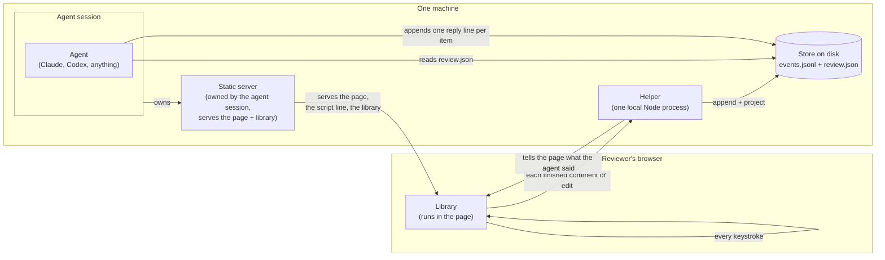

# System overview

This is the current picture of what exists and what talks to what: the
reviewer's browser, the helper process, the store on disk, and the agent. It
updates the summary diagram in the architecture doc, which predates agent
sessions and the session-owned static servers shown here.

## What to notice

- The agent session owns the static server that serves the page, not the
  helper. That is why closing a session stops its own servers without
  touching anyone else's, and why one helper on the machine can sit behind
  several independent agent workstreams at once.
- The library also writes every keystroke to browser storage on its own,
  independent of the helper. That is what keeps the tool useful with no
  helper running at all: nothing here is required for the reviewer to keep
  working, only for the agent loop to exist.
- The store on disk is the one thing the helper, the agent, and (through
  polling) the library all read from. Nothing that happens on screen can take
  a record back; the store is the truth and the page is only a view of it.
