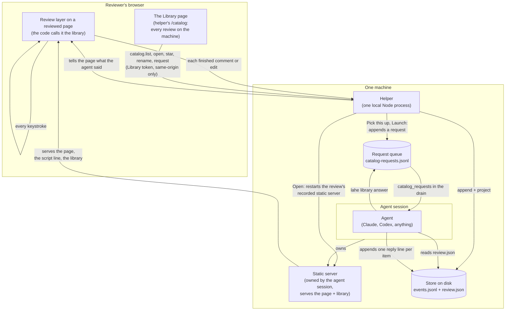

# System overview

This is the current picture of what exists and what talks to what: the
reviewer's browser, the helper process, the store on disk, the Library page
and its request queue, and the agent. It
updates the summary diagram in the architecture doc, which predates agent
sessions and the session-owned static servers shown here.

```mermaid
flowchart TD
    subgraph Browser["Reviewer's browser"]
        Lib["Review layer on a reviewed page<br/>(the code calls it the library)"]
        Cat["The Library page<br/>(helper's /catalog:<br/>every review on the machine)"]
    end

    subgraph Machine["One machine"]
        Static["Static server<br/>(owned by the agent session,<br/>serves the page + library)"]
        Helper["Helper<br/>(one local Node process)"]
        Store[("Store on disk<br/>events.jsonl + review.json")]
        Queue[("Request queue<br/>catalog-requests.jsonl")]

        subgraph Session["Agent session"]
            Agent["Agent<br/>(Claude, Codex, anything)"]
        end
    end

    Static -->|"serves the page,<br/>the script line, the library"| Lib
    Lib -->|"every keystroke"| Lib
    Lib -->|"each finished comment or edit"| Helper
    Helper -->|"append + project"| Store
    Agent -->|"reads review.json"| Store
    Agent -->|"appends one reply line per item"| Store
    Helper -->|"tells the page what the agent said"| Lib
    Session -->|"owns"| Static

    Cat -->|"catalog.list, open, star, rename, request<br/>(Library token, same-origin only)"| Helper
    Helper -->|"Open: restarts the review's<br/>recorded static server"| Static
    Helper -->|"Pick this up, Launch:<br/>appends a request"| Queue
    Queue -->|"catalog_requests in the drain"| Agent
    Agent -->|"lahe library answer"| Queue
```

## What to notice

- Two things are called "library". The in-page script that draws the rail is
  the library in the code. The page that lists every review is the Library to
  the reviewer, and `catalog` in the code, its routes and its URL.

- The agent session owns the static server that serves the page, not the
  helper. That is why closing a session stops its own servers without
  touching anyone else's, and why one helper on the machine can sit behind
  several independent agent workstreams at once.
- The library also writes every keystroke to browser storage on its own,
  independent of the helper. That is what keeps the tool useful with no
  helper running at all: nothing here is required for the reviewer to keep
  working, only for the agent loop to exist.
- The store on disk is the one thing the helper, the agent, and (through
  polling) the library all read from. Nothing that happens on screen can take
  a record back; the store is the truth and the page is only a view of it.
- The Library page talks only to the helper, with its own token. It can list,
  open, star, rename, and queue a request. It cannot post to a review or name
  a file to serve: Open restarts a server the review already had. How it works
  now is `docs/ongoing/LIBRARY.md`.
- The request queue is how the page reaches an agent. Only the helper appends
  requests, and only `lahe library answer` appends answers. The agent sees a
  request in its normal drain, the same way it sees an ended review.
