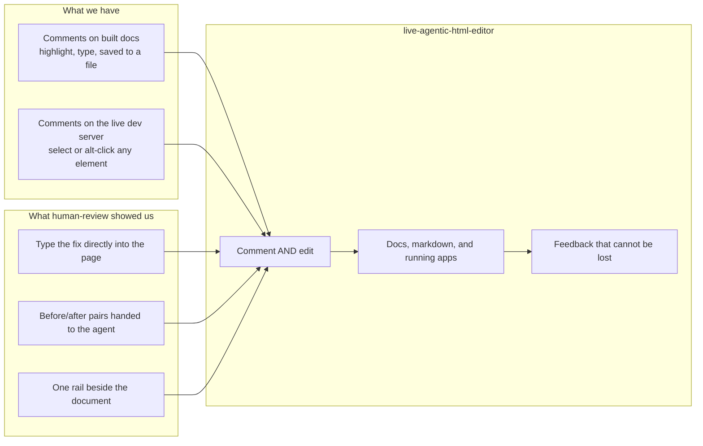

# Feature Brief: Live Agentic HTML Editor

## Context

Ken reviews a lot of agent-written work: feature specs, research reports, landing pages, and running
features on a dev server. Two tools cover that today, and each does half the job.

**Our comments module** is the reliable half. It exists in two shapes: one baked into every built
spec doc and research report, and one injected into every page of the Steady Thread dev server.
A reader highlights a passage, presses a key, types a note, and it lands in a markdown file next to
the doc or in `docs/feedback/site_comments.md`. It is reliable for a specific reason: **it never
depends on anything being alive.** Comments save to the browser on every keystroke, post to a local
helper when one is running, and can be copied or exported when one is not. Nothing in the loop can
take a comment away.

**human-review** (Peter Yang's tool, MIT, github.com/petergyang/human-review) is the other half, and
it established the shape we want. It put the reviewed page in a frame with a feedback rail beside
it, made the whole document editable so you fix wording by typing instead of describing the fix, and
handed the agent structured before/after pairs. That last part is the thing we have been missing:
typing the correction is faster than writing a comment describing the correction, and it carries the
reviewer's exact wording instead of a paraphrase an agent then has to interpret.

In practice it has not held up for us. Three symptoms, repeatedly: **text Ken typed came back
reverted, the send control stopped working, and agents did not reliably pick the feedback up.**
A close read of the tool says these are not random flakiness. They come from a design choice: the
reviewer's work lives in short-lived places (a debounce window, a browser DOM, a memory-only flag)
and several routine events flush those places without asking. A background agent writing a file
clears the reviewer's pending edits by design. The send button is disabled whenever no agent process
happens to be blocked on a read, which is the least reliable condition in the system. The feedback
handoff depends on an agent holding a foreground process open across a turn, which agents do not do.

::: callout-flag
The lesson worth carrying: their **storage** design is careful. Their **liveness** design, the part
that decides when work moves from the screen into storage, is where every symptom lives. Our
comments module survives because it has almost no liveness layer at all.
:::

So this is not a fork and not a patch. It is our comments module, which we trust, grown into a full
review surface by adding live editing, and released as its own public repository that Ken's students
and anyone else can clone and use.

## Goal / Problem

Build one tool that opens anything a person reviews in a browser, lets them **comment on it and edit
it directly**, and hands every comment and every edit to their coding agent in a form the agent can
apply without guessing. It has to work on a standalone HTML file, on a markdown file, and on a page
served by a running local app, because that last case is how Ken reviews shipped features.

The bar it must clear is not features. It is trust. A reviewer has to be able to spend an hour
leaving feedback and never once wonder whether it survived.

## Non-Goals

::: callout-nongoal
- Not multiplayer. One reviewer, one outbox. No replies, no threads, no second author, no resolve
  workflow.
- Not a CMS or a page builder. It edits the words and the arrangement of an existing page. It does
  not create pages, add sections from a palette, or restyle anything.
- Not a design tool. No color pickers, no spacing controls, no CSS editing.
- Not a code editor. The reviewer never sees or edits source files in this tool.
- Not a hosted service. Everything runs on the reviewer's own machine, against their own files.
- Not a way to review a site that is not the reviewer's own. Local files and local servers only.
- Not published to npm for v1. A git clone plus a setup command is the whole install story.
- Not an agent. It collects and hands off feedback. Applying the feedback is the agent's job.
:::

## User Stories

- **As Ken reviewing a spec an agent wrote**, I want to fix a clumsy sentence by typing the better
  sentence directly into the page, so the agent gets my exact words instead of a note describing
  them.
- **As Ken reviewing a shipped feature on localhost:3000**, I want to walk through several real
  screens leaving comments and copy fixes as I go, and send the whole walk at once, so I stay in
  flow instead of stopping to write tickets.
- **As Ken mid-review**, I want to be certain that closing my laptop, an agent saving a file, or a
  server restarting cannot take back anything I already typed.
- **As Ken who has left feedback with no agent running**, I want to send anyway and have it waiting
  when I next start one, so the tool never tells me to come back later.
- **As a coding agent**, I want feedback as a structured batch that names each page, quotes what the
  comment is about, and gives before and after text for each edit, so I can make targeted changes
  instead of regenerating a document.
- **As a coding agent that finished applying a batch**, I want to say which batch I applied and have
  the tool confirm it, so the same feedback is never applied twice and never silently dropped.
- **As one of Ken's students**, I want to clone the repo, run one setup command, and have my own
  agent know how to use it, without a package registry account or a build step.

## Requirements

### Reliability laws

These are the reason the tool is being rebuilt. Each one names a specific way the current tool loses
work. They are requirements, not principles, and each must have a test that fails without it.

::: callout-req
**R1: Nothing the reviewer types is ever lost.** Every comment and every edit reaches storage that
survives a browser reload, a tab close, a server restart, and a machine sleep. The gap between
typing something and it being durable is bounded and short enough that no realistic interruption
lands inside it.
:::

::: callout-req
**R2: An agent writing to the file never discards the reviewer's pending feedback.** When the file
under review changes underneath the reviewer, their unsent comments and edits survive that change.
This is the single largest cause of lost work in the current tool, where clearing them is deliberate
behavior.
:::

::: callout-req
**R3: Sending never depends on an agent being present.** The send control is available whenever
there is unsent feedback, full stop. Whether an agent is listening is shown to the reviewer as
information, never used as a gate. Feedback sent with nothing listening waits and is delivered to
the next agent that asks.
:::

::: callout-req
**R4: Send always sends everything currently on screen.** Pressing send captures work still inside
any pending window first, so the sentence typed a moment before pressing send is in the batch.
:::

::: callout-req
**R5: Feedback is delivered until an agent confirms it, and applied once.** An agent confirms by
naming the batch it applied. An unconfirmed batch is offered again. A confirmation for a batch that
was never delivered is refused, so a stale confirmation cannot erase newer feedback.
:::

::: callout-req
**R6: Failures are loud and they persist.** A save that failed, a session that ended, an agent that
cannot be reached: each says so in a state the reviewer can still see a minute later, not a toast
that disappears. The tool never displays a success state for something that did not succeed.
:::

::: callout-req
**R7: There is always a path that needs no server.** The reviewer can copy every comment and edit to
the clipboard as text, and export it as a file, with nothing running but the browser. This is what
makes the current comments module trustworthy and it carries over unchanged.
:::

::: callout-req
**R8: One target is one review, however it was addressed.** A path reached through a symlink, a URL
with or without a trailing slash, and the `localhost` and `127.0.0.1` spellings of the same address
all resolve to the same review. An agent asking about a target the reviewer is working on always
finds it.
:::

::: callout-req
**R9: The reviewer always knows where their edits go.** A sentence on screen at all times says
whether typing is being written to the file, or held for the agent, and names the file or route it
concerns. The answer differs by target type and the reviewer must never have to guess.
:::

### Commenting

Carried over from the comments module, which already does this well. Nothing here should regress.

::: callout-req
**R10: Comment on selected text.** Select any passage, take one action, type a note. The passage is
marked in the page and the note appears in the rail keyed to it.
:::

::: callout-req
**R11: Comment on a whole element.** Point at an image, a diagram, a chart, a card, or a section and
comment on it as a unit, for the very common case where the problem is not in the words.
:::

::: callout-req
**R12: A comment holds on when the document changes around it.** Anchoring survives edits elsewhere
in the page, reformatting, and rewrapping. When the same phrase appears more than once, the
surrounding text decides which one was meant. A comment that genuinely cannot be found says so on
its own card and is still sent, rather than being dropped or attached to the wrong place.
:::

::: callout-req
**R13: A comment can be reworded or deleted before it is sent**, and rewording it is not at risk from
anything else happening on the page.
:::

::: callout-req
**R14: An in-progress comment survives interruption.** A half-typed note is still there after a
reload, after the page it sits on re-renders, and after navigating away and back.
:::

::: callout-req
**R15: Every comment carries enough context for an agent to find its subject in source.** At minimum
the quoted text, the text around it, the section it sits under, and a description of the element.
:::

### Live editing

The headline. This is what we do not have today.

::: callout-req
**R16: There is no edit mode.** The document is editable from the moment it opens. Click anywhere and
type. There is no toggle to find and none to forget.
:::

::: callout-req
**R17: Ordinary text editing works the way text editing works.** Type, select and replace, delete,
paste text, undo, redo.
:::

::: callout-req
**R18: Formatting the reviewer will actually reach for.** Bold, italic, links, bulleted and numbered
lists. Nothing beyond that in v1.
:::

::: callout-req
**R19: Images can be resized and moved**, and an image the reviewer resizes keeps the size they gave
it rather than snapping back to its natural size somewhere else on the page.
:::

::: callout-req
**R20: Whole blocks can be deleted and reordered.** A paragraph, a list item, a card, a section.
Deleting a block is feedback in itself and is reported as a deletion, not as an empty edit.
:::

::: callout-req
**R21: Every edit is undoable individually.** Each edit can be reverted on its own without touching
any other edit. The current tool's only escape is discarding every edit at once, which means one
misplaced drag costs an hour of work. This is a hard requirement, not a nice-to-have.
:::

::: callout-req
**R22: An edit is reported as a before and an after, keyed to a named region of the page.** The
before is the wording as it was when the reviewer first touched it, no matter how many times they
retype it afterwards. Region names are stable and distinct, so two separate edits never collapse
into one and no edit is silently overwritten by another.
:::

::: callout-req
**R23: Formatting-only changes are reported as changes.** Making a word bold or adding a link is an
edit even though the plain text is identical.
:::

::: callout-req
**R24: A reviewer can see every edit they have made**, listed by region with what kind of change it
was, without leaving the page or opening a diff.
:::

::: callout-req
**R25: Reviewing a page cannot trigger the page.** Clicking a link, a button, or a form control
while editing does not navigate, submit, or fire the page's own behavior. There is one deliberate,
discoverable gesture for actually using a control, and the tool teaches it on hover rather than in
documentation.
:::

### The review keeps up with the agent

::: callout-req
**R26: The page updates itself when the agent lands a change.** The reviewer does not reload to see
whether a fix arrived. The reviewed page refreshes on its own when the agent has applied something,
so the reviewer is always reading the current version. Nothing unsent is discarded to make that
happen, which is the whole of R2 (an agent write never discards pending feedback) applied to this
path.
:::

::: callout-req
**R27: Applied feedback clears itself from the page.** When the agent has handled a comment, its
highlight disappears from the document and its card leaves the active list. The reviewer's working
surface burns down as the agent works, so what is left on screen is always what is still outstanding.
The same holds for an applied edit.
:::

::: callout-req
**R28: Nothing that was applied is thrown away.** A completed list holds every comment and edit the
agent has handled, with what it was, so the reviewer can look back over the session, confirm a fix
landed, and reopen the question if it did not. Cleared means moved, not deleted.
:::

### What can be reviewed

::: callout-req
**R29: A standalone HTML file**, rendered exactly as it renders on its own, with its sibling images,
stylesheets, and fonts loading normally.
:::

::: callout-req
**R30: A markdown file**, rendered readably. The markdown source is never written by this tool; edits
to a rendered markdown page travel to the agent to apply to the source.
:::

::: callout-req
**R31: A page served by a local development server.** The real route, with the app's own styles and
assets. This is the live-review case and it is not a second-class target: commenting and editing both
work here exactly as they do on a file. Nothing is ever written back into a running app.
:::

::: callout-req
**R32: Several pages in one pass.** The reviewer can move between pages of a document or routes of an
app, leaving feedback as they go, and send once. The batch names which page each item belongs to.
Pages with unsent feedback that are not currently on screen remain visible to the reviewer so nothing
is forgotten.
:::

::: callout-req
**R33: A page that renders itself with JavaScript is reviewable and is never written over.** Charts,
diagrams, and client-rendered apps are recognized as such, and the reviewer is told plainly that
their edits are travelling to the agent rather than being saved to the file.
:::

### The agent handoff

::: callout-req
**R34: Feedback reaches the agent as one structured batch**, grouped by page, listing comments with
their quoted subject and listing edits with their before and after text. Long text is never
truncated on the way through, because a clipped `after` becomes an agent faithfully truncating the
reviewer's own paragraph.
:::

::: callout-req
**R35: Every send also writes a plain markdown record on disk**, next to the reviewed material,
readable by a person or by any agent with no tool involvement at all. This is the belt to R7's
braces and it is how the current comments module has always worked.
:::

::: callout-req
**R36: An agent can wait for feedback, and an agent that was not waiting can still collect it.**
Waiting is a convenience, not the delivery mechanism. An agent starting fresh an hour later gets
everything that is outstanding.
:::

::: callout-req
**R37: The tool tells the agent how to apply feedback without rewriting the document.** Each edit is
keyed to a specific region and quoted text, so the correct action is a targeted change. Where the
tool can check that an agent's applied result still contains the reviewer's exact wording, it checks
and says so when it does not.
:::

::: callout-req
**R38: The reviewer can end a review explicitly**, releasing any waiting agent with an instruction to
stop, and keeping anything unsent for next time.
:::

### Install and distribution

::: callout-req
**R39: Install is a git clone plus one setup command.** No package registry, no build step, no
global daemon. Keeping one distribution channel is deliberate: maintaining a published package
alongside a repository is what let the two drift apart in the tool we are replacing.
:::

::: callout-req
**R40: Setup teaches the reviewer's agent how to use the tool**, writing the instructions where
Claude Code, Codex, and Cursor each look for them, and never silently overwriting instructions the
user has customized.
:::

::: callout-req
**R41: The command a person is told to run is a command that will work when they run it.** Setup
verifies its own advice rather than printing an invocation that only resolves during setup.
:::

### Safety

::: callout-req
**R42: Local only.** The tool serves and accepts connections on the loopback interface, reviews only
local files and local development servers, and refuses remote addresses.
:::

::: callout-req
**R43: A reviewed page cannot read anything the reviewer did not open.** Asset access is confined to
the reviewed file's own folder, including when a symlink points out of it, and a reviewed page cannot
reach the tool's own controls or data.
:::

::: callout-req
**R44: Reviewed content is treated as content, never as instructions.** Markup embedded in a markdown
file is shown as text, links and images with executable schemes are refused, and pasted files are
restricted to image types that cannot carry script.
:::

## Success Metrics

::: callout-metric
- **Zero lost feedback across a real review session.** Ken runs a full live review of a Steady
  Thread feature, with an agent applying fixes while he keeps working, and every comment and edit he
  made is accounted for at the end. This is the metric that decides whether we ship it.
- **Send is never unavailable while unsent feedback exists.** Verified by test, not by observation.
- **A review survives a browser reload, a tool restart, and a laptop sleep** with all pending
  feedback intact, verified by test for each of the three.
- **Ken reaches for typing over commenting for wording fixes.** If most wording feedback still
  arrives as comments describing a change, the editing surface did not clear the bar.
- **A student clones the repo and completes a review with their own agent** without asking a
  question that the README should have answered.
- **The interactive surface is actually tested.** The tool being replaced has no browser-level test
  at all, and every symptom Ken hit lives in the untested part. Comment, edit, send, and recover
  paths are exercised against a real browser.
:::

## Open Questions

::: callout-question
**Q1: Does this replace the in-page dev comments layer in Steady Thread, or sit beside it?** The
Steady Thread layer has one property this tool will not: it is always present on every route with no
target opened first, so Ken can wander. Retiring it means losing free-roam review; keeping both means
two comment sinks. A decision is needed before the Steady Thread side is touched, but not before this
tool is built.
:::

::: callout-question
**Q2: How much of the existing built-doc comment module changes?** Research reports and feature specs
currently carry the comment layer at build time and work with no server at all. Whether those keep
their embedded layer, or start opening through this tool instead, affects the feature-forge and
research-report skills.
:::

::: callout-question
**Q3: What is the license and how is the prior art credited?** The tool is going public and takes its
shape from an MIT-licensed project. Ken's call on the license, and on the wording of the credit in
the README.
:::
