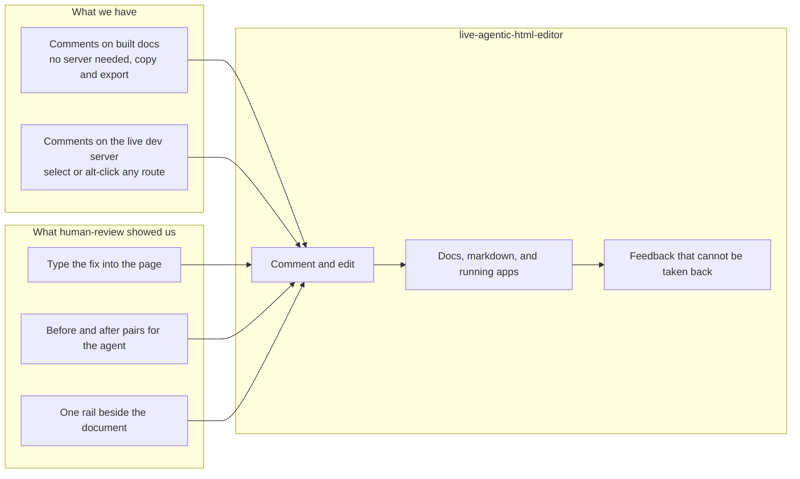

# Feature Brief: Live Agentic HTML Editor

## Context

Ken reviews a lot of agent-written work: feature specs, research reports, landing pages, and running
features on a dev server. Two tools cover that today, and each does half the job.

**Our comments module** is the reliable half. It exists in two shapes, and they are not equally
capable:

- The layer baked into built spec docs and research reports
  (`~/.claude/skills/shared-assets/comment_module.html`). Highlight a passage, press a key, type a
  note. This is the one that is genuinely hard to break, for a specific reason: **it does not depend
  on anything being alive.** Notes save to the browser on every keystroke, post to a local helper
  when one is running, and can be copied or exported to a file when one is not.
- The layer injected into every page of the Steady Thread dev server
  (`steady-thread/code/app/views/shared/_dev_comments.html.erb` and its controller). Select text or
  alt-click any element, type, send. It survives Hotwire morphs and keeps a draft through a reload.
  It has no offline path: a sent comment needs the app's endpoint to be up, and there is no copy and
  no export.

Both are comment-only. Neither lets Ken fix the wording by typing the better wording.

**human-review** (Peter Yang's tool, MIT, github.com/petergyang/human-review) is the other half, and
it established the shape worth having. It put the reviewed page beside a feedback rail, made the
whole document editable so you fix a sentence by typing it rather than describing it, and handed the
agent structured before and after pairs. That is the piece we have been missing. Typing the
correction is faster than writing a comment about the correction, and it carries Ken's exact wording
instead of a paraphrase an agent then has to interpret.

In practice it has not held up. Three symptoms, repeatedly: **text Ken typed came back reverted, the
send control stopped working, the reviewed app stopped responding to clicks, and agents did not
reliably pick the feedback up.** A close read says these are not random. The reviewer's work lives in
short-lived places, and several routine events empty those places without asking. An agent writing a
file clears the reviewer's pending edits, which is deliberate behavior with a test asserting it. The
send button is disabled whenever no agent process happens to be blocked on a read, which is the least
reliable condition in the system, and that disabled state persists to disk. Every click inside a
reviewed page is cancelled so clicks can mean place-the-cursor, which makes a reviewed app read as
broken. Delivery depends on an agent holding a foreground process open across a turn, which agents do
not do.

::: callout-flag
The lesson worth carrying: their **storage** design is careful and well tested. Their **liveness**
design, the part deciding when work moves from the screen into storage, has no browser-level test at
all, and every symptom lives there. Our built-doc comment module survives because it barely has a
liveness layer.
:::

So this is not a fork and not a patch. It is our comments module, which we trust, grown into a full
review surface by adding live editing, released as its own public repository that Ken's students and
anyone else can clone and use.

Two constraints shape the work. Ken wants a working tool the same day, so the plan phases the build
rather than pretending everything lands at once. And the repository is public from the first commit,
so it has to be something a stranger can clone and understand.

## Goal / Problem

Build one tool that opens anything a person reviews in a browser, lets them **comment on it and edit
it directly**, and hands every comment and every edit to their coding agent in a form the agent can
apply without guessing. It has to work on a standalone HTML file, on a markdown file, and on a page
served by a running local app, because that last case is how Ken reviews shipped features.

The bar is not features. It is trust. A reviewer has to spend an hour leaving feedback and never once
wonder whether it survived.

## Non-Goals

::: callout-nongoal
- Not multiplayer. One reviewer, one outbox. No replies, no threads, no second author, no resolve
  workflow.
- Not a CMS or a page builder. It edits the words and the arrangement of a page that already exists.
  It does not create pages, add sections from a palette, or restyle anything.
- Not a design tool. No color pickers, no spacing controls, no CSS editing, and no theming
  of the page being reviewed.
- Not a hosted service. Everything runs on the reviewer's own machine against their own files.
- Not published to a package registry for v1. A git clone plus a setup command is the whole install
  story. Keeping one distribution channel is deliberate: maintaining a published package alongside a
  repository is what let the two drift apart in the tool being replaced.
- Not targeting Windows in v1. macOS first, Linux where it falls out for free. The tool being
  replaced spent four separate rounds of work on Windows and weakened its own test suite each time.
- Not Markdown files. Cut on Ken's call: a Markdown file is already easy to edit in an editor. The
  three targets that matter are built briefs, built report briefs, and pages on a running dev server,
  and all three are HTML. This removes a renderer, a sanitizer, and a whole second content type.
- Not reviewing HTML the reviewer did not produce. v1 assumes the reviewed page is the reviewer's own
  build or their own app. See the architecture's note on isolation.
- Not mobile.
- Not an agent. It collects feedback and hands it off. Applying it is the agent's job.
:::

## User Stories

- **As Ken reviewing a spec an agent wrote**, I want to fix a clumsy sentence by typing the better
  sentence into the page, so the agent gets my exact words instead of a note describing them.
- **As Ken reviewing a shipped feature on his dev server**, I want to move through the real screens
  leaving comments and typed fixes as I go, and send the whole walk at once, so I stay in flow
  instead of stopping to write tickets.
- **As Ken reviewing a feature that needs a login**, I want the pages behind that login to be
  reviewable, because they are the entire product.
- **As Ken mid-review**, I want to click a button in the app to get to the next screen without
  leaving the review or losing what I have typed.
- **As Ken mid-review**, I want certainty that closing my laptop, an agent saving a file, or a server
  restarting cannot take back anything I already typed.
- **As Ken with no agent running**, I want to send anyway and have it waiting when I next start one,
  so the tool never tells me to come back later.
- **As Ken watching an agent work through my feedback**, I want handled items to clear themselves off
  the page so what is left on screen is what is still outstanding.
- **As a coding agent**, I want feedback as a structured batch that names each page, quotes what each
  comment is about, and gives before and after text for each edit, so I make targeted changes instead
  of regenerating a document.
- **As a coding agent that finished**, I want to report which items I applied and which I could not
  and why, so nothing is marked handled that was not.
- **As one of Ken's students**, I want to clone the repo, run one setup command, and have my own
  agent know how to use it.

## Requirements

### Reliability laws

These are the reason for the rebuild. Each names a specific way the current tool loses work, and each
needs a test that fails without it.

::: callout-req
**R1: Nothing the reviewer types is lost.** A browser reload, a tab close, a navigation to another
page, a restart of the tool, or a machine sleep immediately after a keystroke never loses that
keystroke.
:::

::: callout-req
**R2: An agent writing to the reviewed material never discards the reviewer's pending feedback.**
When what is being reviewed changes underneath the reviewer, their unsent comments and edits survive
it. This is the single largest cause of lost work in the current tool, where discarding them is
deliberate.
:::

::: callout-req
**R3: The reviewer's unsent work is never silently overwritten, and collisions are surfaced.** When a
change to the underlying source touches a region the reviewer has unsent work in, that region keeps the
reviewer's version and they are told a conflicting change arrived. When the reviewed page re-renders its
own data instead, the reviewer's edit is set aside with its text intact and its card says the page moved
on, because stamping their words over live application data would be a lie about their own app.
:::

::: callout-req
**R4: Sending never depends on an agent being present.** Send is available whenever unsent feedback
exists. Whether an agent is listening is information shown to the reviewer, never a gate. Feedback
sent with nothing listening waits and goes to the next agent that asks.
:::

::: callout-req
**R5: Send sends everything currently on screen**, including the sentence typed a moment before
pressing it.
:::

::: callout-req
**R6: Outstanding feedback is one queue, not a frozen snapshot.** Sending again while an earlier send
is unconfirmed adds to what is outstanding rather than replacing it.
:::

::: callout-req
**R7: An agent reports per item, not per batch.** It names which items it applied and which it did
not, with a reason for each it did not. An item nobody applied stays outstanding.
:::

::: callout-req
**R8: Feedback is offered until an agent confirms it, and applied once.** A confirmation for
something that was never delivered is refused, so a stale confirmation cannot erase newer feedback.
:::

::: callout-req
**R9: Failures are loud and they persist.** A save that failed, a session that ended, an agent that
cannot be reached: each stays visible in a state the reviewer can still see a minute later. The tool
never shows a success state for something that did not succeed.
:::

::: callout-req
**R10: There is always a path that needs no server.** The reviewer can copy every comment and edit to
the clipboard as text and export them as a file with nothing running but the browser. The built-doc
comment module has this today and it is what makes it trustworthy. On the live-app path this is new
work, not a carry-over.
:::

::: callout-req
**R11: One target is one review, however it was addressed.** A path reached through a symlink, a URL
with or without a trailing slash, and the `localhost` and `127.0.0.1` spellings of one address all
resolve to the same review. An agent asking about a target the reviewer is working on finds it.
:::

::: callout-req
**R12: A second window on the same target joins the same review**, or is refused with a reason that
says what to do instead. Two windows never accumulate separate feedback that overwrite each other.
:::

::: callout-req
**R13: The reviewer always knows where their typing goes.** A sentence on screen at all times says
what happens to an edit on this target and names the file or route it concerns.
:::

### Leaving comments

The two existing comment layers are the specification for this section and neither should regress.
What follows is what has to be true, including the few things that change because the document is now
editable.

::: callout-req
**R14: Comment on selected text.** Select a passage, take one action, type a note. The passage is
marked in the page and the note appears keyed to it.
:::

::: callout-req
**R15: Comment on a whole element** by holding Alt and clicking it, for the common case where the problem
is not in the words: an image, a diagram, a chart, a card, a section. Alt-click is the gesture the Steady
Thread layer already uses, so it is already in the reviewer's hands. **A plain click never opens a compose
box**, because a plain click now places the text cursor.
:::

::: callout-req
**R16: A comment holds on when the document changes around it.** Anchoring survives edits elsewhere,
reformatting, and rewrapping. When the same phrase appears more than once, the surrounding text
decides which was meant.
:::

::: callout-req
**R17: A comment that cannot find its subject says so, and says so to the agent too.** It is marked
on screen and its lost-anchor state travels in the payload, so the agent knows the quote may no
longer be in the file rather than being told to find it.
:::

::: callout-req
**R18: A comment can be reworded or deleted before it is sent**, and rewording it is safe from
anything else happening on the page at the same time.
:::

::: callout-req
**R19: An in-progress comment survives interruption**: a reload, the page re-rendering underneath it,
and navigating away and back.
:::

::: callout-req
**R20: A note tied to nothing is first-class feedback.** The reviewer can write a note about the
whole review, it counts as unsent feedback for the purposes of R4 (send is available whenever unsent
feedback exists), and it can be sent on its own with no comments and no edits.
:::

::: callout-req
**R21: Every comment carries enough context for an agent to find its subject in source**: the quoted
text, the text around it, the section it sits under, and a description of the element.
:::

### Editing the page

The headline. This is what we do not have today.

::: callout-req
**R22: There is no edit mode to find or forget.** The document is editable from the moment it opens.
Click anywhere and type. There is an explicit escape for driving the app (R38), which is a thing the
reviewer reaches for deliberately, not a mode they have to remember to leave.
:::

::: callout-req
**R23: Ordinary text editing works the way text editing works.** Type, select and replace, delete,
paste text, undo, redo.
:::

::: callout-req
**R24: The formatting a reviewer actually reaches for**: bold, italic, links, bulleted and numbered
lists. Nothing beyond that in v1.
:::

::: callout-req
**R25: Images can be resized and moved.** An image the reviewer resizes keeps the size they gave it when
it lands somewhere else. Pasting a new image is cut from v1: it is the one action that would force the
tool to write a file, which R44 and the architecture otherwise forbid, and it has no answer at all on a
running app.
:::

::: callout-req
**R26: Whole blocks can be deleted and reordered**: a paragraph, a list item, a card, a section.
Deleting a block is feedback in itself and is reported as a deletion, not as an edit to nothing.
:::

::: callout-req
**R27: Every edit can be undone on its own**, without disturbing any other edit. The current tool's
only escape is discarding every edit at once, so one misplaced drag costs an hour of work.
:::

::: callout-req
**R28: An edit is reported as a before and an after, keyed to a named region.** The before is the
wording as it was when the reviewer first touched it, however many times they retype it afterwards.
:::

::: callout-req
**R29: Region names are stable and distinct.** Two separate edits never collapse into one row, and no
edit is silently overwritten by another that happened to be named the same.
:::

::: callout-req
**R30: Formatting-only changes are reported as changes.** Bolding a word or adding a link is an edit
even though the plain text is unchanged.
:::

::: callout-req
**R31: The reviewer can see every edit they have made**, listed by region with what kind of change it
was, without leaving the page or opening a diff.
:::

::: callout-req
**R32: Typed text survives the reviewed page updating itself.** On a page whose own code re-renders
parts of the DOM, which is every Hotwire and React app, what the reviewer typed is not silently
replaced. Where it genuinely cannot be preserved, the tool says so loudly rather than letting the
text disappear.
:::

::: callout-req
**R33: Nothing the tool adds to the page can end up in the reviewer's feedback.** Highlights, chips,
handles, and panels are never part of a quoted passage, an edit's before or after, or anything handed
to the agent.
:::

### Leaving the artifact alone

::: callout-req
**R34: The tool styles only the elements it adds.** It never changes how the reviewed page looks. No
stylesheet is injected over the content, no fonts, colors, spacing, or layout of the reviewed
material are overridden, and the document is never re-themed. What the reviewer sees is what the
artifact looks like standalone, which is the whole point of reviewing it in a browser.
:::

::: callout-req
**R35: The tool never writes styles onto the reviewed page's own elements**, including to make its
own changes more visible. Where an edit would be hard to see because of the page's CSS, the tool
confirms it happened through its own layer, not by restyling the reviewed content. The tool being
replaced pins bullets and underlines onto the host page when it decides they would be invisible,
which quietly changes the artifact.
:::

### Using the page while reviewing it

Ken hit both readings of "submission stopped working": the tool's own send going dead, and the
reviewed app refusing to respond. R4 covers the first. These cover the second.

::: callout-req
**R37: A plain click while editing does not fire the page's own behavior.** Links do not navigate,
buttons do not act, forms do not submit, because a plain click places the cursor.
:::

::: callout-req
**R38: The reviewer can use the page for real, and it is obvious how.** An editing toggle turns
interception off for a stretch and gives back an ordinary page, which is what someone moving through a
real flow actually wants. Holding Cmd (or Ctrl) and clicking a link follows it without leaving editing,
for the one-off case. Both are taught on screen rather than in documentation.
:::

::: callout-req
**R39: Leaving a page to use the app does not cost the reviewer anything.** Feedback left on a page
survives navigating away from it, and returning shows it still there.
:::

### What can be reviewed

All three targets are HTML. Markdown was cut from scope, which is why R36 and R41 no longer appear.

::: callout-req
**R40: A standalone HTML file**, rendered exactly as it renders on its own, with its sibling images,
stylesheets, and fonts loading normally.
:::

::: callout-req
**R42: A page served by a running local development server**, showing the real route with the app's
own styles and assets. This is the live-review case and it is not a second-class target: commenting
and editing both work here as they do on a file.
:::

::: callout-req
**R43: Routes that require a login are reviewable.** Ken's dev server needs a session, and the pages
behind it are the product. A tool that only reaches the login screen is of no use for the case it was
built for.
:::

::: callout-req
**R44: The reviewer can attach the tool to a running app once and then wander.** Free-roam is how live
reviews actually go: Ken clicks into whatever screen he lands on and comments there, without having
opened that screen as a target first. The existing Steady Thread layer works this way and the
replacement cannot lose it.
:::

::: callout-req
**R45: Several pages or routes in one pass.** Feedback accumulates across everything the reviewer
visits and sends as one batch that names which page each item belongs to. Pages holding unsent
feedback stay visible to the reviewer even when they are looking at something else.
:::

::: callout-req
**R46: A page that renders itself with JavaScript is reviewable.** Nothing needs to be detected about it:
since the tool never writes any reviewed file, every target gets the same honest sentence from R13 (the
reviewer always knows where their typing goes).
:::

### The reviewed artifact and its source

::: callout-req
**R47: A typed fix reaches whatever the next build reads.** Most of what Ken reviews is generated:
the spec HTML comes from markdown, the report HTML comes from markdown, the dev-server page comes
from templates and components. A fix that lands only in the generated artifact is erased by the next
build, which makes it worse than no fix because it looked applied. The tool never leaves the reviewer
believing a change is safe when the next build will remove it.
:::

::: callout-req
**R48: The tool never corrupts what it was pointed at.** Whatever it does or does not write, the
reviewed material is never left in a state its author did not intend: no reformatting as a side
effect, no partial write, no silent overwrite of a newer version.
:::

### Handing feedback to the agent

::: callout-req
**R49: Feedback reaches the agent as one structured batch**, grouped by page, listing comments with
their quoted subject and edits with their before and after text.
:::

::: callout-req
**R50: The reviewer's own words are never truncated on the way through.** A clipped `after` becomes an
agent faithfully truncating the reviewer's own paragraph. Text quoted out of the reviewed document is a
search key rather than the reviewer's intent, so it may be bounded, visibly.
:::

::: callout-req
**R51: Every send also writes a plain markdown record on disk at a known, documented location**,
readable by a person or any agent with no tool involved. This includes reviews of a running app,
where there is no reviewed file to sit next to. The current comments module has always worked this
way and it is why feedback has never been lost.
:::

::: callout-req
**R52: An agent can wait for feedback, and an agent that was not waiting still collects it.** Waiting
is a convenience. An agent starting fresh an hour later gets everything outstanding.
:::

::: callout-req
**R53: Each item is keyed so that the correct action is a targeted change.** The agent is given what
it needs to change one region and is told not to regenerate the document. The tool being replaced
tried to get this with a prompt rule and nothing else.
:::

::: callout-req
**R54: After an agent applies a batch, the tool checks the reviewer's exact wording is present in the
result, and says so loudly when it is not.** This is the only defense against an agent quietly
rewriting a document and reverting the reviewer's edits in the process.
:::

::: callout-req
**R55: The reviewer can end a review explicitly**, releasing any waiting agent with an instruction to
stop, and keeping anything unsent for next time.
:::

### Keeping up with the agent

::: callout-req
**R68: The agent can write back to the reviewer, in the page.** When an agent cannot apply an item, or
applied it differently than asked, or has a question about it, it attaches a message to that item and
the reviewer reads it on the item's own card. The reviewer is not expected to return to a terminal or a
chat window to find out what happened to their feedback.
:::

::: callout-req
**R69: The page is the channel back to the reviewer.** Anything the tool or the agent needs to tell the
reviewer arrives in the page they are looking at. Something that needs their attention persists on the
item it concerns; something transient can be a passing message. Nothing important lives only in a log,
a terminal, or a chat transcript, because that is not where the reviewer is.
:::

::: callout-req
**R56: The page updates itself when the agent lands a change.** The reviewer does not reload to find
out whether a fix arrived. Nothing unsent is discarded to make this happen, which is R2 (an agent
write never discards pending feedback) applied to this path.
:::

::: callout-req
**R57: Applied feedback clears itself from the page.** When an agent reports an item applied, its
highlight disappears from the document and it leaves the active list. The working surface burns down
as the agent works, so what is on screen is what is still outstanding.
:::

::: callout-req
**R58: Cleared means moved, not deleted.** A completed list holds every item the agent applied, with
what it was, so the reviewer can look back over the session, confirm a fix landed, and reopen it if
it did not.
:::

### Install and distribution

::: callout-req
**R59: Install is a git clone plus one setup command.** No package registry, no build step, no
background service left behind.
:::

::: callout-req
**R60: Setup teaches the reviewer's agent how to use the tool**, writing instructions where Claude
Code, Codex, and Cursor each look for them.
:::

::: callout-req
**R61: Setup never silently overwrites instructions a user has customized.**
:::

::: callout-req
**R62: The command a person is told to run works when they run it**, verified by setup rather than
printed on faith.
:::

### Safety

::: callout-req
**R63: Local only.** The tool listens on the loopback interface, reviews only local files and local
development servers, and refuses remote addresses.
:::

::: callout-req
**R64: A reviewed page cannot read anything the reviewer did not open**, including through a symlink
pointing out of the reviewed file's folder.
:::

::: callout-req
**R65: A reviewed page cannot reach the tool's own controls or stored feedback.** Deferred beyond v1 and
not claimed: the layer lives in the reviewed page's own origin, which is what buys authenticated routes
and free roam. It holds the day reviewing HTML the reviewer did not produce comes into scope, and the
known answer then is an isolating frame.
:::

::: callout-req
**R66: Reviewed content is content, never instructions.** Text taken out of a reviewed page and put
in front of an agent is data the agent may search on, never a directive it may follow. Links and images
carrying executable schemes are refused.
:::

::: callout-req
**R67: No file the reviewer drops or pastes ever becomes part of the page or reaches disk.** With image
paste cut from v1 (R25) this is a refusal rather than an allowlist, and a drop from the desktop must not
navigate the page away from the review.
:::

## Success Metrics

::: callout-metric
- **Zero lost feedback across a real review session.** Ken runs a full live review of a Steady Thread
  feature, with an agent applying fixes while he keeps working, and every comment and edit is
  accounted for at the end. This is the metric that decides whether it ships.
- **Send is never unavailable while unsent feedback exists**, verified by test rather than by
  observation.
- **A review survives a browser reload, a tool restart, and a laptop sleep** with all pending
  feedback intact, verified by test for each of the three.
- **Ken reviews a page behind a login and drives the app through it**, clicking into at least three
  screens and leaving feedback on each, without the review breaking or the app becoming unusable.
- **A student clones the repository and completes a review with their own agent** with no help from
  Ken.
- **The interactive surface is tested against a real browser.** The tool being replaced has no
  browser-level test at all, and every symptom Ken hit lives in the untested part. Comment, edit,
  send, and recover paths are exercised for real.
:::

## Open Questions

::: callout-question
**Q1: Which browsers does v1 support?** The answer changes how much of the editing surface has to be
implemented by hand rather than relying on the browser, and it changes the test matrix. A single
target browser is a legitimate answer for a tool Ken uses himself, and a poor one for a public repo
students will clone.
:::

::: callout-question
**Q2: Does this replace the Steady Thread in-page dev comments layer, or sit beside it?** R44
(attach once and wander any route) means the capability is covered, so the question is only whether
Steady Thread keeps its own copy. This does not block the build and belongs on the Steady Thread
board once the tool exists.
:::

::: callout-question
**Q3: Do built research reports and spec docs keep their embedded comment layer?** They work today
with nothing running at all, which is a real property to give up. If they instead open through this
tool, the feature-forge and research-report skills both change. Also not blocking.
:::

## PM Review Disposition

| Finding | Disposition | Notes |
| --- | --- | --- |
| Batch-level confirmation cannot drive item-level clearing | Accepted | R7 makes the item the unit of confirmation; R57 and R58 depend on it |
| Nothing says who wins when an agent rewrites a block being edited | Accepted | R3 names the rule: the reviewer's version stays, the collision is surfaced |
| Brief never says whether the tool writes the reviewed file | Reframed | Ken's call: this is an architecture decision. The brief states the requirement that makes it decidable (R47, a fix must reach what the next build reads; R48, never corrupt the target) without picking the mechanism |
| Localhost review says nothing about authentication | Accepted | R43 makes authenticated routes a requirement |
| Nothing covers the app's own re-renders eating typed text | Accepted | R32 |
| No requirement for a free-text note tied to nothing | Accepted | R20, explicitly tied to R4 so the note-only-send bug cannot be rebuilt |
| Free-roam is a capability question, not a Steady Thread question | Accepted | R44 makes it a requirement; Q2 is reduced to whether Steady Thread keeps its own layer |
| Element comment and caret placement collide on the click gesture | Accepted | R15 names a modifier gesture and forbids plain-click compose |
| R1's second sentence is unfalsifiable | Accepted | Rewritten as an observable |
| Context overclaims what carries over from the comments module | Accepted | Context now distinguishes the two layers; R10 says the offline path is new work on the live-app side |
| "Features like submission" may mean the reviewed app, not Send | Accepted | Ken confirmed both, at different times. R37, R38, R39 added |
| Five requirements are welded together | Accepted | Split throughout; post-apply verification promoted to R54 |
| Nothing says what a second window does | Accepted | R12 |
| Nothing says what a second send does while one is unconfirmed | Accepted | R6 |
| Sequence into four releases | Deferred to plan | Ken's call: phasing belongs in the plan, and he wants a working tool today |
| Markdown record location undefined for a URL target | Accepted | R51 requires a known documented location including for running apps |
| Self-rendering detection sets no bar on false positives | Accepted | R46 reduced to a reviewer-facing honesty requirement; detection quality is an architecture concern |
| No supported platforms stated | Accepted | Non-goal: macOS first, Windows out of v1 |
| Collapse the six commenting requirements into one | Partially accepted | Section preamble points at the two existing layers as the specification; individual requirements kept because each is separately falsifiable |
| Cut "not a code editor" and "not reviewing others' sites" | Accepted | Both removed; the second is R63 |
| Cut the typing-over-commenting success metric | Accepted | Nothing collects that ratio |
| Cut the unfalsifiable student metric | Accepted | Now: completes a review with no help from Ken |
| Paste restriction constrains a capability never granted | Accepted | R25 now grants image paste; R67 constrains it |
| Q3 (license) is a settled decision | Accepted | Settled as MIT with human-review credited in the README; question removed |
| Tool imposes its own styling on the reviewed artifact (Ken, live) | Accepted | R34 and R35 added: style only what we add, and never write styles onto the host page |
| Nothing important should live only in the chat window; an unplaceable edit needs to say so in the page (Ken, live) | Accepted | R68 (the agent writes back onto the item's card) and R69 (the page is the channel back) |
| Verification cannot match a rendered string to its template | Accepted | Architecture D8 now has a third verdict, not verifiable, rather than a false warning on every interpolated region |
| R3 did not say what happens on an app re-render as opposed to a source change | Accepted | R3 split: source change collides, app re-render detaches |
| Image paste forces a write path the design forbids and has no answer on a route | Accepted | Cut from R25; R67 restated as a refusal |
| R50 read as an absolute covering text the reviewer did not write | Accepted | Bounded to the reviewer's own words |
| R65 is claimed and not achievable | Accepted | Marked deferred and not claimed |
| R46 was a leftover from the design where the tool wrote files | Accepted | Folded into R13 |
| Element comment and pass-through both called a modifier click | Accepted | Alt-click comments, Cmd-click follows a link, plus the R38 toggle |
| Markdown dropped as a target (Ken, live) | Accepted | R36 and R41 cut; R66 restated without markdown; non-goal added. All remaining targets are HTML |
| Genuinely open: does the tool write the file, how auth works, which browsers | Split | The first two are architecture decisions per Ken; browsers remain as Q1 |
