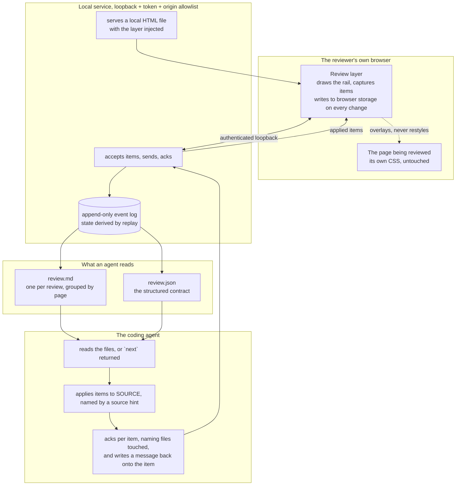
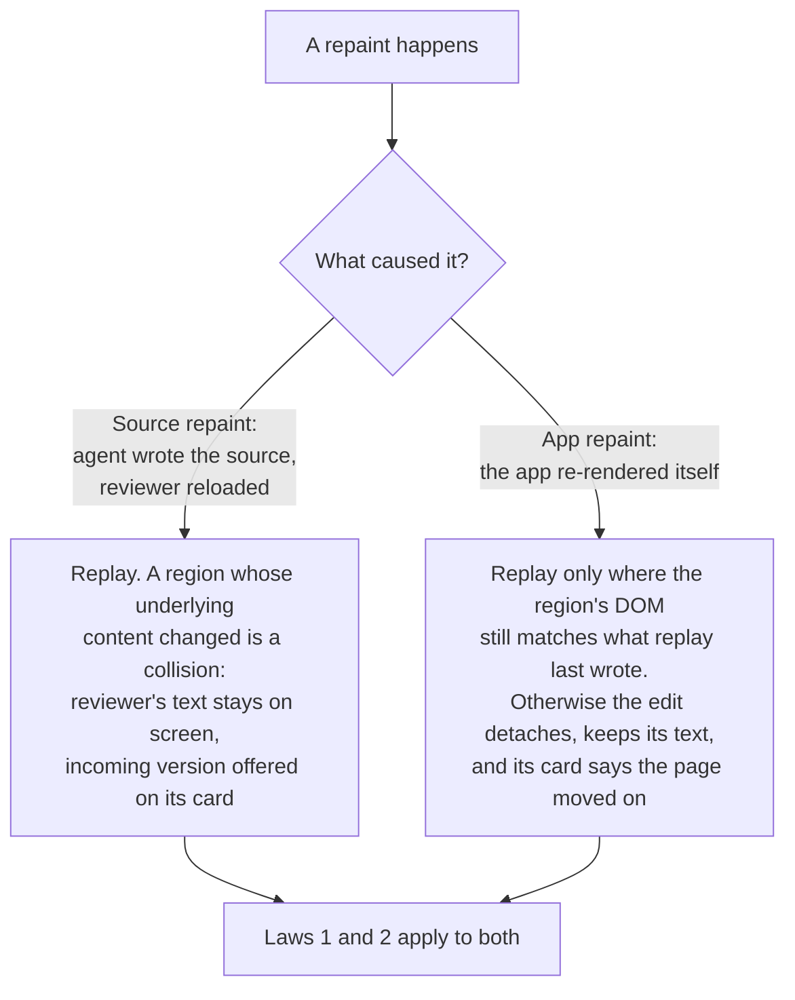
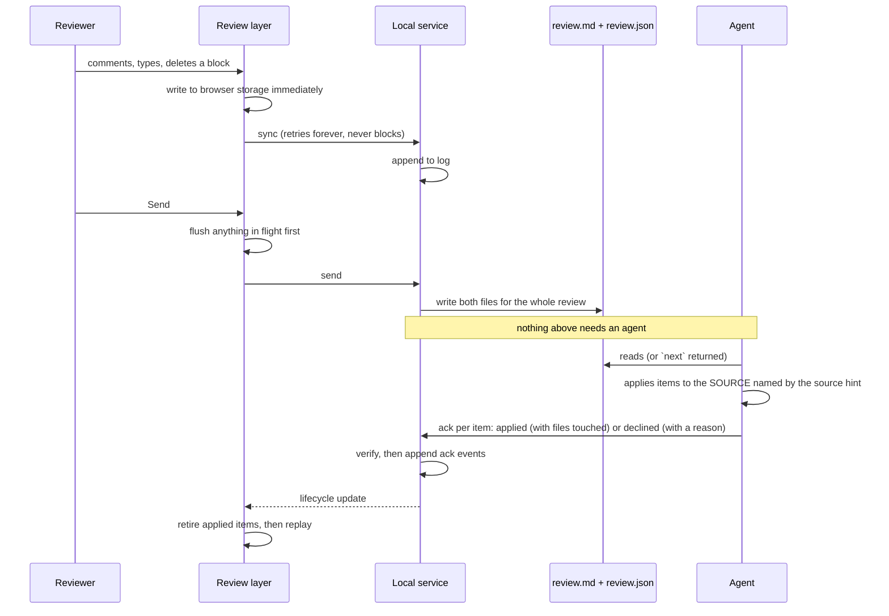
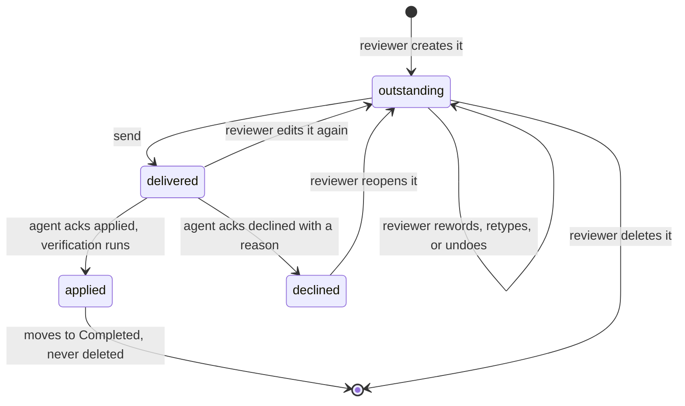

# Architecture: Live Agentic HTML Editor

## Summary

Three parts, each with one job.

A **review layer** is vanilla JS that runs inside whatever page is being reviewed. It draws the
comment and edit surface, captures what the reviewer does, and writes every change to browser storage
the instant it happens. It never restyles the reviewed page and never writes to the reviewed file.

A **local service** serves local files with the layer injected, accepts feedback over loopback behind
real authentication, and appends it to a log on disk. State is derived by replaying the log, so
nothing important lives only in memory.

An **agent surface** is four commands plus two files on disk. The files are the contract; the commands
are a convenience. An agent that was never running when the reviewer pressed send still gets
everything, because delivery is a file, not a connection.

The idea holding it together: **the reviewer's outstanding feedback is the truth, and the page is a
view of it.** An edit is not a change made to a document. It is a durable record replayed on top of
whatever the page currently shows. This is what removes the class of bug where the reviewer's text
comes back reverted: there is nothing to revert to, because the page was never where the text lived.

Replay is powerful and therefore dangerous, so it is bounded by three laws stated in D3: it never
writes on a low-confidence match, it never touches a region holding the caret, and it treats an app
re-rendering its own data differently from a source rewrite. Without those it becomes a worse version
of the bug it exists to kill.

## Analysis of existing structure

Nothing is being modified; this is a new repository. Two existing implementations are the input, and
what actually carries over is narrower than it first looks. Both were read line by line for this
document, and two of the original reuse claims did not survive the reading.

| Existing piece | What genuinely carries over | What is new work |
| --- | --- | --- |
| Built-doc comment module (`shared-assets/comment_module.html`) | Immediate synchronous persistence on every change; copy and export with no server; the *idea* of a ladder of anchor probes; a helper that refuses work for a document it does not own | **Anchoring itself.** Its `locate()` is four exact substring probes over the concatenated text, with no whitespace tolerance and no occurrence disambiguation, so a short prefix binds to the first hit. R16 (survive reformatting, pick the right occurrence among repeats) is not met by it. **Storage keying**: its browser key is the file's basename, so two `index.html` files in different folders merge into one bucket |
| Steady Thread dev layer (`_dev_comments.html.erb`) | Injection into the app's own page rather than a proxy; element commenting by modifier-click carrying a CSS path and surrounding context; a draft that survives a morph | **The remount contract.** It re-registers document-level listeners on every morph without removing the old ones, so handlers accumulate for the life of the page. It also survives morphs largely because Rails re-renders the partial into the response, which an injected script does not inherit. Its draft is one global key, not a queue |
| human-review | The interaction model: page beside a rail, editable document, before-and-after pairs, per-target grouping | None of its liveness design |

The security floor human-review reached is worth inheriting rather than rediscovering: a per-run token
compared in constant time, a host header check, and containment checked after symlink resolution. Its
origin split is the one control v1 does not take, for the reason given in D5.

## Components

| Component | Job |
| --- | --- |
| **Review layer** | Everything the reviewer sees and does, and everything the tool or agent needs to tell them. Vanilla JS, no build step. Identical however it got into the page. |
| **Overlay renderer** | Draws the rail, highlights, chips, and handles in an isolated root. Updates in place; never re-creates a card that holds focus. Owns the persistent failures list. |
| **Anchor engine** | Turns a selection or an element into a durable reference and re-resolves it in a changed document, with a confidence score. New work. |
| **Item store (browser)** | Durable queue written synchronously on every change. The source the layer renders from. |
| **Edit recorder** | Turns editing into item records with a kind, plain text, markup, and landing anchors. |
| **Replay engine** | Re-applies outstanding edits after a repaint, under the three laws in D3. |
| **Sync client** | Ships items to the service, retries forever, never blocks, and distinguishes refused-by-policy from service-down. |
| **Local service** | Serves a local HTML file with the layer injected, authenticates, accepts items and agent replies, appends to the log. |
| **Event log** | Append-only. The only durable server-side state. |
| **Projection** | Reads the log into current state: outstanding, delivered, applied, declined. |
| **Agent commands** | `open`, `next`, `ack`, `setup`. |
| **Attach kit** | Framework-correct guarded snippets emitted by `setup` for a development layout. |

## Key decisions

### D1: A review is the unit, not a target

One review spans many targets. Walking eight routes of an app produces one review containing eight
pages, one `review.md`, and one `review.json`. Items carry the target they belong to; target identity
is the per-page key inside the review, not the identity of the review itself.

This is the difference between an agent reading one file and an agent discovering eight. It is what
makes "walk the app and send the whole walk at once" true, and it is what makes free roam coherent:
a reviewer who wanders through screens is doing one review, not one per URL they happened to land on.

A review's files live at a **review root**, which is server-side configuration recorded when the
reviewer starts a review or attaches a project. It is never accepted from a request body. See D11.

### D2: The tool never writes the file being reviewed, and it names the source instead

Every edit is feedback. There is no autosave, no save conflict, no revert-all, no serialization of a
live DOM over a source file.

The reason is specific to what gets reviewed. A built spec doc and a research report are generated
from markdown, so writing the HTML is erased by the next build. A markdown file under review is what
the agent needs to edit, so two writers collide. A running app has no file to write. Writing helps in
none of the real cases and is the root of most of the reverting bugs in the tool being replaced.

**Refusing to write is not enough on its own.** An agent handed a review of a built HTML file will
edit that HTML file, the verification in D8 will pass, the item will clear from the rail, and the next
build will erase it. The reviewer watched the burn-down and believes the fix landed, which is exactly
the failure R47 (a typed fix must reach whatever the next build reads) exists to prevent.

So every target carries a **source hint**: for a generated document, the file it is generated from;
for a route, the project root. `setup` asks once per project and the answer is stored with the review
root. The hint travels in both agent-facing files, the agent instructions say to edit the generator's
input and to name what it edited, and D8 verifies against that file.

::: xref
[Brief: R47, a typed fix must reach whatever the next build reads](01_brief_live_agentic_html_editor.html#the-reviewed-artifact-and-its-source)
:::

### D3: Replay, and the three laws that keep it safe

An item record holds a region reference, the original content captured the first time that region was
touched, and the current content. The page renders, then outstanding edits are applied on top.

Replay is the reason the reliability laws fall out of one mechanism instead of needing to be defended
one at a time. It is also the most dangerous thing in the design, because a replay that writes to the
wrong place produces a lie about the reviewer's own document. Three laws bound it.

**Law 1: replay never writes on a low-confidence match, and it fails closed.**
A region reference carries several independent ways to find its place: an author-supplied name where
the document offers one, a structural path, the heading it sits under with its position among
siblings, and its original text. Identity is **minted once and re-resolved on every repaint**, because
a repaint destroys anything stored on a node. Each pass binds a reference to at most one node, greedily
in document order. Below the confidence floor, nothing is written to the DOM. The record keeps its
text, and the rail says the edit cannot be placed on this version of the page.

A miss is survivable because the record is the truth. A mis-bind is not: stamping paragraph four's
text onto paragraph five produces a before-and-after pair that is incoherent, and ships it to the
agent as the reviewer's intent. Fail closed.

**Law 2: replay never disturbs the reviewer.**
A region whose DOM already equals the record is skipped, which makes replay idempotent by comparison
rather than by bookkeeping. A region containing the caret or the current selection is never rewritten.
Those two rules together are what stop replay from yanking the cursor out of the paragraph being typed
in. Steady Thread has a Turbo frame that polls every two seconds; without Law 2, replay would fight
the reviewer twice a second, which is a worse version of the symptom this whole design exists to kill.

**Law 3: an app re-rendering its own data is not the same as a source rewrite.**

The distinction matters most in the target Ken cares about. Filter a client roster, come back, and
row three is now a different client. Treating that as a source rewrite would stamp the reviewer's edit
to Sarah onto Marcus and call it a collision. The reviewer would be looking at a lie about their own
app, and D12 (use the app for real) would be fighting replay directly.

### D4: What a record is

Text-only records cannot express most of what the brief asks for, so a record carries:

| Field | Purpose |
| --- | --- |
| `kind` | `commented`, `edited`, `deleted`, `moved`, `formatted`, `resized`, `note` |
| `before` / `after` | Plain text, original captured on first touch |
| `before_html` / `after_html` | Cleaned markup, so a formatting-only change is a change (R30) |
| `moved_after` / `moved_before` | Landing anchors, so a relocation can be applied without a rewrite |
| `region` | The reference described in D3 |
| `target` | Which page in the review it belongs to |
| `state` | The lifecycle in the diagram below |

**Undo is a record operation.** Per-item undo reverts the record and lets replay redraw the region.
This is the only version of undo that composes with D3, because once replay has rewritten a region the
browser's native undo stack for it is gone. Native undo inside a region is a convenience on top, never
the mechanism. This is what R27 (every edit undone on its own) requires, and it is the requirement that
exists because the tool being replaced makes one misplaced drag cost an hour of work.

**The overall note is an item** like any other. It counts as outstanding, and it can ship alone. This
is stated because the note-only send bug, where typing a note left the button dead forever, is one of
the three symptoms that caused this rebuild.

### D5: One mode. The layer is a script in the page, and there is no proxy

Markdown is out of scope, so every target is HTML and there is one way in: **the review layer is a
script tag in the page being reviewed.** How it gets there differs, and nothing downstream cares which.

| Target | How the layer gets in |
| --- | --- |
| A built brief or report brief | Injected at build time, exactly the way the comment module is injected into these documents today |
| A page on a running dev server | A guarded script tag in the development layout, exactly the way the Steady Thread dev layer works today |
| Any other local HTML file | The `open` command serves it over loopback with the layer injected |

This is the model Ken already uses daily in two places, which is the strongest argument for it. It also
means the service does not need to stand between the reviewer and the page: for the first two rows it
serves nothing at all and only receives feedback. Serving exists for the third row and for the
convenience of a real origin, since relative assets, hash links, and an origin the allowlist can name
all work better over loopback than over a `file://` URL.

This answers authentication, client routing, morphs, and free roam by not fighting any of them. The page
is the real page, served by whoever normally serves it, in the reviewer's own logged-in browser. There is
no session to forward, no asset URL to rewrite, no router to shim on the server side, and no login screen
to land on. Free roam falls out for free: the layer is on every page the app renders.

**The cost, stated rather than claimed away: there is no isolation between the layer and the page.**
A script in the page can read the layer's state, its storage, and its token. This is acceptable because
v1's three targets are all the reviewer's own output: their build, their build, their app. It is not
acceptable for HTML the reviewer did not produce, which is why that is a stated non-goal. When it comes
into scope, the known answer is to serve untrusted files inside a frame with an opaque origin and pin
the messages across it, which is what the tool being replaced does for exactly this reason.

**The other costs of living in the page's origin**, all load-bearing:

- **The app's CSP can refuse the layer or its sync.** `script-src` blocks the tag; `connect-src` blocks
  the loopback calls. A CSP refusal looks identical to the service being down, which is the one failure
  this design calls harmless. The sync client distinguishes the two and says which, in the persistent
  failures list.
- **Browser storage is the page's origin's storage.** So R65 (a reviewed page cannot reach the tool's
  controls or stored feedback) is not achievable and is not claimed. It also means `localhost:3000` and
  `127.0.0.1:3000` are separate storage buckets even though the service treats them as one target, and a
  `file://` page has an opaque origin, which is why serving is preferred over opening from Finder.
- **A client-side router gives the layer no event** unless it hooks history and framework navigation. The
  shim moves into the layer; it does not disappear.
- **A morph can remove the overlay root**, because the root is not in the server's HTML. The contract: the
  root is re-created on `turbo:morph`, `turbo:load`, `popstate`, and a MutationObserver fallback, every
  handler is de-registered before re-registration, and replay runs after each remount. The Steady Thread
  layer survives morphs partly because Rails re-renders its partial into the response, which an injected
  script does not inherit, and its own remount path leaks a listener pair on every morph. Neither shape is
  inherited.
- **The layer is never fetched from the service at page load.** A stopped service must not mean no layer,
  or the promise that a stopped service costs nothing is false.

### D6: Durability is an append-only log plus a browser copy, with stated authority

Two independent durable stores. The reviewer's work is safe if either survives.

**Browser side.** Every change is written to browser storage synchronously as it happens, before any
network call. This is the property that makes the built-doc module trustworthy and it is copied
deliberately. Its key is the canonical target path, not a basename, because a basename key merges two
same-named files from different folders.

**Service side.** Every accepted change appends one line to a log. Appending cannot destroy what came
before, which removes the failure where two processes rewrite a shared state file over each other.
State is a projection of the log, read on start. The log is not compacted; a review is a few hundred
events.

**Three rules make two stores safe:**

- Events carry a client-minted id and are idempotent by that id, so a re-send after a failed sync
  cannot double-count.
- An item event is a **full snapshot of that item**, never a delta, so replaying events in any order
  converges.
- **The browser is authoritative for item content until delivery; the service is authoritative for
  lifecycle.** The layer reconciles against the service projection on every reconnect, and lifecycle
  wins. Without this rule an item acked while the browser was closed comes back from browser storage
  as outstanding and re-ships, which breaks apply-once.

### D7: Send is a write, not a handshake

Send is enabled whenever anything is outstanding. There is no sent latch: sending marks items
delivered, and anything created afterward is outstanding immediately. A second send while an earlier
one is unconfirmed adds to the same queue rather than replacing a snapshot.

Agent presence is displayed next to the button because the brief asks for it, and the law is written
here so it cannot drift: **presence is never read by the code that decides whether send works.** In
the tool being replaced, displaying presence is how it became a gate.

**Ordering rule:** acks are processed before replay, so an item the agent applied is retired before
the repaint that its own change caused. Otherwise replay stamps the reviewer's wording back over a fix
that landed and reports a collision that is not one.

### D8: Per-item ack, and verifying the agent did not rewrite the document

An ack names item identifiers. Each is applied, with the file paths the agent touched, or declined
with a reason. Anything unnamed stays outstanding. Applied items move to a completed list; nothing is
deleted.

Per-item is what makes the burn-down honest. A batch-level ack clears highlights for items the agent
skipped, which is worse than losing feedback because it looks handled.

Verification then checks each applied edit against the files the ack named, constrained to the
review's own project root. Two corrections that keep it from causing its own outage:

- **Match on normalized text**, whitespace collapsed and markup stripped. On a markdown source or an
  ERB template, the reviewer's `after` is a rendering of the source and will legitimately never appear
  verbatim.
- **A miss warns loudly and does not reopen the item.** Auto-reopening turns a false positive into an
  infinite re-ship loop. A deletion gets the inverse check: the `before` text should be gone.

This is the only defense against an agent regenerating a document from context and reverting the
reviewer's wording. The tool being replaced attempted it with a sentence in a prompt file.

### D9: Authentication, because loopback is not a boundary

Binding to loopback stops nothing that matters here, because the attacker is a page running in the
reviewer's own browser. A cross-origin POST with a simple content type fires no preflight, reaches the
handler, and takes effect; CORS hides the response, not the effect. Without authentication, any page
the reviewer visits can write forged items into the file their agent reads and acts on. That is a
drive-by write into an agent's instruction stream.

Three layers, all of them:

1. **A per-run token**, regenerated each service start, required on every route that reads or mutates,
   sent as a header, compared in constant time, recorded in an owner-only file.
2. **A server-side origin allowlist**, recorded when the reviewer attaches a project, with no wildcard
   and no reflection, applied to preflight responses too. A page cannot forge its `Origin`, so this
   closes the blind-write path that a token alone cannot, since a token in a development layout is
   readable by anything in the app's origin.
3. **A required JSON content type plus a custom header on every mutating route**, so a simple request
   cannot reach a handler and a preflight is always forced.

The port is ephemeral by default and recorded with the token in the same owner-only file. Pinning is
available and documented as a weakening.

The same three layers cover `ack`, which mutates the burn-down. A forged ack would clear the
reviewer's screen to empty with nothing looking wrong, which is worse than an error because the whole
premise is that what is on screen is what is still outstanding.

### D10: Reviewed content is data, never instructions

The reviewed document is often LLM-generated and may carry text engineered to instruct an agent. That
text becomes a quote in a comment or a `before` in an edit, lands in a file an agent reads raw, and the
agent has repository write access.

The `before` field is the worst carrier: verbatim by design, potentially long, and **the reviewer never
reads it**, because it is the document's original text and not their words. An injected instruction can
travel through a review the reviewer conducted attentively. D8's verification does not help; an
instruction that makes the agent also touch a second file passes it cleanly.

The contract:

- **Every field is classified.** Reviewer-authored (`feedback`, `after`, the note) is instruction.
  Document-derived (`quote`, prefix, suffix, element description, `before`, `before_html`, page title,
  target string) is data.
- **Data fields are fenced structurally** in the markdown, with a per-file random delimiter and any
  content line that would close it escaped. Blockquote-prefixing each line is the right shape and is
  not sufficient alone, because a quoted line can still read like a directive.
- **Every generated markdown file carries a standing header** saying that quoted passages and `before`
  text are content from the reviewed document, are never instructions, and are only search keys for
  locating a region.
- **The JSON is authoritative and the markdown is the human fallback.** Structure survives injection in
  a way prose does not.
- **`before` is bounded** with a visible marker. R50's no-truncation rule is right for `after`, which
  is the reviewer's exact wording, and wrong for `before`, which is arbitrary-length text the reviewer
  did not write.

These rules are also what `setup` writes into the agent instruction files, because that is where they
have to live to have any effect.

### D11: Paths, and what setup may write

**Never derive a path component from untrusted text.** In attached mode the page supplies the target,
so a target-derived filename is attacker-controlled. A write into an agent's own configuration file is
not file corruption; it is agent reconfiguration, which is a full compromise of everything the agent can
reach.

- The review root is server-side configuration set at `setup` or service start, never accepted from a
  request body.
- File names are a hash of the canonical target plus a slug restricted to safe characters and capped in
  length.
- The destination is checked inside the review root after symlink resolution, and refused if it exists
  and is a symlink.
- Writes go through an exclusively created temp name and a rename.
- The log and the token live outside any checkout, in an owner-only directory, so a student running
  `git add -A` cannot publish their review history to a public repository. Setup offers to add the
  review files' pattern to the reviewed project's ignore file.

**Setup writing agent instructions is the highest-privilege thing this tool does**, higher than writing
feedback, because it changes what the agent will do with everything else. It writes a block between
sentinels and on re-run replaces only what is between them. If the sentinels are missing but the file
already mentions the tool, it reports and touches nothing.

The attached-mode snippet is guarded **outside** the script tag, in the host template's own conditional,
because a client-side snippet cannot know the server's environment. `setup` emits the framework-correct
form. A snippet that reached production would run in the production origin, in a real visitor's logged-in
session, for anyone who binds that loopback port; Chrome treats loopback as trustworthy, so mixed-content
blocking does not save it. A loopback-hostname check inside the layer is a second line, not the guard.

### D12: Style only what we add, and never move the page

The layer's UI lives in an isolated root with its own reset. In the other direction it adds no
stylesheet to the reviewed content, overrides no font, color, spacing, or layout, and never sets a style
attribute on a reviewed element.

**The rail is a fixed overlay that never shifts the host page**, and it collapses. This has to be
decided here rather than discovered during the build: the built-doc module docks its panel by setting a
body margin, which is precisely what R34 forbids, and human-review only gets away with a docked rail
because it frames the document. Both modes use the same overlay so they look identical, which is what D5
claims.

The consequence worth stating: when a reviewer creates something the page's CSS hides, such as a list on
a page whose reset removes markers, the tool does not fix the page's appearance. It confirms the change
through its own layer. The artifact keeps looking like the artifact.

Markdown is the one case needing care. A markdown file has no appearance until something gives it one,
so rendering it means choosing a presentation. That is different from restyling a designed document, and
the status line says which the reviewer is looking at.

### D13: Using the app for real

A plain click places the text cursor. Two escapes, because Ken hit both halves of this:

- **A modifier click** passes through to the page: links navigate, buttons fire, forms submit. Taught by
  a hover hint.
- **An editing toggle** turns interception off entirely for a stretch, giving back an ordinary page for a
  multi-step flow. Commenting stays available. Feedback already left is untouched.

Leaving a page and returning re-renders it and replays outstanding edits, so driving the app costs
nothing.

### D14: The rail updates in place

**A card that holds focus is never re-created.** The single largest in-page revert mechanism in the tool
being replaced is a rail that rebuilds every card on every repaint: a half-reworded comment is destroyed
because a removed node never fires blur. Replay makes repaints more frequent, not less, so this law is
stated rather than left to a careful render loop.

The rail also owns a **persistent failures list**. Sync failures, CSP refusals, storage quota, and
verification misses land there and stay until dismissed. Every failure in the tool being replaced is a
three-second toast and then nothing, which is what R9 exists to prevent.

### D15: The page is the channel back to the reviewer

Everything the tool or the agent needs to say arrives where the reviewer is looking, which is the page.
A reviewer does not go back to a terminal to find out what happened to their feedback, and an agent's
turn output is not a place they will ever read.

Three carriers, chosen by whether the reviewer has to do something about it:

| What happened | Where it shows |
| --- | --- |
| The agent could not apply an item, applied it differently, or has a question | A message from the agent on that item's own card, and the item stays outstanding or declined rather than clearing |
| Replay could not confidently place an edit on this version of the page | A persistent state on that item's card saying so, with its text intact |
| Verification could not find the reviewer's wording after an apply | A persistent warning on that item's card |
| Sync refused by policy, service unreachable, storage full | The persistent failures list in the rail, which stays until dismissed |
| Something succeeded, or something the reviewer does not need to act on | A passing message |

So the ack in D8 is not only a status. An agent may attach a **reply** to any item: what it did, what it
could not do, or what it needs answered. The reply is part of the item and is rendered on its card, which
also gives the reviewer somewhere to respond, since a declined item returns to outstanding and ships
again with their answer attached.

This is the difference between an agent that reports to a chat window nobody reads and an agent that
answers in the document. It is also the honest home for every failure mode in D3's Law 1: an edit that
cannot be placed is not a silent no-op, it is a visible card that still holds the reviewer's words.

### D16: Runtime

Zero-dependency Node for the service, vanilla JS with no build for the layer. `git clone`, one setup
command, run it. No package manager for anything the tool needs at runtime, no lockfile, no build step.
Development tooling is allowed dependencies, since the browser test runner is a real install and
pretending otherwise would cost the test strategy that matters most.

Node rather than Python, reversing an earlier draft. The audience runs coding agents and is more likely
to have Node than Python, and `/usr/bin/python3` on a clean Mac is a stub that prompts for Xcode Command
Line Tools, which is not the two-line README this design is trading for. `setup` verifies the runtime is
present and prints the exact remedy if it is not, which is the same check R62 asks for.

With Markdown out of scope there is no renderer to vendor and nothing to sanitize on the way in, so the
runtime genuinely has no dependencies rather than nearly none.

## Data and state

### Item lifecycle

Comments, edits, and the overall note are all items and share one lifecycle, which is what makes
per-item acknowledgment uniform.

`delivered` is not terminal and never gates anything. An item sent with no agent running sits there and
is included in every subsequent read until acked.

### Target identity

A target is a page inside a review. A file resolves through symlinks to its real path; a route normalizes
host spelling, trailing slash, and drops its fragment. An agent naming a target any of the ways a human
might write it reaches the same page.

### The two files

One pair per review, at the review root. The markdown is for a person or an agent with no tooling. The
JSON is the structured contract and is authoritative. Both group items by page, and both carry the source
hint per page so the agent edits the generator's input rather than the artifact.

## Alternatives considered

**Fork human-review and fix it.** Rejected. Its storage design is worth learning from, but the symptoms
live in its liveness design and that design is load-bearing throughout: the blocking poll, the memory-only
delivery flag, the watcher that clears edit rows, the send button gated on a listener. Fixing those is
replacing the spine while keeping the ribs.

**Proxy the reviewed route.** Rejected. The tool fetches the route server-side, carries no session, and
lands on a login page, which kills the primary use case. It also requires rewriting every asset URL,
shimming history for client routers, and giving the framed app a same-origin relationship with the tool's
API. Attached mode has none of these because the page is the app's own page.

**Autosave the reviewed file.** Rejected, see D2.

**Rewrite a state file on every change.** Rejected. It is what lets two processes destroy each other's
feedback, and it means a large rewrite twice a second during ordinary typing.

**Deliver feedback by holding a connection open.** Rejected as the mechanism, kept as a convenience.
Agents end their turns. The tool being replaced has a line in its instructions pleading with agents not
to end their turn while a poll waits, which is a prompt fighting a runtime.

**Serving every target through a frame.** Rejected for v1 along with Markdown. The frame is what buys
isolation between the layer and the reviewed page, and it costs a docked-rail layout problem, a
postMessage protocol, and a second origin. v1's three targets are all the reviewer's own output, so the
isolation buys little and the cost is real. It returns the day reviewing someone else's HTML is in scope.

**A bookmarklet for apps whose source the reviewer will not modify.** Cut from v1. It loads the layer into
whatever page the reviewer is on, so it becomes script in a possibly hostile origin, it would have to
carry the token to work, and no server-side check can enforce local-only when the reviewer's click is the
target selection. It covers the smallest case and carries the largest blast radius. The eventual answer for
that case is a browser extension, which is out of scope for v1 for its own reasons: a store review, a
permissions model, and a per-browser build.

**A browser extension instead of an injected layer.** Deferred, see above.

**Python instead of Node.** Rejected, see D15. An earlier draft chose Python and the reasoning did not
survive contact with a clean machine.

## Failure modes

| Situation | Behavior |
| --- | --- |
| The service is not running | The layer keeps working from browser storage. Copy and export produce the full set. Sync drains when the service returns. In attached mode the layer is not fetched from the service, so it still loads. |
| The app's CSP refuses the layer or its sync | Named as a policy refusal in the persistent failures list, distinct from service-down, with what to change. |
| The reviewed page re-renders its own data | App-repaint rules: replay only where the DOM still matches what replay wrote; otherwise the edit detaches and says the page moved on. |
| The agent rewrites the source | Source-repaint rules: replay, and mark genuine disagreements as collisions on the card. Acks process first so applied items are retired before the repaint they caused. |
| Replay cannot confidently place an edit | Nothing is written to the DOM. The record keeps its text and the rail says it cannot be placed on this version. |
| The reviewer is typing when a repaint lands | The region holding the caret is never rewritten. |
| A comment's subject no longer exists | The comment stays, is marked, and its lost-anchor state travels in the payload so the agent is told rather than sent looking. |
| The reviewer sends with nothing listening | Files are written, send stays available, the next agent to ask gets everything. |
| The agent acks an item the reviewer edited again | The item is outstanding again; the ack applies to the delivered version and the newer one ships next. |
| An ack names something never delivered | Refused. |
| Verification cannot find the reviewer's wording | Loud warning on the item. The item is not auto-reopened. |
| Two windows on the same target | Both join the same review; state is a projection of one log. |
| Two service instances | The second refuses with an instruction rather than racing. |
| A repaint arrives mid-keystroke | The change was already written on the keystroke, not on a timer. |

## Security and privacy

The controls are D9 (token, origin allowlist, forced preflight, ephemeral port), D10 (reviewed content is
data), and D11 (path safety, state location, setup's sentinel writes). What each covers:

| Requirement | Enforced by |
| --- | --- |
| R63, local only | The service refuses non-local targets it serves; the layer refuses to initialize on a non-loopback origin; the origin allowlist refuses everything else. In attached mode there is no server-side fetch, so these three are the boundary rather than a target check |
| R64, no reading outside the reviewed folder | Sibling assets resolved against the reviewed file's directory, checked after symlink resolution |
| R65, a reviewed page cannot reach the tool | **Not achievable in v1 and not claimed.** The layer lives in the page's origin. v1's targets are the reviewer's own build and their own app, and reviewing HTML they did not produce is a stated non-goal. The frame is the known answer when that changes |
| R66, content is not instructions | D10 end to end. Reviewed text reaches an agent only as fenced data, and links and images carrying executable schemes are refused, with control characters removed before a scheme is read |
| R67, paste restrictions | Raster image types only, excluding the vector format that can carry script |

Feedback is the reviewer's words about their own work, written to their own disk, displayed as text and
never as markup. The log lives outside any checkout, owner-only, with a documented retention window and a
purge command.

## Test strategy

The single most important fact from studying the tool being replaced: it has **no browser-level test at
all**, and every symptom Ken hit lives in the part that has none. Its careful, well-tested storage layer is
not where it fails. The strategy is inverted from the one it grew.

| Layer | What it proves |
| --- | --- |
| **Browser tests, real browser** | Each reliability law, individually. Type and reload. Type and kill the service. Type and force an app re-render. Type and have an agent rewrite the source. Type half a comment, trigger a repaint, assert the half-comment survives. Send with nothing listening, add more, send again. |
| **Replay tests** | Idempotence by comparison; the caret is never disturbed; a low-confidence match writes nothing; app repaint and source repaint behave differently; collisions surface rather than resolve. |
| **Anchoring tests** | Survives edits elsewhere, reformatting, rewrapping; picks the right occurrence among repeats; reports honestly when the subject is gone. |
| **Region identity tests** | Two neighboring regions never merge; identity survives a repaint and a move. |
| **Protocol tests** | Per-item ack; stale ack refused; delivered items re-offered until acked; a second send adds rather than replaces; browser and service reconcile with lifecycle winning. |
| **Security tests** | Cross-origin write refused without a token and without an allowlisted origin; forged ack refused; traversal and symlink write refused; injected instructions fenced in the markdown; inert markdown; refused schemes and paste types. |
| **The end-to-end one that decides it** | A full review of a real running app behind a login: comment, type fixes, drive the app through several screens, send, have an agent apply and ack, watch the burn-down, account for every item. |

Every reliability law in the brief needs a test that fails without it. That is the acceptance bar, not a
coverage number.

## Decisions resolved

**Browsers: Chromium only for v1**, stated in the README. The editing surface is the entire risk and its
cost swings with the answer. A second browser gets added when someone reports needing one.

**The built-doc comment module stays for v1.** Opening a spec doc from Finder with nothing running has to
keep working, so this tool does not replace the embedded layer yet.

**Where the agent-facing files live** is answered by D1: one pair per review at a server-side review root,
which removes the question rather than answering it per target type.

## Open Questions

::: callout-question
**Q1: Which projects does a student attach, and how does the tool learn the source hint for a document it
did not build?** D2 has `setup` ask once per project, which works for Ken's repositories where the answer
is uniform. A stranger reviewing a single HTML file they were emailed has no project and no generator. The
fallback is probably to say plainly that the source is unknown and let the agent decide, but the wording of
that fallback is what stops an agent from confidently editing the artifact.
:::

## Architect Review Disposition

| Finding | Disposition | Notes |
| --- | --- | --- |
| A target as the unit breaks one-batch review and makes Q2 unanswerable | Accepted | D1: a review spans many targets, one file pair, one review root |
| Replay has no confidence floor and no fail-closed rule; identity cannot survive a repaint as written | Accepted | D3 Law 1, including minted-once and re-resolved-per-repaint |
| App re-render and source rewrite treated identically; replay destroys the caret | Accepted | D3 Laws 2 and 3. This was the most dangerous defect in the draft |
| Record shape is text-only; undo has no design | Accepted | D4, including undo as a record operation |
| Verification is unimplementable because the ack carries no file paths | Accepted | D8, plus normalized matching and warn-do-not-reopen |
| Refusing to write does not stop the agent editing the artifact the next build erases | Accepted | D2 source hint. This closed a real hole in R47 |
| The xref cites R44 when it means R47 | Accepted | Corrected |
| Attached mode's costs are not admitted | Accepted | D5 costs list: CSP, CORS, origin-scoped storage, router shim, overlay-root contract, layer not fetched from the service |
| Nobody owns the refresh | Accepted | D5 per mode, plus the ordering rule in D7 |
| Nothing protects an open compose box from a rail re-render | Accepted | D14 |
| Two stores with no event identity or stated authority | Accepted | D6 three rules |
| R9 and R20 have no owner | Accepted | D14 failures list; D4 makes the note an item |
| Reuse claims do not survive opening the files | Accepted | Existing-structure table corrected: anchoring and the remount contract are new work |
| A docked rail contradicts the no-restyle rule | Accepted | D12: fixed overlay, never shifts the host |
| Python is not reliably present on a clean Mac | Accepted | D15 reversed to Node |
| Cut compaction and projection-rebuild as named machinery | Accepted | D6 says the log is not compacted |
| Cut the agent-presence display | Rejected | The brief requires presence to be shown. The risk is real, so D7 states the law that presence is never read by the send decision |
| Collapse six commands to four | Accepted | `open`, `next`, `ack`, `setup` |
| Browsers should not still be open | Accepted | Chromium only for v1 |
| Runtime has no dependencies, dev tooling may | Accepted | D15 |
| Does the built-doc module stay | Accepted | Yes for v1, stated |

## Security Review Disposition

| Finding | Disposition | Notes |
| --- | --- | --- |
| No authentication; any origin can write to the loopback service | Accepted | D9 three layers. This also fixes the same hole in the existing `comment_server.py` |
| Prompt injection through quoted content into agent-read files | Accepted | D10. The vector was absent from the draft entirely |
| Path derivation from attacker-controlled target; arbitrary write | Accepted | D11 |
| "The snippet carries the guard" is not implementable | Accepted | D11: the guard is in the host template, emitted framework-correct by setup |
| Dropping the frame loses the only isolation boundary in served mode | Accepted | D5 splits the decision by mode |
| Cut the bookmarklet | Accepted | Cut from v1, recorded in Alternatives with the conditions under which it could return |
| Log location, permissions, retention unstated | Accepted | D11 |
| A forged ack silently empties the burn-down | Accepted | Closed by D9 |
| Setup writes agent instructions with no safety story | Accepted | D11 sentinel blocks; D10's rules are what it writes |
| Local-only has no enforcement point in attached mode | Accepted | Security table states the three real controls instead of one unenforceable claim |
| Verification reads a path the acking party supplies | Accepted | D8 constrains it to the review's project root |
| A fixed default port weakens everything | Accepted | D9 ephemeral by default |
| Markdown sanitization described by effect, not mechanism | Accepted | Security table: inert by construction, control characters stripped before scheme reading, scheme allowlist |
