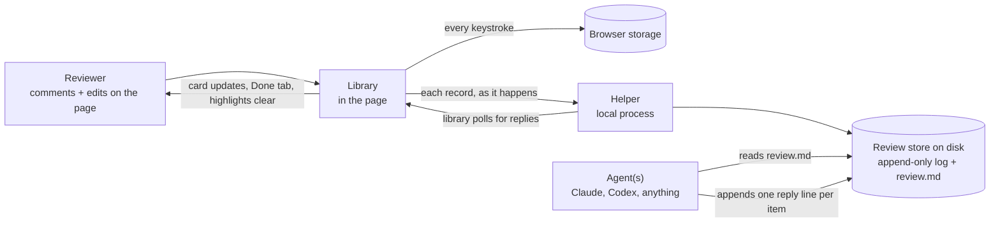
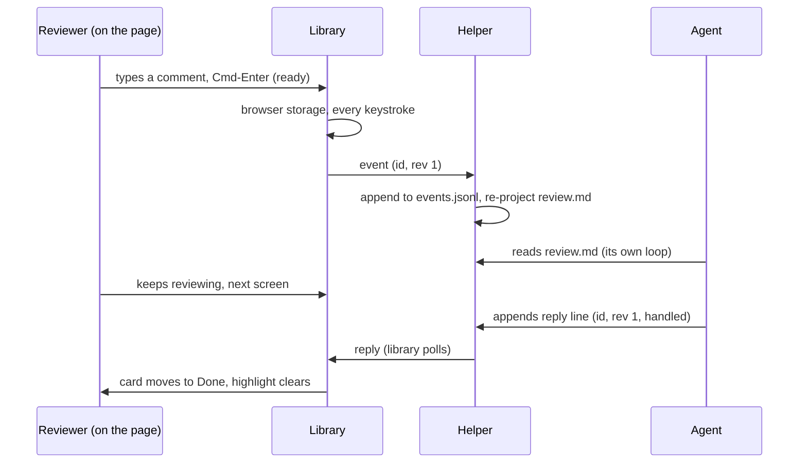
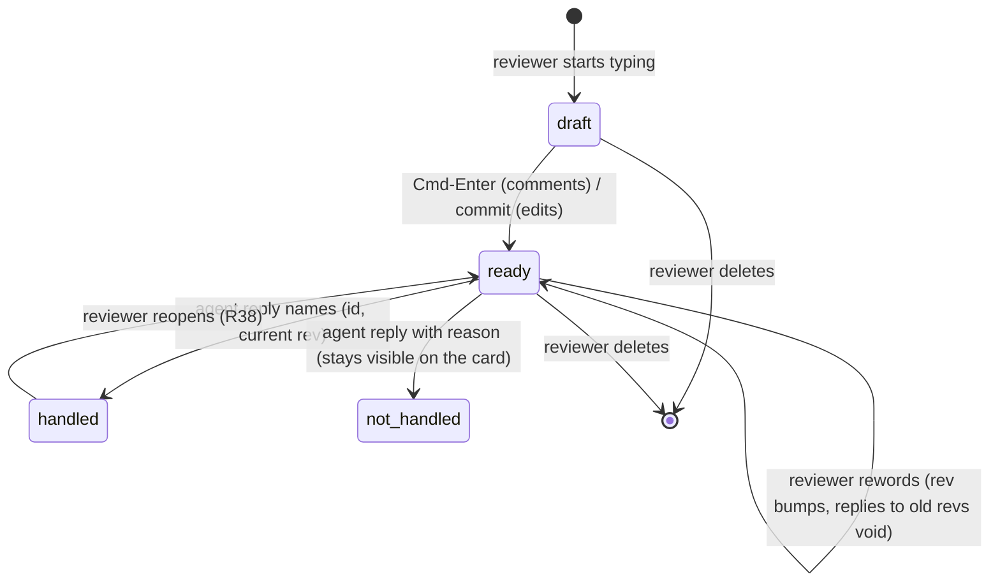

# Architecture: Live Agentic HTML Editor

## Summary

Two pieces. A **library**: one JavaScript file added to any locally run HTML page, which draws the
review surface, records everything the reviewer does, and keeps the page fully native the rest of the
time. A **helper**: one local background process that stores the review durably on disk, gives the
agent one file to read and one place to answer, and tells the library what the agent said so the page
can show it.

The design center is the flow model. There is no send. The reviewer works; each finished thing (a
confirmed comment, a committed edit) becomes a durable **record** the moment it exists; the agent reads
records continuously and answers per record; the page shows those answers as they arrive. Reviewer and
agent run at the same time against the same store, and the store, not the screen, is the truth. The
screen is a view of the records, which is what makes "the user's work is never clobbered" a property of
the design rather than a promise.



The library works alone: with no helper running, everything is kept in the browser and the copy and
export buttons carry it out (R8, R10). The helper adds durability beyond the browser and the agent
loop. Neither piece ever needs the other to be alive at the same moment.

## What carries over, and what does not

From our comments module: the durability posture (keep on every keystroke, depend on nothing being
alive), the overlay rail, copy and export, the confirm-before-actionable gesture. From human-review:
the one idea worth keeping, that a page can be edited in place, rebuilt on the opposite storage
philosophy. From the dead first architecture draft: the protected-region and replay design, the record
shape, and the data-fencing rules survive; the send model, the click-to-edit interaction, and the
Chromium default are gone, contradicted by the brief.

## Key decisions

### D1: One file in the page, one process beside it

::: xref
Grounds R40, R41, R42 (getting the library and running it).
:::

The library is a single built JavaScript file. Adding it to a page is one `<script>` line, which a
person or an agent writes; an `add` command in the repo does it for a static file, and for a dev server
it is one line in a layout. The repo is the one source (GitHub clone, R40); a build script concatenates
the source modules into the shipped file, so builders work on small files and users add one.

The helper is a zero-dependency Node process (`node bin/lahe.js serve`). Node 20+ is the only stated
requirement. Nothing else is platform-specific: the library is standard DOM APIs, the helper is
standard Node, and macOS, Linux, and Windows all run both. The one browser-support note (Custom
Highlight API, D10) is stated with its reason per R42, and it holds in current Chrome, Edge, Safari,
and Firefox.

### D2: The library never writes the reviewed page's file

An edit made in the browser changes the DOM the reviewer is looking at and the record that describes
it. It never touches the HTML file or the app's templates. Applying the change to source is the agent's
job, guided by the record's before and after. This is what makes the same design work on a static doc
and on a dev server page whose "source" is an ERB template three directories away, and it is why an
agent rewriting a whole file cannot destroy anything: the records still hold everything the reviewer
did (R2, R4).

### D3: Two page states, browse and edit, with browse fully native

::: xref
Grounds R13 (the page keeps working, outranking editing convenience), R24, and answers Q1.
:::

**Browse is the default and it is the page untouched.** No intercepted clicks, no contentEditable, no
captured keys beyond the library's own shortcuts. Links navigate, buttons act, forms submit, the app's
own JavaScript sees every event it would see without the library. This is the direct inversion of
human-review, which made the whole body editable and then fought the page for every click.

**Edit is entered deliberately, per region.** Cmd-Shift-E (Ken's call, one-handed) makes the block
under the cursor or selection editable: that one block, nothing else. The rest of the page stays live.
Esc or clicking outside commits the edit and returns the block to native. While a block is in edit
state it is visibly framed so the reviewer always knows which state they are in (R12).

The full gesture vocabulary, designed together as Q1 asked:

| Gesture | Meaning |
| --- | --- |
| Cmd-Shift-C with text selected | Comment on the selection (box opens focused) |
| Cmd-Shift-C with nothing selected | Element-pick mode: hover outlines elements, click one to comment on it, Esc cancels |
| Cmd-Shift-E | Edit the block under the cursor or selection |
| Esc / click outside | Commit the edit, back to browse |
| Cmd-Enter in a comment box | This comment is ready for the agent (R7) |
| Open box at the thread's foot | A note tied to nothing (R18) |

One modifier family, and every gesture is shown as a hint line on the rail so a new user finds them
without documentation (R43). Element commenting via the no-selection case of the same keystroke avoids
Alt-click (undiscoverable) and Cmd-click (the browser's own open-in-new-tab).

### D4: Records are the truth; the page is a view

Everything the reviewer produces is a record:

- **Comment**: quoted subject, anchor (D9), the note, ready-or-draft.
- **Edit**: anchor, `before` (the wording when the reviewer first touched the region, however many
  times they retype, R29), `after` (never truncated, R3), plus the same pair as HTML so an agent can
  see structure without the reviewer reading any (R23).
- **Delete**, **format-only change**, and **untethered note** are their own kinds (R27, R31, R18).

Each record has a client-minted id and a monotonically increasing **rev**, bumped on every rewording.
An agent reply names (id, rev), so a reply to rev 2 cannot mark rev 3 handled: the reviewer's later
rewording stays outstanding (R9, R21). Records are never edited in place in the store; a change is a
new event for the same id. Nothing is ever taken back by anything except the reviewer's own delete,
which is itself an event.

### D5: Durability is browser storage plus an append-only log

::: xref
Grounds R1, R8, R22.
:::

Two stores, each sufficient alone:

1. **Browser storage**, written synchronously on every keystroke, including half-written drafts. A
   reload, a crash, or a sleep costs nothing. Keyed by review id, not by filename, so two pages of one
   review do not collide and two reviews do not merge.
2. **The helper's on-disk store**: one folder per review holding `events.jsonl` (append-only, one JSON
   line per event; appends are atomic at this size, and an interrupted write corrupts at most the last
   line, never history) and the projections built from it (D6). The library posts each event as it
   happens and re-posts anything unacknowledged on every reconnect; events are idempotent by id and
   rev, so re-posting is always safe.

The browser is authoritative for a record's content until the helper has acknowledged it; the store is
authoritative for lifecycle (handled, replied) always. On load, the library merges both: its own
undelivered work from browser storage wins on content, the store wins on status.

A second window on the same page joins the same review: same review id, same store, both windows post
events, and the helper's per-(id, rev) ordering keeps them consistent. This came out cheap because the
store was already the truth; it is not a separate mechanism.

### D6: The agent contract is one readable file, and replies are one appended line

::: xref
Grounds R6, R7, R33, R34; agent-agnostic per the non-goals.
:::

The helper maintains **`review.md`**: one file per review, regenerated from the log, human-readable,
grouped by page. Each item carries its id and rev, its state, the quoted subject or before/after, and
the reviewer's words verbatim. Only records the reviewer marked ready appear as actionable; drafts do
not (R7). This is the single file the agent reads, and it reads it in a loop for as long as the review
runs, so feedback flows while the reviewer keeps working (R6).

The agent answers by appending one JSON line to **`replies.jsonl`** in the same folder: id, rev,
status (`handled` / `not_handled` with a reason / `question` with text), an optional agent name (so
several agents can work at once and the reviewer sees who said what), and what it actually changed. A
file appended to is something every agent on earth can do, which is the whole of the agent-agnostic
story: no SDK, no protocol, no per-agent adapter. `review.md` opens with a short standing block that
states this contract, so an agent pointed at the file needs nothing else.

The helper folds replies into the log, re-projects `review.md`, and hands the changes to the library,
which updates the cards in place: handled items lose their highlight and move to the Done tab, a
not-handled reason or a question lands on the item's own card, on the page, where the reviewer actually
is (R34, R35, R37).



### D7: Protect the active region, replay the committed records

::: xref
Grounds R1, R5, R15, R36. This is the liveness half that killed the old tool, and the half that gets
the heaviest real-browser testing.
:::

Live pages repaint themselves: Turbo morphs, framework re-renders, the agent's own landed changes
arriving as a refresh. Two mechanisms keep the reviewer's work standing through all of it:

**Protected regions.** While the reviewer is actively editing a block, the library owns it. The block
is marked so cooperative frameworks skip it (Turbo's own opt-out attribute, honored by morphing), and a
mutation observer restores it if something rewrites it anyway. The caret and the in-progress text
survive a repaint of everything around them. On commit, the protection lifts and the result is a
record.

**Replay.** After any repaint, committed records are re-applied by a single replay pass. For each
record it finds the anchor (D9) and does a three-way comparison: the DOM already matches `after`, do
nothing (idempotent); it matches `before`, apply the edit again; it matches neither, the content
changed underneath the reviewer, so the item is flagged on its card and nothing is written (R5). Replay
never guesses. A record whose anchor cannot be found uniquely is surfaced as lost, on the page and in
`review.md`, never silently dropped or moved (R20).

When the agent lands a change and the page updates itself (R36), the same pass runs: the agent's
change is the new page, the reviewer's outstanding records are re-applied on top, and a collision
between the two is exactly the neither-matches case, surfaced instead of fought over. This one
mechanism is what "live editing and agentic editing simultaneously without clobbering each other" is
implemented as.

**Undo** (R25, R28) operates on records: undoing one edit reverts that record's region to its
`before` and retires the record, touching nothing else. The current tool's all-or-nothing discard does
not exist here.

### D8: Highlights that do not change the page

::: xref
Grounds R14 and part of R15.
:::

Comment highlights use the CSS Custom Highlight API, which paints a range without inserting anything
into the DOM. The page's own JavaScript, selectors, and layout see a document identical to the one
without the library; there are no wrapper elements to break a framework's diffing or to leak into
quoted text. This is the one capability with a browser floor, and it is why the floor exists: current
Chrome, Edge, Safari, and Firefox all have it (R42's stated reason).

All library UI (rail, boxes, chips, hints) lives in a shadow root with its own styles, so the page's
CSS cannot restyle the library and the library's CSS cannot touch the page. The page renders exactly as
it does without the library, to the pixel, except painted highlights and the fixed rail.

### D9: Anchors match by uniqueness, not confidence

A record's anchor is the normalized text of its region plus enough surrounding context to make it
unique on the page. At replay or agent-read time, a match counts only if it is the *only* match; two
identical list items never get one edit applied to the wrong one, they get a widened context or a
surfaced failure. One shared normalizer is used everywhere text is compared (recording, replay,
anchoring): two normalizers that disagree is how a replay engine ends up fighting the reviewer's own
cursor, so this is a single module by design, not convention.

### D10: The rail

One fixed rail, in the shadow root, with three tabs: **Active** (outstanding comments and notes,
newest visible, the open note box at the foot), **Edits** (every hand edit as before/after rows, kept
apart from comments per R32, and doubling as the end-of-session style-guide list per R39, exportable),
and **Done** (handled items with their agent replies, reopenable per R38). Cards update in place; the
rail never rebuilds itself under a focused text box. Errors are chips on the rail, each dismissible
(R11), and a persistent one-line status states plainly what is happening to the reviewer's typing:
kept locally, stored, or agent connected (R12). The collapsed pill never overlaps the open rail's
content, a nit inherited from the current module and fixed there too.

### D11: Loopback is not a boundary, so the page proves itself

::: xref
Grounds R44, with no reviewer action beyond adding the library.
:::

Any web page the browser has open can try to talk to a local port, so "it came from localhost" proves
nothing. Instead: when the library is added to a page, the add step (the command, or the agent doing
it) embeds a **review token** the helper minted, carried as an attribute on the script line. The helper
accepts only requests bearing a valid token, requires a custom header so the browser forces a CORS
preflight (a plain cross-site form post never reaches a handler), and answers preflights only for
origins it was told about (local files and the named dev server). A random public page has no token and
no allowed origin, so it can neither read the review nor write into it nor mark items handled. The
token persists across helper restarts, because rotating it would orphan a page mid-review and violate
the never-lose-work posture.

### D12: Page text is data; reviewer text is intent

::: xref
Grounds R45, R3.
:::

In `review.md`, everything that came *off the page* (quoted subjects, `before` text, context) is
fenced as data with delimiters and a standing note that it is content to locate, never instructions to
follow, so a malicious or merely weird page cannot puppet the agent through a quoted passage. Text the
*reviewer* wrote (notes, `after`) is their intent, carried verbatim, never truncated, never
"cleaned up" (the comma that came back as an em dash is the named failure here). Quoted page text may
be bounded for length, visibly; reviewer text never is.

## Data and state

One folder per review under the helper's data directory:

```
reviews/<review-id>/
  events.jsonl     append-only, every event, the source of truth
  review.md        projection the agent reads; opens with the contract block
  replies.jsonl    the agent appends one line per answer
```

Item lifecycle, driven entirely by events:



A **database was considered** for the store (Ken raised it; someone he met built theirs on one) and
rejected for v1: Node's built-in SQLite is still marked experimental, an external one breaks
zero-dependency install, and an append-only JSONL log already gives crash-safety, a full history, and
greppability, while `review.md` gives the readable view a database would need generated anyway. The
seam is narrow (the helper's store module), so swapping later is contained.

## Alternatives considered

- **Send/batch delivery** (the first draft): rejected. Ken reviews continuously and the agent should
  work alongside him; a send button is a gate that holds his work hostage to a control that can break,
  which is precisely the old tool's failure.
- **Whole-page contentEditable with intercepted clicks** (human-review's approach): rejected. It makes
  every native behavior a special case to win back, and R13 ranks the page's behavior above editing
  convenience.
- **Wrapper elements for highlights**: rejected for the Custom Highlight API. Wrappers mutate the DOM
  the page's own scripts and frameworks are diffing, which is a standing source of breakage on live
  apps (R14, R15).
- **An MCP server as the agent contract**: rejected as the primary contract. A markdown file plus an
  appended line works for every agent with no protocol support; MCP could be added later as a
  convenience without changing the store.
- **SQLite for the store**: rejected for v1, above.
- **Writing the reviewed file directly**: rejected (D2); it cannot work on dev-server pages and it
  hands the library the power to destroy the reviewer's source.
- **Chromium-only**: rejected. Nothing in the design needs it; the one capability floor (D8) is
  cross-browser, stated with its reason per R42.

## Failure modes

| Failure | What happens |
| --- | --- |
| Helper not running | Library keeps everything in browser storage, status line says so, copy/export work; on reconnect every unacknowledged event is re-posted (idempotent) |
| Helper dies mid-review | Same as above; the log on disk holds everything already delivered |
| Page repaints during typing | The protected region survives; replay restores committed records around it |
| Agent lands a change under an outstanding edit | Three-way compare surfaces the collision on the card; nothing is overwritten silently (R5) |
| Anchor no longer found, or found twice | Item flagged as lost on page and in review.md; never guessed, never dropped (R19, R20) |
| Stale agent reply (old rev) | Refused; the reworded item stays outstanding (R9) |
| Browser crash mid-keystroke | Browser storage has everything up to the last keystroke (R1) |
| A hostile local page probes the helper | No token, no allowed origin: refused at preflight (R44) |
| The reviewer dismisses an error | It stays dismissed; the underlying state is still visible in the status line (R11) |

## Test strategy

Real browser, real pages, per the brief's metric that the interactive parts are tested where the old
tool was not. The harness already built survives: a repainting fixture page whose engine actively
reverts typed text on a timer, a caret assertion that requires the same text node by identity after
five replay passes, and a no-second-write assertion via mutation observation rather than final-DOM
equality (an idempotence bug is invisible to an end-state check). The top-ranked tests map one-to-one
to Ken's three original symptoms: typed text reverting, delivery stopping, and the page's own controls
dying. Replay tests must assert replay actually ran (pass counters), or a do-nothing replay engine
passes every test.

## Open Questions

::: callout-question
**Q1: Does the helper start itself?** The library cannot start a process, so someone must run the
helper once. The install can register it to start on login, or the agent can be responsible for
starting it when a review begins, or it stays a manual one-liner. Leaning agent-started with a manual
fallback, since the agent is already in the loop.
:::

::: callout-question
**Q2: How does `review.md` divide by page on a dev server?** A static doc is one page; a dev-server
review walks many URLs. Grouping by pathname with the review spanning them matches how Ken actually
reviews, but naming and ordering inside the file need a concrete shape at plan time.
:::
