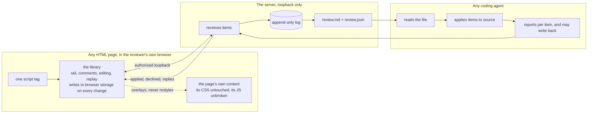
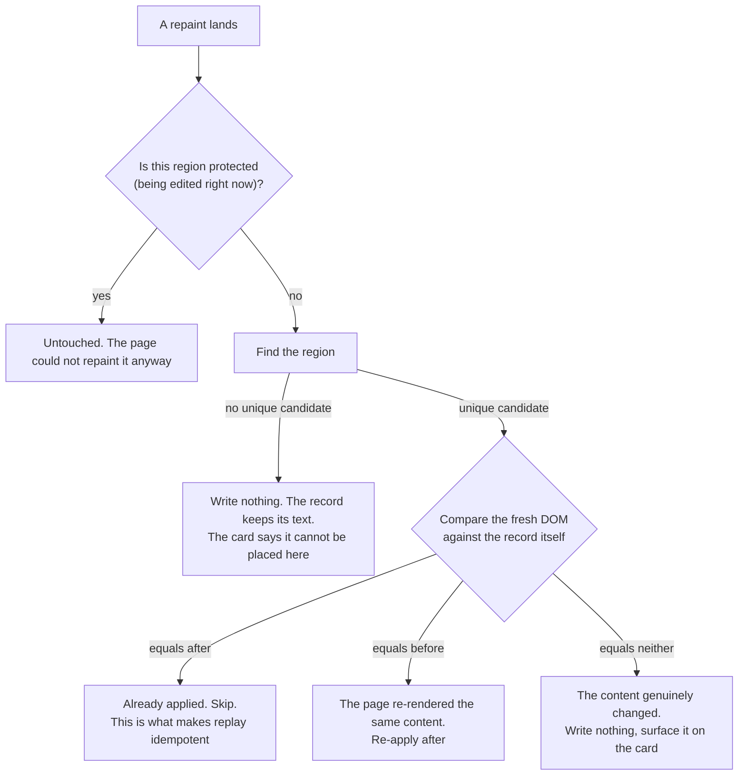
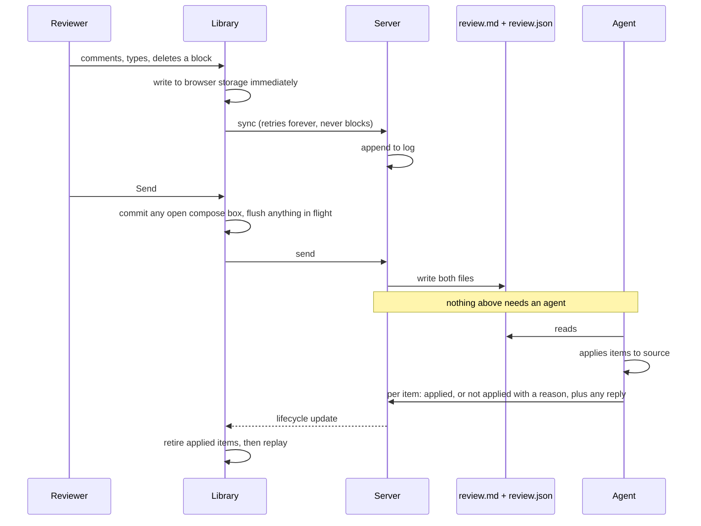

# Architecture: Live Agentic HTML Editor

## Summary

Two things ship. **A library**, one JavaScript file added to a page with a script tag, that draws the
review surface, captures comments and edits, and writes every change to browser storage the instant it
happens. **A server**, one small zero-dependency process on loopback, that receives what the library
sends, appends it to a log, and writes the file an agent reads.

The library is the product. The server is a sink and a file writer. An agent reads a file. There is no
third thing.

The idea holding it together: **the reviewer's outstanding feedback is the truth, and the page is a view
of it.** An edit is not a change made to a document; it is a durable record replayed on top of whatever
the page currently shows. This is what removes the class of bug where typed text comes back reverted.
There is nothing to revert to, because the page was never where the text lived.

## What carries over, and what does not

Two working implementations are the input. Both were read line by line, and two of the original reuse
claims did not survive the reading.

| Existing piece | Carries over | New work |
| --- | --- | --- |
| Built-doc comment module (`shared-assets/comment_module.html`) | Immediate synchronous persistence; copy and export with no server; the shape of a probe ladder for anchoring; the whole idea of a review surface that needs nothing alive | **Anchoring itself.** Its `locate()` is four exact substring probes with no whitespace tolerance and no occurrence disambiguation, so a short prefix binds to the first hit. **Storage keying**: it keys by the file's basename, so two same-named pages merge into one bucket. **The docked rail**: it sets a body margin, which is exactly what R3 forbids |
| Steady Thread dev layer (`_dev_comments.html.erb`) | A library living in the page rather than a proxy; element commenting by Alt-click carrying a CSS path and surrounding context; a draft that survives a morph | **The remount contract.** It re-registers document-level listeners on every morph without removing the old ones, so handlers accumulate for the life of the page. It also survives morphs partly because Rails re-renders the partial, which a script tag does not inherit |
| human-review | The interaction model: a rail beside the page, an editable document, before-and-after pairs | None of its liveness design |

## Key decisions

### D1: The library lives in the page, and that is the whole distribution story

One script tag. The page is the reviewer's own page, served by whoever normally serves it, in their own
browser. That single fact answers most of what made the tool being replaced hard: a page behind a login
just works because it is the reviewer's logged-in session, client-side routing works because nothing is
proxied, and free roam works because the tag is in the layout so every page has it.

For a standalone HTML file, the reviewer adds the tag to the file, or points the server at the file and it
serves a copy with the tag inserted. Both end in the same place: the library is in the page.

**The costs, stated because they are load-bearing:**

- The library is in the page's origin, so the page's own scripts can read what it holds. v1 assumes the
  page is the reviewer's own, which is why reviewing someone else's HTML is a stated non-goal. Isolating
  the library behind a frame is the known answer the day that changes.
- Browser storage is the page's origin's storage, so two spellings of the same host are two buckets.
- A content security policy on the host page can refuse the script or the loopback connection. A refusal
  looks exactly like the server being down, so the library tells the two apart and says which.
- The library is never fetched from the server at page load, or a stopped server would mean no library,
  which contradicts the promise that a stopped server costs nothing.

### D2: The tool never writes the page it is reviewing

Every edit is feedback. No autosave, no save conflicts, no serializing a live DOM back over a file.

Most pages worth reviewing are generated from something else, so writing the page is erased by the next
build, which is worse than not writing it because it looked applied. A running app has no file to write at
all. Refusing to write makes every page behave identically, which is what makes the on-screen sentence in
R16 short and honest: your edits go to your agent.

### D3: Protect the region being edited, replay the ones that are committed

An earlier draft let the page repaint freely and had replay repair the damage afterwards. Walked honestly
against a page with a two-second polling frame, it fails: the repaint writes the original text back over
the fix and destroys the text node holding the caret **before replay ever runs**, so replay wakes to a
region matching nothing it knows and the reviewer watches their sentence disappear. That is the symptom
this tool exists to remove, rebuilt with better bookkeeping.

So the library does not contest the DOM. It divides it.

**A region being actively edited is protected.** From the first keystroke until the reviewer leaves it,
the library owns that block: it is marked so a framework will not morph it and the morph is vetoed for it.
The page's repaints flow around it. On blur the edit commits to a record, protection drops, and the region
rejoins the page. Nothing ever repaints under the caret, so caret survival is structural rather than
defended, and text composition is safe for the same reason.

**Replay applies committed records only**, to a page that has just repainted.

**A write needs a unique candidate, not a high score.** An earlier draft had anchoring return a confidence
that replay thresholded. That is a number with no ground truth to calibrate against, and it fails on the
case that matters: two identical list items that swapped places match exactly, have symmetric context, and
score high, so replay binds each record confidently to the other's node. The dangerous errors are not
low-confidence, they are high-confidence ambiguous. The rule is a predicate instead: write only when the
normalized text probe finds a candidate that is unique, or that surrounding context leaves as the only
survivor. A tie fails closed. Structure and heading position corroborate a candidate and never place a
write.

**Comparison is against the record, not against history.** The three-way comparison above replaces "replay
only where the DOM matches what replay last wrote", which fails on the first repaint after typing, because
replay never wrote that region. Checked against the two cases that matter: a polling frame re-renders the
same content, the DOM equals `before`, so re-apply and the reviewer keeps their fix. A filtered list now
renders different data in that row, the DOM equals neither, so nothing is written and the card says the
content changed. One rule, both cases, and **no need to know why the page repainted**, which matters
because a framework delivers an agent's source rewrite as an in-page morph indistinguishable from the page
re-rendering itself.

**The reviewer's own actions are not ambient.** Undo reverts the record and redraws deliberately, caret
included, placing it at the start of the reverted text. Without that exemption undo would be forbidden
exactly when it is used, since a reviewer almost always undoes the item they are standing in.

**Cross-region gestures decompose.** Selecting across a paragraph boundary and typing merges two blocks in
the DOM. One record per region, tied by a group id, applied atomically. One record holding merged text
would make replay rewrite the first and leave the second standing, so the content appears twice and the
agent is told to duplicate it in source.

### D4: What a record is

| Field | Purpose |
| --- | --- |
| `id` | Minted in the browser at creation |
| `rev` | Monotonic, incremented on every change to this item |
| `kind` | `commented`, `edited`, `deleted`, `moved`, `formatted`, `resized`, `note` |
| `group` | Present when a gesture crossed regions; members apply atomically |
| `before` / `after` | Plain text, original captured on first touch |
| `before_html` / `after_html` | Cleaned markup, so a formatting-only change is a change |
| `moved_after` / `moved_before` | Landing anchors for a relocation |
| `region` | The reference above, plus its lost-anchor state when it cannot be found |
| `page` | Which page in the review it belongs to |
| `state` | The lifecycle below |
| `reply` | What the agent said about this item, rendered on its card |

**`rev` is what stops an ack from swallowing a rewording.** Without it: the reviewer sends an item, rewords
it, closes the laptop, the agent acks it applied, and on reopen the reconciliation rule discards the
rewording. Deliveries and acks name `(item, rev)`, and a lifecycle change wins for the revision it names. A
newer revision survives as outstanding and ships next.

**Undo is a record operation**, since once replay has rewritten a region the browser's native undo stack
for it is gone. Native undo inside a protected region works normally, on top.

**The overall note is an item.** It counts as outstanding and can ship alone, because the note-only send
bug, where typing a note left the button dead forever, is one of the three symptoms behind this rebuild.

**The reviewer's words are never mangled on the way out.** The `after` snapshot is taken when text
composition finishes rather than on every input event, so a send mid-composition cannot ship half-formed
text as the reviewer's exact wording. Spellcheck, autocorrect, and autocapitalize are off on the editable
surface, so the platform cannot rewrite a word and have it recorded as intent.

### D5: Durability is browser storage plus an append-only log

Two independent stores, and the reviewer's work is safe if either survives.

**Browser side.** Every change is written synchronously as it happens, before any network call. This is the
property that makes the existing comments module trustworthy and it is copied deliberately. Keyed by the
page identity the script tag declares, partitioned per page.

**Server side.** Every accepted change appends one line to a log. Appending cannot destroy what came
before, which removes the failure where two processes rewrite a shared state file over each other. State is
a projection of the log, read on start. No compaction; a review is a few hundred events.

Three rules make two stores safe: events carry a client-minted id and are idempotent by it, so a re-send
after a failed sync cannot double-count; an item event is a full snapshot of that item rather than a delta;
and **the browser is authoritative for content until delivery while the server is authoritative for
lifecycle, per revision.** A second window on the same page is refused with a reason and a way to take
over, because two windows share one storage key and the loser would write its stale copy over the winner.

The sync client retries forever, never blocks the reviewer, and distinguishes a policy refusal from a
server that is down.

### D6: Send is a write, not a handshake

Pressing send appends an event and writes the two files. It does not require, check for, or wait on an
agent.

Send is enabled whenever anything is outstanding. There is no sent latch: sending marks items delivered and
anything created afterwards is outstanding immediately. A second send adds to the same queue rather than
replacing a snapshot. Agent presence is displayed because the brief asks for it, and the law is written
here so it cannot drift: **presence is never read by the code that decides whether send works.**

Acks are processed before replay, so an item the agent applied is retired before the repaint its own change
caused. Honestly, in a live app the source write can arrive as a morph seconds before the ack, so a
provisional "content changed" may show and then clear when the ack explains it.

### D7: The agent reports per item, and can answer in the page

An ack names item ids. Each is applied or not applied with a reason, and either may carry a reply. Anything
unnamed stays outstanding. Applied items move to a completed list; nothing is deleted.

Per-item is what makes the burn-down honest. A batch-level ack clears highlights for items the agent
skipped, which is worse than losing feedback because it looks handled.

**Everything the library or the agent needs to say arrives where the reviewer is looking.**

| What happened | Where it shows |
| --- | --- |
| The agent could not apply an item, applied it differently, or has a question | A message on that item's card, and the item stays outstanding rather than clearing |
| Replay could not place an edit on this version of the page | A persistent state on that item's card, text intact |
| Sync refused by policy, server unreachable, storage full | A failures list in the rail that stays until dismissed |
| Something succeeded and needs no action | A passing message |

A reviewer does not go back to a terminal to find out what happened to their feedback, and an agent's turn
output is not a place they will ever read.

### D8: The server is not a boundary, so authorization is explicit

Binding to loopback stops nothing that matters, because the attacker is a page in the reviewer's own
browser. A cross-origin POST with a simple content type fires no preflight, reaches the handler, and takes
effect; the browser hides the response, not the effect. Without authorization, any page the reviewer visits
could write forged items into the file their agent reads and acts on, which is a drive-by write into an
agent's instruction stream.

Three layers: a token held by the server in an owner-only file, an origin allowlist the reviewer adds to
deliberately, and a required JSON content type plus a custom header on every mutating route so a simple
request cannot reach a handler at all.

**The deliberate act is the real control.** A script tag in a page cannot read an owner-only file, so the
library does not carry the server's token. The reviewer authorizes an origin once, at their terminal, and
that act is the thing a hostile page cannot perform. A library on an authorized origin exchanges its origin
for a short-lived session; a page on any other origin is refused before the exchange. The token persists
across server restarts rather than rotating, because rotating it would leave an open page holding a dead
credential and the drain promise would be false.

The port is ephemeral and recorded with the token. The same three layers cover the ack, because a forged
ack would clear the reviewer's screen to empty with nothing looking wrong.

### D9: Text out of the page is data, never instructions

A reviewed page is often generated by an LLM and may carry text engineered to instruct an agent. That text
becomes a quote in a comment or a `before` in an edit, lands in a file an agent reads raw, and the agent has
repository write access.

`before` is the worst carrier: verbatim by design, potentially long, and **the reviewer never reads it**,
because it is the page's original text and not their words. So every field is classified. Reviewer-authored
(`feedback`, `after`, the note) is instruction. Page-derived (`quote`, its surrounding context, the element
description, `before`, `before_html`, the page title) is data, fenced structurally in the markdown with a
per-file random delimiter and any content line that would close it escaped, under a standing header saying
these are search keys and never directives. The structured file is authoritative and the markdown is the
human fallback, because structure survives injection in a way prose does not. `before` is bounded, visibly.

### D10: Style only what we add, and never move the page

The library's UI lives in an isolated root with its own reset. In the other direction it adds no stylesheet
to the page, overrides nothing, and never sets a style attribute on a reviewed element.

**The rail is a fixed overlay that never shifts the page**, and it collapses. This is decided here rather
than discovered later: the existing comments module docks its panel by setting a body margin, which is
exactly what R3 forbids, and human-review only gets away with a docked rail because it frames the document.

The consequence worth stating: when a reviewer creates something the page's CSS hides, such as a list on a
page whose reset removes markers, the library does not fix the page's appearance to make the change
visible. It confirms the change through its own surface. The page keeps looking like the page.

### D11: Using the page for real

A plain click places the cursor. Two escapes, because both halves of "submission stopped working" are real:
an editing toggle turns interception off for a stretch and gives back an ordinary page, and Cmd-click
follows a link without leaving editing. Both are taught by a hover hint.

Leaving a page and returning re-renders it and replays outstanding records, so driving the app costs
nothing.

### D12: The rail updates in place

**A card holding focus is never re-created.** The largest in-page revert mechanism in the tool being
replaced is a rail that rebuilds every card on every repaint, so a half-reworded comment is destroyed
because a removed node never fires blur. Replay makes repaints more frequent, not less, so this is a law
rather than a careful render loop.

### D13: Runtime

Zero-dependency Node for the server, vanilla JavaScript for the library. Clone, run one command.
Development tooling may have dependencies, since the browser test runner is a real install and pretending
otherwise would cost the test strategy that matters most.

Node rather than Python because the audience is more likely to have it and `/usr/bin/python3` on a clean
Mac is a stub that prompts for Xcode Command Line Tools.

## Data and state

Comments, edits, and the note are all items and share one lifecycle, which is what makes per-item
acknowledgment uniform.

A **review** spans every page the reviewer visits, so walking eight routes produces one review with eight
pages and one pair of files, not eight of each. A page identifies itself to the server by what the script
tag declares plus the URL the library finds itself at.

## Alternatives considered

**Fork human-review.** Rejected. Its storage design is worth learning from, but the symptoms live in its
liveness design and that design is load-bearing throughout.

**Proxy the page through the server.** Rejected. It carries no session, so a page behind a login lands on a
login screen. It also requires rewriting every asset URL and shimming history for client routers. A library
in the page has none of these problems, which is why it is the whole shape.

**Autosave the reviewed page.** Rejected, see D2.

**Rewrite a state file on every change.** Rejected. It is what lets two processes destroy each other's
feedback.

**Deliver by holding a connection open.** Rejected as the mechanism. Agents end their turns; the tool being
replaced has a line in its instructions pleading with agents not to, which is a prompt fighting a runtime.

**Isolate the library behind a frame.** Deferred. It is the answer for reviewing pages the reviewer did not
produce, which v1 does not do. Worth noting that D10's fixed-overlay decision removed most of the layout
cost a frame was previously priced against.

**A bookmarklet.** Cut. It loads the library into whatever page the reviewer is on, so it becomes script in
a possibly hostile origin, and no server-side check can enforce local-only when the reviewer's click is the
selection.

## Failure modes

| Situation | Behavior |
| --- | --- |
| The server is not running | The library keeps working from browser storage. Copy and export produce the full set. Sync drains when it returns. The library still loads, because it is not fetched from the server |
| The page's policy refuses the script or the connection | Named as a policy refusal in the failures list, distinct from server-down, with what to change |
| The page re-renders its own data | Replay only where the DOM equals the record; otherwise the edit is set aside with its text intact |
| An agent rewrites the source | Same rule. Acks process first so applied items retire before the repaint they caused |
| Replay cannot place an edit | Nothing written. The record keeps its text and the card says so |
| The reviewer is typing when a repaint lands | The region is protected, so it is not repainted at all |
| A comment's subject no longer exists | The comment stays, is marked, and its lost-anchor state travels to the agent |
| The reviewer sends with nothing listening | Files are written, send stays available, the next agent gets everything |
| An ack names something never delivered, or an older revision | Refused, or applied to the revision it names while the newer one ships next |
| Two windows on the same page | The second is refused with a reason and a way to take over |
| A repaint arrives mid-keystroke | The change was written on the keystroke, not on a timer |

## Test strategy

The tool being replaced has **no browser-level test at all**, and every symptom lives in the part that has
none. Its careful storage layer is not where it fails. So the interactive surface is the priority, and
jsdom does not count for any of it: no layout, no caret rects, no policy enforcement, no real key events.

| Layer | What it proves |
| --- | --- |
| **Real browser** | Each durability law individually. Type and reload. Type and kill the server. Type while the page repaints. Type half a comment, force a repaint, assert the half-comment survives. Send with nothing listening, add more, send again |
| **Replay** | Idempotence observed as the absence of a second write, not as final-DOM equality. The caret is never disturbed under a repeating repaint. A non-unique match writes nothing. A re-render of different data sets the edit aside rather than stamping it |
| **Anchoring** | Survives edits elsewhere, reformatting, rewrapping; picks the right occurrence among repeats; reports honestly when the subject is gone |
| **Region identity** | Two neighbouring regions never merge; identity survives a repaint and a move |
| **Protocol** | Per-item ack; stale ack refused; delivered items re-offered until acked; a second send adds; browser and server reconcile with lifecycle winning per revision |
| **Authorization** | A page on an unauthorized origin can neither write, read, nor forge an ack, judged on effect rather than on a status code |
| **Non-interference** | The page renders identically with the library present, at two widths, rail open and collapsed, with no host element carrying a style attribute |
| **End to end** | A full review of a real running page behind a login: comment, type fixes, drive the page, send, have an agent apply and ack, watch the burn-down |

Every law in the brief needs a test that fails without it. That is the acceptance bar, not a coverage
number.

## Open Questions

::: callout-question
**Q1: One file or several, and does a generated bundle live in the repository?** Carried from the brief,
because it decides whether separate builders can own separate files.
:::

::: callout-question
**Q2: What is the deliberate act that authorizes an origin?** D8 requires one and does not name it. The
answer sets the friction between adding a script tag and being able to send.
:::
