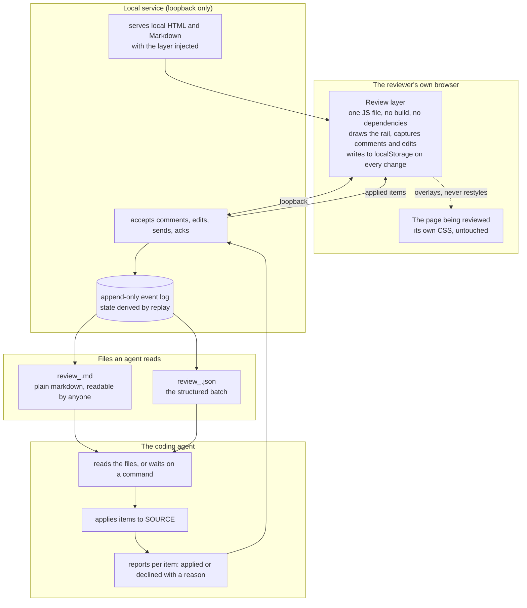
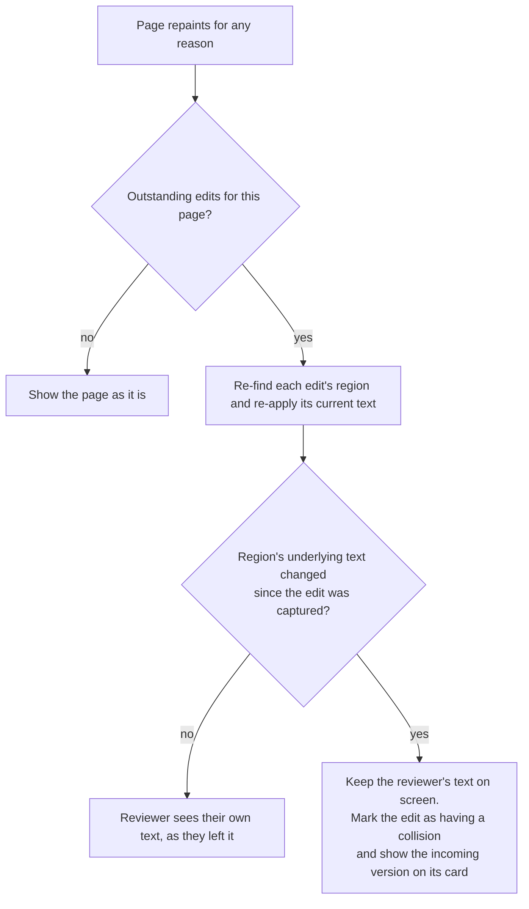
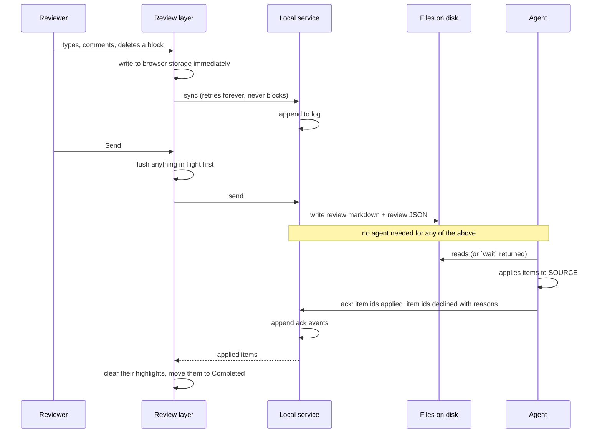
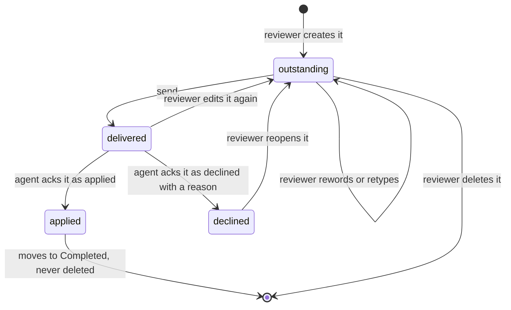

# Architecture: Live Agentic HTML Editor

## Summary

Three parts, each with one job.

A **review layer** is a single vanilla-JS file that runs inside whatever page is being reviewed. It
draws the comment and edit surface, captures what the reviewer does, and writes every change to
browser storage the instant it happens. It never mutates the reviewed page's styles and never writes
to the reviewed file.

A **local service** is a small dependency-free process that serves local files with the layer
injected, accepts feedback over loopback, and appends it to a log on disk. It derives its state by
replaying that log, so nothing important lives only in memory.

An **agent surface** is a handful of commands plus two files on disk. The files are the contract; the
commands are a convenience. An agent that was never running when the reviewer pressed send still gets
everything, because delivery is a file, not a connection.

The idea holding it together: **the reviewer's outstanding feedback is the truth, and the page is a
view of it.** Edits are not changes made to a document. They are durable records that get replayed on
top of whatever the page currently shows. A reload, an app re-render, or an agent rewriting the source
produces a fresh page, and the outstanding edits are laid back over it. This one decision is what
removes the entire class of bug where the reviewer's text comes back reverted, because there is
nothing to revert to: the page was never where the text lived.

## Analysis of Existing Structure

Nothing is being modified. This is a new repository. Two existing implementations are the input, and
what carries over from each is worth being precise about, because the brief's reliability claims rest
on it.

| Existing piece | What it proves | What we take |
| --- | --- | --- |
| Built-doc comment module (`shared-assets/comment_module.html`) | A review surface can be genuinely unbreakable if it depends on nothing being alive | Immediate write to browser storage on every keystroke; quote-plus-context anchoring with a ladder of fallback probes; copy and export with no server; a helper that refuses work for a document it does not own |
| Steady Thread dev layer (`_dev_comments.html.erb`) | A layer injected into a real app survives auth, Hotwire morphs, and free roam | Injection into the app's own page rather than a proxy; element commenting by modifier-click with a CSS path and surrounding context; drafts that survive a morph; remount on `turbo:morph`, `turbo:load`, and a MutationObserver fallback |
| human-review | The shape of the product: page beside a rail, editable document, before-and-after pairs | The interaction model only. None of its liveness design |

Two properties from the built-doc module do not exist on the live-app side today and are new work:
an offline copy-and-export path, and any durable record of a comment before it is sent.

## Components

| Component | Job |
| --- | --- |
| **Review layer** | Everything the reviewer sees and does. One file, vanilla JS, no build step. Runs identically whether it was injected by the service or by the app. |
| **Overlay renderer** | Draws the rail, highlights, chips, and handles inside an isolated root so host CSS cannot reach them and they cannot reach host CSS. |
| **Anchor engine** | Turns a selection or an element into a durable reference, and finds that reference again in a changed document. |
| **Edit recorder** | Turns a typing session into before-and-after records keyed to a stable region identity. Owns the replay that puts outstanding edits back after any repaint. |
| **Local store** | Browser-side durable queue. Written synchronously on every change. Survives reload, and is the source the layer renders from. |
| **Sync client** | Ships local-store changes to the service, retries forever, and never blocks the reviewer. |
| **Local service** | Serves file targets, accepts feedback, appends to the log, writes the two agent-facing files. |
| **Event log** | Append-only record of everything that happened. The only durable server-side state. |
| **Projection** | Replays the log into current state: what is outstanding, what was applied, what is declined. |
| **Agent commands** | `open`, `wait`, `status`, `ack`, `end`, `setup`. |
| **Attach kit** | The one-line snippet for a dev layout, and a bookmarklet for an app that cannot be modified. |

## Key decisions

### D1: The tool never writes the file being reviewed

Every edit is feedback. There is no autosave, no save conflict, no revert-all, and no serialization of
a live DOM back over a source file.

The reason is specific to what actually gets reviewed. A built spec doc and a research report are both
generated from markdown; writing the HTML would be erased by the next build, which is worse than not
writing it because it looked applied. A markdown file under review is the thing the agent needs to
edit, so two writers would collide. A running app has no file to write at all. Writing the reviewed
file helps in none of the real cases and is the root of most of the reverting bugs in the tool being
replaced: the stale-hash conflict that permanently kills saving, the whole-file re-serialization
through the browser's parser, and the stale tab overwriting an agent's newer version.

This makes every target type behave identically, which is what makes the status line honest and short:
your edits go to your agent.

::: xref
[Brief: R44, a typed fix must reach whatever the next build reads](01_brief_live_agentic_html_editor.html#the-reviewed-artifact-and-its-source)
:::

### D2: Outstanding edits are a replayable overlay, not a mutation

An edit record holds a region reference, the original text captured the first time that region was
touched, and the current text. The page is rendered, then every outstanding edit for that page is
applied on top of it.

Replay is what makes the hard requirements fall out rather than needing to be defended one at a time:

The repaint causes are all the same to the layer: a browser reload, the reviewed app re-rendering
part of itself, the agent rewriting the source and the page refreshing. There is one code path, so
the rare cases get the same treatment as the common one.

A region whose reviewer text and incoming text disagree is a collision. The reviewer's text stays on
screen and the incoming version is offered on the edit's card, which is the rule the brief demands
rather than a silent winner.

### D3: Two ways in, and neither is a proxy

| Mode | How the layer gets into the page | For |
| --- | --- | --- |
| **Served** | The service serves the local file and injects one script tag before the closing body tag | HTML files, markdown files |
| **Attached** | The page loads the layer itself, from a one-line script tag in the app's development layout, or from a bookmarklet | A running app, including anything behind a login |

Attached mode is the answer to authentication, to client-side routing, to Hotwire morphs, and to free
roam, and it is the answer because it does not fight any of them. The page is the app's own page,
served by the app, in the reviewer's own logged-in browser. There is no session to forward, no asset
URL to rewrite, no router to shim, and no second origin. The Steady Thread dev layer already works
exactly this way and has none of the problems the proxy approach has.

Free roam falls out of attached mode for free: the layer is on every page the app renders, so the
reviewer clicks into any screen and comments there, with nothing opened as a target first. The target
identity is the route the browser is actually on.

The bookmarklet covers an app whose source the reviewer will not modify. It is the same layer, loaded
on demand into the page already in front of them.

### D4: Durability is an append-only log, and the browser holds its own copy

Two independent durable stores, and the reviewer's work is safe if either survives.

**Browser side.** Every comment, keystroke batch, and deletion is written to browser storage
synchronously as it happens, before any network call. This is the property that makes the built-doc
module trustworthy and it is copied deliberately. A reload re-reads it. Nothing waits on a timer to
become durable.

**Service side.** Every accepted change appends one line to a log file. Appending cannot destroy what
came before, which removes the failure where two processes rewrite a shared state file over each
other. Current state is a projection of the log, rebuilt on start. Compaction, if the log ever grows
enough to matter, writes a new file and renames it into place, never edits in place.

The sync client is allowed to be slow and is not allowed to be a gate. It retries with backoff
forever. If the service is down for the whole session, the reviewer loses nothing: the browser copy
is complete, and copy-and-export produce the full set with no service at all.

### D5: Send is a write, not a handshake

Pressing send appends a send event and writes two files. It does not require, check for, or wait on an
agent.

Send is enabled whenever anything is outstanding. Agent presence is displayed next to it as
information and never consulted to decide whether the button works. There is no "sent" latch: sending
marks the outstanding items as delivered-pending-ack, and anything created afterward is outstanding
again immediately. A second send while an earlier one is unconfirmed adds to the same queue rather
than replacing a snapshot.

### D6: The agent confirms per item

An ack names item identifiers. Each is either applied, or declined with a reason. Anything not named
stays outstanding.

This is what makes the burn-down honest. Clearing a highlight because a batch came back would clear
items the agent skipped, which is worse than losing feedback because it looks handled. An item the
agent could not apply stays on screen with the agent's reason attached, which is also the most useful
thing the reviewer could be told.

Applied items move to a completed list. Nothing is deleted.

### D7: Verifying the agent did not rewrite the document

After an ack, the service checks each applied edit: is the reviewer's exact `after` text present in
the file the agent said it changed? A miss is reported loudly, on the item, in the reviewer's face.

This is the one defense against an agent regenerating a document from context and reverting the
reviewer's wording in the process. The tool being replaced attempted this with a sentence in a prompt
file and nothing else.

### D8: The tool styles only what it adds

The layer's own UI lives in an isolated root with its own reset, so host CSS cannot reach it. In the
other direction the layer adds no stylesheet to the reviewed content, overrides no font, color,
spacing, or layout, and never sets a style attribute on a reviewed element.

The consequence worth stating: when a reviewer creates something the page's own CSS hides, such as a
list on a page with a reset that removes markers, the tool does not fix the page's appearance to make
the change visible. It confirms the change through its own layer, in the edit list and on the region's
own marker. The artifact keeps looking exactly like the artifact.

Markdown is the one case that needs care. A markdown file has no appearance of its own, so rendering
it means choosing one. That is a presentation of unstyled text, not a restyling of a designed
document, and the status line says which of the two the reviewer is looking at.

### D9: Using the app for real

A plain click places the text cursor. Two escapes, because Ken hit both halves of this problem:

- **A modifier click** passes straight through to the page: links navigate, buttons fire, forms
  submit. Taught by a hint on hover rather than in documentation.
- **An editing toggle** turns the layer's interception off entirely for a stretch, giving back an
  ordinary page to drive through a multi-step flow. Commenting stays available; only the
  click-means-cursor behavior stops. Feedback already left is untouched.

Leaving a page and coming back re-renders it and replays outstanding edits onto it, so driving the app
costs nothing.

### D10: Runtime is whatever is already installed

Python 3 standard library for the service, vanilla JS with no build for the layer. `git clone`, one
setup command, run it. No package manager, no lockfile, no build step, no compiled asset.

The dependency-free choice is not aesthetic. It is what lets the install instruction be two lines in a
README that a student follows without help, and it removes the entire class of failure where a
published package and a repository drift apart, which is the failure Ken named when he chose git clone
over npm.

Markdown rendering is the one capability the standard library lacks. It is handled in the browser by a
single vendored renderer file committed to the repository, not fetched by a package manager.

## Data and state

### Item identity

Everything the reviewer creates is an **item** with a stable identifier assigned at creation in the
browser. Comments and edits are both items and share a lifecycle, which is what makes per-item
acknowledgment uniform.

`delivered` is not a terminal state and never gates anything. An item sent with no agent running sits
in `delivered` and is included in every subsequent read until acked.

### Target identity

A target is one review. Identity is canonical: a file resolves through symlinks to its real path; a
route normalizes its host spelling, its trailing slash, and drops its fragment. An agent naming a
target any of the ways a human might write it reaches the same review.

### What a region is

An edit is keyed to a region, and a region needs a name that is stable across repaints and distinct
from its neighbors, because two of the bugs in the tool being replaced come from getting this wrong:
labels that collide silently merge two edits into one, and labels recomputed after a reload produce
contradictory records for the same block.

A region reference carries several independent ways to find the same place, resolved in order, so that
no single change to the document orphans it: an author-supplied name where the document provides one,
a structural path, the heading it sits under with its position among siblings, and its original text.
Identity is assigned once when the region is first touched and travels with the region, including when
the reviewer moves it.

### The two files an agent reads

Written on every send, at a documented path derived from the target. For a file target they sit beside
the file. For a route they sit in a review folder in the project the reviewer names, which is where the
Steady Thread comments file already lives.

The markdown file is for a person or for an agent with no tooling: quoted passage, comment, region,
before, after. The JSON file is the structured contract: pages, items, identifiers, region references,
anchors, original and current text, and the lost-anchor flag when a comment's subject can no longer be
found.

Neither is truncated. A long block travels whole, because a clipped `after` becomes an agent
faithfully truncating the reviewer's own paragraph.

## Alternatives considered

**Fork human-review and fix it.** Rejected. Its storage design is careful and worth learning from, but
the symptoms live in its liveness design, and that design is load-bearing throughout: the blocking
poll, the memory-only delivery flag, the file watcher that clears edit rows, the send button gated on a
listener. Fixing those is replacing the spine while keeping the ribs. The interaction model is the
valuable part and it can be rebuilt in less time than the untangling would take.

**Proxy the reviewed route through the tool.** Rejected. It is how the tool being replaced handles a
running app, and it is the source of the worst problem the brief found: the tool fetches the route
server-side, so it carries no session and lands on a login page. It also has to rewrite every asset
URL, shim the history API for client routers, and give the framed app a same-origin relationship with
the tool's own API. Attached mode has none of these problems because the page is the app's own page.
The cost is a one-line script tag in a development layout, which Steady Thread already has for the
same reason.

**Autosave the reviewed file.** Rejected, see D1. It would help in none of the cases Ken actually
reviews and it is the root of most of the reverting bugs.

**Rewrite a state file on every change.** Rejected. It is what lets two processes destroy each other's
feedback, and it means a megabyte-scale rewrite twice a second during ordinary typing. Appending
cannot lose what came before.

**Deliver feedback by holding a connection open.** Rejected as the mechanism, kept as a convenience.
Agents end their turns, so a blocking read is not something to build delivery on. The tool being
replaced has a line in its instructions pleading with agents not to end their turn while a poll is
waiting, which is a prompt fighting a runtime. Files do not have this problem.

**A browser extension instead of an injected layer.** Rejected for v1. It would remove the script-tag
requirement for attached mode, and it adds a store review, a permissions model, a second distribution
channel, and a per-browser build. The bookmarklet covers the same need with none of it.

**Node instead of Python.** Rejected. Node is the more familiar runtime for the audience, and a clone
still needs an install step for anything beyond the standard library, plus a lockfile to keep honest.
Python 3 is present on the target platform and its standard library covers a loopback HTTP service
completely. If the tool ever needs a package manager, that is the moment to revisit this.

## Failure modes

| Situation | Behavior |
| --- | --- |
| The service is not running | The layer keeps working entirely from browser storage. Everything is captured, copy and export produce the full set, and the sync client drains when the service returns. |
| The service is running and the browser is closed mid-review | Everything already synced is on disk. Anything not yet synced is in browser storage and is sent when the page is opened again. |
| The reviewed page re-renders and eats typed text | Replay puts it back. The edit record is the truth and the DOM is a view of it. |
| The agent rewrites the source under the reviewer | The page refreshes, outstanding edits replay on top, and any region where the reviewer's text and the incoming text disagree is marked as a collision on its card rather than being resolved silently. |
| The agent acks an item the reviewer has since edited again | The item is outstanding again, so the ack applies to the version that was delivered and the newer version ships next. |
| An ack names a batch nobody delivered | Refused. A stale ack cannot clear newer feedback. |
| Two windows open the same target | Both join the same review. State is the projection of one log, so both see the same outstanding set, and neither can overwrite the other's items. |
| A comment's subject no longer exists in the document | The comment stays, is marked on its card, and its lost-anchor state travels in the payload so the agent is told the quote may not be findable rather than being sent to look for it. |
| The reviewer sends with nothing listening | The files are written. Send stays available. The reviewer is shown how to hand it to an agent, and the next agent to ask gets everything. |
| The agent claims an item applied but the text is not in the file | Reported loudly on the item, which returns to outstanding. |
| A repaint arrives while the reviewer is mid-keystroke | The pending change is captured before the repaint is applied, because the record is written on the keystroke rather than on a timer. |

## Security and privacy

The service listens on loopback only, rejects requests whose host header names anything else, and
refuses any target that is not a local file or a local development server.

Served file targets resolve their sibling assets against the reviewed file's own directory, checked
after symlink resolution, so a planted link cannot read outward. The review layer's own controls and
the stored feedback are not reachable from the reviewed page's own scripts.

Markdown is rendered with embedded markup inert and shown as text, and links and images carrying
executable schemes are refused. Pasted files are limited to raster image types, which excludes the
vector format that can carry script.

Feedback text is the reviewer's own words about their own work and is written to their own disk. It
is displayed as text, never as markup, so a passage quoted out of a page cannot execute when it is
rendered back into the rail.

Attached mode is the one place where a deliberate note is warranted: the snippet belongs in a
development layout, guarded the way Steady Thread already guards its dev layer, so it is never served
in production. The setup command's instructions say so, and the snippet itself carries the guard.

## Test strategy

The single most important fact from studying the tool being replaced: it has **no browser-level test at
all**, and every symptom Ken hit lives in the part that has none. Its careful, well-tested storage layer
is not where it fails. So the test strategy is inverted from the one it grew: the interactive surface
is the priority.

| Layer | What it proves |
| --- | --- |
| **Browser tests against a real browser** | The reliability laws, individually. Type and reload, type and kill the service, type and force a re-render, type and have the agent rewrite the file underneath. Send with nothing listening, then add more and send again. Each of these is one test that fails if the corresponding law is broken. |
| **Anchoring tests** | A comment survives edits elsewhere, reformatting, and rewrapping; picks the right occurrence among repeats; reports honestly when its subject is gone. |
| **Region identity tests** | Two neighboring regions never merge into one record; identity survives a repaint and a move. |
| **Replay tests** | Outstanding edits reappear after every repaint cause, and a genuine collision is surfaced rather than resolved. |
| **Protocol tests** | Per-item ack; a stale ack is refused; delivered items are re-offered until acked; a second send adds rather than replaces. |
| **Containment tests** | Symlink escape, host header, inert markdown, refused schemes, refused paste types. |
| **The end-to-end one that decides it** | A full review of a real running app behind a login: comment, type fixes, drive the app through several screens, send, have an agent apply and ack, watch the burn-down, and account for every item. |

Every reliability law in the brief needs a test that fails without it. That is the acceptance bar for
this feature, not coverage percentage.

## Open Questions

::: callout-question
**Q1: Which browsers does v1 support?** Carried from the brief. It changes how much of the editing
surface is implemented by hand and how wide the browser test matrix is. A single target browser is
reasonable for a tool Ken uses and thin for a public repository.
:::

::: callout-question
**Q2: Where do the two agent-facing files go for a route target?** A file target has an obvious answer,
next to the file. A route does not. The candidates are a folder in the project the reviewer names when
attaching, or one known location per project the way the Steady Thread comments file works today. This
needs settling before attached mode is built, not before the file mode is.
:::
