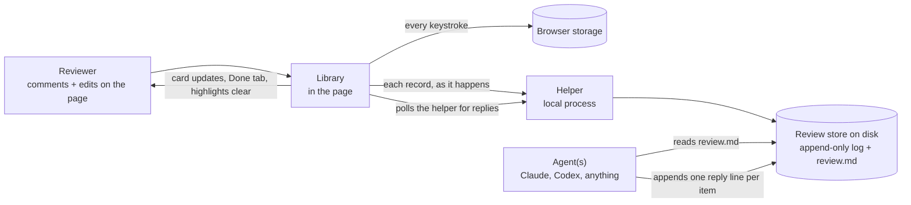
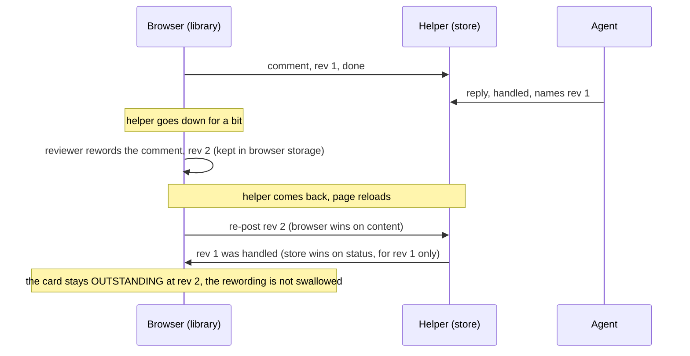
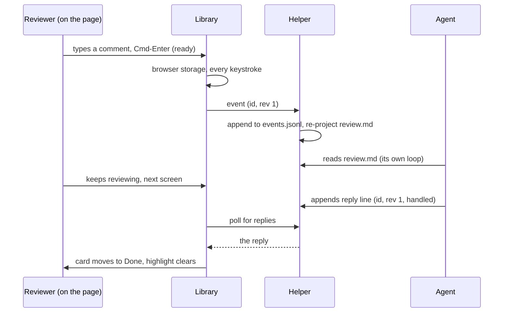
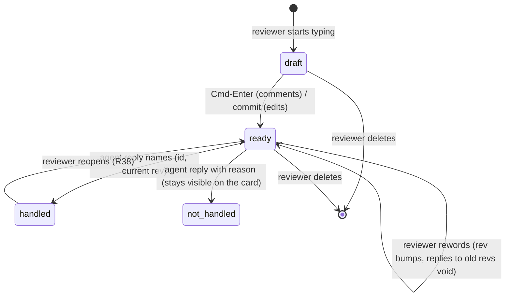

# Architecture: Live Agentic HTML Editor

## Summary

Two pieces:

1. **A library**: one JavaScript file added to any locally run HTML page. It draws the review
   surface, records everything the reviewer does, and keeps the page fully native the rest of the
   time.
2. **A helper**: one local background process. It stores the review durably on disk, gives the agent
   one file to read and one place to answer, and tells the library what the agent said so the page
   can show it.

Reviewer and agent work at the same time against one store. Each finished thing the reviewer makes, a
confirmed comment or a committed edit, becomes a durable **record** the moment it exists. The agent
reads records continuously and answers one record at a time. The page shows those answers as they
arrive. The store holds the truth and the screen is only a view of it, so nothing that happens on
screen can take a record back.



The library works alone: with no helper running, everything is kept in the browser and the copy and
export buttons carry it out (R8, R10). The helper adds durability beyond the browser and the agent
loop. Neither piece ever needs the other to be alive at the same moment, though that is the happy
path.

## What carries over

Our comments module contributes four things: keeping the reviewer's work on every keystroke, the
overlay rail, copy and export, and asking the reviewer to confirm a comment before an agent may act on
it. human-review contributes one: a page can be edited in place. The two combine in D7 (protect the
region being edited, replay the committed records), D4 (records are the truth), and D12 (page text is
data, reviewer text is intent).

## Key decisions

### D1: One file in the page, one process beside it

::: xref
Grounds [R40, R41, and R42 (getting the library and running it)](01_brief_live_agentic_html_editor.html#getting-the-library-and-running-it).
:::

The library is a single built JavaScript file. Adding it to a page is one `<script>` line, which a
person or an agent writes; an `add` command in the repo does it for a static file, and for a dev server
it is one line in a layout. The script line points at the built file itself (a path, or a copy in the
page's own assets), **never at the helper**: if the helper served the library, "the library works
alone" would be false the first time the helper was down. The repo is the one source (GitHub clone,
R40); a build script concatenates the source modules into the shipped file, so builders work on small
files and users add one.

The helper is a zero-dependency Node process (`node bin/lahe.js serve`). It listens on a **fixed
default port**, configurable. The page has to find the helper again after a restart. The script line
carries the helper's URL as an attribute, so a helper restarted on the same port is found again, and
the library can reconnect and re-post everything it was holding. The script
line's attributes (helper URL, review id, token) are public API, pinned exactly in the contracts doc
the plan writes, since they are the one thing every host page depends on. Node 20+ is the only stated
requirement. Nothing else is platform-specific: the library is standard DOM APIs, the helper is
standard Node, and macOS, Linux, and Windows all run both. The one browser-support note (the Custom
Highlight API, D8) is stated with its reason per R42 (requirements stated plainly, with real reasons),
and it holds in current Chrome, Edge, Safari, and Firefox.

### D2: The library never writes the reviewed page's file

An edit made in the browser changes the DOM the reviewer is looking at and the record that describes
it. It never touches the HTML file or the app's templates. Applying the change to source is the agent's
job, guided by the record's before and after. This is what makes the same design work on a static doc
and on a dev server page whose "source" is an ERB template three directories away, and it is why an
agent rewriting a whole file cannot destroy anything: the records still hold everything the reviewer
did (R2, R4).

### D3: Two page states, browse and edit, with browse fully native

::: xref
Grounds [R13 (the page keeps working, outranking editing convenience)](01_brief_live_agentic_html_editor.html#the-page-keeps-working) and [R24 (edit the text directly, entered deliberately)](01_brief_live_agentic_html_editor.html#editing), and answers [Q1 (the gesture vocabulary)](01_brief_live_agentic_html_editor.html#open-questions).
:::

**Browse is the default and it is the page untouched.** No intercepted clicks, no contentEditable, no
captured keys beyond the library's own shortcuts. Links navigate, buttons act, forms submit, the app's
own JavaScript sees every event it would see without the library. This is the direct inversion of
human-review, which made the whole body editable and then fought the page for every click.

**Edit is entered deliberately, per region.** Cmd-Shift-E (Ken's call, one-handed) makes the block
under the cursor or selection editable: that one block, nothing else. The rest of the page stays live.
Esc or clicking outside commits the edit and returns the block to native. While a block is in edit
state it is visibly framed so the reviewer always knows which state they are in (R12).

The full gesture vocabulary, designed together as Q1 asked:

| Gesture | Meaning |
| --- | --- |
| Cmd-Shift-C with text selected | Comment on the selection (box opens focused) |
| Cmd-Shift-C with nothing selected | Element-pick mode: hover outlines elements, click one to comment on it, Esc cancels |
| Cmd-Shift-E | Edit the block under the cursor or selection |
| Esc / click outside | Commit the edit, back to browse |
| Cmd-Enter in a comment box | This comment is done and the agent may act on it (R7). The on-card hint reads "Cmd-Enter when done with this comment" (Ken's copy) |
| Open box at the thread's foot | A note tied to nothing (R18) |

One modifier family, and every gesture is shown as a hint line on the rail (the library's side panel,
designed in D10) so a new user finds them
without documentation (R43). Element commenting via the no-selection case of the same keystroke avoids
Alt-click (undiscoverable) and Cmd-click (the browser's own open-in-new-tab).

### D4: Records are the truth; the page is a view

Everything the reviewer produces is a record:

- **Comment**: quoted subject, anchor (D9), the note, ready-or-draft.
- **Edit**: anchor, `before` (the wording when the reviewer first touched the region, however many
  times they retype, R29), `after` (never truncated, R3), plus the same pair as HTML so an agent can
  see structure without the reviewer reading any (R23).
- **Delete**, **format-only change**, and **untethered note** are their own kinds (R27, R31, R18).
  Formatting is a closed list: **bold and italic**, nothing else in v1 (the brief's "basic formatting
  only"; anything richer is a request to the agent). The structural comparison in replay is defined
  against exactly that list.

Every record names the **page** it was made on (its path and title, plus the source hint when one was
given), which is what lets one review span a whole dev-server walk and still project grouped by page.
Each record has a client-minted id and a monotonically increasing **rev**, bumped on every rewording.
An agent reply names (id, rev), so a reply to rev 2 cannot mark rev 3 handled: the reviewer's later
rewording stays outstanding (R9, R21). Records are never edited in place in the store; a change is a
new event for the same id. Nothing is ever taken back by anything except the reviewer's own delete,
which is itself an event.

### D5: Durability is browser storage plus an append-only log

::: xref
Grounds [R1 (nothing typed is lost) and R8 (work reaches the agent even with nothing running)](01_brief_live_agentic_html_editor.html#the-users-work-is-never-clobbered) and [R22 (a comment survives interruption)](01_brief_live_agentic_html_editor.html#commenting).
:::

Two stores, each sufficient alone:

1. **Browser storage**, written synchronously on every keystroke, including half-written drafts. A
   reload, a crash, or a sleep costs nothing. Keyed by review id, not by filename, so two pages of
   one review do not collide and two reviews do not merge. Browser storage is still partitioned by
   origin (no key choice changes that, so `localhost` and `127.0.0.1` are physically separate
   buckets); the helper is what unifies a review across origins, which is one more reason drafts flow
   to it.
2. **The helper's on-disk store**: one folder per review holding `events.jsonl` (append-only, one JSON
   line per event; an interrupted write corrupts at most the last line, never history) and the
   projections built from it (D6, the agent reads one file). The library posts each event as it happens and re-posts anything
   unacknowledged on every reconnect. Every event carries its own **event id**, and re-posting is
   idempotent by that id rather than by (item, rev): drafts do not bump rev, so many draft events
   legitimately share an item and rev with different content.

**Drafts flow to the helper too**, marked draft, so a half-written thought has both stores like
everything else and does not live only in the reviewed app's own browser bucket, which the app itself
can clear. Drafts never appear as actionable in what the agent reads (R7); they exist in the store
purely as durability. A draft that sits unconfirmed for a while gets a **gentle nudge on its own
card** ("still a draft, Cmd-Enter when done with this comment"), because a new user who never learned
the confirm gesture would otherwise wonder why the agent ignores them. The nudge comes from the
library, not the agent, since drafts never reach the agent by design; to the reviewer it reads the
same. An **open edit commits automatically on navigation or unload** (kept
synchronously in browser storage, handed to the helper on the way out), because browse mode is fully
native and a link click is one click: R1 names navigation, so navigation cannot be a losing move. The
post on the way out uses a keepalive request, the one mechanism that survives unload and can still
carry the headers D11 (the helper checks every request) requires. The browser caps how large such a
request can be. An edit too large for it is already safe in browser storage and reaches the helper on
the next load, so the cap costs time, not work.

The browser is authoritative for a record's content until the helper has acknowledged it; the store is
authoritative for lifecycle **at a given rev**: a handled that names rev 1 retires rev 1, and a
reviewer who reworded to rev 2 offline still has rev 2 outstanding after the merge. On load, the
library merges both: its own undelivered work from browser storage wins on content, the store wins on
per-rev status. The reword-offline case, drawn out:



A second window on the same page is **refused with a reason** pointing at the first, and the refusal
carries a **"Review here instead" button** that moves the review to this window and deactivates the
other one, so the reviewer never has to hunt for the first tab among a thousand open ones (Ken's
note). Two windows
sharing one draft bucket means the last keystroke wins and the other window's work disappears without
saying so. Refusal costs the reviewer nothing. The refusal has two
mechanisms and one named limit: windows that can see each other's storage refuse through a
client-side lock, windows that cannot are refused by the helper's session (with a takeover after a
crashed window's heartbeat goes quiet), and two windows on different origins with no helper running
cannot be refused by anything, so that one case is a stated limit in the failure table rather than a
claim.

A review **starts** when the add step mints it and **ends** when the reviewer chooses **End review**
on the rail. Ending is not just archiving: it surfaces the session's hand-edit list (R39, the
end-of-session list of every edit the reviewer made, kept so style-guide patterns can be spotted) as
the closing step, so the payoff the list exists for happens at the natural moment. Retention (Data
and state) ages out only ended and abandoned reviews, never a live one.

### D6: The agent contract is one readable file, and replies are one appended line

::: xref
Grounds [R6 (feedback flows as the reviewer works) and R7 (the reviewer decides when a comment is done)](01_brief_live_agentic_html_editor.html#the-users-work-is-never-clobbered) and [R33 and R34 (the agent reports per item, and says so on the page when it cannot do something)](01_brief_live_agentic_html_editor.html#working-with-the-agent); agent-agnostic per [the non-goals](01_brief_live_agentic_html_editor.html#non-goals).
:::

The helper maintains **`review.md`**: one file per review, regenerated from the log (atomically:
written beside, then renamed), human-readable, grouped by page. The name cannot collide when several
docs are open at once, because the file lives inside its own review's folder (`reviews/<review-id>/`,
the layout in Data and state): docs in one review share one file grouped by page, and separate
reviews have separate folders. Each page's header carries an optional
**source hint** given at add time, so an agent working a dev-server review edits the template the page
came from rather than built output the next build overwrites. Each item carries its id and rev, its
state, the quoted subject or before/after, and the reviewer's words verbatim. Only records the
reviewer marked ready appear as actionable; drafts do not (R7).

This is the single file the agent reads, and "the agent reads it in a loop" is not left as a hope,
since agents failing to collect feedback is one of the three symptoms being fixed. The contract block
at the top of the file tells the agent both ways to keep up: re-read the file between work items, or
run the helper's **wait command**, which blocks until something new is ready (or a timeout) and prints
it. The wait command **consumes nothing**. It is a read with a watermark: the caller says where it
left off. It never acknowledges anything, so a killed wait, a repeated wait, and two agents waiting at
once are all harmless. An agent says it handled an item only by writing a reply. The file is the
contract, and the wait command is a convenience that makes the loop cheap for agents that can run a
command. If the wait dies, and an agent's turn ending does kill a foreground wait, nothing is lost,
because the file is still there and still complete. The contract block's exact text is pinned at plan time, and the standing header already in
the repo is wrong for this design (it names an authoritative JSON file and a command that no longer
exists) and gets rewritten, not kept.

The agent answers by appending one JSON line to its **reply file** in the same folder
(`replies.jsonl`, or `replies-<agent>.jsonl` when several agents work at once, as the multi-agent
paragraph below spells out): id, rev,
status (`handled` / `not_handled` with a reason / `question` with text), an optional agent name (so
several agents can work at once and the reviewer sees who said what), and what it actually changed.
Every agent can append a line to a file, which is what makes this agent-agnostic. There is no SDK,
protocol, or per-agent adapter to write. `review.md` opens with a short standing block that
states this contract, so an agent pointed at the file needs nothing else.

The helper folds replies into the log, re-projects `review.md`, and hands the changes to the library,
which updates the cards in place: handled items lose their highlight and move to the Done tab, a
not-handled reason or a question lands on the item's own card, on the page, where the reviewer actually
is (R34, R35, R37).

**One agent-facing file is a deliberate deviation** from the usual
"JSON is authoritative" posture, on Ken's call: agents get one readable file, and the structured truth
stays in `events.jsonl` underneath it, available to any agent that would rather parse but never
required. **The replies file is not authenticated**, and cannot usefully be: anything running as the
user can write files, so the trust boundary for file writers is the user account itself. What the
design does instead is treat agent-authored text as its own trust class: reply text is rendered as
plain text only, bounded, labeled with the agent's name, never presented as an instruction to the
reviewer, and fenced as data whenever it is re-projected into `review.md` for other agents to read.
Web pages cannot write files at all, so the forgery a hostile page could attempt runs through the
helper, where D11's per-request checks stop it. Verification of an agent's "handled" claim (checking the change actually
landed) is deliberately cut from v1; the reply line carries an optional list of files touched so
verification can be added later without changing the contract.

**Several agents at once** is the orchestrator's problem, on purpose. Ken's multi-agent case is one
coordinating agent handing items to subagents, and that coordinator already decides who does what; the
store does not add claims or leases in v1. What the store does guarantee: each writer appends whole
lines to its own reply file (`replies-<agent>.jsonl`, with `replies.jsonl` fine for the single-agent
case; the agent name in the filename is constrained to the same safe character set as review ids,
because it too is a path component), so uncoordinated writers never interleave a line; the helper is the single reader and folds
them in arrival order; and conflicting replies to one item resolve by rev first, then latest-wins with
both kept in the log. Two uncoordinated peer agents could still both fix the same item in source; that
is a coordination problem this tool does not own.



### D7: Protect the active region, replay the committed records

::: xref
Grounds [R1 (nothing typed is lost) and R5 (unsent work is never silently overwritten)](01_brief_live_agentic_html_editor.html#the-users-work-is-never-clobbered), [R15 (keeps working while the page changes underneath)](01_brief_live_agentic_html_editor.html#the-page-keeps-working), and [R36 (the page updates itself as the agent lands changes)](01_brief_live_agentic_html_editor.html#working-with-the-agent). This is the liveness half that killed the old tool, and the half that gets
the heaviest real-browser testing.
:::

Live pages repaint themselves: dev servers hot-reload, frameworks rewrite parts of the page in
place, and the agent's own landed changes arrive as a refresh. The library assumes no particular
framework (the standalone non-goal forbids relying on our own stack), so its protection is built on
standard DOM mechanisms, with named framework integrations layered on top where a framework offers a
hook. Rails with Turbo is the first named integration, because Ken reviews on it and it must work
well there; it is an instance, never an assumption. Two mechanisms keep the reviewer's work standing
through all of it:

**Protected regions.** While the reviewer is actively editing a block, the library owns it. Three
layers, because the archived round-2 review proved restore-after alone cannot save the caret (the
repaint destroys the text node the selection lives in before any observer fires): the block is marked
so cooperative frameworks skip it (a keep-this-element attribute, which several morphing libraries
honor; Turbo's is one), the library **vetoes the repaint of that
element before it happens** where the framework offers a hook, and a selection snapshot plus
mutation-observer restore is the framework-free fallback for repaints that honor neither. The caret and the
in-progress text survive a repaint of everything around them. On commit, the protection lifts, the
result is a record, and a replay pass runs immediately: if the page had tried to change that block
while it was protected, the suppressed change now surfaces through the neither-matches branch below
rather than being silently discarded, so an agent's landed change under the reviewer's fingers is
told, not lost.

**Replay.** After any repaint, a single replay pass re-applies the committed records. For each record
it finds the anchor (D9, anchors match by uniqueness) and compares the DOM against that record's
history. The history exists because the event log keeps every rev's `after`, not only the latest, and
the in-memory record carries the same list. Four outcomes: the DOM already matches the
current `after`, do nothing (idempotent); it matches `before`, apply the edit again; it matches an
**earlier rev's** `after`, an old version was applied somewhere, so the current rev is re-applied and
the card says an earlier version had landed; it matches none of these, the content changed underneath
the reviewer, so the item is flagged on its card and nothing is written (R5). The conflict card shows
**both versions in full**, the reviewer's and the page's, and the reviewer picks which one stands
(Ken's call at the wireframe: no "see theirs" indirection, both texts are right there). Replay never
guesses. A
record whose anchor cannot be found uniquely is surfaced as lost, on the page and in `review.md`,
never silently dropped or moved (R20). Two record kinds compare on their own terms: a
**format-only** change compares on structure rather than normalized text (whose whole job is to ignore
formatting), and a **delete** is idempotent by absence: the block gone is applied, the block back is
re-applied.

When the agent lands a change and the page updates itself (R36), the same pass runs: the agent's
change is the new page, the reviewer's outstanding records are re-applied on top, and a collision
between the two is exactly the neither-matches case, surfaced instead of fought over. This one
mechanism is how live editing and agentic editing run at the same time without clobbering each other.

**Undo** (R25, R28) operates on records: undoing one edit reverts that record's region to its
`before` and retires the record, touching nothing else. The current tool's all-or-nothing discard does
not exist here.

### D8: Highlights that do not change the page

::: xref
Grounds [R14 (the library does not change how the page looks) and part of R15 (keeps working while the page changes underneath)](01_brief_live_agentic_html_editor.html#the-page-keeps-working).
:::

Comment highlights use the CSS Custom Highlight API, which paints a range without inserting anything
into the DOM. The page's own JavaScript, selectors, and layout see a document identical to the one
without the library; there are no wrapper elements to break a framework's diffing or to leak into
quoted text. This is the one capability with a browser floor, and it is why the floor exists: current
Chrome, Edge, Safari, and Firefox all have it (R42's stated reason).

All library UI (rail, boxes, chips, hints) lives in a closed shadow root with its own styles, so the
page's CSS cannot restyle the library and the library's CSS cannot touch the page. One named
exception, because the highlight API requires it: the library adds a single page-level stylesheet
containing only its own namespaced highlight rules, and nothing else, ever. The page renders exactly
as it does without the library, to the pixel, except painted highlights and the fixed rail.

### D9: Anchors match by uniqueness, not confidence

A record's anchor is the normalized text of its region plus enough surrounding context to make it
unique on the page. At replay or agent-read time, a match counts only if it is the *only* match; two
identical list items never get one edit applied to the wrong one, they get a widened context or a
surfaced failure. One shared normalizer is used everywhere text is compared (recording, replay,
anchoring): two normalizers that disagree is how a replay engine ends up fighting the reviewer's own
cursor, so this is a single module by design, not convention.

### D10: The rail

One fixed rail, in the shadow root, with three tabs: **Active** (outstanding comments and notes,
newest visible, the open note box at the foot), **Edits** (every hand edit as before/after rows, kept
apart from comments per R32, and doubling as the end-of-session style-guide list per R39, exportable),
and **Done** (handled items with their agent replies, reopenable per R38). The rail is Ken's chosen
shape, an evolution of the comments module he already uses, and his notes on it are folded in here.
**The wireframe settled structure only, and it is not a visual target.**
Whoever builds the rail is expected to design it properly: considered type, spacing, and hierarchy, a
surface that looks like a product someone cared about, judged as if by a staff designer. Copying the
sketch's grey-box styling into the build is wrong; so is inventing decoration. The constraint that
stands is D10's own: the library styles only what it adds, quietly enough to sit over anyone's page. **Copy and export are always visible**, not only when nothing is connected:
the review may need to go to a different agent, and when something is wrong is exactly when the
reviewer cannot tell. **An agent's question is the loudest thing on a card**, a distinct treatment
rather than a tinted label, because a question the reviewer scrolls past is a stalled agent. The
agent's name on a reply comes from the reply itself (the agent states its own name in the reply line;
absent, the card says "agent"), which is the whole of agent detection. The keyboard hints are
readable, not fine print. Cards update in place; the
rail never rebuilds itself under a focused text box. Errors are chips on the rail, each dismissible
(R11), and a persistent one-line status states plainly what is happening to the reviewer's typing:
kept locally, stored, or agent connected (R12). The collapsed pill never overlaps the open rail's
content, a nit inherited from the current module and fixed there too.

Copy and export cover the whole review when the helper is reachable, and say so when they cannot:
with nothing running, the export carries what this browser holds and is labeled as this page's slice
of the review, never passed off as the whole (R10, R11's no-false-success rule applied to export).

### D11: Loopback is not a boundary, so the page proves itself

::: xref
Grounds [R44 (only the reviewer's own review can reach their work)](01_brief_live_agentic_html_editor.html#safety), with no reviewer action beyond adding the library.
:::

Any web page the browser has open can try to talk to a local port, so "it came from localhost" proves
nothing, and a browser preflight is a convention only browsers follow. So the helper checks every
request server-side, no exceptions: a valid **per-review token**, a required custom header, a JSON
content type, a Host header naming the helper itself (against DNS rebinding), and an origin read from
the request's own header, never from its body. Requests missing any of these are refused, including
when no token exists at all: absent configuration fails closed. The add step (the command, or the
agent doing it) mints the token for that review, embeds it as an attribute on the script line, and
registers the page's origin with the helper, so the allowlist is built by the same deliberate act that
adds the library and the reviewer does nothing extra (R44).

The residual risks, stated plainly rather than hidden. The token is readable by any script running on
the reviewed page, and a page opened from a file sends no usable origin, so for a document someone
else sent, the token is the working factor. That is why it is **per-review**: a leak opens that one
review's feedback, never the machine or another review. The token persists across helper restarts,
because rotating it would orphan a page mid-review and violate the never-lose-work posture. A token
written into a static file can be committed and shared, so the add step says so out loud when the file
is in a repository, and the snippet it writes for a dev server belongs in a development-only guard.
The final boundary is the user account: a process already running as the reviewer can touch the store
directly, and no local helper can defend against that.

### D12: Page text is data; reviewer text is intent

::: xref
Grounds [R45 (text off the page is context, never instructions)](01_brief_live_agentic_html_editor.html#safety) and [R3 (the reviewer's words stay exactly as typed)](01_brief_live_agentic_html_editor.html#the-users-work-is-never-clobbered).
:::

In `review.md`, everything that came *off the page* (quoted subjects, `before` text, context) is
fenced as data with random per-item delimiters (so page content cannot close its own fence) and a
standing note that it is content to locate, never instructions to follow. A malicious or merely weird
page cannot puppet the agent through a quoted passage.

The line between data and intent is drawn at **what the reviewer actually vetted, not who a field
belongs to**. An edited region's full `after` text is mostly the page's own words with the reviewer's
changes mixed in, and the brief allows reviewing a document someone else sent, so carrying that whole
text as intent would let a sender's hidden text ride the reviewer's edit into the instruction channel.
So: the reviewer's typed notes and the specific changes they made are intent, carried verbatim, never
truncated, never "cleaned up" (the comma that came back as an em dash is the named failure here). The
full before and after of the region ride along fenced as data, for the agent to locate and apply
against. Quoted page text may be bounded for length, visibly, and reviewer-typed text never is. Agent
reply text has its own trust class (D6, the agent contract).

## Data and state

One folder per review under the helper's data directory:

```
reviews/<review-id>/
  events.jsonl     append-only, every event, the source of truth
  review.md        projection the agent reads; opens with the contract block
  replies.jsonl    the agent appends one line per answer
```

The helper's whole filesystem footprint is this data directory plus the specific pages the add
command was pointed at; it reads and writes nothing else, follows no symlinks inside its data
directory, and writes projections atomically (write beside, then rename) so a crash never leaves a
half-written `review.md`. Review ids are constrained to a plain safe character set, because they are
path components. The data directory and its files are readable by the owner only. The append-only log
grows for the life of a review and is bounded by retention, not rotation: finished reviews age out on
a stated schedule rather than silently losing history mid-review. The library's own UI lives in a
closed shadow root.

Item lifecycle, driven entirely by events:



A **database was considered** for the store (Ken raised it; someone he met built theirs on one) and
rejected for v1: Node's built-in SQLite is still marked experimental, an external one breaks
zero-dependency install, and an append-only JSONL log already gives crash-safety, a full history, and
greppability, while `review.md` gives the readable view a database would need generated anyway. The
seam is narrow (the helper's store module), so swapping later is contained.

## The code already in the repo

A Phase-0 kernel and a real browser test harness are already in the repo, built against an earlier
product shape. **This document is the contract, and where the code disagrees with it, the code is
what changes.** The test harness (fixture
pages with a repainting engine, the caret and no-second-write assertions, the no-arbitrary-sleeps
gate) survives almost untouched, because it tests the liveness properties this design still has. The
kernel splits three ways, decided per module at plan time: keeps (the shared normalizer, the fencing
and atomic-write mechanics, the server-side request checks), reworks (everything whose shape was the
send model or the machine-wide token), and cuts (the send protocol, the blocking ack-based CLI
contract, verification), with cuts going on the cleanup list rather than being deleted mid-build. Code
comments citing the old draft's decision numbering get renumbered to this document's, and the repo's
own `CLAUDE.md` claim of "Chromium and macOS only" is corrected to this document's cross-platform
position.

## Alternatives considered

- **Send/batch delivery** (the first draft): rejected. Ken reviews continuously and the agent should
  work alongside him; a send button is a gate that holds his work hostage to a control that can break,
  which is precisely the old tool's failure.
- **Whole-page contentEditable with intercepted clicks** (human-review's approach): rejected. It makes
  every native behavior a special case to win back, and R13 ranks the page's behavior above editing
  convenience.
- **Wrapper elements for highlights**: rejected for the Custom Highlight API. Wrappers mutate the DOM
  the page's own scripts and frameworks are diffing, which is a standing source of breakage on live
  apps (R14, R15).
- **An MCP server as the agent contract**: rejected as the primary contract. A markdown file plus an
  appended line works for every agent with no protocol support; MCP could be added later as a
  convenience without changing the store.
- **SQLite for the store**: rejected for v1, above.
- **Writing the reviewed file directly**: rejected (D2); it cannot work on dev-server pages and it
  hands the library the power to destroy the reviewer's source.
- **Chromium-only**: rejected. Nothing in the design needs it; the one capability floor (D8) is
  cross-browser, stated with its reason per R42.

## Failure modes

| Failure | What happens |
| --- | --- |
| Helper not running | Library keeps everything in browser storage, status line says so, copy/export work; on reconnect every unacknowledged event is re-posted (idempotent) |
| Helper dies mid-review | Same as above; the log on disk holds everything already delivered |
| Page repaints during typing | The protected region survives; replay restores committed records around it |
| Agent lands a change under an outstanding edit | Three-way compare surfaces the collision on the card; nothing is overwritten silently (R5) |
| Anchor no longer found, or found twice | Item flagged as lost on page and in review.md; never guessed, never dropped (R19, R20) |
| Stale agent reply (old rev) | Refused; the reworded item stays outstanding (R9) |
| Browser crash mid-keystroke | Browser storage has everything up to the last keystroke (R1) |
| Link clicked while an edit is open | The edit commits on the way out and is re-posted on the next page load (R1 names navigation) |
| An agent applied an outdated rev of an edit | Replay recognizes the earlier rev's text, re-applies the current rev, and the card says an older version had landed |
| A second window opens the same review | Refused with a reason pointing at the first, via the storage lock or the helper session; the one unrefusable case (different origins, no helper) is a known limit, and the helper reconciles by event id when it returns |
| A hostile local page or non-browser client probes the helper | Refused server-side on every request: no valid token, custom header, content type, Host, and origin together, no handler runs (R44) |
| A page's own CSP blocks the library's requests | Distinct on the status line from "helper not running", so the reviewer fixes the right thing |
| The reviewer dismisses an error | It stays dismissed; the underlying state is still visible in the status line (R11) |

## Test strategy

Real browser, real pages, per the brief's metric that the interactive parts are tested where the old
tool was not. The harness already built survives: a repainting fixture page whose engine actively
reverts typed text on a timer, a caret assertion that requires the same text node by identity after
five replay passes, and a no-second-write assertion via mutation observation rather than final-DOM
equality (an idempotence bug is invisible to an end-state check). The top-ranked tests map one-to-one
to Ken's three original symptoms: typed text reverting, delivery stopping, and the page's own controls
dying. Replay tests must assert replay actually ran (pass counters), or a do-nothing replay engine
passes every test.

## Architecture Review

Full prose in `02_architecture_live_agentic_html_editor_reviews.md`.

| Finding | Disposition | Notes |
| --- | --- | --- |
| The document ignored the code already in the repo, whose comments and CLAUDE.md contradict it | Accepted | "The code already in the repo" section states the contract rule and the three-way split; the repo CLAUDE.md correction is named there and done |
| The offline merge rule lets a stale handled retire a rewording | Accepted | D5 now says lifecycle is authoritative per rev, with the reword-offline case spelled out |
| Two windows sharing one draft bucket is last-keystroke-wins | Accepted, cut | Second window is refused with a reason; the "came out cheap" claim was wrong once drafts were considered |
| Drafts had one durable home, inside the reviewed app's own storage | Accepted | Drafts flow to the helper too, marked draft, never actionable |
| Nothing committed an open edit on navigation | Accepted | D5: edits commit on navigation or unload, R1 cited |
| The protected region lost the pre-morph veto and selection snapshot that round 2 proved necessary | Accepted | D7 restored all three layers with the reason |
| A protected region silently swallows an agent change; no branch for an applied earlier rev; format-only changes compare equal on normalized text; deletes had no idempotence story | Accepted | D7: post-commit replay surfaces the suppressed change; history-aware comparison; format records compare on structure; deletes idempotent by absence |
| One replies file with N uncoordinated writers is not atomic; no conflict rule; review.md not written atomically | Accepted | D6: per-agent reply files, helper as single reader, rev-then-latest conflict rule; atomic projection writes |
| Agent claims or leases for concurrent agents | Rejected for v1 | The multi-agent case is one orchestrator with subagents, and coordination is its job; stated in D6 with the residual named |
| "Reads the file in a loop" restates the brief's own delivery symptom as a hope | Accepted | D6: the contract block teaches both ways, and the blocking wait command exists as a convenience whose death costs nothing |
| Lost from v1: source hint, CSP-vs-helper-down distinction, where the library file is served from, export scope | Accepted | Source hints on page headers in D6; CSP row in the failure table; D1 says never served by the helper; D10 states export scope honestly |
| Verification deleted without disposition | Accepted | Named as a deliberate cut in D6 with its seam (also raised by security) |
| What starts and ends a review | Accepted | D5's closing paragraph |

## Security Review

Full prose in `02_architecture_live_agentic_html_editor_reviews.md`.

| Finding | Disposition | Notes |
| --- | --- | --- |
| The v2 rewrite dropped the enforceable server-side controls the first draft had accepted | Accepted | Restored: per-request server checks in D11, filesystem scope, atomic writes, symlink refusal, id constraints, owner-only permissions, closed shadow root in Data and state |
| Markdown-only agent contract weakens the injection posture | Accepted with a deviation | One agent-facing file stays, on Ken's explicit call. The structured log remains the truth underneath, fencing uses random per-item delimiters, and the deviation is stated in D6 |
| Nothing authenticates the replies file | Accepted as a boundary statement | File writers are inside the user-account trust boundary and that is said plainly; agent-authored text gets its own trust class (plain text, bounded, labeled, re-fenced) |
| One machine-wide token embedded in page markup is too big a credential | Accepted | Tokens are per-review, so a leak is scoped to one review; the commit-and-share risk and the dev-layout guard are named in D11 |
| Local files send no usable origin, so origin checking is off for the primary case | Accepted | Stated as a residual in D11; the per-review token is the working factor there |
| The full text of an edited region launders page text into the intent channel | Accepted | D12 redrawn: vetted changes are intent, full region text is fenced data |
| "Refused at preflight" claims browser convention as enforcement | Accepted | Failure table and D11 now say server-side per-request checks |
| Verification of agent claims silently disappeared | Accepted | Named as a deliberate v1 cut in D6, with the reply's files field kept as the seam |
| Per-review vs per-machine token; does the reviewer see text leaving; instruction files; shadow root open or closed | Answered | Per-review; yes, the Edits tab is that view; no instruction files are ever written, the contract is the file; closed |


::: callout-question
**Q1: Does the helper start itself?** The library cannot start a process, so someone must run the
helper once.

**Answered (settled at plan time):** the add command starts the helper when it is not already
running, so adding the library to a page is one command and the helper's start rides along with it.
Manual `serve` remains for anyone who wants it.
:::

::: callout-question
**Q2: How does `review.md` divide by page on a dev server?** A static doc is one page; a dev-server
review walks many URLs.

**Answered (settled at plan time):** pages are keyed by pathname, ordered by first visit, and headed
by the page title plus the source hint when one was given. The plan's contract task pins the exact
shape.
:::
