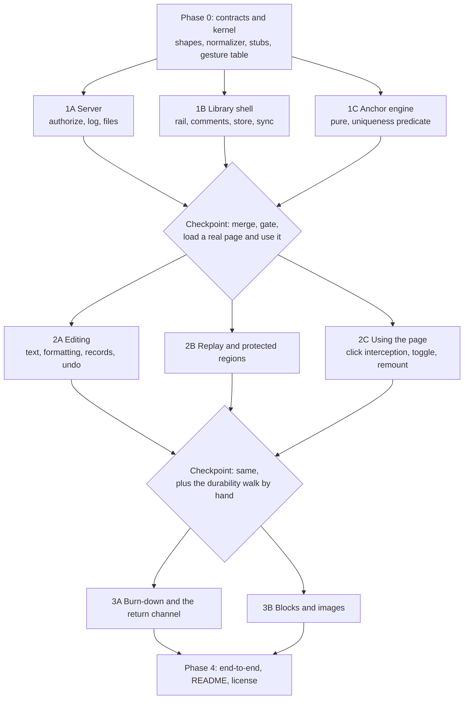

# Plan: Live Agentic HTML Editor

## Shape of the build

Five phases. Phase 0 is one agent and everything waits on it, because it pins the contracts every other
task reads and writes. Phases 1 through 3 fan out to parallel builders. Phase 4 is the tests that decide
whether this shipped, plus what makes it a public repository.

The lesson that shaped this plan, from four reviews of an earlier draft: **the expensive part is never the
feature surface, it is the seams between parallel builders.** The tool being replaced took 45 commits over
two and a half weeks and its cost was concentrated in cross-cutting integration.

The sharpest example, because it is the trap this exact build could fall into: three separate tasks need
to normalize text. The recorder mints a record's plain text, replay compares DOM to record to decide
"already equal, skip", and the anchor engine does whitespace-tolerant matching. If replay's comparison
normalizes even slightly differently from the recorder's minting, no region ever compares equal, replay
rewrites every region on every pass, and the reviewer's cursor gets fought. **Parallelizing this work is
itself capable of manufacturing the exact bug the tool exists to kill.** One normalizer, in Phase 0,
imported by all three.

Two rules for every builder, and the first is a deliverable rather than a hope:

- **A test that fails without the behavior.** Demonstrated, not asserted: the builder pastes the test
  failing against a one-line deliberate revert, with the output, into their progress file. Stating a rule
  without enforcing it is what the tool being replaced did with its "never rewrite the document" prompt,
  and it is why that rule never held.
- **No jsdom** for anything in the library. It has no layout, no caret rects, no policy enforcement, and
  no real key events, so every assertion that would catch the three symptoms is impossible in it.

## What already exists

The repository skeleton, `npm run gate` (lint, Node's test runner, Playwright against Chromium), and the
browser test harness are built and green. The harness ships the fixture pages every task needs, including
a page that re-renders itself on a knob the test controls, a page served with a real content security
policy, and a page with an aggressive CSS reset. It also ships the two hardest assertions with self-tests:
the behavioral caret assertion and idempotence observed as the absence of a second write.

A partial contracts module exists from a stopped agent and carries pieces built against the earlier,
wrong product shape. Phase 0 rescopes it; those pieces go on the cleanup list rather than being deleted
mid-build.

## Phase 0: Contracts and kernel

One agent. Nothing else starts until it lands.

::: callout-req
**Shapes.** The item record with every field from architecture D4, including `rev`, `group`, the region
reference as named fields, the lost-anchor state, and `reply`. The event envelope with its client-minted
id. The lifecycle transition table naming which side may make each transition.

**The one normalizer**, plus cleaned-markup helpers, with tests. Every later task imports it and no task
defines its own. This is the highest-value hour in the build.

**Stubbed signatures, committed, that later tasks fill in**: anchor mint and resolve (the stub returns a
unique match), the replay entry point and the ordering of its callers (the stub is a no-op), the item
store, the rail's card API including how any task attaches state, a badge, or an agent message to a card,
the failures-list API, a listener registry with a count so handler leaks are observable, the marker
identifying library-added nodes, and the caret and selection accessor.

**The script tag contract**: which attributes configure the library, what a page declares about its
identity, and what happens when an attribute is missing.

**The wire**: routes, methods, required headers, error shapes, the session exchange for an authorized
origin, and what the library does on a refusal mid-session.

**The two files** an agent reads, including the fencing and standing header from architecture D9.

**The gesture table**, complete: plain click places the cursor, Alt-click comments on an element,
Cmd-click follows a link, the editing toggle, send, escape.

**Region label rules**: the attribute an author can supply, the fallback chain, that a label is pinned at
first touch and never recomputed, and that record identity is the region reference and never the display
label. Two paragraphs in different containers under one heading must produce two records.

**The uniqueness predicate** from architecture D3, as a function contract, plus the fixture corpus it is
judged against: text and path unchanged (bind), rewrapped and reformatted (bind), a sibling inserted above
(bind), region text fully rewritten (no bind), region deleted (no bind), the same paragraph duplicated (no
bind, ambiguous).

**Two decisions written down** so two builders do not guess differently: the formatting mechanism
(`execCommand` with normalization on capture, versus manual range surgery, given Chromium only), and the
write-epoch rule that stops replay's own mutations from retriggering the observer that schedules replay.
:::

Also closed here: **Q1**, the library ships as several source files concatenated into one artifact, with
the artifact committed so a page can point at it with no build; and **Q2**, a reviewer authorizes an origin
by running one command at their terminal naming it, which is the deliberate act a hostile page cannot
perform.

## Phase 1

**1A, the server.** Zero runtime dependencies. Loopback only. A persistent token in an owner-only file, an
origin allowlist, a required content type and custom header, an ephemeral port recorded with the token.
Append-only log, projection on start. Writes the two files on send. Serving a local HTML file with the
script tag inserted, for the standalone-file case. A second instance refuses with an instruction.

**1B, the library shell.** The overlay in an isolated root that host CSS cannot reach and that touches
nothing in the host. **A fixed overlay that never shifts the page**, collapsible. Comment creation on
selection and on Alt-click, never on a plain click. The card API. The persistent failures list. The status
line. The edit list by region. The item store, written synchronously on every change and partitioned per
page. The sync client: retries forever, never blocks, tells a policy refusal from a server that is down.
Copy and export with no server. The overall note as an item. **The law this task owns: the rail updates in
place and a card holding focus is never re-created.**

**1C, the anchor engine.** Pure functions, no DOM ownership, no UI. Mint a region reference; resolve it in
a changed page returning a unique match or an honest failure with a reason. Whitespace-tolerant matching,
context-based rival elimination, no scalar threshold. Judged against Phase 0's fixture corpus. This is new
work: the existing comments module's version is four exact substring probes that bind a short prefix to
the first hit.

## Phase 2

**2A, editing.** Typing, formatting per Phase 0's decision, the record kinds, cleaned markup, per-item
undo as a record operation, the composition-end deferral, spellcheck and autocorrect off, and the rule
that no library markup ever reaches a payload.

**2B, replay and protected regions.** The highest-risk task. Protection of the actively edited region
including the framework morph veto, commit on blur, and replay of committed records under architecture D3:
the uniqueness predicate, the three-way comparison against the record, atomic groups, and the undo
exemption.

**2C, using the page.** Plain click does not navigate, submit, or fire the page's handlers. The editing
toggle restores an ordinary page. Cmd-click follows a link. The hover hint. The overlay root re-created on
framework morph and navigation events with every handler de-registered through the registry first. Policy
refusal named distinctly from server-down.

## Phase 3

**3A, the burn-down and the return channel.** Per-item ack, applied and not-applied, unnamed items stay
outstanding. Applied items lose their highlight and move to Completed. Agent replies rendered on cards.
The page updating itself when the agent lands a change, with acks processed before replay.

**3B, blocks and images.** Delete and reorder with landing anchors, resize and move. Image paste is cut.

## The cut line

If the day runs out, this is a coherent tool and it is the order to protect: Phase 0, 1C, 1B, 1A, 2A, 2B,
2C, and the ack half of 3A. That gives: add the tag to a page, comment, type fixes, use the page, lose
nothing across a reload or a killed server, copy and export with nothing running, send with no agent, an
agent that reads the file, and items that retire instead of re-shipping forever.

**Do not half-ship these:** 2A without 2B, because typed edits vanish on the first repaint; 2C without
2B's protected regions, because attaching to a page with a polling frame without them is the bug; and 3B
before 2B, because moved blocks depend on replay.

## Acceptance criteria

Judged by evaluators who did not build the code, on the running tool. Each names what failure looks like,
because a walk with no failure line gets a generous pass.

::: callout-metric
**AC1, a built page.** Ken adds the script tag to a built spec, fixes three sentences by typing, comments
on a diagram, writes an overall note, and sends with no agent running. An agent started afterwards
receives all five items from the file. *Fails if:* any item is missing, or the page's layout differs by a
pixel from the same page without the tag.

**AC2, a running app.** Ken adds the tag to a dev layout, walks three screens behind a login, comments on
two, types a fix on a third, and uses the app for real in between by clicking a button that navigates.
Sends the whole walk as one review naming all three pages. *Fails if:* a plain click on that same button
navigates, or the app stops responding.

**AC3, nothing is taken back.** Loses nothing means: item count identical, every item's text
byte-identical, no item changed state, and the caret assertion held. Tested against a browser reload, a
`kill -9` of the server, the page re-rendering the block he is typing in, and an agent rewriting the
source, the last run twice, once in a region he is typing in and once in a region he is not.

**AC4, send always works.** Available whenever anything is outstanding with no agent ever running. Assert
the button's enabled state and label at each step: fresh, note-only, after a send, after adding one more
note, after a second send.

**AC5, the agent talks back in the page.** An agent that cannot apply an item says so on that item's card.
An edit replay cannot place says so with its text intact. *Fails if:* either clears silently.

**AC6, the page is untouched.** Screenshot diff at two widths with the rail open and collapsed, zero diff
outside the rail's bounds; `scrollHeight` and every host block's rect identical with and without the
library; zero host elements carrying a style attribute or a library class after a session that created a
list and a link on a page with a CSS reset.

**AC7, it cannot be driven from outside.** From a real second origin in a real browser: no item written,
no feedback read, no ack forged. Judged on effect, the log has no new entries, not on a status code.

**AC8, a stranger can run it.** Clone, start the server, add the tag to their own page, complete a review.
Under a fresh user account with no existing state.
:::

## Tests, ranked

The top six are written first because each maps to a symptom Ken actually hit. The full list against a
real browser is more than a day of test writing on its own, so the ranking is the plan, not a preference.

| # | Test | Task |
| --- | --- | --- |
| 1 | Caret survives: type ten characters one per 50ms while the page repaints every 200ms; the paragraph reads exactly as before with the ten inserted contiguously; the replay-pass counter incremented | 2B |
| 2 | Send enablement walked through the UI with real clicks, asserting `disabled` and label at every step, with no agent ever; plus a static assertion that agent presence is not among the enablement inputs | 1B |
| 3 | An agent rewrites the source touching one region; all five outstanding items across four regions survive byte-identical and unchanged in state, exactly one marked; run again with the server down | 2B |
| 4 | Reload and `kill -9` durability, asserted synchronously in the same task as the final keystroke | 1B |
| 5 | Fail-closed paired with positive placement: three non-unique fixtures write nothing, three unique ones place correctly | 1C, 2B |
| 6 | Cross-origin write and forged ack from a real second origin, asserted on effect | 1A |
| 7 | Copy and export with no server running | 1B |
| 8 | Acks processed before replay: the agent acks and rewrites in one motion, the item is in Completed, nothing is flagged | 3A |
| 9 | Anchoring against a mechanically generated transformation set, targeting occurrence four of five, re-resolving after occurrence two is deleted | 1C |
| 10 | Two neighbouring regions never merge into one record, resolved in both orders | 1C, 2A |
| 11 | A focused card is never re-created: node identity, `activeElement`, and typing through 20 repaints | 1B |
| 12 | Replay idempotence asserted as the absence of a second write | 2B |
| 13 | Cross-region gesture decomposes into per-region records applied atomically | 2A, 2B |
| 14 | Undo reverts one record with the caret in the region, leaving other edits untouched | 2A, 2B |
| 15 | Plain click does not navigate or submit; Cmd-click does; the toggle restores an ordinary page | 2C |
| 16 | Two windows on one page: the second is refused with a reason | 1B, 1A |
| 17 | An item reworded after delivery survives an ack naming the older revision | 1B, 1A |
| 18 | 100 morphs: the listener registry count is unchanged, one overlay root, one gesture makes one item | 2C |
| 19 | A policy refusal from a real header is named distinctly from server-down | 2C |
| 20 | Failures persist through a remount, a navigation, and a replay pass | 1B |
| 21 | Non-interference per AC6's three assertions | 1B, 2A |
| 22 | No truncation of `after` through a large item; `before` bounded with its marker in the same test | 1A |
| 23 | A fenced field containing the delimiter is escaped | 1A |
| 24 | Blocks delete and reorder with landing anchors; images keep rendered size on move | 3B |
| 25 | A dropped desktop file does not navigate the page and does not reach disk | 2A |
| 26 | End-to-end walks of AC1 and AC2 | Phase 4 |

## Open questions

None blocking. Both prior open questions were closed in Phase 0.

## Cleanup needed

- `src/shared/cli_contract.js` and any command surface beyond what the agent needs to read and acknowledge,
  from the stopped agent's work against the earlier product shape.
- `test/fixtures/sample.html` and `test/browser/sample.spec.js`, the trivial browser test superseded by the
  harness.
