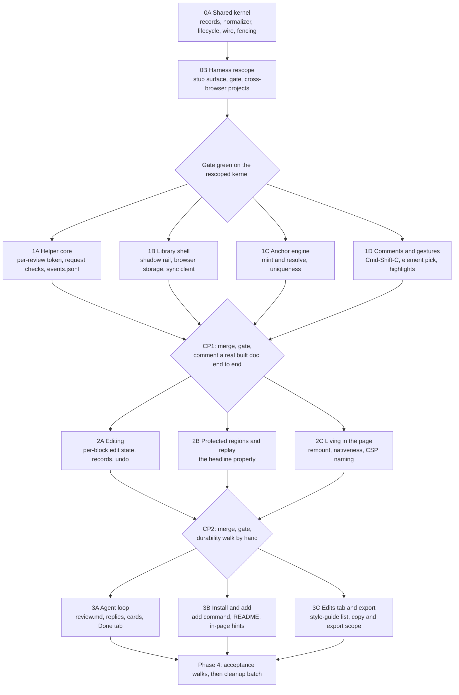

# Plan: Live Agentic HTML Editor

## Shape of the build

Five phases, fourteen tasks. Phase 0 is one agent and everything waits on it, because it pins the
contracts every other task reads and writes. Phases 1 through 3 fan out to parallel builders in their
own worktrees, with a stitch-back checkpoint between each. Phase 4 is the end-to-end acceptance walks
and the batched cleanup.

The lesson that shaped the phasing, carried forward from the previous plan and still true: the
expensive part is never the feature surface, it is the seams between parallel builders. The sharpest
example is text normalization. The edit recorder mints a record's plain text, replay compares the live
DOM against a record to decide "already equal, skip", and the anchor engine does whitespace-tolerant
matching. If replay normalizes even slightly differently from the recorder, no region ever compares
equal, replay rewrites every region on every pass, and the reviewer's caret gets fought twice a second.
Parallelizing this work is itself capable of manufacturing the exact bug the tool exists to kill. One
normalizer, settled in Phase 0, imported by all three.

The second seam, new to this architecture, is the pair of stores. The browser is authoritative for a
record's content until the helper acknowledges it, and the store is authoritative for lifecycle at a
given revision (D5, durability is browser storage plus an append-only log). Two builders who each
invent half of that merge rule produce a tool where an agent's stale "handled" retires a comment the
reviewer just reworded. That rule is code in Phase 0, not prose.

Three rules bind every builder:

- **A test that fails without the behavior, demonstrated rather than asserted.** The builder pastes the
  test failing against a one-line deliberate revert, with the output, into their progress file. Stating
  a rule without enforcing it is what the tool being replaced did with its "never rewrite the document"
  prompt, and it is why that rule never held.
- **No jsdom, ever, for anything in the library.** It has no layout, no caret rectangles, no policy
  enforcement, and no real key events, so every assertion that would catch the three symptoms is
  impossible in it.
- **The architecture document is the contract.** Where existing code disagrees with it, the code
  changes (see "The code already in the repo" in the architecture). No builder re-litigates a decision
  in code.

## What already exists, and what happens to it

A Phase-0 kernel and a real browser test harness are in the repo, built against an archived draft with
a different product shape (a send button, a blocking `next` and `ack` command pair, one machine-wide
token, Chromium only). The architecture says the code splits keep, rework, and cut, decided per module
at plan time. This is that decision.

Dispositions in one line: **the test harness survives almost whole (23 of 26 files kept), the shared
kernel is mostly keep or rework (12 of 14, with only the CLI contract cut), and the entire agent-facing
command surface plus verification is cut (6 files).** Nothing is deleted during the build. Every cut
goes on the Cleanup needed list at the foot of this plan and is removed in one batch, with human
approval, in Phase 4.

### src/

| Module | Disposition | Reason |
| --- | --- | --- |
| `shared/normalize.js` | Keep | The one normalizer, unchanged by the new architecture and still the highest-value module in the repo |
| `shared/uniqueness.js` | Keep | The predicate with no tunable number is exactly D9 (anchors match by uniqueness, not confidence) |
| `shared/epoch.js` | Keep | The write-epoch rule that stops replay's own mutations retriggering replay is unchanged by the new design |
| `shared/markers.js` | Keep | One spelling of "this node is ours" is what makes R23 (no library markup in feedback) enforceable |
| `shared/regions.js` | Keep | Record identity is the region reference and never the display label; still true and still the bug it prevents |
| `shared/contracts.js` | Keep | Barrel re-export only, nothing defined in it, so it follows whatever the kernel becomes |
| `shared/record.js` | Rework | Field table shape survives. Drop `moved`, `resized`, `delivered`, `ack`, `verification`; add the draft flag and the reply kinds from D4 (records are the truth) |
| `shared/lifecycle.js` | Rework | The actor column is the good part and stays. The states change from outstanding/delivered/applied/declined to draft, ready, handled, not_handled, question, reopened (D4 and the lifecycle diagram) |
| `shared/protocol.js` | Rework | Routes and credential model are the send-model's. Per-run token plus session exchange becomes the per-review token, custom header, JSON content type, Host check, and header-read origin of D11 (loopback is not a boundary) |
| `shared/review_format.js` | Rework | Fencing, per-item random delimiters, and field classification are exactly D12 (page text is data) and stay. `review.json` as the authoritative file is gone; `review.md` grouped by page with the contract block replaces it (D6, the agent contract) |
| `shared/failures.js` | Rework | The enum machinery with severity, persistence, and surface stays. Prune the send, ack, and verification codes; add lost anchor, neither-matches collision, second window refused, and CSP refused |
| `shared/gestures.js` | Rework | The pure-function-over-a-descriptor shape stays because it makes the table unit-testable. The table itself is replaced by D3's vocabulary (Cmd-Shift-C, Cmd-Shift-E, Cmd-Enter); Alt-click and plain-click-places-caret are dead |
| `shared/manifest.js` | Rework | One owner per file and the concatenation order both stay; the file list changes with this plan's tasks |
| `shared/cli_contract.js` | **Cut** | The blocking `next` and `ack` exit-code contract is the dead send model. The agent contract is now a file to read and a file to append to (D6) |
| `layer/listeners.js` | Keep | Working, not stubbed, and the leak it makes countable is still the remount failure mode in D7 and the failure table |
| `layer/selection.js` | Keep and extend | One caret accessor stays; 2B adds the selection snapshot and restore that D7 (protect the active region) requires as its third layer |
| `layer/anchor.js` | Rework | `mint` and `resolve` signatures survive and already defer to the uniqueness predicate. The stub candidate search is replaced with the real DOM search (1C) |
| `layer/store.js` | Rework | The synchronous-write-on-every-change law survives intact. Add drafts, revisions, and keying by review id rather than by page or origin (D5) |
| `layer/sync.js` | Rework | Telling a CSP refusal from a helper that is down survives and is a failure-table row. The single send call becomes post-per-record, re-post-unacknowledged, and poll-for-replies |
| `layer/overlay.js` | Rework | The law that the rail updates in place and a focused card is never re-created is the most valuable thing in the file and stays. Tabs become Active, Edits, Done (D10, the rail); the send control is gone |
| `layer/replay.js` | Rework | Pass ordering, epoch discipline, and the counters stay because the ranked tests read them. The comparison becomes the history-aware four-branch compare of D7, and the protection veto is new |
| `layer/editing.js` | Rework | The `execCommand` mechanism decision survives; its Chromium-only reasoning does not, and the entry gesture changes from click-to-edit to deliberate per-block edit state (D3, browse is fully native) |
| `layer/inject.js` | Rework | The remount contract (re-create the root, de-register every handler through the registry first, replay after) is right and stays. Route detection widens to the multi-page dev-server review |
| `layer/index.js` | Rework | Boot and version stamp stay. Its refusal to initialize on a non-loopback origin must go: it would break the `file://` built-doc case, which is a supported primary case |
| `service/state_dir.js` | Rework | Outside-any-checkout, owner-only, and the safe-id rule stay. The layout becomes `reviews/<id>/{events.jsonl, review.md, replies*.jsonl}` and the token becomes per-review (D11) |
| `service/review_writer.js` | Rework | Single writer, path safety, and atomic write-beside-then-rename are all restored security findings and stay. It writes `review.md` only |
| `service/routes.js` | Rework | The router shape and the fail-loud stub rule stay. The route table changes with the protocol; the verification call site goes away with verification |
| `service/auth.js` | Rework | One-line stub. Becomes the per-request server-side check block from D11 |
| `service/index.js` | Rework | One-line stub. Becomes `serve` |
| `service/log.js` | Rework | One-line stub. Becomes the `events.jsonl` appender |
| `service/projection.js` | Rework | One-line stub. Projects the log into `review.md` and into the reply state the library polls |
| `service/verification.js` | **Cut** | Checking that an agent's claimed change actually landed is a deliberate v1 cut (D6), with the reply line's files field kept as the seam |
| `cli/index.js` | Rework | Entry point stays; the commands become `serve`, `add`, and `wait` |
| `cli/commands/next.js` | **Cut** | The blocking next command is the dead send model. `wait` in 3A is a different thing: a convenience whose death costs nothing because the file is still complete |
| `cli/commands/ack.js` | **Cut** | Acknowledgement is now an appended line in a reply file, not a command |
| `cli/commands/open.js` | **Cut** | Superseded by `add`, which mints the review and its token in the same act |
| `cli/commands/setup.js` | **Cut** | Superseded by `add`. No instruction files are ever written now; the contract is the file itself |
| `dist/lahe-layer.js` | Rework | Built artifact, rebuilt by the build script; committed so a page can point at it with no build step (D1) |

### test/

| Module | Disposition | Reason |
| --- | --- | --- |
| `helpers/assertions.js` | Keep | The caret assertion and the no-second-write assertion are the two hardest things in the project and both still test properties this design has |
| `helpers/caret.js` | Keep | Caret identity compared by node identity rather than by path is the only comparison that catches a dead caret |
| `helpers/mutations.js` | Keep | Idempotence observed as the absence of a second write; a final-DOM equality check cannot see the bug |
| `helpers/counters.js` | Keep | Replay tests must assert replay actually ran, or a do-nothing engine passes everything |
| `helpers/poll.js` | Keep | The one place a timer is allowed, and the reason the no-arbitrary-sleeps gate can exist |
| `helpers/repaint.js` | Keep | Drives the fixture's own re-render machinery; harness-owned and unaffected by the redesign |
| `helpers/typing.js` | Keep | Real key events through the keyboard, which is the whole mechanism under test |
| `helpers/bridge.js` | Keep | Page-side utilities under their own namespace, so a test can assert the layer left nothing behind |
| `helpers/servers.js` | Keep | Real CSP response headers and a real second origin, neither of which a meta tag or a same-origin test can fake |
| `helpers/contexts.js` | Keep | Two storage-separate contexts; now also the instrument for the second-window refusal test |
| `helpers/test.js`, `helpers/index.js`, `helpers/README.md` | Keep | Harness entry points; the README's swap-point list is updated by 0B |
| `helpers/stub.js` | Rework | This is the declared swap point. Its function list changes with the new gesture and edit-state vocabulary |
| `helpers/service.js` | Rework | The `kill -9` readiness and durability contract stays; the readiness file's shape changes with the per-review token |
| `fixtures/assets/repaint-engine.js` | Keep | A repaint engine that actively reverts what the reviewer typed is what stops caret tests being theatre |
| `fixtures/assets/harness-stub.js` | Rework | Keeps standing in for the layer in harness self-tests; its exposed surface follows 0A's contracts |
| `fixtures/servers/stub-service.js` | Rework | Same role, new credential and file shape |
| `fixtures/built-doc.html`, `repainting.html`, `csp-probe.html`, `css-reset.html`, `attacker.html` | Keep | Each is a fixture for a failure-table row that still exists |
| `fixtures/uniqueness_corpus.js` | Keep | The six-case corpus the predicate and the real engine are both judged against |
| `fixtures/sample.html` | **Cut** | Trivial page superseded by the built-doc fixture |
| `browser/sample.spec.js` | **Cut** | Trivial browser test superseded by the harness self-tests |
| `browser/harness_selftest.spec.js` | Keep | Both halves, positive and negative. The negative halves are what stop an assertion that can never fail |
| `browser/harness_second_origin.spec.js` | Keep | Retarget from the stub service to the real helper by changing one constant, as its own header says |
| `unit/normalize.test.js`, `unit/uniqueness.test.js`, `unit/epoch.test.js`, `unit/no_arbitrary_sleeps.test.js`, `unit/sanity.test.js` | Keep | They test kept modules and kept laws |
| `unit/record_lifecycle.test.js` | Rework | Follows the new states and actors |
| `unit/regions_gestures.test.js` | Rework | The regions half is kept; the gestures half follows the new table |
| `unit/review_format.test.js` | Rework | Fencing assertions stay; the `review.json` assertions go and per-page grouping arrives |
| `unit/harness_service.test.js` | Rework | Follows the reworked service helper |
| `playwright.config.js` | Rework | Chromium-only is dead as a product claim (D1 and R42, stated requirements with real reasons). Chromium stays the fast default lane; Firefox and WebKit projects are added and run at the checkpoints |

One repo-hygiene item found while taking this inventory: several modules cite `docs/CONTRACTS.md` ("How
a shared module loads") and that file does not exist. Phase 0A writes it or retargets the references.
The repo's own `CLAUDE.md` already carries the corrected cross-platform position, so that architecture
follow-up is done.

## Phase 0: the kernel and the harness

### 0A: Shared kernel rework

One agent, in the main worktree, and nothing else starts until it lands.

::: xref
Implements D4 (records are the truth), D5 (durability is browser storage plus an append-only log),
D6 (the agent contract), D9 (anchors match by uniqueness), D11 (server-side request checks), and D12
(page text is data, reviewer text is intent).
:::

What it produces:

- **The record shapes**, as the field table in code: id, client-minted; `rev`, monotonic and bumped on
  every rewording; kind (comment, edit, delete, format-only, note); draft or ready; the anchor
  reference as named fields; `before` and `after` in text and in HTML; the lost-anchor state; the
  reply. Every builder imports a field name and never types the string.
- **The lifecycle table with its actor column.** Which side may make each transition, spelled out. The
  agent may only move an item that names the current revision. A reply naming revision 2 cannot retire
  revision 3 (R9, the same feedback is never acted on twice, and R21, a comment can be reworded safely).
- **The merge rule, as a tested function.** Given browser state and store state for one id, produce the
  merged item: the browser wins on content for anything the helper has not acknowledged, the store wins
  on lifecycle per revision. This is the rule that decides whether a reviewer who reworded while
  offline keeps their rewording outstanding.
- **The normalizer**, kept as it is, with its existing tests, plus the two comparison modes replay
  needs: normalized text for ordinary records, and structural comparison for format-only records (whose
  whole point is a change the text normalizer is built to ignore).
- **The wire**: routes, methods, the required custom header, the JSON content type, the Host check, the
  origin read from the request header rather than from the body, the per-review token, the error
  shapes, and what the library does on a refusal mid-session. Absent configuration fails closed.
- **The review file format**: `review.md` grouped by page, the standing contract block that teaches an
  agent both ways to keep up, the per-item random fencing delimiters, and the classification of every
  field as intent or as data. Reviewer-typed text is intent, verbatim, never truncated. Everything that
  came off the page rides fenced as data (D12).
- **The reply file format**: one JSON line per answer with id, revision, status, optional agent name,
  optional files touched.
- **The gesture table**, replaced wholesale with D3's vocabulary and kept as a pure function over a
  descriptor so it stays unit-testable.
- **The stubbed signatures every later task fills in**, committed so five callers do not each invent a
  scheduling policy: replay's entry point and pass ordering (a working no-op with live counters), the
  anchor mint and resolve, the rail's card API including how any task attaches state or an agent
  message to a card, the failures list, the protection API (mark, veto, snapshot, restore, release),
  and the store.
- **Two open questions closed**, so no builder guesses:
  - **Q1, does the helper start itself?** The agent starts it. `lahe serve` is idempotent, and the
    contract block in `review.md` plus the README both say so. A manual one-liner is the fallback and
    login registration is not built in v1. The library never depends on it being up (D1).
  - **Q2, how does `review.md` divide by page?** One section per pathname, ordered by first visit, with
    the page title and the optional source hint in the section header, and the review spanning them.
    Query strings and fragments collapse into the pathname. A `file://` review is one section named by
    the file's basename.

**Done when:** the gate is green, every kept unit test still passes, the reworked ones pass against the
new shapes, and the merge rule and the lifecycle actor rule each have a test that fails when a one-line
revert lets a stale revision retire a current one.

### 0B: Harness rescope and cross-browser lanes

One agent, after 0A. Small and mechanical, but it blocks everyone because they all write tests against
it.

::: xref
Implements the architecture's Test strategy section (real browser, real pages, replay must prove it
ran) and D1's cross-platform position.
:::

Rescope `test/helpers/stub.js` and `test/fixtures/assets/harness-stub.js` to the new vocabulary (enter
edit state on a block, protect, release, commit, mark ready) while keeping both halves of every
self-test, including the negative halves. Rework the service helper for the per-review token. Add
Firefox and WebKit Playwright projects, with Chromium remaining the default fast lane. Update the
harness README's swap-point list.

**Done when:** `npm run gate` is green on Chromium and the harness self-tests, positive and negative
halves both, pass on all three browsers.

## Phase 1: four parallel builders

Each takes its own worktree and its own manifest-owned files. A builder that needs a file it does not
own asks the orchestrator rather than editing it.

### 1A: Helper core

::: xref
Implements D5 (the append-only log), D11 (loopback is not a boundary, so the page proves itself), and
the Data and state section (filesystem scope, atomic projection writes, owner-only permissions).
:::

Zero runtime dependencies. `lahe serve` binds loopback on an ephemeral port. Every request is checked
server-side with no exceptions: a valid per-review token, the required custom header, a JSON content
type, a Host header naming the helper, and an origin read from the request's own header. Missing
configuration refuses. `events.jsonl` appends whole lines; events are idempotent by id and revision, so
a re-post is always safe. Projections are written beside and renamed. Review ids are constrained to a
safe character set because they are path components. No symlinks are followed inside the data
directory. The data directory is owner-only. A second helper instance refuses with an instruction.

**One spike inside this task, decided before 1A closes:** whether a `file://` page can reach the helper
at all. A page opened from disk has a null origin, and the browser may refuse the request outright
regardless of what the helper allows. Test it first, on all three browsers. If it works, the per-review
token is the working factor as D11 says. If it does not, the fallback is already in the design space:
the helper serves that one file itself, giving it a real http origin, and `add` says so. Whichever way
it lands, write it into the architecture's D11 as a resolved note.

**Done when:** the second-origin browser spec passes against the real helper rather than the stub,
asserted on effect (the log on disk has no new lines) rather than on a status code; a `kill -9`
mid-write leaves at most a truncated last line and a readable history; and the `file://` question has a
written answer with test output behind it.

### 1B: Library shell

::: xref
Implements D8 (the library changes nothing about how the page looks), D10 (the rail), and D5's browser
storage half.
:::

All library UI in a closed shadow root with its own styles: the page's CSS cannot reach the library and
the library's CSS cannot touch the page. A fixed rail with three tabs (Active, Edits, Done), a
dismissible failure chip list, and a persistent one-line status that states plainly what is happening
to the reviewer's typing: kept locally, stored, or agent connected (R12, the reviewer always knows what
is happening to their typing). The collapsed pill never overlaps the open rail.

Browser storage written synchronously on every keystroke, including half-written drafts, keyed by
review id so `localhost` and `127.0.0.1` are not two buckets. The sync client posts each event as it
happens, re-posts anything unacknowledged on reconnect, retries forever, never blocks the reviewer, and
tells a CSP refusal apart from a helper that is down. Drafts flow to the helper too, marked draft. A
second window on the same review is refused with a reason pointing at the first.

**The law this task owns: the rail updates in place, and a card holding focus is never re-created.**

**Done when:** typing into a comment box survives twenty repaints with the card node identity and
`activeElement` unchanged; a reload and a `kill -9` each lose nothing, asserted in the same task as the
final keystroke with no awaited timer in between; and the second window is refused.

### 1C: Anchor engine

::: xref
Implements D9 (anchors match by uniqueness, not confidence).
:::

Pure functions, no DOM ownership and no UI. Mint an anchor from a region: its normalized text plus
enough surrounding context to be unique on the page. Resolve it in a changed page, returning either a
unique match or an honest failure with a reason. Whitespace-tolerant matching, context-based rival
elimination, no scalar threshold anywhere. Judged against the six-case fixture corpus, and against a
mechanically generated transformation set.

This is new work, not a port: the built-doc comment module's locate is four exact substring probes that
bind a short prefix to the first hit.

**Done when:** the three binding cases bind to the right node and the three non-binding cases write
nothing, on the same corpus the predicate's unit tests use, and targeting occurrence four of five
survives the deletion of occurrence two.

### 1D: Comments, gestures, and highlights

::: xref
Implements D3 (the gesture vocabulary, answering the brief's Q1) and D8 (highlights that do not change
the page).
:::

Cmd-Shift-C with a selection opens a comment box already focused on that passage. Cmd-Shift-C with
nothing selected enters element-pick mode: hovering outlines elements, clicking one comments on it, Esc
cancels (R17, comment on a whole element). An open box at the foot of the thread is a note tied to
nothing (R18). Cmd-Enter marks a comment ready for the agent, and nothing that is not ready is
actionable (R7, the reviewer decides when a comment is ready). A comment can be reworded, which bumps
its revision, or deleted, before an agent acts on it.

Highlights use the CSS Custom Highlight API, which paints a range without inserting anything into the
DOM. No wrapper elements, ever: wrappers mutate the DOM the page's own framework is diffing and leak
into quoted text. Every gesture appears as a hint line on the rail so a new user finds them without
documentation (R43, a new user can work it out from the page itself).

**Done when:** a comment made on a static built doc appears as a highlight, survives a reload as a
draft mid-sentence, and the page's own `scrollHeight` and every block's bounding rectangle are
identical with and without the library.

### CP1: first stitch-back

Orchestrator merges all four branches, runs the gate on all three browsers, then does this by hand: add
the library to `test/fixtures/built-doc.html`, start the helper, leave three comments and one untethered
note, kill the helper, leave a fourth comment, restart the helper, and confirm all five are in
`events.jsonl` exactly once with the reviewer's text byte-identical.

## Phase 2: three parallel builders

### 2A: Editing

::: xref
Implements D3's edit state (edit is entered deliberately, per region) and D4's edit record.
:::

Cmd-Shift-E makes the block under the cursor or selection editable, that one block and nothing else,
visibly framed so the reviewer always knows which state they are in. Esc or a click outside commits.
The rest of the page stays live throughout. An open edit commits automatically on navigation or unload,
because browse mode is fully native and a link click is one click (R1 names navigation, so navigation
cannot be a losing move).

The record's `before` is the wording as it was when the reviewer first touched the region, however many
times they retype it after (R29, an edit is a before and an after tied to a place). The `after` is
never truncated and never cleaned up (R3, the reviewer's own words stay exactly as typed; the comma
that came back as an em dash is the named failure). Basic formatting only. Deleting a block is its own
record kind and reads as a deletion rather than as an empty edit (R27). A formatting-only change is
still a change (R31). Per-record undo reverts that record's region to its before and retires the
record, touching nothing else (R28, every edit can be undone on its own). Composition events are
deferred to composition end; spellcheck and autocorrect are off; no library-added markup ever reaches a
record.

**Done when:** two edits in neighbouring regions stay two records resolved in either order; undo of one
leaves the other untouched with the caret still in place; a formatting-only change produces a record;
and no record contains any node carrying a library marker.

### 2B: Protected regions and replay

The highest-risk task in the build, and the one the headline property lives in. Give it the strongest
builder.

::: xref
Implements D7 (protect the active region, replay the committed records), which is what "live editing
and agentic editing simultaneously without clobbering each other" is implemented as.
:::

**Protection, three layers, because the archived round-two review proved restore-after alone cannot
save the caret.** A repaint destroys the text node the selection lives in before any observer fires, so
by the time a restore runs there is nothing to restore to. So: the block is marked so cooperative
frameworks skip it (Turbo's opt-out attribute), the library vetoes the morph of that element before it
happens wherever the framework offers the hook, and a selection snapshot plus mutation-observer restore
is the fallback for repaints that honour neither. All three. Two of them is a design that loses the
caret on the framework that offers no hook.

**Replay, history-aware, four branches, never guessing.** After any repaint, one pass re-applies
committed records. For each record, resolve the anchor and compare:

1. The DOM already matches the current `after`: do nothing. Idempotent.
2. It matches `before`: apply the edit again.
3. It matches an **earlier revision's** `after`: an old version landed somewhere, so re-apply the
   current revision and say on the card that an earlier version had landed.
4. It matches none of these: the content changed underneath the reviewer, so flag it on the card and
   write nothing (R5, the reviewer's unsent work is never silently overwritten).

A record whose anchor resolves to zero matches or to more than one is surfaced as lost, on the page and
in `review.md`, never dropped and never moved (R20, a comment that cannot find its subject says so). A
format-only record compares on structure rather than on normalized text. A delete is idempotent by
absence: the block gone is applied, the block back is re-applied.

**On commit, protection lifts and a replay pass runs immediately**, so a change the page tried to make
to the protected block while it was protected surfaces through branch four rather than being silently
swallowed. When the agent lands a change and the page updates itself (R36), the same pass runs: the
agent's change is the new page, the reviewer's outstanding records are re-applied on top, and a
collision is exactly branch four.

Every replay path increments the pass counter and the regions-written counter, because a test that does
not assert replay ran is passed by a do-nothing engine.

**Done when:** the caret assertion holds through five passes against the actively reverting repaint
engine; idempotence is proved by the absence of a second write rather than by final-DOM equality; each
of the four compare branches has its own test with the counters asserted; and an agent rewriting the
source under one region leaves every other outstanding record byte-identical and unchanged in state.

### 2C: Living in the page

::: xref
Implements D3's browse-is-fully-native half (R13, the page keeps working, which outranks editing
convenience) and the remount contract.
:::

Browse mode is the page untouched: no intercepted clicks, no contentEditable anywhere, no captured keys
beyond the library's own shortcuts. Links navigate, buttons act, forms submit, and the app's own
JavaScript sees every event it would see without the library.

The overlay root is not in the server's HTML, so a morph can remove it. It is re-created on morph,
load, popstate, and a mutation-observer fallback, with every handler de-registered through the registry
before re-registration, and replay running after each remount. A CSP refusal is named distinctly from a
helper that is down, on the status line, so the reviewer fixes the right thing.

**Done when:** on the repainting fixture, one hundred morphs leave the listener registry count
unchanged, one overlay root, and one gesture still making exactly one item; a plain click on a link
navigates and a plain click on a button fires the page's own handler; and the CSP fixture produces the
CSP message rather than the helper-down message.

### CP2: second stitch-back and the durability walk

Merge, gate on three browsers, then walk it by hand on the repainting fixture with the helper running:
type a fix while the page repaints on its timer, commit it, reload, confirm the record survived and
replay re-applied it, then have a script rewrite the fixture's source under a different region and
confirm nothing else moved.

## Phase 3: three parallel builders

### 3A: The agent loop

::: xref
Implements D6 (the agent contract is one readable file and replies are one appended line), D10's Done
tab, and D12's fencing at projection time.
:::

The helper maintains `review.md`, regenerated from the log and written atomically, grouped by page per
Phase 0's answer to Q2, opening with the standing contract block that tells an agent both ways to keep
up. Only records the reviewer marked ready appear as actionable; drafts never do. Every item carries
its id and revision, its state, its quoted subject or before and after fenced as data, and the
reviewer's words verbatim as intent.

Agents answer by appending one JSON line to `replies-<agent>.jsonl` in the same folder, with plain
`replies.jsonl` fine for the single-agent case. Per-agent files, because one file with several
uncoordinated writers is not atomic. The helper is the single reader, folds replies into the log in
arrival order, and resolves conflicting replies to one item by revision first and then latest-wins with
both kept in the log. A reply naming a stale revision is refused and the reworded item stays
outstanding.

Agent reply text is its own trust class: rendered as plain text only, bounded, labeled with the agent's
name, never presented to the reviewer as an instruction, and re-fenced as data whenever it is projected
back into `review.md` for other agents.

The library polls for replies. A handled item loses its highlight and moves to the Done tab (R37). A
not-handled reason or a question lands on that item's own card, on the page, because the reviewer is
not reading the chat window (R34, an agent that cannot do something says so on the page). Handled items
are kept and reopenable, not deleted (R38). `lahe wait` blocks until something new is ready or a
timeout, and prints it; its death costs nothing, because the file is still there and still complete.

**Done when:** an agent that only ever appends lines to a file can retire items and report a failure
onto a card; a reply naming an old revision is refused with the item still outstanding; and a reply
whose text contains the fence delimiter is escaped rather than closing its own fence.

### 3B: Install, add, and first-run

::: xref
Implements D1 (one file in the page, one process beside it) and D11's add-step-mints-the-token half
(R44, only the reviewer's own review can reach their work, with no action beyond adding the library).
:::

`lahe add` on a static file writes the one script line, pointing at the built library file and never at
the helper. On a dev server it prints the one line for a layout, wrapped in a development-only guard.
Either way it mints the per-review token for that review, embeds it as an attribute on the script line,
registers the page's origin with the helper, and records the optional source hint so an agent edits the
template rather than build output the next build overwrites.

It says out loud, at the moment it writes, that a token written into a file inside a repository can be
committed and shared, and that the leak is scoped to one review rather than to the machine. README with
the stated requirements and their reasons (Node 20 or later, and the Custom Highlight API floor with
why it exists), the MIT license, and the in-page hint lines that let a new user work the tool out
without documentation.

**Done when:** a fresh user account with no existing state can clone, run one command, add the library
to their own page, and complete a review.

### 3C: The Edits tab, copy, and export

::: xref
Implements D10's Edits tab (R32, hand edits kept apart from comments; R39, the end-of-session list) and
R10 (there is always a way to take the work elsewhere with nothing running).
:::

Every hand edit as a before and after row, kept apart from the comment thread so neither buries the
other, and doubling as the end-of-session list of hand edits worth feeding a style guide. Copy and
export cover the whole review when the helper is reachable. With nothing running, the export carries
what this browser holds and is labeled as this page's slice of the review, never passed off as the
whole (R11's no-false-success rule applied to export). Export bytes come from the same pure formatter
the helper uses, so the two never drift.

## The cut line

If time runs out, this is the order to protect: 0A, 0B, 1C, 1B, 1A, 1D, 2A, 2B, 2C, then the reply half
of 3A. That is a coherent tool: add the library to a page, comment, type fixes, use the page for real,
lose nothing across a reload or a killed helper, copy and export with nothing running, an agent that
reads one file and answers by appending to another, and items that retire instead of shipping forever.

**Shipped without, if the day runs out:**

- `lahe wait` (the blocking convenience). The file is the contract and re-reading it works.
- Per-agent reply files. A single `replies.jsonl` is correct for the one-agent case, which is every
  case until an orchestrator fans out.
- Reopening a handled item from the Done tab. Keeping handled items visible is the requirement; the
  reopen affordance can wait.
- The `question` reply status. Not-handled with a reason covers the need.
- Source hints on page headers. Useful on a dev-server review, not load-bearing.
- Firefox and WebKit as gate lanes, if the harness fights. Chromium as the test lane is a test-infra
  choice and not a product support claim, and the product claim stays cross-browser.

**Do not half-ship any of these. Each is worse present-and-partial than absent:**

- **Editing (2A) without protected regions and replay (2B).** Typed edits vanish on the first repaint,
  which is symptom one of the three this replaces.
- **Replay without branch four (neither matches).** A replay engine that guesses when the content
  changed underneath the reviewer silently overwrites their work, which is a worse failure than not
  replaying at all.
- **Protection with only two of its three layers.** The caret dies on the framework that offers no
  veto hook, and the tool looks like it works right up until it does not.
- **The helper without the full server-side request check set.** A partial check reads as protection
  and is not one.
- **The sync client without synchronous browser storage underneath it.** A record that exists only in
  flight is exactly the short-lived place the brief names as the root cause.
- **Reply folding without the revision check.** A stale "handled" retiring a rewording is silent loss
  of work the reviewer can see on screen.
- **Highlights via wrapper elements as a stopgap for the Custom Highlight API.** Wrappers mutate the
  DOM a framework is diffing and leak into quoted text.

## Tests, ranked

The top five are written first. Four map one-to-one to the three real symptoms plus the headline
property this design adds; the fifth is the security effect. The laws that survive from the previous
plan and bind every test below: replay tests assert replay actually ran through the pass counters, or a
do-nothing engine passes everything; no arbitrary sleeps, and the gate enforces it; caret assertions
compare by node identity, never by path or id; idempotence is observed as the absence of a second write,
never as final-DOM equality; a real browser always, and never jsdom.

| # | Test | Maps to | Task |
| --- | --- | --- | --- |
| 1 | **Typed text does not revert.** Type ten characters, one per 50ms, into a block while the repaint engine reverts that block every 200ms. The paragraph reads exactly as before with the ten inserted contiguously, the caret is in the same text node by identity, and the replay pass counter incremented at least five times. Run on all three protection layers separately, including the flavor with no veto hook | Symptom: typed text reverting | 2B |
| 2 | **Human and agent edit at once without clobbering.** The reviewer is typing in region A while a script rewrites the source of region B and the page re-renders. Assert: A's in-progress text and caret survive, B's outstanding record re-applies through branch two or three, every other record is byte-identical and unchanged in state, and exactly zero records were written by branch four. Then the interleaving that must flag: the script rewrites region A itself while it is protected, and on commit branch four flags that one card and writes nothing | **The headline property** (D7) | 2B |
| 3 | **Delivery never stops.** Ten confirmed records made across a helper that is killed with `kill -9` at record four and restarted at record seven. All ten are in `events.jsonl` exactly once, byte-identical, and all ten are in `review.md`. Plus a static assertion that no control anywhere gates a record on the helper being reachable | Symptom: delivery stopping | 1A, 1B |
| 4 | **The page's own controls keep working.** On a real app fixture: a plain click on a link navigates, on a button fires the page's handler, and a form submits, all with the library loaded and with a comment and an edit already outstanding. One hundred morphs later the listener registry count is unchanged, there is one overlay root, and one gesture still makes exactly one item | Symptom: the page's controls dying | 2C |
| 5 | **It cannot be driven from outside.** From a real second origin in a real browser: no record written, no feedback read, no reply forged, no token guessed. Asserted on effect (the log on disk has no new lines) and not on a status code, because the attacker cannot read the status either | R44 | 1A |
| 6 | Nothing is lost across a reload, a tab close, a navigation with an edit open, and a `kill -9`, asserted synchronously in the same task as the final keystroke | 1B, 2A |
| 7 | Fail-closed paired with positive placement: the three non-binding corpus cases write nothing, the three binding ones place correctly, and the same corpus judges both the predicate and the real DOM engine | 1C, 2B |
| 8 | Replay idempotence as the absence of a second write, across five passes with no repaint in between | 2B |
| 9 | A reply naming an older revision is refused and the reworded item stays outstanding, run both online and across an offline rewording that merges on reconnect | 0A, 3A |
| 10 | A focused card is never re-created: node identity, `activeElement`, and typed characters all intact through twenty repaints | 1B |
| 11 | Each of replay's four compare branches, with its own fixture and its counter assertions, including a format-only record comparing on structure and a delete idempotent by absence | 2B |
| 12 | An anchor that resolves to zero matches, and one that resolves to two, are both surfaced as lost on the card and in `review.md`, and neither writes | 1C, 2B |
| 13 | Two neighbouring regions never merge into one record, resolved in both orders | 1C, 2A |
| 14 | Per-record undo reverts one edit with the caret inside the region and leaves every other edit untouched | 2A, 2B |
| 15 | The page renders identically with and without the library: screenshot diff at two widths with the rail open and collapsed, zero diff outside the rail's bounds, `scrollHeight` and every block rect identical, and zero host elements carrying a library class or a style attribute after a session on the CSS-reset fixture | 1B, 1D |
| 16 | Drafts survive a reload mid-sentence, reach the helper marked draft, and never appear as actionable in `review.md` | 1B, 3A |
| 17 | A CSP refusal is named distinctly from a helper that is down, driven by a real response header | 1B, 2C |
| 18 | A second window on the same review is refused with a reason, and no separate feedback accumulates | 1A, 1B |
| 19 | Reviewer text is never truncated through a very large edit, while quoted page text is bounded with its marker visible, asserted in the same test | 0A, 3A |
| 20 | A fenced field containing its own delimiter is escaped, for page text and for agent reply text both | 0A, 3A |
| 21 | Failure chips persist through a remount, a navigation, and a replay pass, and stay dismissed once dismissed | 1B |
| 22 | Copy and export with no helper running produce the same bytes as the helper's projection for the same records, and the export is labeled as this page's slice | 3C |
| 23 | An untethered note, an element comment, and a selection comment each round-trip to `review.md` and back to a card | 1D, 3A |
| 24 | The helper refuses a symlink inside its data directory, an unsafe review id, and a write outside its data directory | 1A |
| 25 | A file dropped onto the page from the desktop does not navigate the page and does not reach disk | 2A |
| 26 | End-to-end walks of AC1, AC2, and AC3 below, scripted | Phase 4 |

## Acceptance criteria

Scored by an evaluator who did not build the code, on the running tool in a real browser. Each names
what failure looks like, because a walk with no failure line gets a generous pass.

::: callout-metric
**AC1, the built-document case.** The evaluator adds the library to a built HTML report opened from
`file://`, fixes three sentences by typing them, comments on a diagram, leaves an untethered note, and
marks all five ready. With no agent ever running, they copy the review out and it contains all five with
their text byte-identical. Then they start the helper and all five appear in `review.md`. *Fails if:*
any item is missing or altered, or the page's layout differs by a pixel from the same page without the
library.

**AC2, Ken's dev-server story.** The evaluator adds the library to a Turbo-driven app's development
layout, logs in, walks three screens, comments on two of them, types a fix on the third while the page
polls and morphs underneath them, and drives the app for real in between by clicking a button that
navigates. All of it lands in one review naming all three pages. *Fails if:* any click behaves
differently than it does without the library, the app stops responding, an open edit is lost on
navigation, or a morph loses the caret.

**AC3, human and agent at the same time.** With the evaluator holding an unfinished edit open in one
region, an agent reads `review.md`, changes the source of a different region, appends a handled line,
and the page updates itself. The unfinished edit and its caret survive. The handled item loses its
highlight and moves to Done. Every other outstanding item is byte-identical and unchanged in state.
Then the agent changes the source of the very region being edited: on commit, that one card is flagged
as changed underneath and nothing is overwritten. *Fails if:* anything is silently overwritten, or the
collision is not surfaced.

**AC4, nothing is taken back.** Loses nothing means item count identical, every item's text
byte-identical, no item changed state, and the caret assertion held. Tested against a browser reload, a
`kill -9` of the helper, a machine sleep simulated by suspending the helper process, the page
re-rendering the block being typed in, and a navigation with an edit open. *Fails if:* any of the four
measures moves.

**AC5, the agent talks back on the page.** An agent that cannot apply an item appends a not-handled
line with a reason, and that reason appears on that item's card. A record whose anchor replay cannot
place says so on its card with its text intact. A reply naming an old revision leaves the item
outstanding. *Fails if:* any of the three clears silently or shows a success state.

**AC6, a new user's install.** Under a fresh user account with no existing state: clone, run the one
documented command, add the library to a page of their own, and complete a review, working out the
gestures from the page itself without opening the README. *Fails if:* any step needs a second command
not printed by the first, or the gestures cannot be found on the page.

**AC7, the end-of-session edit list.** After a session with six hand edits, the Edits tab lists all six
as before and after pairs, apart from the comment thread, and exports as a list that reads as
style-guide input. *Fails if:* an edit appears only in the comment thread, or a formatting-only change
is missing.

**AC8, outside cannot get in.** From a second origin in a real browser, and from a non-browser client:
no record written, no feedback read, no reply forged. Judged on the log's contents. *Fails if:* any
request reaches a handler without all five server-side checks passing.
:::

## Open questions

None blocking. The architecture's two open questions (whether the helper starts itself, and how
`review.md` divides by page) are closed in Phase 0A. The one live unknown, whether a `file://` page can
reach the helper at all, is a spike inside Phase 1A with its fallback already designed, so it cannot
block the build either way.

## Cleanup needed

Deletions are batched and executed once, with human approval, in Phase 4. Nothing on this list is
removed during the build.

- `src/shared/cli_contract.js` (the dead blocking next-and-ack exit-code contract)
- `src/cli/commands/next.js`
- `src/cli/commands/ack.js`
- `src/cli/commands/open.js`
- `src/cli/commands/setup.js`
- `src/service/verification.js` (deliberate v1 cut, with the reply's files field kept as the seam)
- `test/fixtures/sample.html`
- `test/browser/sample.spec.js`
- Any archived-draft decision numbering left in code comments after the renumbering pass, if a
  wholesale file removal is cheaper than editing it
