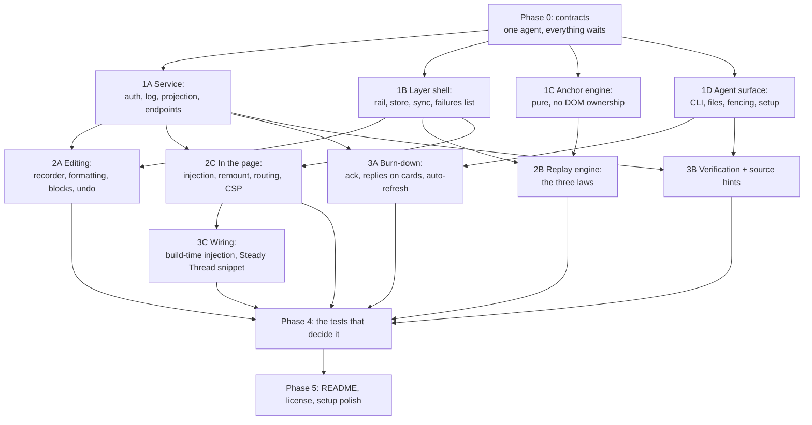

# Plan: Live Agentic HTML Editor

## Shape of the build

Six phases. Phase 0 is one agent and everything waits on it, because it pins the contracts every other
task reads and writes. Phases 1 through 3 fan out to parallel builders in their own worktrees. Phase 4
is the test suite that decides whether this shipped. Phase 5 is what makes it a public repository.

Two rules for every builder, because they are the rules this tool exists to enforce on itself:

- **A test that fails without the behavior, or the behavior is not done.** Every reliability law in the
  brief has one. That is the acceptance bar, not a coverage number.
- **Nothing silently swallowed.** A failure surfaces in the page, per R69 (the page is the channel back
  to the reviewer). A builder that catches an error and moves on has written a bug.

## Phase 0: Contracts

One agent. Nothing else starts until this lands, and everything else reads it rather than inventing.

::: callout-req
**Task 0.1: Pin the shapes.** The item record and every field in it, per D4. The event envelope with its
client-minted id. The wire protocol: routes, methods, required headers, and error shapes. The review
file formats, both of them, including the fencing and the standing header from D10. The state directory
layout. Write it as one reference document in the repo plus the shared constants module both the service
and the layer import, so there is one definition and not two that drift.
:::

Done when: a builder can implement either side of any boundary from this document alone, and the
constants module is the only place a field name is spelled.

## Phase 1: The four foundations, in parallel

### Task 1A: The service

::: callout-req
Node, zero runtime dependencies. Ephemeral port, token and port recorded in an owner-only file, state
directory outside any checkout. Every route requires the token in a header compared in constant time,
requires a JSON content type and a custom header so no simple request reaches a handler, and checks the
origin against a server-side allowlist recorded when the reviewer attaches. Append-only event log,
projection read on start, no compaction. Serving a local HTML file with the layer injected. The endpoints
Phase 0 pinned, including the stream the layer listens on for lifecycle changes.
:::

Tests that must fail without it: a cross-origin POST without a token is refused; with a token but an
unallowed origin is refused; a simple content type never reaches a handler; two events with the same id
apply once; a killed and restarted service serves the same projection; the port is not a constant.

### Task 1B: The layer shell

::: callout-req
The overlay in an isolated root that host CSS cannot reach and that reaches nothing in the host. The rail
as a **fixed overlay that never shifts the host page**, collapsible, per D12. Comment creation on selected
text and on a modifier click, never on a plain click. The item store writing synchronously on every change,
keyed by canonical target path. The sync client that retries forever, never blocks, and tells policy
refusal apart from service-down. The persistent failures list. Copy and export with no service running.
The overall note as an item.
:::

The law this task owns: **the rail updates in place and a card holding focus is never re-created.** This
is the single largest in-page revert mechanism in the tool being replaced, and it is one careless render
loop away from being rebuilt.

Tests: type half a comment, force a repaint, the half-comment survives. Kill the service mid-session,
everything still captured, copy produces the full set. Two files with the same basename in different
folders do not share a store.

### Task 1C: The anchor engine

::: callout-req
Pure functions over a document, no ownership of the DOM and no UI. Turn a selection or an element into a
region reference carrying its independent locators. Re-resolve a reference in a changed document and
**return a confidence**, because D3's Law 1 is a caller decision and this task supplies the number it is
made from. Whitespace-tolerant matching, occurrence disambiguation by surrounding context, honest failure.
:::

This is new work, not a port. The built-doc module's version is four exact substring probes with no
whitespace tolerance and no disambiguation, so it binds a short prefix to the first hit.

Tests: survives edits elsewhere; survives reformatting and rewrapping; picks the right occurrence among
repeats; reports failure rather than guessing when the subject is gone; two neighboring regions never
resolve to the same node in one pass.

### Task 1D: The agent surface

::: callout-req
Four commands: `open`, `next`, `ack`, `setup`. The two review files, written per review and not per
target, at the server-side review root, through an exclusively created temp name and a rename, refusing
a symlinked destination, with names derived from a hash and a restricted slug and never from untrusted
text. The fencing and standing header from D10, with reviewer-authored and document-derived fields
classified and `before` bounded. `setup` writing agent instructions between sentinels, replacing only
what is between them, and reporting rather than touching a file that mentions the tool without them.
:::

Tests: a target string containing traversal or encoded segments cannot move the write; a pre-planted
symlink at the destination is refused; a fenced field containing the delimiter is escaped; re-running
setup twice leaves one block and preserves text outside the sentinels; `next` returns outstanding items
with no service connection held open.

## Phase 2: The three hard parts, in parallel

### Task 2A: Editing

::: callout-req
No edit mode; the page is editable from the moment the layer loads. Ordinary typing, bold, italic, links,
bulleted and numbered lists. Images resized, moved keeping their rendered size, and pasted with the
allowed types only. Blocks deleted and reordered, a deletion recorded as a deletion. Every change becomes
a record with a kind, plain text, cleaned markup when formatting changed, and landing anchors for a move.
**Per-item undo that reverts the record and lets replay redraw**, since native undo does not survive
replay rewriting a region.

Nothing the layer adds may appear in a quote, a before, an after, or any field handed to the agent.
:::

Tests: a formatting-only change is a change; a deletion is a deletion and not an empty edit; undoing one
edit leaves the others untouched; two edits to neighboring blocks stay two records; the layer's own
markup never appears in a payload.

### Task 2B: Replay

::: callout-req
Re-apply outstanding edits after a repaint, under D3's three laws, with the confidence number from 1C:

- **Law 1, fail closed.** Below the confidence floor nothing is written to the DOM. The record keeps its
  text and the item's card says it cannot be placed on this version of the page. One reference binds to
  at most one node per pass, greedily in document order.
- **Law 2, never disturb the reviewer.** A region whose DOM already equals the record is skipped, which
  is what makes replay idempotent. A region holding the caret or the selection is never rewritten.
- **Law 3, a source repaint is not an app repaint.** A source repaint replays and marks genuine
  disagreements as collisions with the incoming version offered on the card. An app repaint replays only
  where the DOM still matches what replay last wrote, and otherwise detaches the edit with its text intact
  and says the page moved on.
:::

This task is the one most able to produce a worse version of the bug the tool exists to kill. Steady
Thread has a Turbo frame polling every two seconds, so Law 2 is not theoretical.

Tests: type into a region, fire a repaint every 200ms, the caret never moves and the text is never
disturbed; a low-confidence document writes nothing and says so; replay twice equals replay once; an app
repaint that changes a region's data detaches rather than stamping; a source repaint that changes the same
region raises a collision.

### Task 2C: Living in the page

::: callout-req
The layer loads from a script tag and never fetches itself from the service at page load. The overlay root
is re-created on `turbo:morph`, `turbo:load`, `popstate`, and a MutationObserver fallback, **with every
handler de-registered before re-registration**, and replay runs after each remount. Client-side navigation
is detected by hooking history and framework events, so the target follows the route. CSP refusal of the
script or of the loopback connection is detected and named as a policy refusal, distinct from
service-down. `setup` emits framework-correct guarded snippets, with the guard outside the script tag in
the host template's own conditional.
:::

The Steady Thread layer leaks a listener pair on every morph; do not inherit that shape.

Tests: a hundred simulated morphs leave one set of handlers and a working layer; a client-side route change
moves the target without a page load; a CSP that blocks the connection produces a named policy refusal in
the failures list; a stopped service leaves the layer fully functional.

## Phase 3: Closing the loop, in parallel

### Task 3A: The burn-down and the return channel

::: callout-req
Per-item ack processing: applied with the files touched, or declined with a reason, anything unnamed stays
outstanding. Applied items lose their highlight, leave the active list, and move to a completed list that
keeps them. **Agent replies attached to an item and rendered on its card**, per R68, so a reviewer never
goes to a terminal to find out what happened. Auto-refresh when the agent lands a change, with acks
processed before replay so an applied item is retired before the repaint it caused. A stale ack is refused;
a forged one cannot pass Phase 1A's auth.
:::

Tests: an ack naming three of five items clears three and leaves two; a declined item stays visible with
its reason; an item edited after delivery is outstanding again and the ack applies to the delivered
version; a completed item is still readable at the end of a session; the burn-down cannot be emptied by an
ack for something never delivered.

### Task 3B: Verification and source hints

::: callout-req
Every target carries a source hint: for a built document, the file it is generated from; for a route, the
project root. Setup asks once per project. Both review files carry it and the agent instructions say to
edit the generator's input and name what was edited. Verification then checks the reviewer's wording
against the files the ack named, constrained to the project root, **matching on normalized text** because
the reviewer's wording is a rendering of the source and will not appear verbatim in a template. A miss
warns loudly on the item and does not reopen it.
:::

Tests: an agent that edits the built HTML instead of its source is caught; a match through an ERB
template is not a false miss; a path outside the project root is a verification failure, not a read; a
deletion is verified by absence.

### Task 3C: Wiring it into the real workflows

::: callout-req
Build-time injection of the layer into feature-forge and research-report documents, the way the comment
module is injected today. The guarded snippet for the Steady Thread development layout. Both are the same
layer with no per-surface variation.
:::

Tests: a built brief carries the layer and renders identically without the service running; the Steady
Thread snippet is inert outside development.

## Phase 4: The tests that decide it

::: callout-req
The browser suite against a real browser, which is the thing the tool being replaced does not have and the
reason every symptom Ken hit went unnoticed. Plus the end-to-end that is the actual acceptance bar.
:::

## Phase 5: A public repository

::: callout-req
README that a stranger follows without help: what it is, the two-line install, the three ways the layer
gets into a page, and the honest statement of what v1 does not do. MIT license with human-review credited
as prior art. The state directory and review file patterns in the shipped ignore file.
:::

## Acceptance criteria

Judged by evaluators who did not build the code, on the running tool, as user stories rather than unit
assertions.

::: callout-metric
**AC1, the brief.** Ken opens a built brief, fixes three sentences by typing, comments on a diagram,
writes an overall note, and sends with no agent running. An agent started afterwards receives all five
items, edits the **markdown source** rather than the built HTML, and acks. The items clear from Ken's
page and appear in his completed list without him touching anything.

**AC2, the running app.** Ken attaches to the Steady Thread dev server, walks three screens behind the
login, comments on two and types a fix on a third, uses the app for real in between by clicking a button
that navigates, and sends the whole walk as one batch naming all three routes.

**AC3, nothing is taken back.** In the middle of typing, each of these happens and Ken loses nothing: a
browser reload, the service killed and restarted, the app re-rendering the block he is typing in, and an
agent rewriting the source underneath him. The Turbo-frame case is explicit: with a frame polling every
two seconds, his cursor never moves and his text is never disturbed.

**AC4, send always works.** Send is available whenever anything is outstanding, with no agent ever
running. He sends, adds one more note, and sends again, and both reach the agent.

**AC5, the agent talks back in the page.** An agent that cannot apply an item says so on that item's
card, in words Ken reads without leaving the page. An edit replay cannot place says so on its card with
its text intact. Neither is a silent clear and neither requires a terminal.

**AC6, the artifact is untouched.** A built brief reviewed and sent looks pixel-identical to the same
brief opened without the tool. No injected stylesheet, no shifted layout, no style attribute on any
reviewed element.

**AC7, it cannot be driven from outside.** A page on another origin can neither write an item, nor read
the feedback set, nor forge an ack.

**AC8, a stranger can run it.** A clone plus the setup command produces a working review on a machine
that has never run it, with the agent instructions installed for the agent that machine actually uses.
:::

## Test list

| Area | Test |
| --- | --- |
| Durability | Reload mid-keystroke loses nothing |
| Durability | Service killed mid-session loses nothing; sync drains on return |
| Durability | Copy and export produce the full set with no service |
| Durability | Two same-named files in different folders keep separate stores |
| Replay | Idempotent by comparison |
| Replay | Caret and selection never disturbed, including under a 2s repaint |
| Replay | Low-confidence match writes nothing and says so |
| Replay | App repaint detaches; source repaint collides |
| Anchoring | Survives edits elsewhere, reformatting, rewrapping |
| Anchoring | Picks the right occurrence among repeats |
| Anchoring | Honest failure, carried into the payload |
| Identity | Neighboring regions never merge |
| Identity | Identity survives a repaint and a move |
| Editing | Formatting-only change is a change |
| Editing | Deletion is a deletion |
| Editing | Per-item undo leaves other edits untouched |
| Editing | Layer markup never appears in a payload |
| Rail | A focused card is never re-created |
| Rail | Failures persist until dismissed |
| Send | Available whenever anything is outstanding, no agent needed |
| Send | Note-only send works, and a second send after it works |
| Send | Send flushes anything in flight first |
| Protocol | Per-item ack; unnamed items stay outstanding |
| Protocol | Stale ack refused; forged ack refused |
| Protocol | Delivered items re-offered until acked |
| Protocol | Browser and service reconcile with lifecycle winning |
| Return channel | Agent reply renders on the item's card |
| Verification | Editing the artifact instead of the source is caught |
| Verification | A template match is not a false miss |
| Security | Cross-origin write refused without token and allowed origin |
| Security | Simple content type never reaches a handler |
| Security | Traversal and symlink writes refused |
| Security | Fenced fields escape a delimiter collision |
| Security | Setup preserves text outside its sentinels |
| In the page | 100 morphs leave one handler set |
| In the page | Client-side route change moves the target |
| In the page | CSP refusal is named, not reported as service-down |
| Non-interference | Reviewed page renders identically with the layer present |
| End to end | AC1 and AC2 walked in a real browser |

## Open Questions

::: callout-question
**Q1: Does a review need a name, or is one review per project enough?** D1 makes a review span many
targets, which raises whether Ken reviewing two features in one day wants them separated. One review per
project per session is the simplest answer and is probably right, but it decides how `next` picks what
to return.
:::
