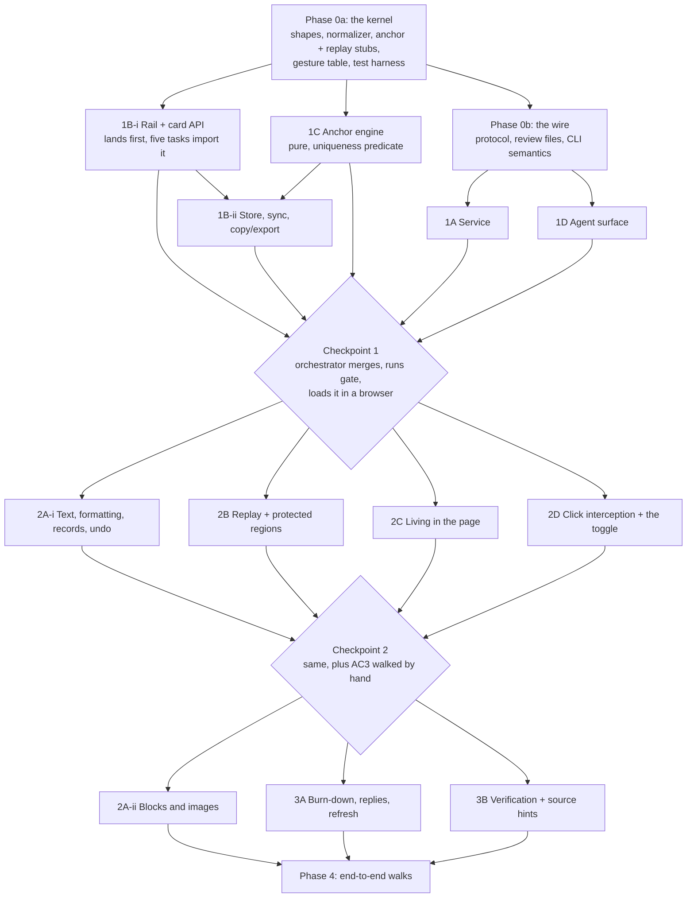

# Plan: Live Agentic HTML Editor

## Shape of the build

Four reviews reshaped this plan, and the reshaping is mostly one lesson: **the expensive part is never
the feature surface, it is the seams between parallel builders.** The tool being replaced took 45
commits over two and a half weeks and its cost was concentrated in cross-cutting integration, not in any
one subsystem. So Phase 0 grew from a document into a working kernel, every task now names the files it
owns, and there are budgeted integration checkpoints between phases rather than one merge day.

The sharpest example of why: four separate tasks need to normalize text. The recorder mints a record's
plain text, replay compares DOM to record to decide "already equal, skip", verification matches against
source, and the anchor engine does whitespace-tolerant matching. If replay's comparison normalizes even
slightly differently from the recorder's minting, no region ever compares equal, replay rewrites every
region on every pass, and the caret fights the reviewer. **Parallelizing this work is itself capable of
manufacturing the exact bug the tool exists to kill.** One normalizer, in Phase 0, imported by all four.

Two rules for every builder, and one of them is now a deliverable rather than a hope:

- **A test that fails without the behavior.** Not asserted, demonstrated: the builder pastes the test
  failing against a one-line deliberate revert, with the output, into their progress file. Stating this
  rule without enforcing it is what the tool being replaced did with its "never rewrite the document"
  prompt, and it is why that rule never held.
- **No jsdom** for anything in the layer, replay, the rail, editing, or anchoring. jsdom has no layout,
  no caret rects, no CSP enforcement, and no real key events, so every assertion that would catch the
  three symptoms is impossible in it. Real Chromium via the Phase 0 harness or the test does not count.

## Phase 0: The kernel

One agent, two commits. Everything else waits on 0a; 1A and 1D wait on 0b. This is the only gate, so
under-specifying it means four builders invent four versions of the same thing and the merge is the
disaster.

The repository skeleton, `npm run gate`, Playwright against Chromium, and `CLAUDE.md` already exist.

### Task 0a: The shared kernel

::: callout-req
**Shapes.** The item record with every field from architecture D4, including `rev`, `group`, the region
reference as named fields rather than prose, the lost-anchor state, and `reply`. The event envelope with
its client-minted id. The item lifecycle transition table naming which side may make each transition.

**The one normalizer**, plus cleaned-markup and canonical-target functions, with tests. Every later task
imports these and no task may define its own. This is the highest-value hour in the build.

**Stubbed signatures, committed, that later tasks fill in**: the anchor engine's mint and resolve, the
replay scheduler's entry point and the ordering of its callers, the item store's read and write, the
rail's card API (how any task attaches state, a badge, or an agent message to a card), the failures-list
API, a listener registry with a count so handler leaks are observable, the node marker identifying
tool-added DOM, and the caret and selection accessor. A stubbed anchor engine returns a fixed unique
match and a stubbed replay is a no-op, so downstream tasks compile against real signatures and the swap
is a one-line diff a reviewer can find.

**The layer file manifest**, one owner per file per phase, and how the layer is concatenated into the
single artifact `setup` copies into a host app.

**The gesture table**, complete: plain click places the cursor, Alt-click comments on an element,
Cmd-click follows a link, the editing toggle, send, escape, and what a Cmd-click over a link inside a
commentable block does.

**The region label rules**: the author-supplied attribute name, the fallback chain, that a label is
pinned at first touch and never recomputed, and that record identity is the region reference and never
the display label. Two paragraphs in different containers under one heading must produce two records;
that collision is a named shipped bug in the tool being replaced.

**The uniqueness predicate** from architecture D3 Law 1, expressed as a function contract, plus the
fixture corpus it is judged against: text and path unchanged (bind), rewrapped and reformatted (bind), a
sibling inserted above (bind), region text fully rewritten (no bind), region deleted (no bind), the same
paragraph duplicated (no bind, ambiguous).

**The formatting mechanism decision**, written down: `execCommand` with normalization on capture, given
Chromium-only, or manual range surgery. Two builders will otherwise guess differently.

**The write-epoch rule** so replay's own mutations do not retrigger the observer that schedules replay.
:::

### Task 0b: The wire and the files

::: callout-req
Routes, methods, required headers, error shapes. The session-minting exchange for a layer living in a
host page, what it is bound to, and what the layer does on a 401 mid-session. The two review file
formats including D10's fencing, the standing header, and the per-page source hint. The state directory
layout. `next` fully defined: flags, whether it blocks, keepalive, the terminal payload shapes, exit
codes, and what an agent is told on each.

**Who writes the review files**: a pure writer module owning the path-safety rules, imported and called
by the service's send handler. Not two owners.

**A no-op `verify()` stub** at its call site, so 3A writes the call and 3B fills it in and the collision
is one line.
:::

### Task 0c: The test harness

::: callout-req
Fixture pages every task shares: a static built-doc-shaped page, a page that re-renders itself on a
knob the test controls (both a Turbo-style frame swap and a React-style text-node replacement, with
interval and target subtree settable), and a page served with a real CSP header.

Helpers every task shares: `typeInto`, `forceRepaint`, `assertCaretUnmoved`, a replay-pass counter and
a regions-written counter the tests read, a MutationObserver capture over a subtree, service start and
`kill -9`, a second-origin attacker page server, and two browser contexts.

**No arbitrary sleeps.** Every wait is a condition poll or a counter read. A flaky browser test gets its
determinism fixed, never its assertion loosened, and the tool is never weakened to make a test pass.
:::

**Decisions closed here rather than carried:** a review is per project per session, and `next` returns
the most recent review with anything outstanding. A target whose source hint is unknown says so plainly
in both files rather than letting an agent confidently edit an artifact.

## Phase 1

**Task 1C, the anchor engine.** Pure functions, no DOM ownership, no UI. Mint a region reference; resolve
it in a changed document returning a unique match or an honest failure with a reason. Whitespace-tolerant
matching, context-based rival elimination, no scalar threshold. Judged against Phase 0's fixture corpus.
New work, not a port: the built-doc module's version is four exact substring probes that bind a short
prefix to the first hit.

**Task 1B-i, the rail.** Lands before anything in Phase 2 dispatches, because five tasks import its card
API. The overlay in an isolated root that host CSS cannot reach and that touches nothing in the host. A
fixed overlay that never shifts the host page, collapsible. Comment creation on selection and on
Alt-click, never on a plain click. The card API. The persistent failures list. The status line naming
where an edit on this target goes. The edit list by region. **The law this task owns: the rail updates
in place and a card holding focus is never re-created.**

**Task 1B-ii, the store and the wire home.** Synchronous write on every change, keyed by canonical target
and partitioned per target. Reconciliation on load and reconnect, lifecycle winning per `rev`. Second-tab
refusal with a reason. The sync client: retries forever, never blocks, tells policy refusal from
service-down. Copy and export with no service, scoped honestly to what this origin holds. The overall
note as an item.

**Task 1A, the service.** Zero runtime dependencies. Persistent run token in an owner-only file,
ephemeral port, per-target HttpOnly credential for served documents, origin allowlist, forced preflight.
Append-only log, projection on start, no compaction. Serving a local HTML file with the layer injected.
The lifecycle stream. Second-instance refusal with an instruction.

**Task 1D, the agent surface.** `open`, `next`, `ack`, `setup`. The review file writer with hashed names,
temp-and-rename, symlink refusal, and the fencing. `setup` writing agent instructions between sentinels,
replacing only what is between them, and reporting rather than touching a file that mentions the tool
without them. `setup` owns the command outright; 2C supplies snippet content as data.

## Phase 2

**Task 2B, replay and protected regions.** The highest-risk task in the build. Protection of the actively
edited region including the Turbo veto, commit on blur, and replay of committed records under D3: the
uniqueness predicate, the three-way comparison against the record, atomic groups, and the undo exemption.

**Task 2A-i, text and records.** Typing, formatting per Phase 0's decision, the record kinds, cleaned
markup, per-item undo as a record operation, the `compositionend` deferral, spellcheck and autocorrect
off, and the rule that no layer markup ever reaches a payload.

**Task 2C, living in the page.** The layer loads from the host app's own assets and never from the
service. Overlay root re-created on `turbo:morph`, `turbo:load`, `popstate`, and a MutationObserver, with
every handler de-registered through the registry before re-registration. Client-side route detection. CSP
refusal named distinctly from service-down. Snippet content, guarded outside the script tag, per
framework.

**Task 2D, using the page for real.** Plain click does not navigate, submit, or fire the page's handlers.
The editing toggle restores an ordinary page. Cmd-click follows a link. The hover hint. This is half of
the submission symptom and it had no owner until the EM review.

## Phase 3

**Task 3A, the burn-down and the return channel.** Per-item ack, applied and declined, unnamed items stay
outstanding. Applied items lose their highlight and move to Completed. Agent replies rendered on cards.
Auto-refresh with acks processed first, and honestly: in a host page the source write arrives as a morph
seconds before the ack, so a provisional collision may show and then clear when the ack explains it.

**Task 3B, verification and source hints.** Source hint per target. Three verdicts: found, not found, and
not verifiable. Authoritative for built docs where the reviewer's prose is literal in the markdown;
advisory for routes, where an interpolated template can never match literally. A miss warns and never
reopens.

**Task 2A-ii, blocks and images.** Delete and reorder with landing anchors, resize and move. Image paste
is cut.

## Not in this build

**Wiring into feature-forge, research-report, and Steady Thread.** It writes into two other repositories,
so it cannot run in this repo's worktree fan-out, and it collides with a decision already made: the
built-doc comment module stays for v1, so injecting this layer into the same builds puts two review
layers in every brief, both intercepting selection and both drawing a rail. It ships separately, after
Phase 4's non-interference test, with its own rows on the target repos' boards. Everything in the
acceptance criteria is reachable through `open` and a hand-added snippet.

## The cut line

If the day runs out, this is a coherent tool and it is the order to protect: Phase 0, 1C, 1B-i, 1B-ii,
1A, 1D, 2A-i, 2B, 2D, and the ack half of 3A. That gives: open a built brief, comment, type fixes, use
the page, lose nothing across a reload or a killed service, copy and export with nothing running, send
with no agent, an agent that reads the files, and items that retire instead of re-shipping forever.

Cut cleanly: 2A-ii, 2C, 3B, and 3A's refresh and replies. **Do not half-ship these:** 2A-i without 2B,
because typed edits vanish on the first repaint; 2C without 2B's protected regions, because attaching to
a page with a two-second poll without them is the bug; 3B without 3A, because verification hangs off the
ack path; and `setup` without its sentinel logic, because it writes agent instruction files.

## Acceptance criteria

Judged by evaluators who did not build the code, on the running tool. Each names what failure looks like,
because a walk with no failure line gets a generous pass.

::: callout-metric
**AC1, the brief.** Ken opens a built brief through `open`, fixes three sentences by typing, comments on
a diagram, writes an overall note, and sends with no agent running. An agent started afterwards receives
all five items and edits the markdown source. *Fails if:* an agent that edits the built HTML instead of
its source does not produce a loud warning on the item.

**AC2, the running app.** Ken attaches to a dev server, walks three screens behind a login, comments on
two, types a fix on a third, and uses the app for real in between by clicking a button that navigates.
Sends the whole walk as one batch naming all three routes. *Fails if:* a plain click on that same button
navigates.

**AC3, nothing is taken back.** Loses nothing means: item count identical, every item's text
byte-identical, no item changed state, and the caret assertion held. Tested against a browser reload, a
`kill -9` of the service, the app re-rendering the block he is typing in, and an agent rewriting the
source, the last one run twice, once in a region he is typing in and once in a region he is not.

**AC4, send always works.** Send is available whenever anything is outstanding with no agent ever
running. Assert the button's enabled state and label at each step: fresh, note-only, after a send, after
adding one more note, after a second send.

**AC5, the agent talks back in the page.** An agent that cannot apply an item says so on that item's card.
An edit replay cannot place says so with its text intact. *Fails if:* either item clears silently.

**AC6, the artifact is untouched.** Screenshot diff at two widths with the rail open and collapsed, zero
diff outside the rail's bounds; `scrollHeight` and every host block's rect identical with and without the
layer; zero host elements carrying a `style` attribute or a layer class after a session that created a
list and a link on a page with a CSS reset.

**AC7, it cannot be driven from outside.** From a real second origin in a real browser: no item written,
no feedback read, no ack forged. Judged on effect, the event log has no new entries and the review files
are unchanged, not on a status code. Same-origin access is a stated v1 non-goal and is not tested here.

**AC8, a stranger can run it.** A clone plus setup produces a working review under a fresh user account
with no state directory and no existing agent instruction files.
:::

## Tests, ranked

Each row names the task that ships it. The top six are written first because each maps to a symptom Ken
actually hit. Thirty-eight rows against a real browser harness is more than a day of test writing on its
own, so the ranking is the plan, not a preference.

| # | Test | Task |
| --- | --- | --- |
| 1 | Caret survives: type ten characters one per 50ms into a paragraph while the fixture repaints every 200ms; the paragraph reads exactly as before with the ten inserted contiguously; the replay-pass counter incremented at least five times | 2B |
| 2 | Send enablement walked through the UI with real clicks, asserting `disabled` and label at every step, with no agent ever; plus a static assertion that agent presence is not among the enablement expression's inputs | 1B-i |
| 3 | An agent rewrites the source touching one region; all five outstanding items across four regions survive byte-identical and unchanged in state, exactly one marked; run again with the service down | 2B |
| 4 | Reload and `kill -9` durability, asserting synchronously in the same task as the final keystroke, with no awaited timer between | 1B-ii |
| 5 | Fail-closed paired with positive placement: three naturally low-confidence fixtures write nothing (zero MutationObserver records) and three above the line place correctly; plus an ordering assertion rather than exact scores | 1C, 2B |
| 6 | Cross-origin write and forged ack from a real second origin, asserted on effect; plus a fenced field containing the delimiter is escaped | 1A, 1D |
| 7 | Copy and export with no service running | 1B-ii |
| 8 | Acks processed before replay: agent acks and rewrites in one motion, the item is in Completed, no collision raised | 3A |
| 9 | Verification both directions: an ack with no file change warns; a template region reports not verifiable; a literal markdown match passes; a deletion verified by absence | 3B |
| 10 | Anchoring against a mechanically generated transformation set, named per transformation, targeting occurrence four of five and re-resolving after occurrence two is deleted | 1C |
| 11 | Two neighboring regions never merge into one record, resolved in both orders | 1C, 2A-i |
| 12 | A focused card is never re-created: node identity by reference, `activeElement`, and the behavioral version typing through 20 repaints | 1B-i |
| 13 | Replay idempotence asserted as no second write via MutationObserver, not final-DOM equality | 2B |
| 14 | Cross-region gesture decomposes into per-region records applied atomically | 2A-i, 2B |
| 15 | Undo reverts one record, redraws with the caret in the region, leaves other edits untouched | 2A-i, 2B |
| 16 | Plain click does not navigate or submit; Cmd-click does; the toggle restores an ordinary page | 2D |
| 17 | Target identity converges: symlinked path, trailing slash, and both loopback spellings reach one review | 1A |
| 18 | Two browser contexts on one target: the second is refused with a reason | 1B-ii, 1A |
| 19 | No truncation of `after` through a 200KB item and a 300-item batch round-tripped through the CLI; `before` bounded with its marker in the same test | 1D |
| 20 | 100 morphs: the listener registry count is unchanged, one overlay root, one gesture produces one item, one keystroke one record | 2C |
| 21 | CSP refusal from a real header is named distinctly from service-down | 2C |
| 22 | Failures persist through a remount, a route change, and a replay pass | 1B-i |
| 23 | Traversal and symlink writes refused; setup preserves text outside its sentinels | 1D |
| 24 | Non-interference per AC6's three assertions | 2A-i, 1B-i |
| 25 | An item reworded after delivery survives an ack naming the older `rev` | 1B-ii, 1A |
| 26 | Blocks delete and reorder with landing anchors through the wire; images keep rendered size on move | 2A-ii |
| 27 | A dropped desktop file does not navigate the page and does not reach disk | 2A-ii |
| 28 | The printed setup invocation actually runs | 1D |
| 29 | End-to-end walks of AC1 and AC2 | Phase 4 |

## Open questions

None blocking. Both prior open questions were closed in Phase 0.
