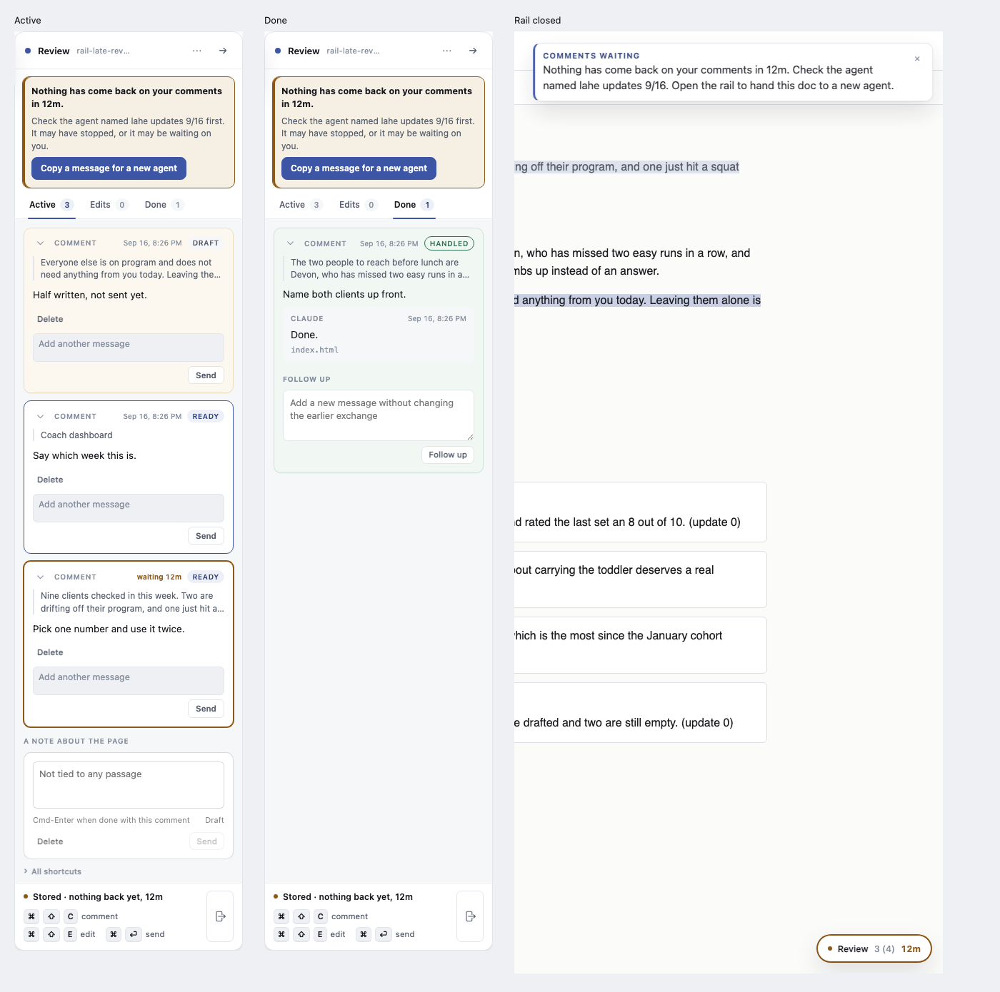
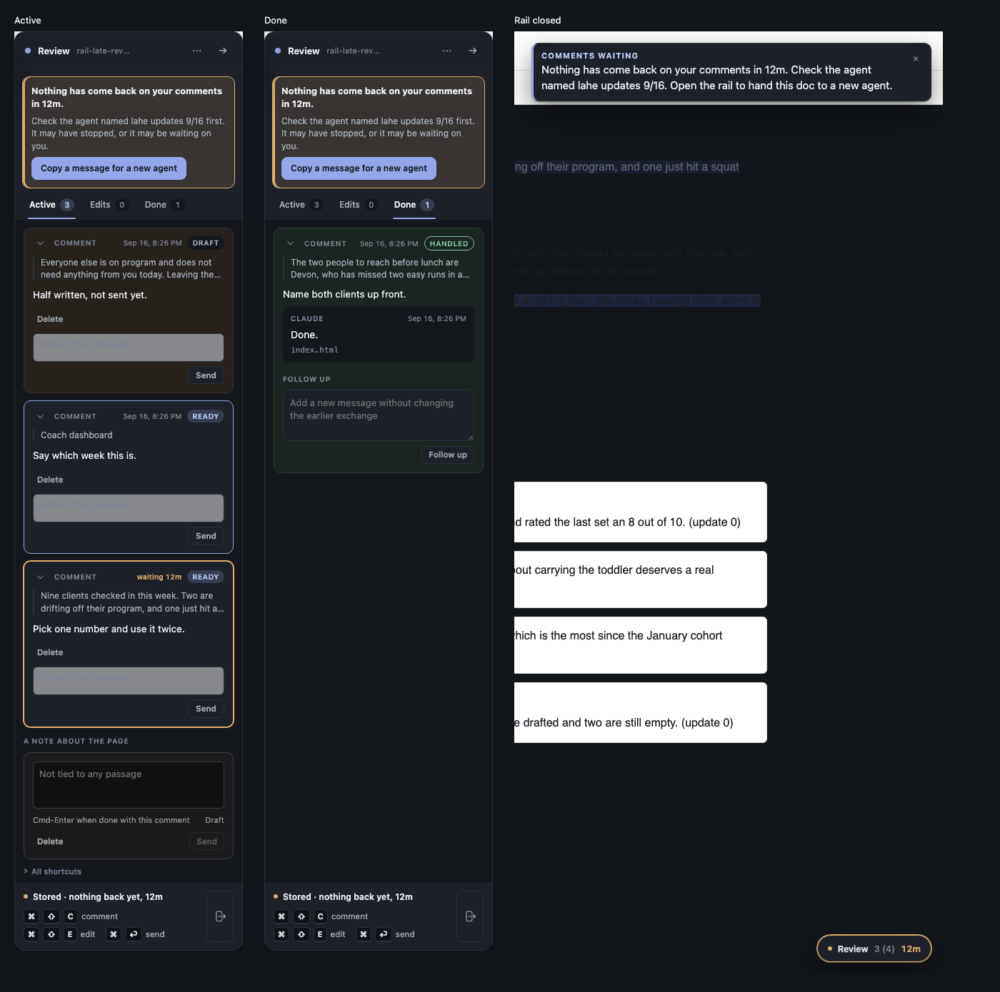

# Make it obvious when nobody is picking up your comments

Ken, 2026-09-16, looking at the rail's footer line "Stored · nobody has picked this up, 10m": "this is great, but it should be more prominent. active boxes should change color if they haven't been picked up after a certain amount of time. something with more prominence should tell you to go check your agent or assign a new one to this doc."

A whetstone-size change to the rail. Progress is at the bottom.

## What you will see

- **A comment card that has waited too long changes color.** Today every waiting card in the Active tab looks the same whether it was sent five seconds ago or an hour ago, and that color is green, signifying success. After the wait passes the limit below, that card turns amber, and it says how long it has waited.
- **A banner at the top of the rail**, not the small line at the bottom, once anything has waited past the limit. It says, in plain words, that nobody has picked up your comments, for how long, and gives two things to do:
  - **Check your agent.** The words say to look at the agent's window, because that is usually the fix.
  - **Hand this doc to a new agent.** A button copies a short message you paste into a fresh agent. The message tells that agent to take over this LAHE session and work the comments that are waiting. It uses the takeover command the tool already has.
- **When the rail is closed to its small pill**, the pill itself turns amber and shows how long things have waited. Hovering it gives the same sentence as the banner, including the agent's name. Clicking it opens the rail, where the banner is.
- **A pop-up notice, once.** The moment something first goes late, the rail shows one of its usual pop-up notices with the same message, whether the rail is open or closed. Dismissing it means it does not come back for that same wait; a new wait later gets a new one.
- The small line at the bottom stays as it is.
- When a reply lands, the card goes back to its normal color and the banner goes away on its own.

## Session names

Ken runs many agents at once, and a LAHE session id like `s_9a3835ce54bc9e66` does not tell him which window to go check. Claude Code tells the agent the human's name for its session when he uses `/rename`. So:

- A LAHE session can carry a name. The agent sets it when it starts a review, and updates it if the session is renamed.
- `lahe session list` shows the name beside the id.
- The banner says "Check the agent named lahe updates 9/16" instead of just "check your agent", and the handoff message names it too.
- With no name, everything reads as it does today. Hosts that never tell the agent a name just show no name.

## What it looks like

Built and passing its tests; not merged yet. Left to right: the Active tab with the banner naming the agent, then a draft, a sent card still within its time, and a late card; the Done tab with a handled card; and the page with the rail closed, showing the one pop-up notice and the late pill.

What changed from the first pass, because of your comments:

- A sent card that is still within its time is now plain, with a blue outline. Green only means handled.
- A late card has no tint at all, just a strong amber outline and "waiting 12m", so it cannot be mistaken for a draft.
- The banner, the pop-up, and the closed pill all name the agent when the session has a name.
- The garbled comment box in the first screenshot was the test page, not the real rail. These pictures come from the real rail on a real page.

One thing the pictures show that this change did not cause: in dark mode, the "Add another message" boxes are light grey with unreadable text. That is an existing styling bug; it is a separate small fix.

## The limits, decided

The rail already has two limits and this change uses them rather than inventing new ones:

- **No agent listening at all:** the card and banner go amber after 30 seconds. There is nobody to wait for.
- **An agent is listening but nothing has come back:** amber after 10 minutes.
- **An agent is working on it:** never amber. A long queue behind a working agent is explained.

Say if you want different numbers; they live in one place.

## Tests

Written first. Unit tests for the rule that decides amber (each of the three cases above, and the reset when a reply lands) and for the handoff message (it names the session and the takeover command, and it is plain text with no token in it). One browser spec, run by name only, that a card past the limit carries the amber state and the banner shows with the copy button; the full browser suite runs once at merge.

## Files

The rail's drawing code and its styles (`src/layer/overlay.js`, `src/layer/tab_active.js`), the words in `src/shared/protocol.js` beside the existing wait wording, and their tests. The contract text says the rail "offers them a button to export their feedback and take it to another agent" after ten minutes; check that such a button actually exists today. If it does not, the new handoff button is it, and the contract sentence stays true. If it does, keep one button, not two.

## Progress

- 2026-09-16 20:02: spec written, builder dispatched.
- 2026-09-16 20:14: first pass came back with tests green. Sent back for Ken's edit (waiting cards should not be green), an amber that does not blur with drafts, a comment box drawn without styles in the screenshot, and session names in the banner. Ken approved the spec.
- 2026-09-16 20:05: builder read the spec, found no existing handoff or export button in the escalation (only the menu's Copy review and Export review, and a hover sentence pointing at them), so the new button is the one the contract sentence describes. Unit tests written and red.
- 2026-09-16 20:20: one overdue rule now lives in protocol.js (AGENT_LIVENESS.overdue); the footer, the card color and the banner all read it. The helper sends takeover_command (state dir included, no token) so the page can name the session. Unit tests green, gate:unit passes.
- 2026-09-16 20:30: rail draws late cards amber with "waiting 12m" in the head (it replaces the timestamp, which pushed the state chip off the card), and the banner under the head with the copy button. Browser spec test/browser/rail_agent_liveness.spec.js passes on Chromium. Not merged, not pushed.
- 2026-09-16 20:45: builder took Ken's spec edit and the Session names section onto the branch. Working the colors first: ready is not green, overdue is not draft-colored, and the screenshot comes from the real booted layer.
- 2026-09-16 20:50: colors. Ready is the plain card with the accent border, green is handled only, late is a strong amber border plus the wait label with no wash, so it cannot pass for a draft. The garbled composer in the first screenshot was the rail harness (it hosts a bare comment box in the card and never closes it), not a bug on main; screenshots now come from the real booted layer. rail_design.spec.js's green-ready assertions updated but not run here.
- 2026-09-16 21:05: unit tests written for session names, the late pill and the one-toast rule; red.
- 2026-09-16 21:16: sessions carry a name (review --name, takeover --name, session name), list shows it, the page gets session_name. The banner, footer hover and handoff message name the agent; the collapsed pill goes amber with the wait; one toast per crossing. Unit tests green, gate:unit passes.
- 2026-09-16 21:31: browser spec covers the closed rail (late pill, one notice, back to normal after a reply) and a name written as markup drawn as text; it caught the banner not repainting its check line. Agent docs (AGENTS.next.md, SKILL.md) tell agents to pass --name. gate:unit and rail_agent_liveness.spec.js pass. Screenshots in light and dark from the real booted layer. Not merged, not pushed.
- 2026-09-16 21:55: review round. The notice is raised only on the crossing, keyed on review, the helper's oldest waiting item and its wait-start, and remembered in sessionStorage; names fill in literally ($& stays $&); cleanName strips zero-width, separator and direction-override characters; the page gets session_id and state_dir_flag_needed instead of a command with a path; lahe review --name only names a session it made or was handed; one status repaint reads the line once. Rebased onto main. gate:unit and rail_agent_liveness.spec.js pass.
- 2026-09-16 20:46: merged to main and pushed. Full test run green after two older browser tests were updated to the new rule that a sent card is plain, not green. Helper restarted on the new code. This session is now named "lahe updates 9/16" with the new command, so its banner names it.
