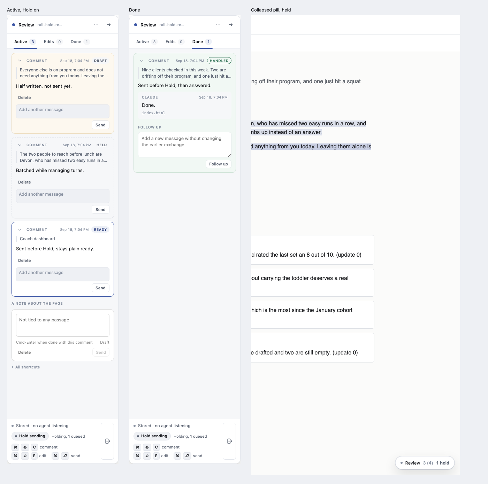
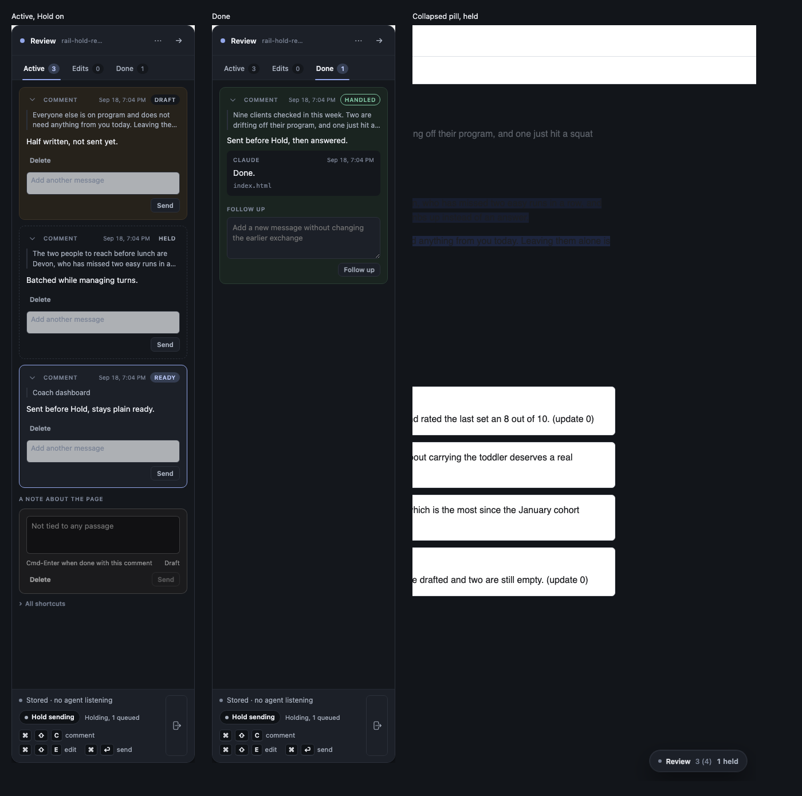

# Hold: queue several comments, release them to the agent at once

Whetstone-size. Ken, 2026-09-17: "we should probably put in a feature to hold
sending to the agent, so that i can leave a bunch of comments and then let the
agent get them all at once. it's needed at times like now when i'm at my
budget and actively managing turns."

## Problem

Every comment and edit reaches the agent the moment it is committed (Cmd-Enter).
That is right most of the time, but not when Ken is burning through his own
turn budget: five separate comments mean five separate wakes, and each wake is
a turn he is spending on purpose. He wants to leave a batch and choose when the
agent sees any of it.

## Requirements

1. A toggle in the rail turns Hold on and off, per review. While on, Cmd-Enter
   still commits a comment or edit to state `ready`, durably, in the browser,
   exactly as today. Nothing about the item lifecycle changes (see
   `docs/diagrams/item_lifecycle.md`): Hold gates delivery, not state.
2. While Hold is on, a newly-ready item's `item.ready` event is never posted to
   the helper. It queues in the browser's outbox exactly as it does today
   (`store.js` `queueEvent`), but `sync.js`'s flush never sends it while held.
3. Turning Hold off flushes the queue immediately, in one pass, no confirm
   dialog. The helper receives everything at once and the agent's next drain
   sees it all.
4. Because a held item never reaches the helper, it must not appear in
   `review.json`, must not fire a wake line, and must not affect tonight's
   agent-liveness overdue clock (`protocol.AGENT_LIVENESS`, entirely
   helper-side, starts a wait only on an item it has received). Proven by a
   test, not asserted.
5. The toggle shows a live count while on. At zero queued it reads
   "Holding — nothing sends until you release", not a bare "Holding, 0
   queued": a zero-count label that only makes sense once something has been
   typed reads as broken the moment Hold is turned on. Past zero it reads
   "Holding, 3 queued".
6. Ending the review force-flushes anything still held, with no confirm
   dialog. Nothing queued is silently lost, matching the existing rule that
   ending a review discards nothing, and matching this rail's existing rule
   that nothing here uses `window.confirm`.
7. Hold persists across a page reload (stored the same way the rest of review
   state is), so a reload mid-burst does not silently flush everything.
8. Per-review, not global. Only the holder tab may create items today (the
   refused-window model), so Hold needs no new multi-tab handling.
9. Turning Hold on suppresses everything currently in the review's outbox,
   not only items committed after the toggle: the outbox does not distinguish
   "queued because held" from "queued because the helper was briefly
   unreachable and this is a retry", and this spec does not add that
   distinction. Simpler rule, one meaning: while held, nothing in this
   review's outbox goes out. An item already mid-flight when Hold is turned
   on (a request already sent, awaiting a response) is not cancelled; it is
   allowed to finish normally.
10. The collapsed rail's pill (built tonight for the overdue state) also
    shows Hold: while held with items queued, the pill reads a neutral
    "3 held", visually distinct from its amber "waiting" state. The rail's
    own footer toggle is not the only surface a reviewer sees; someone
    "actively managing turns" is watching the page they are annotating, not
    necessarily an open rail, so the thing most likely to stay visible needs
    to carry the state too.
11. The toggle carries a real accessible name and pressed state
    (`aria-pressed` or `role="switch"`), and the live count is in an
    `aria-live` region, the same pattern the overdue banner already uses, so
    a screen-reader user is told the count changed without polling for it.

## Approach

No new state machine and no new wire event. This is a gate on an existing
call, not a new subsystem, which is why it fits at whetstone size:

- `store.js`: a `held` boolean per review, read and written through the same
  storage the rest of review state uses. `setHeld(reviewId, bool)`,
  `isHeld(reviewId)`.
- `sync.js`: `scheduleFlush` and `flush` (around lines 1726 and 1916) check
  `store.isHeld(reviewId)` before actually sending. Held: the event stays
  queued, nothing goes over the wire. Not held: unchanged today's behavior.
  Releasing Hold calls `flush({ immediate: true })` (the same call the
  existing `blur`/`ready`/`navigation`/`unload` immediate-flush paths use,
  see `protocol.FLUSH.IMMEDIATE_ON`).
- `overlay.js`: the toggle control and the held card's visual state. A held
  card is neutral, not a fourth color in the set that already means
  something (green is handled, warm cream is draft, amber is overdue): use
  the rail's existing neutral tokens (`--line` or `--line-soft` for a dashed
  border, `--surface` or `--sunken` for the wash) rather than inventing a
  new hue. `data-state='held'`. Read the amber/overdue work from tonight
  (`docs/features/20260916.04_unanswered_prominence/`) before touching any
  card CSS so the two states never collide.
- The toggle sits in the rail's footer, next to the existing status line
  ("Stored · nothing back yet"), not in a new zone: that is already the
  rail's place for "state of the conversation with the agent", and Hold is
  exactly that.
- Toggle label: "Hold sending", not a bare "Hold", so the verb is
  unambiguous at a glance without reading further.
- The agent-liveness overdue clock needs no code change: it already only
  starts once the helper has the item, so a held item is invisible to it for
  free. The test in Requirement 4 is there to prove that stays true, not to
  add a new check.

Rejected: a fourth item-lifecycle state ("queued"). The item already IS ready,
durably, the moment Cmd-Enter fires; modeling Hold as a delivery gate rather
than a state keeps `item_lifecycle.md` and the contract's state vocabulary
untouched, and it is the smaller change.

## Tasks

1. `store.js`: `setHeld`/`isHeld`, persisted per review. Unit tests: set,
   read, survives a simulated reload (rehydrate a fresh store instance from
   the same backing).
2. `sync.js`: gate `scheduleFlush`/`flush` on `isHeld`. Unit tests: a queued
   event does not post while held; releasing Hold flushes immediately;
   an item committed while NOT held still posts on the existing debounce,
   unaffected.
3. `overlay.js`: the toggle (with live count) and the held card's distinct
   visual state, light and dark. Unit or browser test per the existing
   pattern for card state.
4. Integration: a held item does not appear in `review.json`, does not
   fire a wake line, and the overdue rule never marks it loud. One browser
   test exercising all three together.
5. End-of-review force-flush: ending a review with items still held posts
   them first. Test.
6. Screenshot of the toggle on, with a held card next to a ready card and a
   handled card, light and dark, per tonight's screenshot rule in `CLAUDE.md`.
7. Docs: one paragraph in the skill (`skills/lahe/SKILL.md`) and
   `docs/CONTRACTS.md` if the wire payload gains a field, saying Hold exists
   and that a held item is invisible to the agent until released.

## Acceptance criteria

- [x] Turning Hold on, leaving three comments, then off: the agent's drain
      sees all three at once, not as they were typed. (unit:
      `test/unit/hold_toggle.test.js`, "releasing hold flushes the queue
      immediately, in one pass")
- [x] A held item is absent from `review.json` until released. (browser:
      `test/browser/rail_hold.spec.js`)
- [x] A held item never fires a wake line and never turns amber. (browser
      and unit: the same spec's wake-feed diff, and
      `test/unit/hold_toggle.test.js`'s R4 test)
- [x] The toggle shows a live queued count while on, with a real label at
      zero queued, and is announced to a screen reader on each change.
      (browser: `holdInfo().countText`/`.countLive`)
- [x] The collapsed rail's pill shows a neutral held state, distinct from its
      amber overdue state. (browser: `pillWaitInfo().held`/`.late`)
- [x] Ending a review with items held flushes them first, no confirm dialog.
      (browser: "ending a review force-flushes anything still held")
- [x] Hold survives a page reload. (browser: "Hold survives a page reload")
- [x] Turning Hold on suppresses the whole outbox, including anything queued
      before the toggle was flipped (unit: "a flush the moment Hold goes on
      suppresses anything already sitting in the outbox"); an in-flight
      request is not cancelled by design (`flush()`'s held check runs only
      at the START of a new flush call, and the `flushing` guard already
      prevents a second flush from starting while one is in progress,
      unchanged by this feature), verified by inspection rather than a
      dedicated test.
- [x] `npm run gate:unit` green; one named browser spec proves the visual and
      wake-suppression claims (`test/browser/rail_hold.spec.js`, three
      tests, all passing on Chromium); full suite to run once at merge.

## Design review, 2026-09-17 (`magic-mirror`)

Findings integrated above: the zero-count label, the held card's neutral
(not a fourth hue) treatment, the toggle's footer placement and "Hold
sending" wording, the collapsed pill also carrying held state, accessible
name and live-region announcement, and the whole-outbox-suppression rule.
Confirmed as correct and unchanged: no confirm dialog on force-flush, per
this rail's existing no-`window.confirm` rule.

## What it looks like

Real booted layer, light and dark: the Active tab with Hold on (a draft, a held
comment, and one that was already sent before Hold started, still plain
ready), the Done tab, and the collapsed pill reading "1 held".

## Code review

One pass, per whetstone's process. Verdict: approve to merge once the
screenshots above were committed (they were) and once `npm run gate:unit` and
`npx playwright test test/browser/rail_hold.spec.js` were confirmed green by
someone with shell access, which I then did myself: both pass (1,185 unit
tests, 3/3 browser). The two things the builder flagged itself both checked
out as low risk: the `reviewSessions` test plumbing never runs outside a test
harness, and the in-flight-request-not-cancelled claim holds by construction
(the hold check is a single synchronous read before any request is sent; JS
has no path back to it mid-flight). One nice-to-have, not a blocker: a
dedicated unit test for that in-flight case.

## Progress

- 2026-09-17: spec written, reviewed by `magic-mirror`, findings integrated.
- 2026-09-18: verified the neutral-token instruction before writing any CSS
  (read commit `51bfd2a` and the amber card's current code first). Tasks 1-2
  built TDD: `store.js` gets `setHeld`/`isHeld` in their own best-effort
  bucket (`lahe.held.v1:<reviewId>`), and `sync.js`'s `flush()` gates on
  `store.isHeld` with a `force` option that bypasses it for drainOutbox (end
  review) and for releasing Hold. `test/unit/hold_toggle.test.js` written
  first, watched red, then green (10 tests). `npm run gate:unit` green.
- 2026-09-18: Task 3. The toggle (real switch, `aria-pressed`, an
  `aria-live` queued count) sits in the footer beside the status line. A
  held card is display-only (`cardDisplayState`, `data-state='held'`),
  computed from whether THIS item's own event is still sitting in the
  outbox while held, not from "is Hold on" globally, so an item already
  delivered before Hold went on stays a plain ready card. Found while
  building: `cardWaitFor` (the per-card amber ring) computes its wait from
  the item's own local timestamp, not from anything the helper reported, so
  a held item was NOT safe from the overdue clock "for free" at the card
  level (only the banner/pill are, since those read the helper's own
  `oldest_unanswered_at`). Added an explicit guard, proven by a test that
  flips the same item's held-ness and shows `overdue` flip with it. 7 more
  unit tests added (17 total). `npm run gate:unit` green.
- 2026-09-18: Tasks 4-5, and the R4 integration proof. Wrote
  `test/browser/rail_hold.spec.js` against the real helper and, new for this
  feature, a real agent session (`test/helpers/service.js` and
  `src/service/index.js` gained `reviewSessions`, test-only, because the
  ordinary `LAHE_REVIEWS` shortcut leaves a review owned by the synthetic
  "legacy" session, which has no wake feed at all — a wake-line assertion
  against one would pass whether or not Hold's gate does anything). One test
  proves review.json absence, an unmoved wake feed file, and an unmoved
  `agent_liveness.unanswered`/`oldest_unanswered_at` together, then releases
  Hold and shows all three flip. A second test proves ending a review
  force-flushes held items, no confirm dialog. A third proves Hold survives
  a reload.
  The browser spec caught two real bugs the unit tests could not see (no
  DOM, no poll loop): the toggle's queued count and a freshly-held card both
  lagged up to a poll interval behind sync.js's status line, which
  deliberately holds its reading steady rather than repainting on every
  queued event; fixed by queuing the event before painting the card
  (`index.js`) and repainting Hold's own chrome from `upsertCard` directly,
  not only from the poll-driven `renderStatus`. And `heldQueuedCount`
  originally read the outbox's raw event count, which over-counted (one
  comment is more than one event, and a queued draft is not a comment an
  agent could act on either way); it now counts distinct ready items.
  All three browser tests pass on Chromium. `npm run gate:unit` green
  (1185 pass, 2 todo, 0 fail).
- 2026-09-18: Task 7, docs. One paragraph in `skills/lahe/SKILL.md`. Per
  CLAUDE.md's rule that `AGENTS.md` and the `contract` field in
  `review.json` travel together, the same paragraph also went into
  `AGENTS.md` and the `CONTRACT` array in `src/shared/review_format.js`
  (with its restated copies in `test/unit/review_format.test.js` and
  `docs/CONTRACTS.md`, and the sentinel length bumped 43 to 44).
  `docs/CONTRACTS.md` needed no wire-payload section changes: this feature
  adds no wire event and no new field.
- 2026-09-18: Task 6, screenshots. Taken from the real booted layer (not a
  harness), light and dark, showing the toggle on with "Holding, 1 queued",
  a held card (dashed neutral border) beside a plain ready card and a
  draft, the handled card in Done, and the collapsed pill reading "1 held".
  Saved under the builder's scratchpad (not committed; see the build
  report for the path).
- 2026-09-18: code review complete, gate:unit and the named browser spec independently re-run and confirmed green, screenshots committed. Merging.
