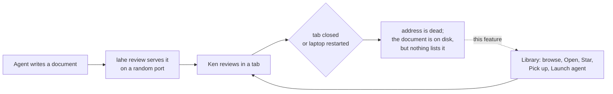

# Feature Brief: LAHE Library

**Summary:** A page that lists every document ever reviewed in LAHE, so Ken can browse them, bring one back with its comments and rail, and close tabs without worrying. Open and Star act directly from the page. Picking a document up, or launching a fresh agent on it, goes through an agent.

## Context

LAHE is now how Ken reads almost everything his agents produce: 20 or more documents a working day. Every review is kept on disk with its file path, page title, dates, owning agent session, and full comment history. Nothing lists them.

Each document is served at an address with a random port. Close the tab, or restart the laptop, and that address is gone for good. So Ken keeps tabs open as the only index he has, hesitates to close them, and loses the whole set on a restart.

The idea was pressure-tested on two LAHE pages:

- [the ideas page](../../ongoing/DOCUMENT_INDEX_IDEAS.md)
- [the crucible](00_crucible_lahe_library.md), accepted with Approach B

## Goal / Problem

Ken needs to find a past document without remembering its name, open it again with the rail on it, and hand it to an agent, all from one page. The pile of documents should feel smaller, and closing a tab should feel safe.

The key design question, for the wireframe: **what is one row?** A document, a review, or an agent session. At 20 documents a day, the answer decides whether the page reads as a list or as a wall.

## Non-Goals

- Not keeping old addresses alive. A reopened document gets a new address, and that is fine.
- Not deleting or archiving anything. Every review stays on disk.
- Not starting the helper at login. After a restart, an agent starts LAHE, and the Library works from then on.
- Not a search engine over document contents. Search covers what a row shows: titles, file names, folders.
- Not a replacement for `lahe session list`, which stays the agent-facing tool.

## User & Context

**Who:** Ken, a single power user. He runs many agents at once, and each hands him pages to review: 20 or more a working day. He works from the browser and from chat, often by voice. He does not know or want to know where files live; many sit in worktrees or temp folders. Later, new users from the npm package and the Product Hunt launch will reach the same pile after a few weeks of use.

**Where:** on a laptop, working all day. Occasionally a restart leaves a browser window of dead-looking LAHE tabs. A Claude Code chat is always available. He is deciding what to pick back up, often mid-way through several other things.

## User Stories

- **As Ken**, I want to browse everything I've reviewed recently, so that I can find a document whose name I don't remember.
- **As Ken**, I want to open a past document with one click and have the rail on it, so that I can read and comment on it right away.
- **As Ken**, I want to star the documents that matter, so that they stay easy to find as new ones pile up.
- **As Ken**, I want to hand a document to the agent I'm already talking to, so that my comments on it get answered.
- **As Ken**, I want to launch a fresh agent on a document, so that one agent isn't juggling ten documents.
- **As Ken**, I want to close a tab knowing I can get the document back, so that I can clear my desktop.
- **As Ken, after a restart**, I want one thing to ask an agent for ("open the lahe library"), so that I don't have to reconstruct what I had open.

## Solution Outline

1. Ken asks any agent to "open the lahe library." The agent runs one command. It starts LAHE if needed and opens the Library in the browser.
2. The Library lists every past document, newest first, with the volume handled by the design the wireframe settles.
3. Each row shows a recognizable name, where the document lives, when it was last worked on, how many comments are waiting, and whether it is open right now.
4. **Open** brings the document back at a new address with the rail on it, and opens it in a new tab. No agent is needed to read it.
5. **Star** marks it. Starred documents stay easy to find however old they get.
6. **Pick this up** tells the agent that opened the Library to take the document over, so comments on it get answered.
7. **Launch a new agent** asks that agent to start a fresh one on the document.
8. Ken can bookmark the Library. The bookmark works whenever LAHE is running.

## Requirements

### Listing

**R1.** The Library lists every review on disk, with none deleted or hidden permanently.

**R2.** Each row shows a name Ken would recognize: the page title when there is one. When the title is missing or shared with another row, the row also shows the folder and file name.

**R3.** Each row shows where the document lives (project folder), when it was last worked on, how many comments are waiting on an agent, and whether it is open right now.

**R4.** The Library keeps a working day's volume (20 or more documents) scannable without scrolling past older work. The grouping and default view are settled in the wireframe.

**R5.** Reviews that the old one-review-per-page registration split apart show together, the way that document would register today.

**R6.** Search filters rows by title, file name, and folder, across all documents regardless of age.

**R7.** A document whose file no longer exists is hidden by default, with a way to show it.

### Acting on a row

**R8. Open** brings the document back with its rail and its existing comments, and opens it in a new tab. It works directly from the page, without an agent, and whether or not any agent is running.

**R9.** A document that lived in a worktree that is gone opens from the same path in the main repository, when that file exists there.

**R10.** A document that is already being served opens at its current address instead of starting a second copy.

**R11. Star** and unstar act directly from the page and persist across helper restarts.

**R12. Pick this up** reaches the agent that opened the Library as ordinary work. That agent takes the document's session over, so comments on it reach that agent.

**R13. Launch a new agent** asks the agent that opened the Library to start a fresh agent, already pointed at that document's session.

**R14.** When no agent is listening, Pick this up and Launch a new agent say so, and offer a prompt Ken can paste into any agent instead.

### Reaching the Library

**R15.** One command opens the Library. It starts LAHE if it isn't running.

**R16.** The Library has a fixed address Ken can bookmark. It loads whenever LAHE is running.

**R17.** The agent skill tells agents how to open the Library and how to handle Pick this up and Launch a new agent.

### Safety

**R18.** Every action on the page passes the same request checks every other helper action passes. A website open in the same browser cannot open, star, or launch anything.

**R19.** Open serves only files that were already under review. The Library cannot be used to serve an arbitrary path.

## AI Behavior

Agents act on two of the Library's buttons.

- **Pick this up:** the agent takes the document's session over the same way it would on "take over the lahe session," arms its wake channel, and drains the catch-up list before anything else. It tells Ken on the Library's rail which document it picked up.
- **Launch a new agent:** the agent starts one new agent on that document, and reports on the rail that it did, and where (for example, which terminal window). It launches one agent per click, never more.
- **Never:** pick up or launch without a click from Ken, take over a session he didn't point at, or close any session.
- **On failure** (a launch that doesn't start, a takeover that is refused): reply `not_handled` on the Library's rail with the reason, and offer the paste-in prompt.

## Success Metrics

- Ken closes LAHE tabs freely. After two weeks of use, he reports no longer keeping tabs open to hold documents.
- After a restart, Ken gets any document back with one request to an agent and one click.
- Finding a document from the past week takes one screen and no scrolling past older work.
- Zero requests from other origins succeed against Library actions (covered by tests).

## UX Notes

- Uses the St. Clair AI document style, like every other LAHE page.
- Works in light and dark.
- Desktop first. It should still read on a narrow window, since Ken often has the rail open beside it.

## Analytics / Logging

The helper log records each Open, Star, Pick up, and Launch, with the review id. That is enough to check the first success metric by asking Ken rather than by counting.

## Rollout / Flags

No flag. The Library reads records that already exist, so it works on the full history from the first run. Starring adds new stored state; older helpers ignore it.

## Open Questions

1. What is one row: a document, a review, or an agent session? Settled in the wireframe, on real data.

2. How does the default view keep the volume manageable (a recent window, grouping by day, collapsing)? Settled in the wireframe.

3. Which app does Launch a new agent open (Terminal, iTerm, the Claude desktop app), and for which hosts (Claude Code, Codex)? Settled in the architecture.

## PM Review

Pending.
