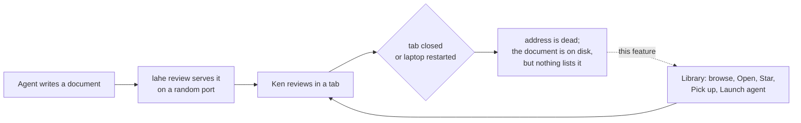

# Feature Brief: LAHE Library

**Summary:** A page that lists every document ever reviewed in LAHE, so Ken can browse them, bring one back with its comments and rail, and close tabs without worrying. Open and Star act directly from the page. Picking a document up, or launching a fresh agent on it, goes through an agent.

## Context

LAHE is now how Ken reads almost everything his agents produce: 20 or more documents a working day. Every review is kept on disk with its file path, page title, dates, owning agent session, and full comment history. Nothing lists them.

Each document is served at an address with a random port. Close the tab, or restart the laptop, and that address is gone for good. So Ken keeps tabs open as the only index he has, hesitates to close them, and loses the whole set on a restart.

The idea was pressure-tested on two LAHE pages:

- [the ideas page](../../ongoing/DOCUMENT_INDEX_IDEAS.md)
- [the crucible](00_crucible_lahe_library.md), accepted with Approach B

## Goal / Problem

Ken needs to find a past document without remembering its name, open it again with the rail on it, and hand it to an agent, all from one page. The pile of documents should feel smaller, and closing a tab should feel safe.

The key design question, for the wireframe: **what is one row?** A document, a review, or an agent session. At 20 documents a day, the answer decides whether the page reads as a list or as a wall.

## Non-Goals

- Not keeping old addresses alive. A reopened document gets a new address, and that is fine.
- Not deleting or archiving anything. Every review stays on disk.
- Not starting the helper at login. After a restart, an agent starts LAHE, and the Library works from then on.
- Not a search engine over document contents. Search covers what a row shows.
- Not letting the page or the helper start an agent or any other program. Only a running agent does, on Ken's click.
- Not a replacement for `lahe session list`, which stays the agent-facing tool.

## User & Context

**Who:** Ken, a single power user. He runs many agents at once, and each hands him pages to review: 20 or more a working day. He works from the browser and from chat, often by voice. He does not know or want to know where files live; many sit in worktrees or temp folders. Later, new users from the npm package and the Product Hunt launch will reach the same pile after a few weeks of use.

**Where:** on a laptop, working all day. Occasionally a restart leaves a browser window of dead-looking LAHE tabs. A Claude Code chat is always available. He is deciding what to pick back up, often mid-way through several other things.

## User Stories

- **As Ken**, I want to browse everything I've reviewed recently, so that I can find a document whose name I don't remember.
- **As Ken**, I want to open a past document with one click and have the rail on it, so that I can read it right away, and comment knowing when an agent will see it.
- **As Ken**, I want the Library to show me what still needs me (documents with waiting comments, starred ones) before the rest, so that the pile feels finite.
- **As Ken**, I want to star the documents that matter, so that they stay easy to find as new ones pile up.
- **As Ken**, I want to hand a document to the agent I'm already talking to, so that my comments on it get answered.
- **As Ken**, I want to launch a fresh agent on a document, so that one agent isn't juggling ten documents.
- **As Ken**, I want to close a tab knowing I can get the document back, so that I can clear my desktop.
- **As Ken, after a restart**, I want one thing to ask an agent for ("open the lahe library"), so that I don't have to reconstruct what I had open.

## Solution Outline

1. Ken asks any agent to "open the lahe library." The agent runs one command. It starts LAHE if needed and opens the Library in the browser.
2. The Library lists every past document, newest first, with the volume handled by the design the wireframe settles.
3. Each row shows a recognizable name, where the document lives, when it was last worked on, how many comments are waiting, whether it is being served now, and whether an agent is watching it.
4. **Open** brings the document back at a new address with the rail on it, and opens it in a new tab. No agent is needed to read it.
5. **Star** marks it. Starred documents stay easy to find however old they get.
6. **Pick this up** tells the agent that opened the Library to take the document over, so comments on it get answered.
7. **Launch a new agent** asks that agent to start a fresh one on the document.
8. Ken can bookmark the Library. The bookmark works whenever LAHE is running, and LAHE keeps running while the Library or a document opened from it is open.

## Requirements

### Listing

**R1.** The Library lists every review on disk, with none deleted or hidden permanently.

**R2.** Each row shows a name Ken would recognize: the page title when there is one. When the title is missing or shared with another row, the row also shows the folder and file name.

**R3.** Each row shows where the document lives (project folder), when it was last worked on, and how many comments are waiting on an agent. It also shows two separate signals: whether the document is being served now (so Open will reuse it), and whether an agent is watching it, and which one.

**R4.** The Library keeps a week's volume (100 or more documents at Ken's pace) findable without typing a search. The grouping and default view are settled in the wireframe.

**R4a.** The default view separates documents that need Ken (waiting comments, starred) from documents that don't.

**R5.** Reviews from before Sep 16, when each page in a folder got its own review, appear as one document, the way they would be recorded today. How that shows as rows is settled with Open Question 1.

**R6.** Search filters rows by everything a row shows (title, file name, folder, agent session name), across all documents regardless of age.

**R7.** A document is missing only when neither its file nor its main-repository copy (R9) exists. Missing documents are hidden by default, with a way to show them. On a missing row, Open is unavailable and says why. Star still works.

### Acting on a row

**R8. Open** brings the document back with its rail and its existing comments, and opens it in a new tab. It works directly from the page, without an agent, and whether or not any agent is running.

**R9.** A document that lived in a worktree that is gone opens from the same path in the repository that worktree belonged to, when that file exists there. The page tells Ken he is seeing the main repository's copy, which may differ from the version he reviewed.

**R10.** A document that is already being served opens at its current address instead of starting a second copy. The page says so, and warns that a second tab on the same document splits the comments.

**R10a.** While the Library, or a document opened from it, is open in the browser, LAHE keeps serving them, even after the last agent session closes.

**R10b.** When no agent is watching a document opened from the Library, its rail says so, keeps Ken's comments, and offers Pick this up and the paste-in prompt.

**R11. Star** and unstar act directly from the page and persist across helper restarts.

**R12. Pick this up** reaches the agent attached to the Library as ordinary work. That agent takes the document's session over, so comments on it reach that agent.

**R12a.** Before Ken clicks, the page names the agent that will receive Pick this up and Launch a new agent. When no agent is attached, the buttons say so ahead of time, not after the click.

**R12b.** Pick this up and Launch a new agent on a document that a live agent is watching ask Ken to confirm first. The confirmation names that agent and lists the other documents that move with the session.

**R12c.** After Pick this up or Launch, the row shows that the request is waiting, then which agent took it, or why it failed. A second click on the same row while one is waiting does nothing and says so.

**R13. Launch a new agent** asks the agent attached to the Library to start a fresh agent, already pointed at that document's session. The new agent's session is named after the document, so Ken can tell launched agents apart.

**R14.** When no agent is listening, Pick this up and Launch a new agent say so, and offer a prompt Ken can paste into any agent instead.

### Reaching the Library

**R15.** One command opens the Library. It starts LAHE if it isn't running.

**R16.** The Library has a fixed address Ken can bookmark. It loads whenever LAHE is running.

**R17.** The agent skill tells agents how to open the Library and how to handle Pick this up and Launch a new agent.

### Safety

**R18.** Every action on the page passes the same request checks every other helper action passes. A website open in the same browser cannot open, star, or launch anything. Tests prove it: requests from another origin are refused for every action.

**R19.** Open serves only a file that was under review, or, for a worktree that no longer exists, the file at the same path in the repository that worktree belonged to (R9). Nothing else. The Library cannot be used to serve an arbitrary path.

## AI Behavior

Agents act on two of the Library's buttons.

- **Pick this up:** the agent takes the document's session over the way the skill describes, then tells Ken on the Library page which document it picked up.
- **Launch a new agent:** the agent starts one new agent on that document, then tells Ken on the Library page where it launched (for example, which terminal window). One agent per click, never more.
- **Never:** pick up or launch without a click from Ken, take over a session he didn't point at, or close any session.
- **On failure** (a launch that doesn't start, a takeover that is refused): the Library page shows the reason and the paste-in prompt.

## Success Metrics

- Ken closes LAHE tabs freely. After two weeks of use, he reports no longer keeping tabs open to hold documents.
- After a restart, Ken gets any document back with one request to an agent and one click.
- Given a description of any document from the past week, Ken finds it without typing a search.
- After two weeks, a script over the helper log reports Opens per working day, and how many were documents older than the default view. A number near zero means the Library is not replacing tabs.

## UX Notes

- Uses the St. Clair AI document style, like every other LAHE page.
- Works in light and dark.
- Desktop first. It should still read on a narrow window, since Ken often has the rail open beside it.

## Analytics / Logging

The helper log records each Open, Star, Pick up, and Launch, with the review id and the time. The last success metric is counted from it by a script.

## Rollout / Flags

No flag. The Library reads records that already exist, so it works on the full history from the first run.

## Open Questions

1. What is one row: a document, a review, or an agent session? Settled in the wireframe, on real data.

2. How does the default view keep the volume manageable (a recent window, grouping by day, collapsing)? Settled in the wireframe.

3. Which app does Launch a new agent open (Terminal, iTerm, the Claude desktop app), and for which hosts (Claude Code, Codex)? Settled in the architecture.

4. How does an agent attach to the Library, so the page can name it (R12a)? From a bookmark, no agent opened it; over a day, several may have. Settled in the architecture.

## PM Review

| # | Finding | Disposition | Rationale |
|---|---------|-------------|-----------|
| RF1 | Closing the last session kills the Library and its documents | Accepted | R10a: LAHE keeps serving while they are open |
| RF2 | R9 contradicts R19 | Accepted | R19 allows the worktree fallback only; R9 says it is the main repo's copy |
| RF3 | Pick this up can cut off a working agent and move other documents | Accepted | R3 shows who is watching; R12b confirms first |
| RF4 | Which agent receives Pick this up is undefined | Accepted | R12a names it before the click; how it attaches is Open Question 4 |
| RF5 | Comments on an unwatched document reach nobody silently | Accepted | R10b; story reworded |
| RF6 | "Open right now" is ambiguous | Accepted | R3 now has two signals: served, and agent watching |
| RF7 | No click feedback; double click launches twice | Accepted | R12c |
| RF8 | "The page never starts a program" is missing | Accepted | Added as a non-goal; R14 answers the no-agent case |
| RF9 | AI Behavior presumes the Library has a rail | Accepted | Reworded at product level |
| RF10 | Metrics disagree with R4; one is a test | Accepted | R4 now covers a week; cross-origin test moved to R18; log-counted metric added |
| RF11 | No story for "stop feeling buried" | Accepted | New story and R4a |
| RF12 | R7 misses the worktree case and Open on a hidden row | Accepted | R7 reworded |
| RF13 | Open can create a second tab that splits comments | Accepted | Added to R10 |
| RF14 | Launched agents need a recognizable name | Accepted | Added to R13 |
| RF15 | R5 in internal history, presumes row answer | Accepted | R5 reworded |
| RF16 | Rollout compatibility note is build detail | Accepted | Cut |
| RF17 | Search leaves out session name | Accepted | R6 covers everything a row shows |
