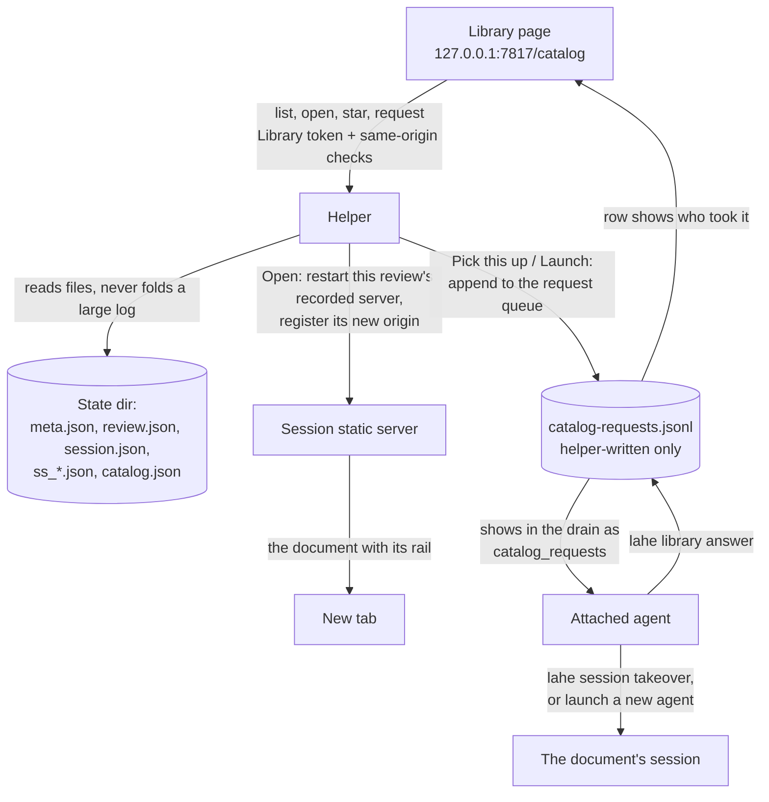
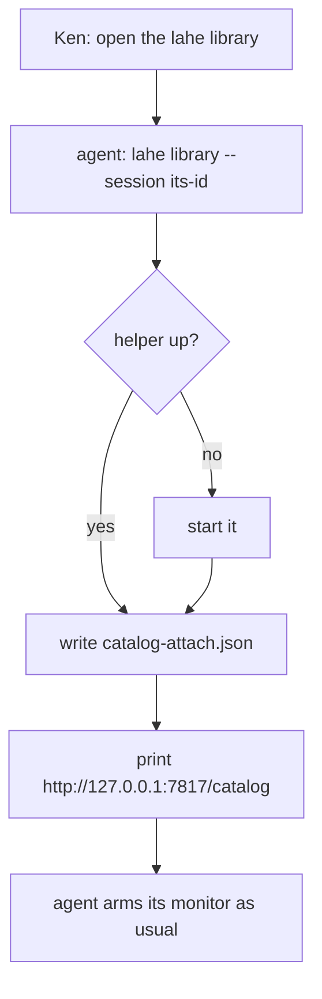

# Architecture: LAHE Library

## Summary

The helper serves one new page, the Library, at a fixed address on its own port: `http://127.0.0.1:7817/catalog`. The page lists every review from records already on disk, grouped agent session, then review, then pages (wireframe B), with each session's project shown as a label and a project filter. Open and Star act directly through helper routes that only the Library page can call. Open restarts the servers a review already had, it never serves a path the helper did not serve before. Handing a document to an agent, or launching a new one, is a request the helper writes to a queue only it can write. The attached agent sees that queue in its normal drain, the same way it sees an ended review today, acts on it, and answers. The page shows the answer on the row.



## Analysis of Existing Structure

- **The list needs no new data.** `meta.json` has target, session and creation time. The last-written `review.json` has titles, counts and `ended_at`. `session.json` has the name. `ss_*.json` records say what a session served and from where. `monitor.json` and the liveness check say whether an agent is watching.
- **The helper serves JSON and the layer bundle, nothing else.** Its one raw-response function sends `Access-Control-Allow-Origin: *`, so the Library page cannot go through it.
- **Every mutating route needs a per-review token today** (D11). A page that acts across all reviews needs its own credential, which is an amendment to D11.
- **Reopening and taking over already exist** (`lahe session reopen`, `lahe session takeover` with its `handoff_rev` fence). A restarted static server gets a new random port, and nothing registers that port as an allowed origin.
- **The helper stops when the last session closes.** The Library is the first page that must outlive every session.
- **The drain already carries a helper-authored list besides items:** `ended_reviews`. Catalog requests follow that precedent, so no item or `review.json` field changes.
- **`lahe monitor` watches one session.** After a pick-up the agent owns two.
- **Name collision.** This codebase already calls the in-page script "the library". The user-facing name stays Library. Code, routes, files and the URL path use `catalog`.

## Components / Modules Touched

- **Shared protocol:** new routes `catalog.page`, `catalog.asset`, `catalog.list`, `catalog.open`, `catalog.star`, `catalog.request`, and a new auth class `CATALOG_TOKEN`. Header names come from `protocol.js`, like every other route.
- **Service, catalog reader (new):** builds the list from files, with an mtime cache. Owns folding old per-page reviews, the project label, and the missing and worktree rules.
- **Service, catalog routes and request queue (new):** Open, Star, the request queue and its expiry.
- **Service, static servers:** restart one recorded server by id, try its old port first, and register the resulting origin on the review, replacing that review's stale loopback origins. Also closes the open board row LAHE-static-server-host-check: every static server refuses a Host that is not its own loopback address and port, because the Library keeps more of them alive.
- **Service, helper lifetime:** remembers when the Library page last polled.
- **Layer, catalog page (new, not part of the rail bundle):** an HTML template plus one script file, served by the helper. It gets its own list in `src/shared/manifest.js`.
- **CLI:** new `lahe library [--session <id>]` and `lahe library answer`. `lahe monitor` accepts `--session` more than once. `lahe status` prints `catalog_requests` for the sessions it drains. `session close` checks the Library before stopping the helper.
- **Docs and contract:** a D11 amendment in `docs/CONTRACTS.md`. The skill, the contract text, the copy in `test/unit/review_format.test.js`, and the dist bundle change together for the new drain section.

## Data / State Changes

**`<state>/catalog.json`**, written only by the helper, with the existing write-beside-and-rename:

```json
{ "schema": 1, "stars": { "<review-id>": "2026-09-28T16:20:00Z" }, "reopened": { "<session-id>": "2026-09-28T16:21:00Z" } }
```

**`<state>/catalog-attach.json`**, written only by the CLI (`lahe library --session`):

```json
{ "schema": 1, "session": "s_...", "at": "2026-09-28T16:02:00Z" }
```

One writer per file, so a star and an attach cannot overwrite each other.

**`<state>/catalog-requests.jsonl`**, append-only, written only by the helper and by `lahe library answer`:

```json
{ "id": "cq_...", "at": "...", "action": "pickup" | "launch", "review": "r_...", "session": "s_...", "for": "s_<attached>" }
{ "id": "cq_...", "answered_at": "...", "by": "s_<attached>", "status": "done" | "refused", "text": "..." }
```

A request holds ids only. No text from a page reaches it. The drain adds the title and path as data fields, fenced like any other page-derived text. A request expires when the attached session changes, when its monitor has been dead past the liveness threshold, or after 30 minutes unanswered. The row then goes back to normal and says it was not picked up.

**The Library token** is minted in memory at each helper start and never written to disk. It exists only inside the served page.

**The list response** (`catalog.list`), one entry per session:

```json
{
  "attached": { "session": "s_...", "name": "document index", "watching": true },
  "sessions": [{
    "id": "s_...", "name": "coach activity", "projects": ["steady-thread"],
    "watching": false, "last": "2026-09-28T15:40:00Z",
    "reviews": [{
      "id": "r_...", "title": "Feature Brief: Coach Activity", "file": "01_brief.md", "folder": "...",
      "path_hint": "~/Documents/workspace/steady-thread/...", "waiting": 3, "total": 9,
      "counts_as_of": "2026-09-28T15:40:00Z", "ended": false, "served_url": null,
      "openable": "yes" | "via-agent" | "missing", "starred": false,
      "pending_request": null, "pages": [{ "title": "...", "path": "/..." }],
      "folded_from": ["r_...", "r_..."]
    }]
  }]
}
```

`openable` is `via-agent` for reviews Open cannot restart itself (below). The page does search, the project filter, and the "unanswered comments, and starred" section on the client from this one response.

## Key Flows

### Open

```mermaid
sequenceDiagram
  participant K as Library page
  participant H as Helper
  participant S as Static server
  participant Q as Request queue
  participant A as Attached agent
  K->>K: click Open, open a blank tab now (noopener)
  K->>H: POST catalog.open {review}
  H->>H: token, same-origin, exact Origin; review has a recorded server
  H->>S: reopen the session if closed; restart that server (old port if free)
  H->>H: register the server's origin on the review, drop stale loopback ones
  H-->>K: {url} (loopback http only)
  K->>K: point the tab at url
  H->>Q: pickup request, only if an agent is attached and none is watching
  Q->>A: shows in the next drain
  A->>A: lahe session takeover <doc session>, adds it to its monitor
  A->>Q: lahe library answer: done, "watching <title>"
  Q-->>K: row: watched by <agent>
```

- **Already served (R10):** the helper returns the live URL and starts nothing.
- **Another agent is watching (R12b):** the page asks first, naming that agent and the other reviews in its session. "Just open it to read" opens with no request.
- **No agent attached (R14):** Open still opens and reads. No request is queued. The document's rail shows its existing "no agent listening" state and its existing hand-off message. The rail never carries the Library token.
- **What Open can restart itself:** a review whose session has an `ss_*.json` record whose root contains the review's page. That record was written by `lahe review` or the helper, never by a page, so Open serves nothing new. Everything else is `via-agent`: its Open button queues a pick-up and the agent re-serves it with `lahe review`. That covers dev-server reviews, legacy `lahe add` script-line reviews, and the worktree fallback.
- **Worktree fallback (R9):** when the recorded root is gone and sits under `<repo>/.claude/worktrees/<name>/`, the row says "the worktree is gone; an agent will open the main-repo copy". The pick-up request carries the candidate path, checked by the helper: under the repo by real path, no hidden segment, owned by Ken, a page. The agent serves it with `lahe review`, so the path goes through the CLI's own checks.
- **Folded rows:** Open targets the newest review in the fold.

### Star

`POST catalog.star {review, starred}`. The helper writes `catalog.json` and answers. No agent.

### Launch a new agent

Queues a `launch` request. The attached agent opens a new Terminal window running its own host's command line (`claude` for Claude Code, `codex` for Codex) with the takeover prompt, then answers with where it launched. A host with no command line answers `refused` with the paste-in hand-off message. The new session is named after the document (R13).

### Reaching the Library



### Helper lifetime (R10a)

The page polls `catalog.list` every 15 seconds whether or not its tab is visible, and the helper keeps the last poll time in memory. `lahe session close` on the last open session asks the helper for that time (through `health`) and leaves the helper running if the Library polled in the last two minutes or any document window is still held. There is no self-stop timer: the helper then stops at the next close that finds everything quiet, or at a restart. A session the Library reopened with no agent is closed again by the helper once none of its windows has been held for 30 minutes and no agent took it over, so reopened sessions do not pile up.

## Alternatives Considered

- **The Library as an ordinary LAHE review (crucible Approach A).** Rejected by Ken: Open and Star must act directly.
- **A per-review token on every row.** The page would hold every review's key, the "one page holds all the keys" risk D11 exists to avoid. One Library token that cannot post to any review is smaller.
- **Hand-over requests as comment items in an inbox review.** The first draft. Rejected in review: `review.json` only writes known item fields, so the request would never reach the agent without changing the frozen format; any page holding a review token could forge the same field; and the note would carry a page-set title into the field agents treat as Ken's own words. A helper-only queue shown as its own drain section has none of these problems.
- **Stable per-review addresses on the helper port.** Old tabs would come back on their own, but the helper would then serve every review's files, moving serving out of session-owned servers. Ken is fine with a new port.
- **The helper runs the takeover itself on Pick this up.** It would fence the old agent with no new one listening. Only an agent that will watch should take a session over.
- **Open serves the worktree fallback itself.** The helper would serve a path it never served, from a record any page can edit. Handing it to an agent sends the path through the CLI's checks instead.
- **Launch from the page directly (brief Open Question 5).** Deferred, see Open Questions.

## Failure Modes / Edge Cases

- **Old per-page reviews (R5).** Within one session, reviews created before 2026-09-17 whose targets are single HTML files in the same folder fold into one row titled from the folder. Nothing on disk changes.
- **No `review.json`, or a stale one.** A review that never recorded a title shows its file name (R2). When a review's `events.jsonl` is newer than its `review.json` and small enough, the reader re-projects that one review; otherwise it shows the counts with their `counts_as_of` time. It never folds a large log to fill a row.
- **Double click (R12c).** One pending request per review. The page disables the button and shows "waiting for <agent>".
- **Pending requests are capped** at five across the Library, so a leaked token cannot queue a launch for every review.
- **Attached agent goes away.** The page shows the no-agent state on its next poll. Pending requests for that agent expire.
- **Two agents ran `lahe library`.** The last one is attached, and the page names it before any click.

## Security & Privacy Notes

This amends D11: one new credential, the Library token, that can list, open (restart recorded servers only), star, and queue a request. It cannot post to a review, read comment text, or name a file to serve.

- **Serving the page:** no CORS headers on any catalog route, `Content-Security-Policy` with `script-src 'self'` and `frame-ancestors 'none'`, `X-Frame-Options: DENY`, `Referrer-Policy: no-referrer`. The script is a separate file, never inline.
- **Every catalog request** needs the Host check, `Sec-Fetch-Site: same-origin`, the custom header, and the token. POSTs also need JSON and an Origin exactly equal to the helper's own. The preflight handler never approves a catalog route.
- **The page renders page-derived text** (titles, file names) with `textContent` only.
- **Open** only accepts a loopback `http:` URL back from the helper, and opens it with no opener.
- **Files Open or a fallback serve** must be owned by the current user.
- **Static servers get the Host check** (board row LAHE-static-server-host-check), since the Library keeps more of them running.
- **Launching is only through an agent in v1,** which runs in its normal permission mode.

## Test Strategy

- **Unit:**
  - the reader: grouping, folding, fallback titles, missing and worktree rows, `openable`, counts freshness
  - each catalog route refuses a wrong Host, missing header, wrong content type, foreign Origin, cross-site `Sec-Fetch-Site`, and a wrong token
  - a review token cannot call a catalog route, and the Library token cannot call a review route
  - the page response carries no CORS header and does carry the frame and script policies
  - Open refuses a review with no recorded server and never serves a path outside a recorded root
  - a restarted server's origin is registered and stale loopback origins are dropped
  - request queue: ids only, one pending per review, the cap, expiry on detach and on dead monitor
  - the drain prints `catalog_requests` with the title fenced as data
  - `lahe monitor` with two `--session` flags wakes on either
  - helper lifetime: the last close with a recent Library poll leaves the helper up
  - static servers refuse a foreign Host
- **Browser, one named spec:** open the Library, Open a closed review, land on the document with its rail, post a comment, then see a stub agent's answer on the row. Screenshots in light and dark.
- **Contract copies** stay identical, checked by the existing review-format test.

## Open Questions

1. **Direct launch (brief Open Question 5).** v1 launches only through the attached agent. A direct path would be the helper running one fixed program, macOS only, turned on by a line in `user.env`, started with no shell, the prompt passed as an argument, ids checked, the agent in normal permission mode, and a log line per launch. It needs its own security review. Recommendation: build v1 without it.
2. **The name in code.** The page says Library; code and the URL say `catalog`, because "library" already means the in-page script in this repo. Fine?

## Architect Review

| # | Finding | Disposition | Rationale |
|---|---------|-------------|-----------|
| RF1 | `catalog_request` never reaches the agent | Accepted | Inbox items replaced by a helper-only queue shown as its own drain section |
| RF2 | One monitor, two sessions after a pick-up | Accepted | `lahe monitor` takes `--session` more than once |
| RF3 | Restarted port never registered as an origin | Accepted | Helper tries the old port, registers the new origin, drops stale ones |
| RF4 | Worktree copy served with no rail | Accepted | Fallback goes through an agent and `lahe review` |
| RF5 | Background tab lets the helper stop | Accepted | Poll continues when hidden |
| RF6 | Reopened sessions pile up | Accepted | Helper closes a Library-reopened session after 30 quiet minutes |
| RF7 | Simpler lifetime rule | Accepted | Last-poll time in memory, checked on close, no self-stop timer |
| RF8 | `catalog.json` has two writers | Accepted | Attach moved to its own CLI-written file |
| RF9 | A dead agent blocks a row forever | Accepted | Requests expire |
| RF10 | No Open path for legacy and dev-server reviews | Accepted | `openable: via-agent` |
| RF11 | Rail Pick this up has no design | Accepted | Rail keeps its existing hand-off message only |
| RF12 | Launch app and hosts unsettled | Accepted | Terminal, `claude` or `codex`, else refused with the message |
| RF13 | No list response shape | Accepted | Shape defined |
| RF14 | Counts can be stale | Accepted | Small reviews re-projected, else shown with their time |
| RF15 | Share the append-project-wake steps | Cut | No helper-made items remain |
| RF16 | Inbox reviews listed as rows | Cut | No inbox reviews remain |
| RF17 | Analytics script missing | Accepted | Log lines here; the counting script is a plan task |
| RF18 | Helper does not serve the doc style | Accepted | `catalog.asset` serves the style bundle and fonts |
| RF19 | Page folder and manifest entry | Accepted | Own manifest list, header names from `protocol.js` |
| RF20 | Internal contradictions | Accepted | Rewritten |
| RF21 | Folded row Open target undefined | Accepted | Newest review in the fold |
| RF22 | D11 needs a written amendment | Accepted | In `docs/CONTRACTS.md` |

## Security Review

| # | Finding | Disposition | Rationale |
|---|---------|-------------|-----------|
| RF1 | Raw response sends a wildcard CORS header | Accepted | Catalog routes send no CORS headers |
| RF2 | Page can be framed for clickjacking | Accepted | `frame-ancestors 'none'` and `X-Frame-Options: DENY` |
| RF3 | `target_path` is writable by any token holder | Accepted | Open restarts only recorded servers; never serves `target_path` |
| RF4 | A page can forge `catalog_request` on an item | Accepted | No item field; helper-only queue |
| RF5 | Page-set title in the agent's instruction field | Accepted | Requests carry ids; titles are fenced data |
| RF6 | Worktree fallback rules loose | Accepted | Fallback goes through the agent and the CLI's checks |
| RF7 | More live static servers without a Host check | Accepted | Host check on static servers is part of this feature; quiet reopened sessions close |
| RF8 | Origin check cannot work for GET | Accepted | `Sec-Fetch-Site: same-origin`; exact Origin on POST; no preflight approval |
| RF9 | No limit on queued requests | Accepted | One per review, five in total |
| RF10 | Rail must never carry the Library token | Accepted | Rail keeps its existing hand-off message |
| RF11 | 0600 token file protects nothing | Accepted | Token is in memory, minted per helper start |
| RF12 | Row text could run script | Accepted | `textContent` and a strict script policy |
| RF13 | Opened tab can rewrite the Library tab | Accepted | Opened with no opener; loopback URLs only |
| RF14 | Files in shared folders | Accepted | Owner check |
| RF15 | Direct launch needs its own design | Deferred | Open Question 1 |
