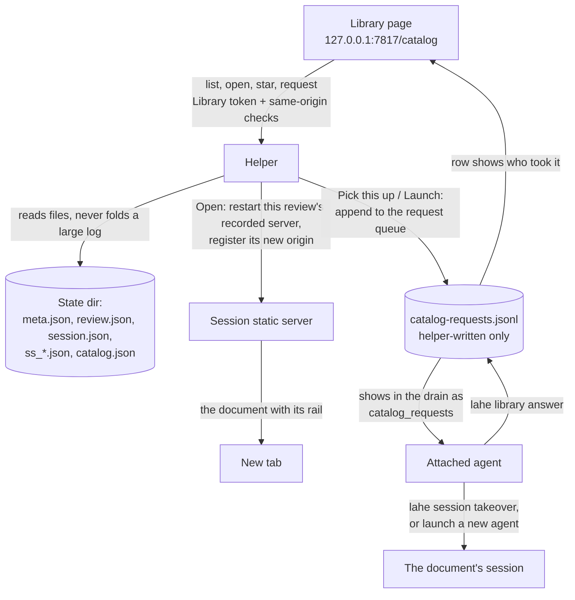
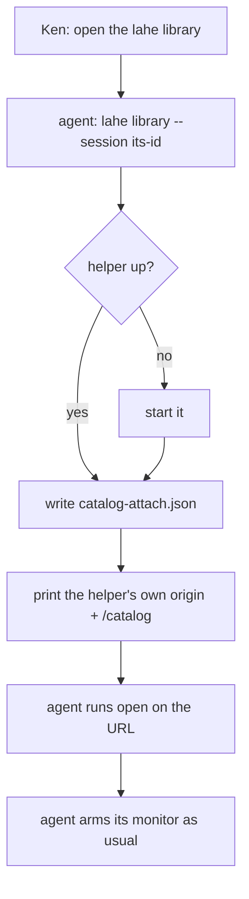

# Architecture: LAHE Library

## Summary

The helper serves one new page, the Library, at a fixed address on its own port: `http://127.0.0.1:7817/catalog`. The page lists every review from records already on disk, grouped agent session, then review, then pages (wireframe B), with each session's project shown as a label and a project filter. Open and Star act directly through helper routes that only the Library page can call. Open restarts the servers a review already had, it never serves a path the helper did not serve before. Handing a document to an agent, or launching a new one, is a request the helper writes to a queue only it can write. The attached agent sees that queue in its normal drain, the same way it sees an ended review today, acts on it, and answers. The page shows the answer on the row.



## Analysis of Existing Structure

- **The list needs no new data.** `meta.json` has target, session and creation time. The last-written `review.json` has titles, counts and `ended_at`. `session.json` has the name. `ss_*.json` records say what a session served and from where. `monitor.json` and the liveness check say whether an agent is watching.
- **The helper serves JSON and the layer bundle, nothing else.** Its one raw-response function sends `Access-Control-Allow-Origin: *`, so the Library page cannot go through it.
- **Every mutating route needs a per-review token today** (D11). A page that acts across all reviews needs its own credential, which is an amendment to D11.
- **Reopening and taking over already exist** (`lahe session reopen`, `lahe session takeover` with its `handoff_rev` fence). Both run in the CLI, not the helper. A restarted static server listens on port 0, so it gets a new random port, and nothing registers that port as an allowed origin.
- **Origins only ever grow.** `reviews.js` appends `origin.registered` to the review's log, and recovery rebuilds the origin set from those events. Nothing removes one.
- **The helper stops when the last session closes.** The Library is the first page that must outlive every session.
- **The drain already carries a helper-authored list besides items:** `ended_reviews`, delivered once per session through `ended-delivered.log`. Catalog requests follow that precedent, so no item or `review.json` field changes.
- **`lahe monitor` watches one session.** After a pick-up the agent owns two.
- **Name collision.** This codebase already calls the in-page script "the library". The user-facing name stays Library. Code, routes, files and the URL path use `catalog`.

## Components / Modules Touched

- **Shared protocol:** new routes `catalog.page`, `catalog.asset`, `catalog.list`, `catalog.open`, `catalog.star`, `catalog.request`, and a new auth class `CATALOG_TOKEN`. Also a client value `catalog`, a `CHECK.SEC_FETCH_SITE`, the error codes in [Security](#security-privacy-notes), the `origin.removed` event, the log line format, and the `CATALOG` constants below. Every one of these is spelled once, in `protocol.js`.
- **Service, catalog reader (new):** builds the list from files. Owns folding old per-page reviews, `display_name`, the project label, and the missing and worktree rules. It also exports the one function that describes a review (display name, path, worktree candidate), which the drain calls too.
- **Service, catalog store (new, small):** reads and writes `catalog.json` (stars and the `reopened` map). The only code that touches that file.
- **Service, catalog routes and request queue (new):** Open, Star, the request queue and its expiry.
- **Service, static servers:**
  - Restart one recorded server by id. The spawned server takes a preferred port and falls back to 0.
  - Each `ss_` record keeps the list of ports it has used.
  - Register the resulting origin on the review, and remove only that server's earlier loopback origins (see [Stale origins](#stale-origins)).
  - Two service-level functions the routes call: `reopenForCatalog(sessionId, serverId)` and `closeQuiet(sessionId)`. The CLI's own reopen and close keep working as before.
  - Closes the open board row LAHE-static-server-host-check. Every static server accepts a Host of `127.0.0.1:<its port>` or `localhost:<its port>` and refuses anything else, including a missing Host. The check covers every path: pages, the reserved library route, and 404s.
- **Service, helper lifetime:** remembers when the Library page last polled, reports it on `health`, and runs the reopened-session sweep.
- **Layer, catalog page (new, not part of the rail bundle):** an HTML template (`src/service/catalog_page.js`), the page script (`src/layer/catalog/page.js`), and a pure view-model module (`src/layer/catalog/view_model.js`) that turns a list response into sections, rows and button states with no DOM. The page files get their own manifest list, `CATALOG_PAGE`. They are served raw from `src/` with no build step, so they never touch `dist/`.
- **CLI:**
  - `lahe library [--session <id>] [--json]` and `lahe library answer`.
  - `lahe monitor` accepts `--session` more than once.
  - `lahe status` prints `catalog_requests` for the sessions it drains.
  - `lahe session name <id> --from-review <review>` names a session after a review's display name, read by the CLI itself.
  - `session close` checks the Library before stopping the helper.
- **Docs and contract:** a D11 amendment in `docs/CONTRACTS.md` with the per-route check table below, the new event, and the `health` field. The skill, the contract text, the copy in `test/unit/review_format.test.js`, and the dist bundle change together for the new drain section.

## Data / State Changes

### Constants

All in `protocol.CATALOG`, each with its value:

| Name | Value | Used for |
|---|---|---|
| `REQUEST_EXPIRY_MS` | 30 minutes | an unanswered request expires |
| `LIBRARY_SEEN_MS` | 2 minutes | a Library poll this recent keeps the helper up |
| `REOPENED_AUTOCLOSE_MS` | 30 minutes | a quiet Library-reopened session closes |
| `QUEUE_CAP` | 5 | pending requests across the Library |
| `REPROJECT_MAX_BYTES` | 5 MB | the largest log the reader will re-project |
| `POLL_MS` | 15 seconds | the page's poll |
| `ANSWER_SHOWN_MS` | 24 hours | how long an answer stays on its row |
| `ANSWER_TEXT_MAX` | 500 characters | the longest answer `lahe library answer` accepts |
| `DEFAULT_VIEW_DAYS` | 7 | sessions active this recently are open in the default view |
| `FOLD_CUTOFF` | `2026-09-17T04:00:00Z` | reviews created before this instant (midnight US Eastern) can fold |

"The monitor is dead" means its heartbeat is older than `MONITOR.HEARTBEAT_FRESH_MS`, read through the existing liveness function in `agent_sessions.js`. Every expiry and freshness check takes `now` as an argument.

### Files

**`<state>/catalog.json`**, written only by the helper through the catalog store, with the existing write-beside-and-rename:

```json
{ "schema": 1,
  "stars": { "<review-id>": "2026-09-28T16:20:00Z" },
  "reopened": { "<session-id>": { "at": "2026-09-28T16:21:00Z", "handoff_rev": 4 } } }
```

A corrupt `catalog.json` is never overwritten: a star is refused with `PROTO_CATALOG_UNREADABLE`, and the list shows no stars with a notice. An Open that would reopen a closed session is refused the same way, because a reopen the sweep cannot see would leave that session open for good (fix round CX2 and CR4).

**`<state>/catalog-attach.json`**, written only by the CLI (`lahe library --session`):

```json
{ "schema": 1, "session": "s_...", "at": "2026-09-28T16:02:00Z" }
```

One writer per file, so a star and an attach cannot overwrite each other.

**`ss_*.json`** gains `ports: [51234, 55480]`, oldest first, so the helper knows which loopback origins came from this server.

**The review log** gains one event, `origin.removed {origin}`. Recovery applies it in order with `origin.registered`, so a removed origin stays removed after a helper restart.

**`<state>/catalog-requests.jsonl`**, append-only, written only by the helper and by `lahe library answer`:

```json
{ "id": "cq_...", "at": "...", "action": "pickup" | "launch", "review": "r_...", "session": "s_...", "for": "s_<attached>" }
{ "id": "cq_...", "answered_at": "...", "by": "s_<attached>", "status": "done" | "refused", "text": "..." }
{ "id": "cq_...", "expired_at": "...", "reason": "attach_changed" | "monitor_dead" | "timeout" }
```

- A request holds ids only. No text from a page reaches it, and extra body fields are dropped.
- A request expires when the attached session id changes to a different one, when the `for` session's monitor is dead, or after `REQUEST_EXPIRY_MS` unanswered. Re-attaching the same session id is not a change.
- Expiry is worked out on each read from `now`. The helper appends the `expired` line the first time it sees one, so the file stays the single record.
- An answered or expired request no longer counts toward one-per-review or `QUEUE_CAP`.
- A torn last line is skipped with a helper log line. The list and the drain still work.

**The Library token** is minted in memory at each helper start and never written to disk. It exists only inside the served page.

**`health`** gains `catalog_seen_at`, the time of the last authenticated `catalog.list`, or null.

### The list response

`catalog.list`, one entry per session:

```json
{
  "attached": { "session": "s_...", "name": "document index", "watching": true },
  "sessions": [{
    "id": "s_...", "name": "coach activity", "projects": ["steady-thread"],
    "watching": { "session": "s_...", "name": "free writing lahe" }, "last": "2026-09-28T15:40:00Z",
    "reviews": [{
      "id": "r_...", "title": "Feature Brief: Coach Activity", "display_name": "Feature Brief: Coach Activity",
      "file": "01_brief.md", "folder": "...", "path_hint": "~/Documents/workspace/steady-thread/...",
      "last": "2026-09-28T15:40:00Z", "waiting": 3, "total": 9, "counts_as_of": "2026-09-28T15:40:00Z",
      "ended": false, "served_url": null,
      "openable": "yes" | "via-agent" | "missing", "kind": "static" | "dev-server" | "legacy" | "worktree",
      "starred": false, "unreadable": false,
      "request": { "id": "cq_...", "action": "pickup", "at": "...", "state": "waiting" | "done" | "refused" | "expired",
                   "by_name": "document index", "text": "...", "answered_at": "..." },
      "pages": [{ "title": "...", "path": "/..." }],
      "folded_from": ["r_...", "r_..."]
    }]
  }]
}
```

Rules the reader owns:

- **`display_name`** is the title. When the title is missing, or shared with another row, it is `folder / file`.
- **`last`** on a review is its newest event time; on a session, its newest review's. Origin events do not count: an Open's origin swap appends them to every review the restarted server serves, so a log that ends in them takes `last` from the newest other event, read from the log's tail (fix round CR5).
- **`projects`:** the base name of the git top level of each review's target. For a worktree, the owning repository's name. No git repository means no project.
- **`openable: yes`** when `static_servers.servesPath(...)` is true for a recorded server of the session. That counts mounts.
- **`kind`** tells the agent how to re-serve a `via-agent` row.
- **`watching`** is null or `{session, name}`, taken from the `primary` field of the session's `monitor.json` heartbeat. So a session picked up by another agent names that agent.
- **`attached.watching`** is false when the attached session's monitor is dead. An attach with no session on disk behind it reads as no agent.
- **`request`** is the latest request on that review. An answer stays until the next request on the review, or `ANSWER_SHOWN_MS`.
- **`pages[].path`** is a URL path on the review's server. Page rows are informational; they have no Open of their own.
- **`unreadable: true`** marks a row whose `review.json`, `meta.json`, `session.json` or `ss_*.json` is corrupt. That row degrades; the rest of the list returns.
- **Probes:** `served_url` and `watching` need HTTP probes. The reader runs them in parallel, caches each result for one `POLL_MS`, and skips `ss_` records with `stopped_at` set.
- **Cache:** per file, keyed on modified time plus size.
- **Never in the list:** comment text, and the token.

The page does search, the project filter, and the "unanswered comments, and starred" section on the client from this one response.

### The drain section

`lahe status` adds `catalog_requests` to its summary line, beside `ended_reviews`. One entry per pending request whose `for` is a drained session:

```json
{ "request": "cq_...", "action": "pickup" | "launch", "review": "r_...", "session": "s_...", "kind": "static" | "dev-server" | "legacy" | "worktree",
  "moves_with": ["r_...", "r_..."], "at": "...",
  "title": "...", "path": "...", "candidate": "..." | null, "handoff": "..." }
```

- `request`, `action`, `review`, `session`, `kind`, `moves_with` and `at` are ids and helper values.
- `title`, `path`, `candidate` and `handoff` are page-derived text. They are declared as data fields in `PROJECTED_FIELD_CLASS` and fenced exactly like other page-derived text. A title containing the fence marker or a newline cannot break out of the entry.
- `candidate` is the main-repository copy for a worktree row. The drain derives it from the recorded root at drain time and checks it: under the repository by real path, no hidden segment, owned by the current user, a page. A candidate that fails is `null`. The request itself never carries a path.
- `handoff` is the rail's existing hand-off message for the document's session (`AGENT_LIVENESS.handoffMessage`).
- **Wake:** a new pending request is work. It gets past `--quiet` and makes `lahe monitor` exit 0 once per request. A per-session `catalog-delivered.log`, like `ended-delivered.log`, records each delivered request id with the session's `handoff_rev`, so a takeover delivers it again.
- **Listing:** the non-quiet drain keeps listing a request until it is answered or expires.

### The log line

The helper writes one line to its log per action, in a format spelled once in `protocol.js`:

```
catalog <open|star|unstar|pickup|launch> review=<id> age_days=<n>
```

`age_days` is whole days from the review's `last` to the action.

## Key Flows

### Open

```mermaid
sequenceDiagram
  participant K as Library page
  participant H as Helper
  participant S as Static server
  participant Q as Request queue
  participant A as Attached agent
  K->>K: click Open: tab = open about:blank, tab.opener = null
  K->>H: POST catalog.open {review, handoff, confirmed}
  H->>H: route checks; review has a recorded server
  H->>H: session closed? record it in the reopened map first
  H->>S: reopenForCatalog: restart that server (old port if free), then reopen the session if closed
  H->>H: register the new origin, append origin.removed for this server's old ports
  H-->>K: {url, request_id, not_asked}
  K->>K: url is loopback http? tab.location = url, else close the tab and show why
  H->>Q: pickup request, only if handoff and an agent is attached and none is watching
  Q->>A: shows in the next drain
  A->>A: lahe session takeover <doc session>, adds it to its monitor
  A->>Q: lahe library answer: done, "watching <title>"
  Q-->>K: row: watched by <agent>
```

- **Already served (R10):** the helper returns the live URL and starts nothing.
- **Another agent is watching (R12b):** the page asks first, naming that agent and the other reviews in its session. "Move the session" sends `handoff: true, confirmed: true`. "Just open it to read" sends `handoff: false` and queues nothing. The helper refuses an unconfirmed hand-over on a watched session with `PROTO_CONFIRM_NEEDED`.
- **No agent attached (R14):** Open still opens and reads, with `not_asked: "no_agent"`. The document's rail shows its existing "no agent listening" state and its existing hand-off message. The rail never carries the Library token.
- **Queue full:** Open still opens, with `not_asked: "queue_full"`, and the row says no agent was asked.
- **What Open can restart itself:** a review whose session has an `ss_*.json` record that serves the review's page. That record was written by `lahe review` or the helper, never by a page, so Open serves nothing new. Everything else is `via-agent`: its Open queues a pick-up and the agent re-serves it. With no agent attached, a `via-agent` Open is disabled and offers the hand-off message; the helper refuses it with `PROTO_NO_AGENT`. By `kind`:
  - **dev-server:** the agent answers `refused`: "Start the dev server at `<origin>`, then ask me again."
  - **legacy** (`lahe add` script-line reviews, recovered as session "legacy"): there is no session to take over, so the agent runs `lahe review <path>` in its own session.
  - **worktree:** see below.
- **Worktree fallback (R9):** when the recorded root is gone and sits under `<repo>/.claude/worktrees/<name>/`, the row says "The worktree is gone. An agent will open the main repository's copy, which may differ from what you reviewed." The request carries only the review id. The drain derives and checks the candidate (see the drain section). The agent serves it with `lahe review`, so the path goes through the CLI's own checks.
- **Missing:** Open is refused with `PROTO_NOT_OPENABLE`, reason `missing`.
- **Folded rows:** Open targets the newest review in the fold.

### Stale origins

On a new port, the helper registers `http://127.0.0.1:<new>` and `http://localhost:<new>` on the review. It then appends `origin.removed` for the loopback origins of this same `ss_` server's earlier ports, and only those. It never removes a non-loopback origin, a dev-server origin, or an origin from another server.

### Star

`POST catalog.star {review, starred}`. The helper writes `catalog.json` and answers. On a folded row it stars or unstars every review in the fold, since the list shows the row starred when any of them is (fix round CR2). The row changes when the answer comes back. A failed star puts the row back and says why. No agent.

### Launch a new agent

Queues a `launch` request. The attached agent reads it in its drain, then:

1. **macOS, host with a command line** (`claude` for Claude Code, `codex` for Codex):
   1. Names the document's session with `lahe session name <session> --from-review <review>`. The CLI reads the display name itself, so the title never passes through a shell.
   2. Runs `osascript` with the script from the skill. It passes the host command and the drain's `handoff` message as separate arguments. The script opens a new Terminal window and builds the command with `quoted form of`, so the message reaches the host as one argument.
   3. Answers `done`: "Launched <host> in a new Terminal window."
2. **Linux, Windows, or a host with no command line:** answers `refused`: "I can't open a terminal here. Copy the hand-off message and paste it into a new agent." The page shows the hand-off copy button on that row.

The new agent follows the hand-off message: it takes the session over and starts watching.

### Reaching the Library



- `lahe library` prints the URL; it never opens a browser. The skill tells the agent to run `open`.
- The URL uses the helper's actual origin, read from `service.json`, so `--port` is honored.
- With no `--session`, it leaves the attach as it is and prints who is attached.
- `--json` prints `{url, attached, helper_started}`.
- `lahe library answer <request-id> --session <id> --status done|refused --text "..."` refuses:
  - an unknown id (`BAD_USAGE`)
  - a request whose `for` is not `--session`
  - an expired request
  - a second answer, printing the first one
  - text over `ANSWER_TEXT_MAX`

### Watching several sessions

`lahe monitor --session a --session b`:

- writes a heartbeat into every watched session's `monitor.json`, with `primary` naming the first `--session`
- exits 0 on work in any of them
- on a closed or taken-over session, prints a line and drops it from the watch set
- exits with that session's code only when no session is left

### Helper lifetime (R10a)

- The page polls `catalog.list` every `POLL_MS`, whether or not its tab is visible. Only an authenticated `catalog.list` updates the last poll time; a refused one does not.
- `lahe session close` on the last open session reads `catalog_seen_at` from `health`. It leaves the helper running if the Library polled within `LIBRARY_SEEN_MS`, or if any document window is still held. There is no self-stop timer: the helper stops at the next close that finds everything quiet, or at a restart.
- **Reopened-session sweep:** `sweepReopened(now)` runs on a helper timer every `POLL_MS`. It closes (with `closeQuiet`) a session in the `reopened` map once none of its windows has been held for `REOPENED_AUTOCLOSE_MS`. It leaves alone:
  - a session reopened with `lahe session reopen` (it is not in the map)
  - a session taken over since (its `handoff_rev` moved past the recorded one)
  - a session whose monitor is live
  - a session an Open is part way through bringing back

  The helper runs Open's restart step one at a time per server record (fix round CR1), so two Opens of a closed session start one server and both answer on its port.

  After a close, it clears the session's `reopened` entry.
- **After a helper restart,** the old token is refused. On `PROTO_UNAUTHORIZED` the page stops polling and shows "LAHE restarted, reload this page." Reloading fetches a fresh token.

## Alternatives Considered

- **The Library as an ordinary LAHE review (crucible Approach A).** Rejected by Ken: Open and Star must act directly.
- **A per-review token on every row.** The page would hold every review's key, the "one page holds all the keys" risk D11 exists to avoid. One Library token that cannot post to any review is smaller.
- **Hand-over requests as comment items in an inbox review.** The first draft. Rejected in review: `review.json` only writes known item fields, so the request would never reach the agent without changing the frozen format; any page holding a review token could forge the same field; and the note would carry a page-set title into the field agents treat as Ken's own words. A helper-only queue shown as its own drain section has none of these problems.
- **Stable per-review addresses on the helper port.** Old tabs would come back on their own, but the helper would then serve every review's files, moving serving out of session-owned servers. Ken is fine with a new port.
- **The helper runs the takeover itself on Pick this up.** It would fence the old agent with no new one listening. Only an agent that will watch should take a session over.
- **Open serves the worktree fallback itself.** The helper would serve a path it never served, from a record any page can edit. Handing it to an agent sends the path through the CLI's checks instead.
- **Counting a Library poll as a live holder when the CLI replaces a stale helper.** The Library polls for as long as its tab is open, so it would block every helper upgrade. The page's reload message covers the restart instead.
- **Launch from the page directly (brief Open Question 5).** Deferred, see Open Questions.

## Failure Modes / Edge Cases

- **Old per-page reviews (R5).** Within one session, reviews created before `FOLD_CUTOFF` whose targets are single HTML files in the same folder fold into one row titled from the folder. The fold sums `waiting` and `total`, and shows a star if any folded review is starred. Nothing on disk changes.
- **No `review.json`, or a stale one.** A review that never recorded a title shows its file name (R2). When a review's `events.jsonl` is newer than its `review.json` and under `REPROJECT_MAX_BYTES`, the reader re-projects that one review. Otherwise it shows the counts with their `counts_as_of` time. It never reads a log over the limit.
- **Double click (R12c).** One pending request per review. The page disables the button and shows "Waiting for <agent>". A second request is refused with `PROTO_REQUEST_PENDING`.
- **Pending requests are capped** at `QUEUE_CAP` across the Library (`PROTO_QUEUE_FULL`), so a leaked token cannot queue a launch for every review.
- **Attached agent goes away.** The page shows the no-agent state on its next poll. Pending requests for that agent expire. Open and request return the no-agent result.
- **Two agents ran `lahe library`.** The last one is attached, and the page names it before any click.
- **Corrupt files.** One corrupt file degrades only its own row. A corrupt `catalog.json` is left as it is and refuses stars.

## Security & Privacy Notes

This amends D11: one new credential, the Library token, that can list, open (restart recorded servers only), star, and queue a request. It cannot post to a review, read comment text, or name a file to serve.

**Checks by route.** The page is loaded by navigation and its assets by `<script>` and `<link>`, so neither can carry a header. The page carries the token; its script sends it on every API call.

| Route | Method | Host | `Sec-Fetch-Site` | Client header `catalog` + token | JSON body | Origin |
|---|---|---|---|---|---|---|
| `catalog.page` | GET | helper's own | `none` or `same-origin` | not required | no | not read |
| `catalog.asset` | GET | helper's own | `none` or `same-origin` | not required | no | not read |
| `catalog.list` | GET | helper's own | exactly `same-origin` | required | no | not read |
| `catalog.open`, `catalog.star`, `catalog.request` | POST | helper's own | exactly `same-origin` | required | required | exactly `http://` + the request's Host |

- **Host** is `127.0.0.1:<port>` or `localhost:<port>` at the helper's actual port. A wrong Host is refused on every row, because the page carries the token and a DNS-rebinding page must not read it.
- **`Sec-Fetch-Site: same-site` is refused on the API routes.** A document under review on another loopback port sends `same-site`, and it is the page most likely to run a script Ken did not write. A missing `Sec-Fetch-Site` is refused too.
- **Error codes:**

  | Code | Status | When |
  |---|---|---|
  | `PROTO_CROSS_SITE` | 403 | `Sec-Fetch-Site` check fails |
  | `PROTO_NOT_OPENABLE` | 409 | Open on a missing row or one with no recorded server; carries a `reason` |
  | `PROTO_REQUEST_PENDING` | 409 | the review already has a pending request |
  | `PROTO_QUEUE_FULL` | 429 | `QUEUE_CAP` reached |
  | `PROTO_NO_AGENT` | 409 | no attached agent, or its monitor is dead |
  | `PROTO_CONFIRM_NEEDED` | 409 | a hand-over on a watched session without `confirmed` |
  | `PROTO_CATALOG_UNREADABLE` | 500 | `catalog.json` is corrupt |

  Each code has a remedy line in `protocol.js`, and the page shows that remedy.
- **Serving the page:** no CORS headers on any catalog route. `Content-Security-Policy` with `script-src 'self'` and `frame-ancestors 'none'`, `X-Frame-Options: DENY`, `Referrer-Policy: no-referrer`, `Cache-Control: no-store`.
- **The token** sits in a `<meta name="lahe-catalog-token">` tag, since `script-src 'self'` forbids an inline script. Header names, route paths and constants come from `protocol.js`, which `catalog.asset` serves beside the page script.
- **`catalog.asset`** serves a fixed allowlist and nothing else: `protocol.js`, `catalog/page.js`, `catalog/view_model.js`, the style bundle, and the fonts. Any other name, including `../`, an encoded `%2e%2e%2f`, or an absolute path, gets a 404 with no file bytes.
- The preflight handler never approves a catalog route.
- **The page renders page-derived text** (titles, file names, answers) with `textContent` only.
- **Open** opens `about:blank`, sets `opener` to null before any await, and then navigates only to a loopback `http:` URL from the helper.
- **Files Open or a fallback serve** must be owned by the current user.
- **Static servers get the Host check** (board row LAHE-static-server-host-check), since the Library keeps more of them running.
- **Launching is only through an agent in v1,** which runs in its normal permission mode. Page-derived text never goes into a shell string.

## Test Strategy

The plan's Test List is the full list. The shape:

- **Unit, `node:test`:** the reader against a committed fixture state dir, with every modified time set explicitly; the route checks as a matrix; the queue and drain with an injected `now`; the monitor with several sessions; helper lifetime and the sweep with an injected `now`; the view model for every page state; the log line and the count script.
- **Browser:** the page's DOM (text rendering, the new tab, the confirm step, restart recovery); one end-to-end spec with a stub agent that uses the real CLI; and a cross-site spec on all three lanes that sends each action from another origin and from another loopback port.
- **Contract copies** stay identical, checked by the existing review-format test.
- **Manual, recorded on the progress page:** a real agent walk of Pick this up and Launch, and a background-tab check in Chrome and Safari.

## Open Questions

1. **Direct launch (brief Open Question 5).** v1 launches only through the attached agent. A direct path would be the helper running one fixed program, macOS only, turned on by a line in `user.env`, started with no shell, the prompt passed as an argument, ids checked, the agent in normal permission mode, and a log line per launch. It needs its own security review. Recommendation: build v1 without it.
2. **The name in code.** The page says Library; code and the URL say `catalog`, because "library" already means the in-page script in this repo. Fine?

## Architect Review

| # | Finding | Disposition | Rationale |
|---|---------|-------------|-----------|
| RF1 | `catalog_request` never reaches the agent | Accepted | Inbox items replaced by a helper-only queue shown as its own drain section |
| RF2 | One monitor, two sessions after a pick-up | Accepted | `lahe monitor` takes `--session` more than once |
| RF3 | Restarted port never registered as an origin | Accepted | Helper tries the old port, registers the new origin, drops stale ones |
| RF4 | Worktree copy served with no rail | Accepted | Fallback goes through an agent and `lahe review` |
| RF5 | Background tab lets the helper stop | Accepted | Poll continues when hidden |
| RF6 | Reopened sessions pile up | Accepted | Helper closes a Library-reopened session after 30 quiet minutes |
| RF7 | Simpler lifetime rule | Accepted | Last-poll time in memory, checked on close, no self-stop timer |
| RF8 | `catalog.json` has two writers | Accepted | Attach moved to its own CLI-written file |
| RF9 | A dead agent blocks a row forever | Accepted | Requests expire |
| RF10 | No Open path for legacy and dev-server reviews | Accepted | `openable: via-agent` |
| RF11 | Rail Pick this up has no design | Accepted | Rail keeps its existing hand-off message only |
| RF12 | Launch app and hosts unsettled | Accepted | Terminal, `claude` or `codex`, else refused with the message |
| RF13 | No list response shape | Accepted | Shape defined |
| RF14 | Counts can be stale | Accepted | Small reviews re-projected, else shown with their time |
| RF15 | Share the append-project-wake steps | Cut | No helper-made items remain |
| RF16 | Inbox reviews listed as rows | Cut | No inbox reviews remain |
| RF17 | Analytics script missing | Accepted | Log lines here; the counting script is a plan task |
| RF18 | Helper does not serve the doc style | Accepted | `catalog.asset` serves the style bundle and fonts |
| RF19 | Page folder and manifest entry | Accepted | Own manifest list, header names from `protocol.js` |
| RF20 | Internal contradictions | Accepted | Rewritten |
| RF21 | Folded row Open target undefined | Accepted | Newest review in the fold |
| RF22 | D11 needs a written amendment | Accepted | In `docs/CONTRACTS.md` |
| Plan CR RF3 | Stale origins had no mechanism or rule (plan review back-patch) | Accepted | `origin.removed` event; `ss_` port history; only that server's old loopback origins |
| Plan CR RF4 | Drain section had no contract (plan review back-patch) | Accepted | New "The drain section" subsection: entry shape, field classes, wake once, listed until answered |
| Plan CR RF5 | Request lifecycle had no data (plan review back-patch) | Accepted | `request` field with states; `expired` line; answers shown 24 hours; request body with `confirmed`; queue-full Open |
| Plan CR RF6, RF7 | `lahe library` and `lahe library answer` under-specified (plan review back-patch) | Accepted | Prints the URL, agent runs `open`; `--session` on answer; refusals listed |
| Plan CR RF8 | Multi-session monitor and "who is watching" (plan review back-patch) | Accepted | New "Watching several sessions"; `watching` is `{session, name}` from `primary` |
| Plan CR RF9 | Helper restart kills an open Library (plan review back-patch) | Accepted | Page shows a reload message; counting the Library as a holder rejected, listed under Alternatives |
| Plan CR RF12 | List lacked `last`, `display_name`, project rule (plan review back-patch) | Accepted | Rules the reader owns, listed under the response |
| Plan CR RF13 | Open on via-agent, legacy, dev-server rows (plan review back-patch) | Accepted | Per-`kind` handling in the Open flow |
| Plan CR RF14 | Launch contract was prose (plan review back-patch) | Accepted | Numbered Launch steps; `session name --from-review`; argv only |
| Plan CR RF15 | Helper-side reopen and close unassigned (plan review back-patch) | Accepted | `reopenForCatalog`, `closeQuiet`, preferred port, `reopened` stores `handoff_rev` |
| Plan CR RF17 | Unnamed constants and two cutoff dates (plan review back-patch) | Accepted | Constants table in `protocol.CATALOG`; cutoff pinned as a UTC instant |
| Plan CR RF22 | What `catalog.asset` serves (plan review back-patch) | Accepted | Fixed allowlist, raw from `src/`, manifest list `CATALOG_PAGE` |
| Plan CR RF24 | Every poll probes every server (plan review back-patch) | Accepted | Parallel probes cached for one poll; stopped records skipped |
| Plan Testing RF1 | Time checks had no controlled clock (plan review back-patch) | Accepted | Every expiry and freshness check takes `now` |
| Plan Testing RF6 | Auto-close exemptions and trigger (plan review back-patch) | Accepted | `sweepReopened(now)` on a timer; three exemptions; only authenticated list updates the poll time |
| Plan Testing RF9 | One corrupt file takes down the list (plan review back-patch) | Accepted | Row-level `unreadable`; corrupt `catalog.json` refuses stars |
| Plan EM RF6 | Worktree candidate contradicted "ids only" (plan review back-patch) | Accepted | Request holds the review id; the drain derives and checks the candidate |

## Security Review

| # | Finding | Disposition | Rationale |
|---|---------|-------------|-----------|
| RF1 | Raw response sends a wildcard CORS header | Accepted | Catalog routes send no CORS headers |
| RF2 | Page can be framed for clickjacking | Accepted | `frame-ancestors 'none'` and `X-Frame-Options: DENY` |
| RF3 | `target_path` is writable by any token holder | Accepted | Open restarts only recorded servers; never serves `target_path` |
| RF4 | A page can forge `catalog_request` on an item | Accepted | No item field; helper-only queue |
| RF5 | Page-set title in the agent's instruction field | Accepted | Requests carry ids; titles are fenced data |
| RF6 | Worktree fallback rules loose | Accepted | Fallback goes through the agent and the CLI's checks |
| RF7 | More live static servers without a Host check | Accepted | Host check on static servers is part of this feature; quiet reopened sessions close |
| RF8 | Origin check cannot work for GET | Accepted | `Sec-Fetch-Site: same-origin`; exact Origin on POST; no preflight approval |
| RF9 | No limit on queued requests | Accepted | One per review, five in total |
| RF10 | Rail must never carry the Library token | Accepted | Rail keeps its existing hand-off message |
| RF11 | 0600 token file protects nothing | Accepted | Token is in memory, minted per helper start |
| RF12 | Row text could run script | Accepted | `textContent` and a strict script policy |
| RF13 | Opened tab can rewrite the Library tab | Accepted | Opened with no opener; loopback URLs only |
| RF14 | Files in shared folders | Accepted | Owner check |
| RF15 | Direct launch needs its own design | Deferred | Open Question 1 |
| Plan CR RF1, Testing RF2 | The page could not pass its own route checks; `same-site` was allowed (plan review back-patch) | Accepted | Per-route check table; page and asset need no header; API routes need exactly `same-origin` |
| Plan CR RF2, Testing RF16 | A `noopener` tab cannot be navigated later (plan review back-patch) | Accepted | `about:blank`, `opener = null`, then navigate to a checked loopback URL |
| Plan CR RF10 | Error codes, client value and exact Origin unnamed (plan review back-patch) | Accepted | Codes table; client `catalog`; Origin equals `http://` + Host |
| Plan EM RF14, Testing RF13 | Static server Host set unstated (plan review back-patch) | Accepted | `127.0.0.1` and `localhost` at its own port; every path checked |
| Plan Testing RF17 | `catalog.asset` path escape (plan review back-patch) | Accepted | Fixed allowlist; everything else 404 with no bytes |
| Plan Testing RF20 | List must not carry comment text or the token (plan review back-patch) | Accepted | Stated as a reader rule |
