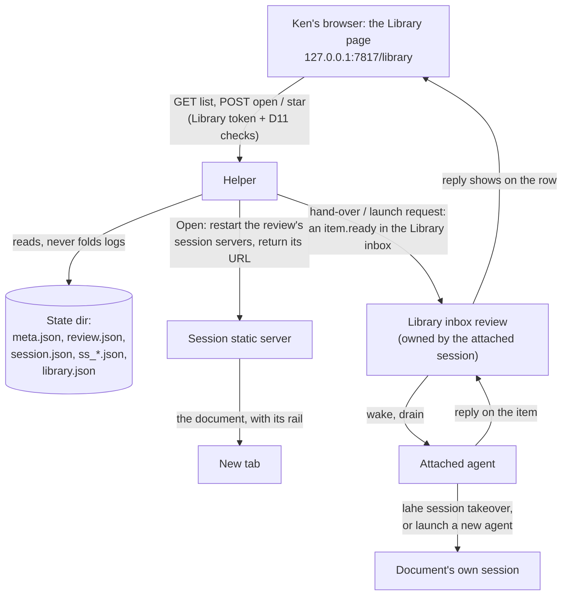
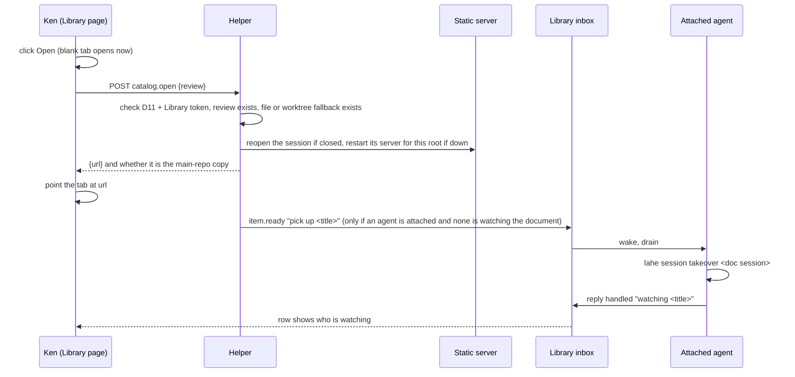
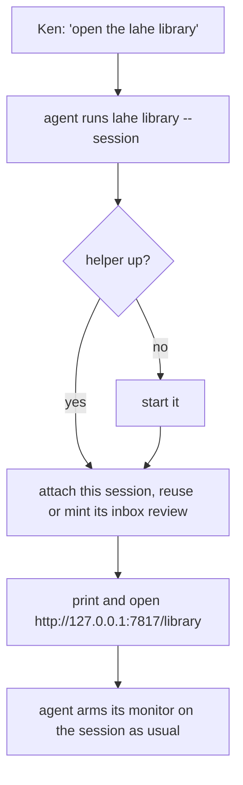

# Architecture: LAHE Library

## Summary

The helper gains its first HTML page: the Library, served at a fixed address on the helper's own port, `http://127.0.0.1:7817/library`. It lists every review from the records already on disk, grouped agent session, then review, then pages (wireframe B). Open and Star act directly through three new helper routes, checked the same way every other route is (decision D11), with one new credential: a Library token that only the Library page carries. Handing a document to an agent is not a new channel. `lahe library --session <id>` attaches an agent session to the Library and gives it one ordinary review, the Library inbox. Each hand-over or launch request becomes a normal comment item in that inbox, so the agent is woken, drains it, acts, and replies exactly as it does for any comment today.



## Analysis of Existing Structure

- **Everything the Library lists already exists on disk.** `meta.json` has the target, session and creation time. The last-written `review.json` has page titles, counts per state, and `ended_at`. `session.json` has the name. The session's `static-servers/ss_*.json` say what is being served, and `monitor.json` plus the liveness check say whether an agent is watching. Projection is lazy now, so the Library reads these files and never folds an `events.jsonl`.
- **The helper serves only JSON and the layer bundle today.** No route returns HTML, and every mutating route needs a per-review token. A page that acts on all reviews fits neither of the two auth classes (`NONE`, `REVIEW_TOKEN`), so the Library adds a third.
- **Reopening a closed session and its servers already exists** (`lahe session reopen`, `staticServers.restartAll`), and so does moving a session to another agent (`lahe session takeover`, with the `handoff_rev` fence). The Library calls the first in-process and asks an agent to run the second.
- **The helper stops when the last session closes.** Nothing keeps it up for an open page. The Library is the first page that must outlive every session.
- **Name collision.** The codebase already calls the in-page script "the library" (`library.get`, `/.lahe-library/lahe-layer.js`). The user-facing name stays Library; code, routes and files use `catalog` so the two never meet in a grep.

## Components / Modules Touched

- **Shared protocol:** three new routes and one new auth class, `CATALOG_TOKEN`. The route table and the order of D11's checks stay where they are.
- **Helper routes:** `catalog.page` (GET, the HTML), `catalog.list` (GET, JSON), `catalog.open`, `catalog.star`, `catalog.request` (POST each).
- **Catalog reader (new, service):** builds the list from the files above, with an mtime-keyed cache so a refresh re-reads only what changed. Owns the folding rule for old per-page reviews and the worktree fallback.
- **Catalog page (new, layer-side asset, not part of the rail bundle):** a static HTML page plus a small script, styled with the St. Clair document style the helper already serves.
- **State dir:** one new file, `catalog.json` (stars, the attached session, the Library token), written with the existing write-beside-and-rename helper.
- **CLI:** new `lahe library [--session <id>]`. `session close` learns one exception (Helper lifetime, below).
- **Static servers:** `restartAll` gains a single-session, single-root form so Open restarts only what it needs.
- **Skill and contract:** how an agent opens the Library, and how it handles the two inbox item kinds. Per the repo rule, the skill, the contract text, `docs/CONTRACTS.md`, the copy in `test/unit/review_format.test.js`, and the dist bundle change together.

## Data / State Changes

`<state>/catalog.json`, owner-only, like `service.json`:

```json
{
  "schema": 1,
  "token": "<random, minted on first run>",
  "stars": { "<review-id>": "2026-09-28T16:20:00Z" },
  "attached": { "session": "s_...", "inbox_review": "r_...", "at": "2026-09-28T16:02:00Z" },
  "page_seen_at": "2026-09-28T16:21:04Z"
}
```

- Stars are keyed by review id. For a folded row (several old per-page reviews shown as one), the star is on the newest review in the fold.
- `attached` is the last session that ran `lahe library --session`. The page shows its name before any click (R12a).
- The Library inbox is an ordinary review owned by the attached session. Its target is the Library page itself, so its items read naturally in `review.json` and in the drain. One inbox per attached session, reused across runs, so the no-empty-reviews rule holds.

Each hand-over or launch request is one item in that inbox:

```json
{
  "kind": "comment",
  "note": "Pick up \"Startup Studio, Class 2\" and watch it for comments.",
  "catalog_request": { "action": "pickup" | "launch", "review": "r_...", "session": "s_..." }
}
```

`note` is written by the helper from a fixed template and the stored title. `catalog_request` is the structured part the agent acts on; the review and session ids in it come from the helper's own records, never from the request body beyond the review id it validates.

## Key Flows

### Open (the default path)

Open reopens and hands over in one click (R8). The new tab is opened synchronously in the click handler and pointed at the URL when the helper answers, so the browser does not treat it as a popup.



- **Already being served (R10):** the helper returns the live URL and starts nothing.
- **Another agent is watching (R12b):** the page asks first, names that agent and lists the other reviews in its session. Confirming sends the same Open with `force_handover`.
- **No agent attached (R14):** Open still opens the document. No inbox item is made. The row and the document's rail both say no agent is watching, and offer the rail's existing hand-off message.

### Star

`POST catalog.star {review, starred}` writes `catalog.json` and returns the new state. Instant, no agent.

### Launch a new agent

Same shape as the hand-over: an inbox item with `action: "launch"`. The attached agent opens a new terminal window running its host with the takeover prompt, and names the new session after the document (R13). Open Question 1 asks whether the helper should also be able to launch directly, with no agent in between (the brief's Open Question 5).

### Reaching the Library



### Helper lifetime (R10a)

The Library page polls `catalog.list` every few seconds while visible and updates `page_seen_at`. `lahe session close` on the last open session leaves the helper running when `page_seen_at` is recent, and the helper stops itself once no session is open and the page has been silent for a minute. Documents opened from the Library keep the helper up the ordinary way, because Open reopens their session.

## Alternatives Considered

- **The Library as an ordinary LAHE review (crucible Approach A):** acting through comments only. Rejected by Ken: Open and Star must act directly.
- **A per-review token on every row:** the page would carry every review's token, which is exactly the "one page holds all the keys" risk D11 was written to avoid. One Library token that can do only three things (list, open, star) and can never post to a review is smaller.
- **Stable per-review addresses on the helper port (`/r/<id>/`):** old tabs would come back on their own. Rejected for now: it means the helper serves every review's files, which moves serving out of session-owned static servers. Ken is fine with a new port or the old one.
- **A new "hand-over" channel from page to agent:** a separate queue, wake type and reply shape. Rejected: a wake line with nothing to drain is the no-op token burn the monitor rules exist to stop. An inbox item reuses the wake, drain, reply and liveness machinery unchanged.
- **The helper runs `lahe session takeover` itself on Pick this up:** it would fence the old agent with no new agent actually listening, leaving a session nobody watches. Only an agent that will then watch should take a session over.

## Failure Modes / Edge Cases

- **Old per-page reviews (R5).** Within one session, reviews created before 2026-09-17 whose targets are single HTML files in the same folder fold into one row, titled from the folder, with the pages listed under it. Nothing on disk changes.
- **`review.json` never written.** About 200 reviews never recorded a page title because no page ever connected. The row falls back to the file name (R2). The reader never folds a log to fill the gap.
- **Worktree fallback (R9, R19).** Only when the recorded file is gone and its path sits under `<repo>/.claude/worktrees/<name>/`. The candidate is `<repo>/<rest>`, resolved by real path, must exist, must not be hidden, and must be a page. Open then starts a server rooted at the main-repo folder for the same review and says so on the page. Any other path is refused.
- **Origin after a restart.** A restarted server has a new port. The rail registers its loopback origin on load, which the helper accepts. A test proves a reopened document's rail can post a comment.
- **Double click (R12c).** `catalog.request` refuses a second open request for the same review while its inbox item is unanswered, and the row shows "waiting for <agent>".
- **Attached agent went away.** The page reads the attached session's liveness on every poll. A dead monitor flips the page to the no-agent state before Ken clicks, not after.
- **Two agents ran `lahe library`.** The last one is attached. The page shows its name, so Ken sees who will receive the work.

## Security & Privacy Notes

- **The Library token** lives in `catalog.json` (0600) and in the page the helper serves. The page is served only to a request whose Host is the helper itself, so a DNS-rebinding page cannot read it. Every catalog POST also needs the custom header, the JSON content type, and an Origin equal to the helper's own origin. A cross-site form or link can reach none of them.
- **What the token can do:** list, open (restart a server for a review that already exists, or its checked worktree counterpart), star, and file a fixed-template request in the inbox. It cannot write to any review's events, read comment text, or name a file.
- **The inbox note is helper-written.** No user text from the request reaches it. Titles in it come from `review.json` and are fenced like any other page-derived text in the contract.
- **Launching programs** is only through an agent in v1. The direct path in Open Question 1 would be the first time a web click starts a process, and gets its own security review before it is built.

## Test Strategy

- **Unit:** the reader (grouping, folding, fallback titles, missing and worktree rules, watching and served flags) against a fixture state dir, including one review with no `review.json`. The three routes: each D11 check refuses (wrong Host, missing header, wrong content type, foreign Origin, wrong token), a review token cannot call a catalog route, and the catalog token cannot call a review route. Stars survive a helper restart. The inbox item shape and the double-click refusal. Helper lifetime: the last close with a fresh `page_seen_at` leaves the helper up, and it stops after the quiet minute.
- **Browser (one named spec):** open the Library, click Open on a closed review, land on the document with its rail, post a comment, see the row show waiting and then answered by a stub agent. Screenshot in light and dark.
- **The contract copies** stay identical, checked by the existing review-format test.

## Open Questions

1. **Direct launch (brief Open Question 5).** v1 launches a new agent only through the attached agent. Should the helper also launch one directly when no agent is attached? It would run one fixed command (a new Terminal window running `claude` with the takeover prompt), macOS only, off unless a line in `user.env` turns it on, and it gets its own security review. Recommendation: build v1 without it and decide once the inbox path is in use.
2. **The name in code.** The UI says Library. Code and routes say `catalog`, because "library" already means the in-page script everywhere in this repo. Fine?

## Architect Review

Pending.

## Security Review

Pending.
