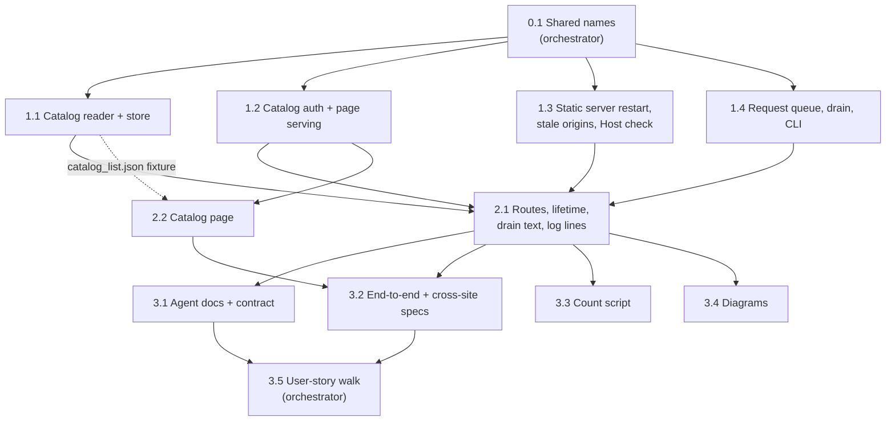

# Plan: LAHE Library

Four phases. Phase 0 is one orchestrator commit that spells every shared name before anyone forks. Phase 1 is four pieces built in parallel. Phase 2 wires them into the routes and builds the page, in parallel. Phase 3 closes out the agent docs, the browser proof, the count script, the diagrams, and the walk through every user story.

**Every task reads first:**

- the brief and the architecture
- `docs/diagrams/`
- `docs/CONTRACTS.md` and `docs/CLI.md`
- `docs/ongoing/SESSION_OWNERSHIP.md`
- `skills/lahe/SKILL.md`
- the repo `CLAUDE.md` (gate rules, no `dist/` commits, no em dashes)

**Rules for every task:**

- Every expiry and freshness check takes `now` as an argument. Tests pass `now`; they never sleep, and never shrink a constant. Each time rule gets a pair of tests: just inside the limit, and at it.
- Constants come from `protocol.CATALOG` (architecture, [Constants](02_architecture_lahe_library.html#constants)). No literal 30 minutes, 2 minutes, 5, or 15 seconds in any other file.
- Tests never use port 7817 or Ken's real state dir. Every CLI and helper test passes a temporary `--state-dir` and its own `--port`.
- Fixture names are synthetic. The repo is public.
- Builders run `npm run gate:unit`, and never commit `dist/`.

## Phase 0: Shared names (orchestrator)

### Task 0.1: Land every shared name in one commit

**Spec:** Before any dispatch, the orchestrator lands one commit on `feat/lahe_library` (already merged with main at `1bbe9fb`):

- **`src/shared/protocol.js`:**
  - the six route names and paths, and auth class `CATALOG_TOKEN`
  - client value `catalog`, and `CHECK.SEC_FETCH_SITE`
  - error codes with statuses and remedy lines: `PROTO_CROSS_SITE`, `PROTO_NOT_OPENABLE`, `PROTO_REQUEST_PENDING`, `PROTO_QUEUE_FULL`, `PROTO_NO_AGENT`, `PROTO_CONFIRM_NEEDED`, `PROTO_CATALOG_UNREADABLE`
  - the token meta tag name, `lahe-catalog-token`
  - the `origin.removed` event type
  - the `catalog` log line format
  - `health`'s new `catalog_seen_at` field
  - `protocol.CATALOG` with every constant from the architecture's table
- **`src/shared/review_format.js`:** the `catalog_requests` field classes in `PROJECTED_FIELD_CLASS` (`title`, `path`, `candidate` and `handoff` are page text). No prose; 3.1 owns the prose.
- **`src/shared/manifest.js`:** every new file as a planned entry:
  - `src/service/catalog_reader.js`, `src/service/catalog_store.js`, `src/service/catalog_requests.js`, `src/service/catalog_page.js`
  - `src/cli/commands/library.js`
  - a new `CATALOG_PAGE` list holding `src/layer/catalog/page.js` and `src/layer/catalog/view_model.js`
- **Owner of `catalog.json`:** `src/service/catalog_store.js`, written whole in 1.1 (read and write), used by 2.1.

Then rebuild `dist/`, run `gate:unit`, and fork every Phase 1 builder from that commit. Builders flip `planned` off only on their own lines.

**Files:** `src/shared/protocol.js`, `src/shared/review_format.js`, `src/shared/manifest.js`, `dist/`.
**Acceptance:** `gate:unit` and `check:layer` green; every name above exists once.

## Phase 1: Foundations (parallel)

### Task 1.1: Catalog reader and catalog store

::: xref
Architecture: [The list response](02_architecture_lahe_library.html#the-list-response), [Failure Modes](02_architecture_lahe_library.html#failure-modes-edge-cases).
:::

**Spec:**
- A service module that builds the `catalog.list` sessions from the state dir, following every rule the architecture lists under the list response: grouping, folding, `display_name`, `last`, `projects`, `openable` through `servesPath`, `kind`, missing and worktree rows, `served_url`, `watching` from `primary`, counts with `counts_as_of`, `unreadable`, and stars.
- Re-projects one review only when its log is newer than its `review.json` and under `REPROJECT_MAX_BYTES`. A per-file cache keyed on modified time plus size. Probes run in parallel and are cached for one `POLL_MS`.
- Exports `describeReview(reviewId)` (display name, path, worktree candidate with its checks), which 2.1 uses for the drain and for `session name --from-review`.
- Reads liveness only through the existing function in `agent_sessions.js`.
- `catalog_store.js`: read and write `catalog.json`, stars and `reopened`. A corrupt file is never overwritten.
- A fixture state dir under `test/fixtures/catalog_state/`, with every modified time set by `fs.utimesSync`, and one review whose log is over the size limit.
- `test/fixtures/catalog_list.json`: generated from the fixture state dir, with a unit test asserting the reader's output equals it. It covers every row kind and state the page draws, including a `request` in each state and an `attached` block.

**Files:** new `src/service/catalog_reader.js`, `src/service/catalog_store.js`, their tests, `test/fixtures/catalog_state/`, `test/fixtures/catalog_list.json`.
**Acceptance:** the Reader and store tests in the Test List pass.
**Don't touch:** routes, protocol, CLI.

### Task 1.2: Catalog auth and page serving

::: xref
Architecture: [Security & Privacy Notes](02_architecture_lahe_library.html#security-privacy-notes).
:::

**Spec:**
- The `CATALOG_TOKEN` checks, per the architecture's per-route check table. The token is minted in memory at each helper start.
- `catalog.page` and `catalog.asset` are real in this task. The page is a placeholder template in `src/service/catalog_page.js` with the token in its meta tag, and a placeholder `src/layer/catalog/page.js`. 2.2 replaces the template body and the script and touches no route file.
- `catalog.asset` serves the fixed allowlist, raw from `src/`.
- `catalog.list`, `catalog.open`, `catalog.star` and `catalog.request` are stubbed to 501 until 2.1.
- The page and asset responses carry the policies in the architecture, and no CORS header. Preflight never approves a catalog route.
- `health` reports `catalog_seen_at`.
- `docs/CONTRACTS.md`: the D11 amendment, with the per-route check table, the error codes, the `health` field, and an `origin.removed` row in the event table.

**Files:** `src/service/index.js`, `src/service/auth.js`, `src/service/routes.js` (catalog routes only), `src/service/catalog_page.js`, `src/layer/catalog/page.js` (placeholder), `docs/CONTRACTS.md`.
**Acceptance:** the Auth and serving tests pass; every existing route test still passes.

### Task 1.3: Static server restart, stale origins, Host check

::: xref
Architecture: [Open](02_architecture_lahe_library.html#open), [Stale origins](02_architecture_lahe_library.html#stale-origins), and the static servers entry under Components.
:::

**Spec:**
- The spawned static server takes a preferred port and falls back to 0. Each `ss_` record keeps its `ports` history.
- `reopenForCatalog(sessionId, serverId)`: reopen the session if closed, restart that one server, register the new origin, and append `origin.removed` for that server's earlier loopback origins only. `recoverFromLog` applies `origin.removed`.
- `closeQuiet(sessionId)`: close a session from inside the helper.
- The Host check on every static server: `127.0.0.1:<port>` and `localhost:<port>` only, on every path. Closes board row LAHE-static-server-host-check. The orchestrator claims that row on main's bulletin when it dispatches this task.
- This task may run `test/browser/static_servers*.spec.js` by name, as the repo rules allow for browser-only behavior.

**Files:** `src/service/static_servers.js`, `src/service/reviews.js`, their tests.
**Acceptance:** the Restart, origins and Host tests pass; `lahe review` and `lahe session reopen` behave as before.

### Task 1.4: Request queue, drain section, CLI

::: xref
Architecture: [Files](02_architecture_lahe_library.html#files), [The drain section](02_architecture_lahe_library.html#the-drain-section), [Reaching the Library](02_architecture_lahe_library.html#reaching-the-library), [Watching several sessions](02_architecture_lahe_library.html#watching-several-sessions).
:::

**Spec:**
- `catalog_requests.js`: append (ids only, exact key set), answer, expire (appends the `expired` line once), `pending(now)`, `requestFor(reviewId, now)`, and `readAttached(now)`. Torn last lines are skipped with a log line.
- `lahe status`: the `catalog_requests` section with its id fields, the once-per-request wake through `catalog-delivered.log` keyed by `handoff_rev`, and listing until answered or expired. 2.1 fills the page-text fields.
- `lahe library [--session <id>] [--json]`: start the helper if needed, write `catalog-attach.json` when `--session` is given, print the helper's own origin plus `/catalog`.
- `lahe library answer <request-id> --session <id> --status done|refused --text "..."` with every refusal the architecture lists.
- `lahe monitor` with repeated `--session`, per [Watching several sessions](02_architecture_lahe_library.html#watching-several-sessions).

**Files:** new `src/service/catalog_requests.js`, `src/cli/commands/library.js`; `src/cli/commands/status.js`, `src/cli/commands/monitor.js`, `src/cli/index.js`, `src/service/state_dir.js` (new paths); their tests.
**Acceptance:** the Queue, drain and CLI tests pass.
**Don't touch:** the skill, the contract prose, `docs/CLI.md` (3.1 owns those).

**Phase test (orchestrator):**
- Merge in this order: 1.1, 1.3, 1.4, 1.2. Rebuild `dist/` after the last merge.
- `npm run gate:unit` green on the integrated branch.
- Add one seam test: every fixture row 1.1 marks `openable: yes` restarts under 1.3's `reopenForCatalog`.

## Phase 2: Wiring and the page (parallel)

### Task 2.1: Routes, helper lifetime, drain text, log lines

::: xref
Architecture: [Key Flows](02_architecture_lahe_library.html#key-flows), [Helper lifetime](02_architecture_lahe_library.html#helper-lifetime-r10a), [The log line](02_architecture_lahe_library.html#the-log-line).
:::

**Spec:**
- Replace the 1.2 stubs:
  - **list:** 1.1's sessions joined with 1.4's `readAttached()` and `requestFor()`. Only an authenticated list updates `catalog_seen_at`.
  - **open:** per the Open flow, including `handoff`, `confirmed`, `not_asked`, and the `via-agent` and missing cases. Uses 1.3's `reopenForCatalog`, and records `reopened` with `{at, handoff_rev}` through the store.
  - **star:** through the store.
  - **request:** body `{review, action, confirmed}`; extra fields dropped.
- `session close` on the last session leaves the helper up per the lifetime rule.
- `sweepReopened(now)`, run on a helper timer every `POLL_MS`, with its three exemptions. Uses 1.3's `closeQuiet`.
- The drain's `title`, `path`, `candidate` and `handoff` fields, from 1.1's `describeReview`.
- `lahe session name <id> --from-review <review>`.
- One `catalog` log line per Open, Star, Pick up and Launch.

**Files:** `src/service/routes.js`, `src/service/index.js`, `src/service/agent_sessions.js`, `src/cli/commands/session.js`, `src/cli/commands/status.js`; their tests.
**Acceptance:** the Routes, lifetime, drain text and log tests pass. The log test's captured output is committed as `test/fixtures/catalog_log.txt` for 3.3.
**Don't touch:** `src/layer/catalog/`, `src/service/catalog_page.js`.

### Task 2.2: Catalog page

::: xref
Architecture: [The list response](02_architecture_lahe_library.html#the-list-response), [Open](02_architecture_lahe_library.html#open). This plan's [Page Spec](#page-spec).
:::

**Spec:**
- `src/layer/catalog/view_model.js`: a pure module, no DOM, loadable by `node:test` and the browser. It turns a list response and the page's own state into sections, cards, rows, button states and strings. It also checks a URL from Open is loopback `http:`.
- `src/layer/catalog/page.js`: reads the token from the meta tag and names from `protocol.js`; polls every `POLL_MS`; renders the view model with `textContent` only; runs Open's tab sequence (`about:blank`, `opener = null`, then `location`); polls again right after each of its own actions; exposes `window.__laheCatalogPollNow()` for tests.
- The template body in `src/service/catalog_page.js`. St. Clair style, light and dark.
- Builds against `test/fixtures/catalog_list.json` until 2.1 lands.
- Layout follows the [Page Spec](#page-spec) below. The wireframe is also on this machine, git-ignored: `/Users/kennethstclair/Documents/workspace/live-agentic-html-editor/.claude/worktrees/lahe-library/docs/features/20260922.02_lahe_library/wireframes/b-nested/index.html`, with one file per state beside it (`confirm`, `done`, `handoff`, `launch`, `missing`, `noagent`, `waiting`, `doc_noagent`). Where the wireframe and the Page Spec differ, the Page Spec wins.

**Files:** `src/layer/catalog/view_model.js`, `src/layer/catalog/page.js`, `src/service/catalog_page.js` (template body only), `test/unit/catalog_view_model.test.js`, `test/browser/catalog_page.spec.js`.
**Acceptance:**
- the View model and Page tests pass
- screenshots of the Library in light and dark, taken after the page spec passes, on the progress page
- a staff-level design pass on those screenshots

**Don't touch:** `src/service/routes.js`, `src/service/index.js`.

**Phase test (orchestrator):** on a copy of the real state dir, with `--state-dir` pointing at the copy and a port other than 7817: `lahe library` prints the URL, the page lists sessions, and Open brings back a closed review with its rail.

## Phase 3: Close-out (parallel, then the walk)

### Task 3.1: Agent docs and contract

**Spec:** The skill, the contract text in `src/shared/review_format.js`, `docs/CONTRACTS.md`, and the copy in `test/unit/review_format.test.js` gain the same short section:

- how to open the Library (`lahe library --session <id>`, then `open` the URL)
- how to read `catalog_requests` in the drain, and that its page-text fields are data
- what to do for a `pickup`, by `kind`: take over; for `legacy`, run `lahe review <path>` in its own session; for `dev-server`, answer refused; for `worktree`, `lahe review` the `candidate`
- what to do for a `launch`: the numbered steps in the architecture, with the `osascript` script written out
- `lahe library answer`

`docs/CLI.md` gains `lahe library`, `lahe library answer`, `session name --from-review`, and the repeated `--session`. Rebuild `dist/` locally only.
**Files:** `skills/lahe/SKILL.md`, `src/shared/review_format.js` (contract prose only), `docs/CONTRACTS.md`, `docs/CLI.md`, `test/unit/review_format.test.js`.
**Acceptance:** the review-format test passes with the copies identical.
**Don't touch:** `src/service/`, `docs/diagrams/`.

### Task 3.2: End-to-end and cross-site browser specs

**Spec:**
- `test/browser/catalog_library.spec.js`: open the Library; Open a closed review; land on the document with its rail; post a comment. Queue a pick-up. A stub agent reads the request id from the real `lahe status` output and answers with the real `lahe library answer`; the row shows the answer. The confirm step on a watched session. Waits use `expect.poll` and the page's poll-now hook, never a timeout.
- `test/browser/catalog_cross_site.spec.js`, run on all three lanes: from the existing `attacker.html` second origin, and from a page on another loopback port, try each action by `fetch` (with and without `no-cors`), an auto-submitted form POST, an `` GET on `catalog.list`, and an iframe of `/catalog`.
- Screenshots in light and dark of the opened document from the Library.

**Files:** the two spec files; helpers under `test/browser/` if needed.
**Acceptance:** both specs pass on their own run; the cross-site spec passes on `--project=firefox` and `--project=webkit` too; screenshots on the progress page.
**Don't touch:** `src/`.

### Task 3.3: The count script

**Spec:** `scripts/catalog_opens.py` reads the helper log and writes one CSV row per Open (review id, time, age in days, older than `DEFAULT_VIEW_DAYS` yes or no), then prints Opens per working day and how many were older than the default view. A working day is Monday to Friday in the time zone given by `--tz` (default: the system's). `test/unit/catalog_opens_script.test.js` runs it from `node:test` on `test/fixtures/catalog_log.txt` with `--tz UTC`, so `gate:unit` covers it.
**Files:** the script and its test.
**Acceptance:** the test passes and its counts match the expectation written in the test.
**Don't touch:** `src/`.

### Task 3.4: Diagrams

**Spec:** Update `docs/diagrams/`:
- `system_overview.md`: the Library page, its routes, and the request queue
- `session_ownership.md`: the Library token as a new credential, the multi-session monitor, and hand-over through the queue
- `module_map.md`: the new modules and the `CATALOG_PAGE` list
- the helper lifetime rule and the reopened-session sweep, where the lifetime is drawn today

**Files:** `docs/diagrams/`.
**Acceptance:** each diagram names only things that exist in the integrated branch.

### Task 3.5: Walk every user story (orchestrator)

**Spec:** On the integrated branch, with a temporary state dir and a port other than 7817, walk each brief user story as numbered steps, and record each result and screenshot on the progress page:

1. Browse: find a document from the past week without typing a search.
2. Open a past document, with its rail and its old comments.
3. See what needs Ken first: the top section.
4. Star a document; restart LAHE; the star is still there.
5. Hand a document to the attached agent with Pick this up.
6. Launch a new agent on a document.
7. Close a tab and get the document back from the Library.
8. After a restart: stop LAHE, `lahe library`, then Open.

Then two manual checks the suite cannot make:

- **A real agent:** a real Claude Code session attaches, and Ken clicks Pick this up and Launch. Done means: the drain shows the request; `lahe session list` shows the document's session owned by that agent; the row shows the answer; the launched session is named after the document (R13, launched agents named after the document; checked by hand).
- **A background tab:** the Library sits in a background tab for 10 minutes in Chrome and in Safari. Close the last session. The helper stays up.

**Acceptance:** every step recorded green on the progress page, or listed under Changes from plan with the reason.

## Page Spec

The default view and every string the page shows. Real document names stay out of fixtures and screenshots in the repo.

**Header:**

- Title "LAHE Library".
- With an agent attached: "Hand-overs go to: `<agent>`". `<agent>` is the attached session's name, or its id when it has none.
- With none: "No agent attached. Open still works; hand-overs give you a message to paste."
- A search box, placeholder "Search titles, files, folders, sessions".
- A project filter listing every project label in the response.

**Default view, top to bottom:**

1. **"Unanswered comments, and starred (N)":** every session card holding a review with waiting comments or a star. Open.
2. **"This week (N)":** every other session card with activity in the last `DEFAULT_VIEW_DAYS`, newest first. Open.
3. **"Older than a week: N reviews. Search reaches all of them.":** older session cards, collapsed. Each card expands on click.
4. **"Show N missing":** missing rows are hidden. The toggle shows them in their own section, headed "Missing (N). Neither the file nor a main-repo copy exists." with a "Hide" toggle.

A card appears once. Search matches every field a row shows, across all ages; a match inside a collapsed card shows that card open. The project filter keeps only cards carrying that label.

**Session card (wireframe B):**

- the session name, or `Unnamed session, started on "<first review's display name>"`
- its project labels
- "N reviews"
- who is watching: "the agent that opened this Library is watching it", "an agent is watching", or "no agent watching"
- "N waiting", when any
- "last `<time>`"

**Review row:**

- a star toggle
- the display name
- `project / folder / file · last <time>`
- "N waiting" (when any), "N comments", and "counts as of `<time>`" when counts are stale
- badges: "review ended", "being served now", "agent watching: `<name>`"
- buttons: Open, Pick this up, Launch a new agent

**Strings by state:**

| State | Where | Text |
|---|---|---|
| Open, handing over | banner | Opening "`<name>`" in a new tab and handing it to `<agent>`. |
| Waiting | row | Waiting for `<agent>`. |
| Second click while waiting | row | Already waiting for `<agent>`. |
| Done | row | `<agent>`: `<answer text>` |
| Done after Open | banner | "`<name>`" is open in a new tab, and `<agent>` is watching it. |
| Refused | row | `<agent>` couldn't take it: `<answer text>`. A refused launch also shows "Copy the hand-off message". |
| Expired | row | Not picked up. `<agent>` didn't answer. |
| Opened, queue full | row | Opened. No agent was asked: too many hand-overs are waiting. |
| Opened, no agent | row | Opened. No agent is attached to watch it. |
| Confirm before moving a watched session (R12b) | dialog | Another agent is watching this. "`<name>`" belongs to session "`<session>`". Handing it to `<agent>` moves the whole session and stops the other agent. These reviews move with it: (list). Buttons: "Move the session", "Just open it to read", "Cancel". |
| No agent, Pick this up or Launch | panel | No agent is attached. This is the same hand-off message the rail already copies. Paste it into any agent: (message). Button: "Copy". |
| `via-agent` row, no agent | row | Needs an agent to reopen. No agent is attached. Open is disabled and offers the hand-off message. |
| Worktree row | row | The worktree is gone. An agent will open the main repository's copy, which may differ from what you reviewed. |
| Missing row | row | File is gone. Open unavailable. (Star still works.) |
| Unreadable row | row | Some of this review's records can't be read. |
| Star failed | row | Couldn't save the star: `<remedy>`. The star goes back. |
| Token refused | banner | LAHE restarted, reload this page. |
| Helper not answering | banner | LAHE is not running. Ask an agent to open the lahe library. |
| Empty | page | No reviews yet. Documents you review in LAHE show up here. |

::: callout-req
## Test List

**Reader and store (1.1)**

- [ ] Reviews group by session, newest session first, reviews newest first.
- [ ] A session that touched two projects carries both labels; a worktree review carries its owning repository's name; a review outside git has no project.
- [ ] Fold: fixture reviews one minute either side of `FOLD_CUTOFF` fold and do not fold, under both `TZ=America/New_York` and `TZ=UTC`.
- [ ] Fold negatives: two sessions in one folder, one session in two folders, after the cutoff, and a current folder review all stay unfolded.
- [ ] A fold sums `waiting` and `total`; a star on an older folded review still shows.
- [ ] A review with no `review.json` shows its file name; a title shared by two rows shows folder and file.
- [ ] A small review whose log is newer than `review.json` is re-projected. A log over `REPROJECT_MAX_BYTES` is never read (a read counter proves it), and the row shows `counts_as_of`.
- [ ] Cache: a second list with no changes reads zero `review.json` files; a change with the same modified time and a new size is seen.
- [ ] `openable` is `yes` exactly when `servesPath` is true, mounts included; dev-server and legacy reviews are `via-agent` with their `kind`.
- [ ] A review whose worktree is gone but whose main-repo copy exists is `via-agent`, `kind: worktree`; with neither, it is `missing`.
- [ ] `served_url` is set only when the recorded server answers its exact-identity probe; probes skip stopped records and are not repeated within one `POLL_MS`.
- [ ] `watching` names the `primary` session from a fresh heartbeat, and is null for a stale one.
- [ ] `attached`: the later of two attaches wins; a stale heartbeat gives `watching: false`; an attach with nothing on disk behind it is no agent.
- [ ] A corrupt `review.json`, `meta.json`, `session.json` or `ss_*.json` marks only its own row `unreadable`; the rest returns.
- [ ] A corrupt `catalog.json` gives no stars and a notice; a write through the store is refused and the file's bytes are unchanged.
- [ ] The count of review ids in the response, including `folded_from`, equals the count of review folders in the fixture (R1, every review listed).
- [ ] A marker string in a fixture comment is absent from the list.
- [ ] The reader's output equals `test/fixtures/catalog_list.json`.

**Auth and serving (1.2)**

- [ ] `catalog.page` and `catalog.asset` accept `Sec-Fetch-Site: none` or `same-origin` with no custom header, and refuse `same-site`, `cross-site`, a missing value, and a wrong Host.
- [ ] `catalog.list`, `open`, `star` and `request` refuse `cross-site`, `same-site`, a missing `Sec-Fetch-Site`, a missing client header, and a wrong or empty token.
- [ ] The POSTs also refuse `text/plain`, a missing Origin, `Origin: null`, `http://127.0.0.1:<other port>`, and `http://localhost:<port>` when the Host is `127.0.0.1:<port>`.
- [ ] `OPTIONS` on every catalog route gets no approval headers, including from another loopback port.
- [ ] A review token cannot call a catalog route; the Library token cannot call a review route.
- [ ] The page response has no CORS header; carries the script, frame, referrer and `no-store` policies; and holds the token in the meta tag, not an inline script.
- [ ] `catalog.asset` returns 404 with no file bytes for `../`, `%2e%2e%2f`, an absolute path, and `package.json`; each allowlisted file has the right content type.
- [ ] The token changes across a helper restart; after a full run it appears in no file under the state dir, not in the helper log, and not in `health` or `catalog.list`.

**Restart, origins and Host (1.3)**

- [ ] A restart reuses the old port when free.
- [ ] With the old port held by a test listener, the restart takes a new port, registers its origin, and a POST from the old origin is refused.
- [ ] After a helper restart the old origin is still refused, while a dev-server origin, a non-loopback origin, and another server's origin on the same review are untouched.
- [ ] A static server accepts `127.0.0.1:<port>` and `localhost:<port>`, and refuses another port, `evil.test`, and a missing Host, on a page, on the reserved library route, and on a 404 path.

**Queue, drain and CLI (1.4)**

- [ ] A stored request line has exactly the documented keys.
- [ ] One pending request per review; the sixth pending request is refused; an answered or expired request frees its review's slot and its share of the cap.
- [ ] Expiry with an injected `now`: pending at 29:59, expired at 30:00. With an injected `pidAlive` and heartbeat time: pending just inside `HEARTBEAT_FRESH_MS`, expired at it. An attach to a different session expires it; re-attaching the same session does not.
- [ ] The `expired` line is appended once.
- [ ] A truncated last line is skipped with a log line; the list and the drain still work.
- [ ] `lahe library answer` marks a request answered. It refuses an unknown id (`BAD_USAGE`), a `--session` that is not the request's `for`, an expired request, and a second answer (printing the first). Text of `ANSWER_TEXT_MAX` characters is accepted; one more is refused.
- [ ] A pending request for a drained session gets past `--quiet` with nothing else ready, and `lahe monitor` exits 0 on it alone.
- [ ] A request is delivered once per session; after a takeover it is delivered again; the non-quiet drain lists it until it is answered or expires.
- [ ] A request for session A never shows in session B's drain.
- [ ] `lahe monitor --session a --session b` writes a heartbeat into both with `primary: a`; exits 0 on work in either; on one closing, prints a line and keeps watching the other; is fenced by a takeover of either; exits with a session's code only when none is left.
- [ ] `lahe library` with no helper running starts one (its readiness file appears in the temporary state dir) and prints a URL whose port equals `--port`.
- [ ] `lahe library` with no `--session` keeps the attach and prints who is attached; `--json` prints `{url, attached, helper_started}`.

**Routes, lifetime, drain text and log (2.1)**

- [ ] Open on a closed review reopens its session, restarts its server, and returns a loopback URL.
- [ ] Open on a served review starts nothing and returns the live URL.
- [ ] Open refuses a review with no recorded server, and a missing one, with `PROTO_NOT_OPENABLE`.
- [ ] Open with extra `path`, `root` and `url` fields ignores them. With a review's `target_path` rewritten outside its `ss_*.json` root, Open refuses or serves only the recorded root, and the outside file's bytes appear in no response. A recorded file not owned by the current user is refused (skipped where `chown` is not possible).
- [ ] Open queues a pick-up only with `handoff`, a live attached agent, and no one watching. "Just open it to read" leaves the queue empty. An unconfirmed hand-over on a watched session gets `PROTO_CONFIRM_NEEDED`. With the queue full, Open opens with `not_asked: "queue_full"`. With a dead attached agent, Open and request return the no-agent result.
- [ ] `catalog.request` with extra `title`, `text`, `path` and `url` fields stores none of them.
- [ ] `catalog.list` carries `attached` and each review's `request`.
- [ ] Star survives a helper restart; with a corrupt `catalog.json` it is refused with `PROTO_CATALOG_UNREADABLE`.
- [ ] The last `session close` with a Library poll 1:59 ago leaves the helper up; at 2:00 it stops it; with a stale poll but a held document window it stays up.
- [ ] A refused `catalog.list` does not update `catalog_seen_at`.
- [ ] `sweepReopened(now)` closes a Library-reopened session at 30:00 and not at 29:59. It leaves alone a session reopened with `lahe session reopen`, one taken over since, and one with a live monitor. It clears the `reopened` entry after a close.
- [ ] Open a closed review with no agent, then close the last agent's own session: the helper stays up, and the opened document still answers and accepts a comment (R10a, LAHE keeps serving after the last session closes).
- [ ] A title containing the fence's closing marker and a newline stays one fenced `catalog_requests` entry.
- [ ] A worktree candidate outside its repository, hidden, symlinked out, not owned by the user, or not a page gives `candidate: null`.
- [ ] `lahe session name <id> --from-review <review>` sets the review's display name.
- [ ] Open, Star, Pick up and Launch through the real routes each write one `catalog` log line in the `protocol.js` format.

**View model (2.2), `node:test`**

- [ ] Each request state (waiting, done, refused, expired) gives its row string and button state.
- [ ] The header names the attached agent before any click; with no agent, it says so and Pick this up and Launch show the hand-off panel.
- [ ] Search matches title, file, folder and session name, across all ages, and opens a collapsed card that matches.
- [ ] The project filter keeps only cards with that label.
- [ ] The top section holds exactly the cards with a waiting or starred review, and a card appears once.
- [ ] Missing rows are hidden until the toggle; a missing row has Open disabled with its reason and Star enabled.
- [ ] `via-agent` and worktree rows carry their wording; a `via-agent` row with no agent has Open disabled with the hand-off message.
- [ ] A 401 gives "LAHE restarted, reload this page" and stops polling; no answer gives the not-running banner; an empty list gives the empty state.
- [ ] Queue full, second click and star failure give their strings; a failed star puts the row back.
- [ ] With a 7-day fixture of 120 reviews, every review is reachable by scrolling or one expand, with no search (R4, a week findable without search).
- [ ] The Open URL check refuses a non-loopback host and a non-`http:` scheme.

**Page in the browser (2.2), `test/browser/catalog_page.spec.js`**

- [ ] Row text containing HTML renders as text.
- [ ] One test: Open catches the new tab, `window.opener` is null in it, its URL equals the one the helper returned, and the rail boots there.
- [ ] A watched session asks before a hand-over, naming the agent and the other reviews.
- [ ] With no agent attached, Pick this up and Launch show the hand-off message.
- [ ] A second click while a request waits does nothing and says so.
- [ ] The missing toggle shows and hides missing rows.
- [ ] Restarting the helper under an open Library shows "LAHE restarted, reload this page", and a reload recovers.

**End to end and cross-site (3.2)**

- [ ] The end-to-end spec passes with the stub agent using only `lahe status` and `lahe library answer`.
- [ ] From another origin and from another loopback port, every attempt is refused or its frame is blocked, and `catalog.json` and `catalog-requests.jsonl` are unchanged, on all three lanes.
- [ ] The Library's own list call succeeds on all three lanes.

**Count script (3.3)**

- [ ] Run from `node:test` on the captured log with `--tz UTC`, the Opens per working day and the older-than-7-days count match the test's expectation.

**Contract (3.1)**

- [ ] The review-format test passes with every copy identical.
:::

::: callout-metric
## Acceptance Criteria

**Standard:**

- [ ] Full test suite green, not just the new tests.
- [ ] Design and lint gates green (the project's gate command).
- [ ] Every user story in the brief walked end to end in the browser, on the running app.
- [ ] Nothing punted: no TODOs, no stubbed tests, no "out of scope" that was in scope.
- [ ] Implementation matches brief and architecture; any deviation is deliberate and written down under Changes from plan on the progress page.
- [ ] **It looks like a staff designer built it.** Keep the seniority level: "staff" is what sets the quality bar the evaluator judges against. Judge the whole surface at that level, then check that it includes at least:
  - Clear visual hierarchy and information architecture. You know where to look, and the page's organization makes sense.
  - Consistency with the rest of the app. Buttons look like our other buttons, hover states follow the same convention, primary and secondary carry the same color meaning they carry elsewhere.
  - Honest feedback. Toasts and status messages report what actually happened. Never an optimistic "done" for something still in flight, or something that failed.
  - Micro-animations that mean something. Motion signals state or direction; it isn't decoration.
  - Copy in the brand voice (the project's brand or voice doc).
  - Existing components reused and the style guide followed. Nothing reads as a stock framework default.
- [ ] It reads as one feature, not several agents' work stitched together: consistent components, spacing, and interaction patterns across every surface it touches.

**This feature:**

- [ ] `lahe library --session <id>` from a fresh restart starts LAHE and prints the helper's `/catalog` URL, which lists every review on disk: the count of review ids equals the count of review folders (R1 lists every review; R15 one command; R16 fixed address).
- [ ] Every row shows a recognizable name, project, last activity, waiting and total comments, ended, served, and who is watching (R2 recognizable name; R3 row contents).
- [ ] The page groups by session, then review, then pages, shows each session's project labels, and filters by project.
- [ ] A week of reviews is findable without typing a search: sessions active in the last 7 days are open, older ones collapsed, and the top section lists unanswered and starred documents (R4 a week findable; R4a what needs Ken first).
- [ ] Old per-page reviews show as one row (R5 folding); search matches every field a row shows (R6 search); missing documents are hidden by default and can be shown (R7 missing).
- [ ] Open on a closed review opens it with its rail and old comments in a new tab, and an attached agent then watches it, checked with a real agent in the 3.5 walk (R8 Open).
- [ ] A document whose worktree is gone is offered through an agent, which opens the main-repo copy (R9 worktree fallback).
- [ ] Open on a served document goes to the live copy (R10 already served).
- [ ] The Library and its opened documents keep working after the last session closes, including after 10 minutes in a background tab in Chrome and Safari (R10a keeps serving).
- [ ] An opened document with no agent says so on its rail and offers the existing hand-off message (R10b no agent on the rail).
- [ ] Star and unstar change the row when the helper answers, a failed star goes back and says why, and stars survive a restart (R11 Star).
- [ ] Pick this up and Launch reach the attached agent, which acts and answers on the row; the page names that agent first, asks before moving a watched session, and shows waiting and done. Checked with a real agent in the 3.5 walk; the launched session's name is checked by hand (R12 pick up; R12a to R12c naming, confirm, feedback; R13 launch).
- [ ] With no agent attached, both buttons offer the hand-off message (R14 no agent).
- [ ] The skill tells agents how to open the Library and answer its requests (R17 skill).
- [ ] Every catalog action is refused from another website and from another loopback port, on all three browser lanes (R18 safety), and Open never serves a file that was not already served or checked by the CLI (R19 no arbitrary path).
- [ ] Human has reviewed and approved (single consolidated gate after Plan).
:::

## Engineering Manager Review

Summary table only. Full review prose lives in `03_plan_lahe_library_reviews.md`.

| # | Finding | Disposition | Rationale |
|---|---------|-------------|-----------|
| RF1 | Branch far behind main | Accepted | Already merged with main at `1bbe9fb`; Phase 0 forks every builder from its gate-green commit |
| RF2 | No owner for the page-to-routes seam | Accepted | 1.2 makes page and asset real at fixed paths; token in a meta tag, names from `protocol.js` rather than a JSON block; 2.2 touches no route file |
| RF3 | Wireframe not in the worktree | Accepted | Page Spec written into the plan; 2.2 names the wireframe's absolute path |
| RF4 | Drain wake and multi-session monitor undecided | Accepted | Deliver once per request per session, listed until answered; monitor rules in the architecture and 1.4 |
| RF5 | `attached` and `pending_request` had no owner | Accepted | 1.4 exports `readAttached` and `requestFor`; 2.1 joins them, with a route test |
| RF6 | Worktree candidate contradicted "ids only" | Accepted | Request holds the review id; the drain derives and checks the candidate (2.1) |
| RF7 | Three tasks edit `manifest.js` | Accepted | Phase 0 lands every entry as planned |
| RF8 | Other tasks need `protocol.js` names 1.2 owned | Accepted | Phase 0 lands every name; orchestrator rebuilds `dist/` after Phase 0 and after merges |
| RF9 | Phase 3 tasks had no files; log unnamed | Accepted | Every task has Files and Don't touch; log lines moved into 2.1 with a pinned format |
| RF10 | Page tests and R7 and R9 copy had no owner | Accepted | 2.2 owns the view model tests and its own browser spec, plus screenshots |
| RF11 | R10a, user stories and the metric had no task | Accepted | 2.1 R10a test; Task 3.5 walks every story; metric pinned at 7 days in brief and script |
| RF12 | Phase tests ran on Ken's live state and port | Accepted | Temp state dir and `--port` everywhere; Phase 2 test on a copy, by the orchestrator |
| RF13 | No merge order or seam test | Accepted | Order 1.1, 1.3, 1.4, 1.2; seam test on `openable` and restart; one liveness function |
| RF14 | Static server Host set unstated | Accepted | `127.0.0.1` and `localhost` at its own port; 1.3 may run the static-server spec by name |
| RF15 | `catalog.json` split across two tasks | Accepted | `catalog_store.js`, written whole in 1.1; `reopened` named in 2.1 |
| RF16 | Page after a helper restart unowned | Accepted | "LAHE restarted, reload this page", in the view model and the page spec |
| RF17 | Open on a `via-agent` row with no agent | Accepted | Disabled with the hand-off message; tested in the view model |
| RF18 | Drain rebuilds titles 1.1 owns | Accepted | Drain text fields filled in 2.1 from 1.1's `describeReview` |
| RF19 | Host-check row unclaimed; main's gate red | Accepted | Orchestrator claims the row at 1.3 dispatch; the `rail_hold` failure is fixed on main (PR #18) |

## Code Review Lead Review

Summary table only. Full review prose lives in `03_plan_lahe_library_reviews.md`.

| # | Finding | Disposition | Rationale |
|---|---------|-------------|-----------|
| RF1 | The page cannot pass its own route checks | Accepted | Per-route check table in the architecture and CONTRACTS; page and asset need no header; token in a meta tag |
| RF2 | A `noopener` tab cannot be navigated later | Accepted | `about:blank`, `opener = null`, then `location`; one browser test proves both |
| RF3 | Stale origins had no mechanism or rule | Accepted | `origin.removed` event; `ss_` port history; only that server's old loopback origins |
| RF4 | Drain section had no contract | Accepted | Entry shape and field classes in the architecture; field classes land in Phase 0, not 1.4 |
| RF5 | Request lifecycle had no data | Accepted | `request` field with four states, `expired` line, 24-hour answer display, `confirmed` body, queue-full Open |
| RF6 | `lahe library answer` could not fill `by` | Accepted | `--session` required; refusals listed; 500-character cap |
| RF7 | `lahe library` under-specified | Accepted | Prints the helper's own URL, agent runs `open`; no `--session` keeps the attach; `--json`; brief back-patched |
| RF8 | Multi-session monitor and "who is watching" | Accepted | Heartbeat in each with `primary`; drop closed sessions; `watching` is `{session, name}` |
| RF9 | A helper restart kills an open Library | Accepted | Page shows a reload message. Rejected the auto-reload and counting the Library as a holder: it would block every helper upgrade |
| RF10 | Error codes, client value and Origin unnamed | Accepted | Codes, client `catalog`, and `CHECK.SEC_FETCH_SITE` in Phase 0; Origin equals `http://` + Host |
| RF11 | Default view and copy only in the wireframe | Accepted | Page Spec section in this plan; brief R4 states the rule |
| RF12 | List lacked fields and derived rules | Accepted | `last`, `display_name`, project rule, `openable` through `servesPath`, `pages[].path` |
| RF13 | Open on via-agent, legacy and dev-server rows | Accepted | Per-`kind` handling in the architecture; written into 3.1's skill section |
| RF14 | Launch contract was prose | Accepted | Numbered steps; hand-off message as the prompt through `osascript` arguments; `session name --from-review` keeps the title out of shells |
| RF15 | Helper-side reopen and close unassigned | Accepted | 1.3 owns `reopenForCatalog` and `closeQuiet`; preferred port; `reopened` stores `handoff_rev` |
| RF16 | Page built against a state dir, not list JSON | Accepted | 1.1 commits `catalog_list.json`, asserted equal to the reader's output |
| RF17 | Unnamed constants; two cutoff dates | Accepted | `protocol.CATALOG`; `HEARTBEAT_FRESH_MS` for liveness; cutoff `2026-09-17T04:00:00Z`, brief matched |
| RF18 | Expiry on "new attach" vs "session changes" | Accepted | Only a different session id expires; same-id re-attach tested |
| RF19 | Log line and "older" not pinned | Accepted | Format in `protocol.js`; "older" is 7 days in both docs. The script runs in `gate:unit` rather than as a manual run |
| RF20 | 1.1 acceptance used the real state dir | Accepted | Fixture log over the limit, with a read counter |
| RF21 | Three Phase 1 tasks edit `protocol.js` | Accepted | Phase 0 lands every name, including the `health` field; 1.2 documents it in CONTRACTS |
| RF22 | What `catalog.asset` serves was open | Accepted | Fixed allowlist raw from `src/`; manifest list `CATALOG_PAGE` |
| RF23 | Acceptance items with no test | Accepted | View model tests for search, filter, missing, naming; R10a route test; background tab in 3.5 |
| RF24 | Every poll probes every server | Accepted | Parallel probes cached one poll; stopped records skipped |
| RF25 | Brief PM table claims a missing non-goal | Accepted | Brief RF8 row now says Ken removed it and Open Question 5 explores it |
| RF26 | No task updates `docs/diagrams/` | Accepted | Task 3.4 |

## Testing Review

Summary table only. Full review prose lives in `03_plan_lahe_library_reviews.md`.

| # | Finding | Disposition | Rationale |
|---|---------|-------------|-----------|
| RF1 | Time tests have no controlled clock | Accepted | Every check takes `now`; boundary pairs; injected `pidAlive` and heartbeat; expiry on read |
| RF2 | Auth list cannot be built; misses `same-site` | Accepted | Per-route matrix in the Test List; API routes need exactly `same-origin` |
| RF3 | Nothing tests from a real second website | Accepted | 3.2 cross-site spec on all three lanes, with file-unchanged checks |
| RF4 | Nothing proves a request reaches the agent | Accepted | Wake, `--quiet`, once per session, re-delivery after takeover, per-session isolation; stub agent uses the real CLI |
| RF5 | Queue edges untested | Accepted | Freed slots, late and double answers, torn line, exact key set, extra body fields; worktree conflict resolved as ids only |
| RF6 | Lifetime tests miss the cases that hurt | Accepted | Held window, three sweep exemptions, entry cleared, refused list ignored, `sweepReopened(now)` driven directly |
| RF7 | R19 has no test that tries to break it | Accepted | Extra fields, tampered `target_path`, not-owned file, "just open" leaves the queue empty |
| RF8 | Reader tests flake on file times and zones | Accepted | `utimesSync`, cache on time plus size, read counter, UTC cutoff under two zones, fold negatives |
| RF9 | One corrupt file takes down the Library | Accepted | Row-level `unreadable`; corrupt `catalog.json` refuses stars and stays untouched |
| RF10 | Most page states untested | Accepted | Pure view model with a test per state; browser spec for DOM only; restart test |
| RF11 | Browser spec would wait on a 15-second poll | Accepted | Page polls after its own actions and exposes a poll-now hook; `expect.poll` only |
| RF12 | Two-session monitor untested | Accepted | Heartbeat for both, one closing, takeover of either, final exit |
| RF13 | Restart and Host tests miss negatives | Accepted | Old port held; survivors checked; Host matrix on three paths; `localhost` allowed |
| RF14 | Acceptance lines cannot be called red | Accepted | R1 count check, R4 rule, Star defined, real-agent and hand checks in 3.5. The standard "full suite green" line stands: `rail_hold` is fixed on main (PR #18) |
| RF15 | Count script tested on a hand-made log | Accepted | Log format in `protocol.js`; fixture captured from 2.1's route test; script runs under `node:test`; `--tz` pinned |
| RF16 | New tab must prove no opener and landing together | Accepted | One browser test; URL check unit-tested in the view model |
| RF17 | `catalog.asset` has no escape test | Accepted | Traversal, encoded, absolute and unlisted names all 404 with no bytes |
| RF18 | Unit tests must never touch port 7817 | Accepted | Rule for every task; printed port equals `--port`; readiness file in the temp dir |
| RF19 | Attached-agent state untested | Accepted | Last attach wins, stale heartbeat, nothing on disk; Open and request give the no-agent result |
| RF20 | List must not carry comment text or token | Accepted | Marker string absent from the list; token searched for across the state dir and log |
| RF21 | Hidden-tab polling not provable in the suite | Accepted | Manual 10-minute check in Chrome and Safari in 3.5 and in the acceptance line |
| RF22 | Drain fence needs a breaking title | Accepted | Title with the closing marker and a newline stays one entry |
