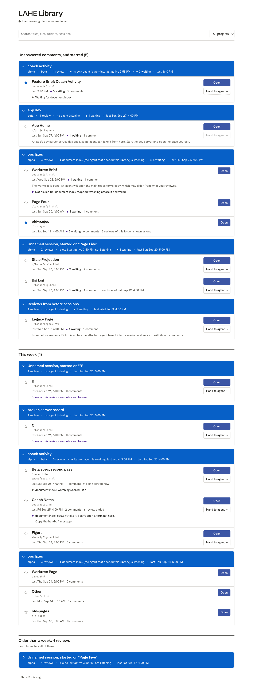
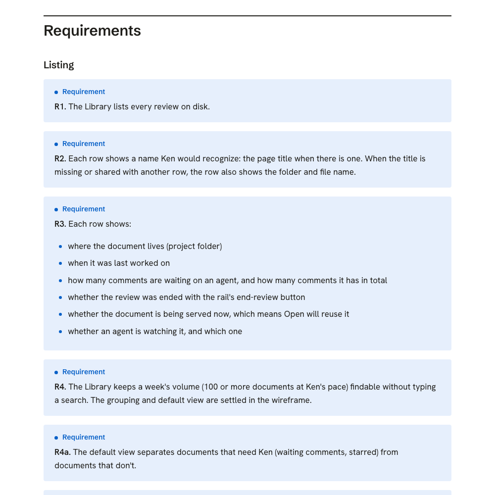
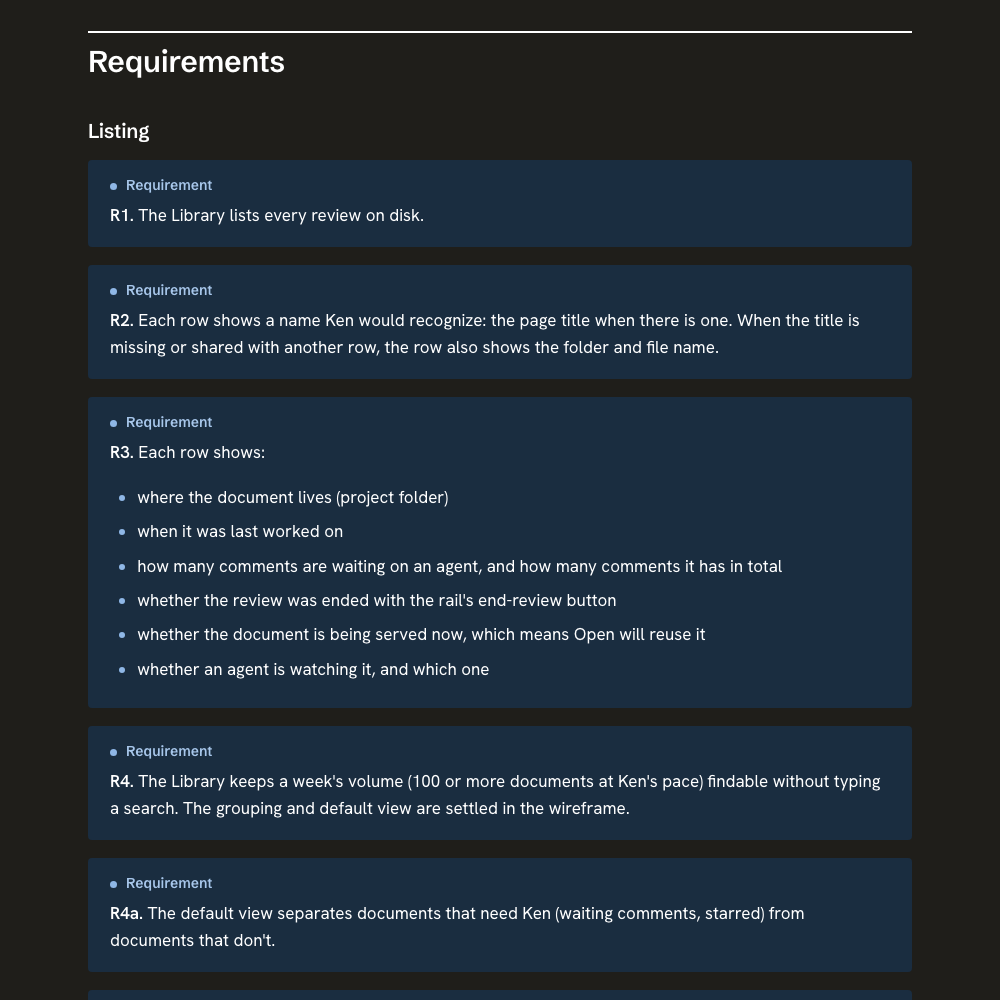

# Progress: LAHE Library

**Phase 8, Ship.** The PR is open: [#19](https://github.com/kenxle/live-agentic-html-editor/pull/19). Every review finding is fixed and the full suite passed apart from two Firefox tests from main. Two things are waiting on you. Last updated 2026-09-29 13:47.

**Docs:** [Crucible](http://127.0.0.1:54705/00_crucible.html) · [Brief](http://127.0.0.1:54705/01_brief_lahe_library.html) · [Wireframes](http://127.0.0.1:54705/wireframes/index.html) · [Architecture](http://127.0.0.1:54705/02_architecture_lahe_library.html) · [Plan](http://127.0.0.1:54705/03_plan_lahe_library.html) · [Ideas page](http://127.0.0.1:55480/DOCUMENT_INDEX_IDEAS-b09cd11f2a84063f.html)

## Needs your attention

- [ ] **Approve PR #19** (https://github.com/kenxle/live-agentic-html-editor/pull/19) so I can merge it. Its automated check runs on GitHub now. After the merge, the Library goes live here once the main LAHE folder pulls main and the helper restarts, which I'll do when you say.
- [ ] **May I take this LAHE session back?** Another copy of me took it over by mistake yesterday and then handed it back. Until I run `lahe session takeover`, comments you leave on this page reach nobody. I'm asking because the rule is to take a session over only when you say so.

## Currently working on

Nothing is running. Next: merge PR #19 once you approve and its check passes.

## Phases

| Phase | Status | Changed |
|---|---|---|
| 0 Setup | done | 2026-09-22 |
| 1 Crucible | done | 2026-09-22 |
| 2 Brief | done | 2026-09-22 |
| 3 Wireframe | done | 2026-09-28 |
| 4 Architecture | done | 2026-09-28 |
| 5 Plan | done | 2026-09-28 |
| 6 Implement | done | 2026-09-28 |
| 7 Review | done | 2026-09-29 |
| 8 Ship and land | in progress | 2026-09-29 |
| 9 Cleanup | not started | |

## The record

### Task index

| Phase | Task | Short name | Status | Detail | Outcome |
|---|---|---|---|---|---|
| 0 | 1 | shared names | done | commit 000c40b | Routes, auth class, error codes, constants and manifest entries landed; unit gate green. |
| 1 | 1 | list reader and star store | merged | `task/lib-reader`, progress/phase1_task1_reader.md | Builds the Library's list from records on disk, folds old per-page reviews, and never reads a large log. A corrupt stars file is refused, never overwritten. 1366 unit tests pass. One rule is copied from the server code for now; step 2.1 moves it to one place. |
| 1 | 2 | auth and page serving | merged | `task/lib-auth`, progress/phase1_task2_auth.md | The Library's key lives only in the page; every Library request passes the same-site checks; the page and its files are served with no cross-site access. It also closed an old gap: a page on another local port could get preflight approval for any path. 1330 unit tests pass. |
| 7 | A | agent-facing safety fixes | merged | `task/lib-fix-agent`, progress/phase7_fix_round.md | Page titles never reach a new agent's prompt; file paths never go into a shell command (`lahe library serve`); owner and symlink checks; a strict page content policy. |
| 7 | B | service fixes | merged | `task/lib-fix-service` | Open on a folder lands on the right page; no double servers on a double click; stars on grouped rows unstick; "watching" is judged one way everywhere. |
| 7 | C | page and test fixes | merged | `task/lib-fix-tests` | One "Hand to agent" menu per row, fewer status colors, the rail's button color, phone width; 13 test fixes. |
| 7 | D | final-review fixes | merged | `task/lib-fix2` | A page can no longer steer which folder an agent serves or starts in; Launch refused where it could mislead; idle Library sessions close themselves; pre-session reviews open fresh; a Firefox focus bug fixed. |
| 3 | 3 | count script and fixes | merged | `task/lib-fixes`, progress/phase3_task3_script_and_fixes.md | The count script works on the fixture log. The session card now names the watching agent once. The request file is read once per refresh, not once per row. |
| 2 | 2 | the Library page | merged | `task/lib-page`, progress/phase2_task2_page.md | The page, built on wireframe B, with every state unit-tested and 12 browser tests passing. Screenshots below. |
| 2 | 1 | wiring and lifetime | merged | `task/lib-wiring`, progress/phase2_task1_wiring.md | List, Open, Star and hand-over requests work end to end on the helper; LAHE stays up while the Library is open; quiet reopened sessions close again. The copied server rule now lives in one place. The helper's version number went up, so an older running helper gets replaced. |
| 1 | 4 | request queue and CLI | merged | `task/lib-queue`, progress/phase1_task4_queue.md | The queue that hands a document to an agent, its place in the agent's drain, `lahe library`, and a monitor that watches several sessions. 1373 unit tests pass. |
| 1 | 3 | restart and Host check | merged | `task/lib-restart`, progress/phase1_task3_restart.md | A restarted server tries its old port first and swaps its origin; every page server now refuses a foreign Host. 1331 unit tests pass. |

### Loop passes

| Pass | Dispatched | Red after evaluation | Note |
|---|---|---|---|
| 3 | Four fix rounds, then the final adversarial review | nothing | Every finding from six reviews and the story walk fixed, each with a test. |
| 2 | Everything merged | Open on a folder review; the page contradicting itself; redundant hand-over requests; design polish | Story walk: 4 of 8 stories green, 3 partial, 1 red. Five reviews: 2 security and about 20 correctness findings. All in one fix round now. |
| 1 | Phase 1 tasks 1.1 to 1.4 | not evaluated yet | Merged at 6c872d7, unit gate 1449 pass, 0 fail. Evaluators run after Phase 2. |

### Changes from plan

- **Attaching to the Library.** A bare `lahe library` starts a fresh session for the calling agent and attaches it; the session closes itself after 30 quiet minutes with no reviews. The approved design required an existing session. You chose this over requiring an existing session.
- **Session cards name the watching agent once** ("watched by <agent>") instead of the Page Spec's unnamed "an agent is watching", and rows no longer repeat it.
- **One "Hand to agent" menu per row** holds Pick this up and Launch; Open stays visible. The plan had three buttons per row.
- **Launch is refused on pre-session and worktree rows,** with the reason on the page. The design allowed it; the final review found it could tell a new agent to take over a session nobody pointed at.
- **Pre-session reviews are picked up as a fresh review;** their old comments stay on the old one. Only 15 of 531 reviews are affected.
- **`lahe library serve <request-id>`** is new. The agent serves a worktree or pre-session document through it, so a file path never goes into a shell command.
- **One hand-off message builder,** shared by the rail and the Library, with an option for the Library's wording and the real `--state-dir`.
- **The Library's logic lives in its own module,** `catalog_actions.js`, not in `routes.js`.
- **List fields the architecture did not name:** a top-level `notice`, each row's `project`, the request's expiry `reason`, and `attached.closed`.
- **`lahe session reopen` also prefers the old port** when it restarts a server.
- **Launch passes the hand-off message through a file,** and changes into the document's project folder when one is known.
- **The count script** writes its CSV to a file (`--csv`) and its summary to the terminal.
### Follow-ups

### Cleanup queue

Nothing queued.

### Test results

Test count and how often tests ran are kept apart. The full suite runs at the end (release tier), and again after any code change.

| When | Command | Result | Duration |
|---|---|---|---|
| 2026-09-28, after Phase 3 merged | `npm run gate` (Chromium) | 413 passed, 1 failed: a page test that read a request before it arrived; fixed with a poll | 3.5 min |
| 2026-09-28, after the first three fix rounds | `npm run gate:all` | 1259 passed, 1 failed: Library Open end to end, Firefox only; a real focus bug, fixed | 9.9 min |
| 2026-09-29 12:58, all fixes in | `npm run gate:all` | 1721 unit and 1265 browser passed, 0 failed | 12 min |
| 2026-09-29 13:05, after merging main (128 commits) | `npm run gate:unit` | 1887 passed after two fixes where main's trimmed drain met the Library | under 1 min |
| 2026-09-29 13:15 | `npm run gate:all` | the browser run did not start: the merge left one function defined twice; removed | |
| 2026-09-29 13:28 | `npm run gate:all` | 1887 unit and 1312 browser passed, 1 failed: `oversized_records.spec.js` in Firefox, which fails on plain main too (board row LAHE-oversized-image-firefox) | 12.8 min |
| 2026-09-29, after merging main's 4 newest commits | `npm run gate:unit`, then `npm run gate:all` | 1886 unit and 1326 browser passed, 2 failed, both Firefox tests from main: the image test that fails on main too, and `window_goodbye` which passed 8 of 8 alone (board rows) | 14.8 min |

### Ship

- PR [#19](https://github.com/kenxle/live-agentic-html-editor/pull/19) opened, waiting on your approval and its CI run.

## Log

- **2026-09-29 13:44.** Main moved while this was in review: 128 commits, including one that stops idle page servers after two minutes and one that trims what an agent's drain prints. Both are merged in beside the Library. Two follow-ups are on the board: a Firefox test from main that fails on main too, and lint missing a function declared twice.
- **2026-09-29 12:39.** A second copy of me took this LAHE session over by mistake, then handed it back and stood down. Nothing was lost.
- **2026-09-29 12:21.** You chose: a bare `lahe library` starts a session for the agent that runs it, and that session closes itself after 30 quiet minutes with no reviews.
- **2026-09-28 18:27.** Story walk on a test copy: browsing, starring, getting a closed tab back, and coming back after a restart all work. Open on a folder of pages (like these forge docs) landed on "not found", and the page sometimes said an agent was watching in one spot and not in another. Both are in the fix round, with a design pass: fewer status colors, the rail's button color, and one "Hand to agent" menu per row instead of three buttons. Screenshots of the walk are in the `eval/` folder (not committed; they show real document names).
- **2026-09-28 17:39.** The Library page is built. First look, from the page's own browser test (fixture data, not your real records):

  

  One change is on the way: each row repeated "agent watching", so the session card will say it once instead.
- **2026-09-28 16:53.** Plan reviewed by three agents (engineering manager, code lead, testing): 67 findings, all accepted, 4 of them with one part turned down (written in the plan's tables). You cleared the design on the architecture page, so the plan went straight to building; the plain-language pass on the plan was skipped. One addition to confirm when you read the plan: `lahe session name --from-review`, so a launched agent is named after its document without the title passing through a shell command.
- **2026-09-28 16:53.** The linked-docs fix shipped: [PR #17](https://github.com/kenxle/live-agentic-html-editor/pull/17) merged after the Hold test fix, [PR #18](https://github.com/kenxle/live-agentic-html-editor/pull/18). It goes live here once the main checkout catches up and the helper restarts.
- **2026-09-28 16:33.** Architecture reviewed: the architect found 4 blockers and security found 4, all accepted. The biggest change: handing a document to an agent no longer goes through a comment in an inbox review (a page could have forged it, and it would never have reached the agent). It is now a queue only the helper writes, shown to the agent as its own section of the drain. Open only restarts servers a review already had, and anything else goes through an agent. The Library's address is `/catalog`, because "library" already means the in-page script in this code.
- **2026-09-28 16:17.** The forge doc template now uses the St. Clair AI style; only its stylesheet changed, and new builds pick it up. The brief and crucible are rebuilt with it.

  

  
- **2026-09-28 16:11.** Wireframe gate closed on your nested model: each agent session is a card, its reviews sit inside, and a review with several pages lists them (direction B). Open hands the document to an agent by default.
- **2026-09-28 16:05.** Back on the forge template. The brief and crucible had been served as raw Markdown with hand-written links and no callouts; they now go through `build_feature_docs.py`, which adds the nav bar (Crucible, Brief, Architecture, Plan, Wireframes, Progress), the callout boxes, and the PM review under the brief. The crucible is renamed `00_crucible.md` so the build finds it, and the wireframes live in the feature folder's `wireframes/`, git-ignored because the repo is public. The whole folder is one review now, so the editor follows every nav link. Comments left on the old Markdown pages stay there.
- **2026-09-28 16:03.** The first wireframes were lost: the wireframing skill writes to a temp folder, and the system cleared it on Sep 27. Rebuilt in `~/Documents/lahe-library-wireframes`, outside the repo because the repo is public and the pages show real document names. B is now your nested layout. Open now hands the document to an agent by default, per your brief edit.
- **2026-09-28 16:03.** Your brief edits folded in: Open includes an agent watching; rows show total comments and whether a review ended; old per-page reviews show together; the pick-up and no-agent paths reuse the existing hand-over; launching an agent straight from the page is Open Question 5.
- **2026-09-28 16:03.** Side fix shipped for review: links between documents keep the editor. [PR #17](https://github.com/kenxle/live-agentic-html-editor/pull/17).
- **2026-09-22 08:45.** Wireframes built from real records: 483 reviews fold into 242 documents; 105 worked on this week, 13 need you, 29 missing. 202 reviews never recorded a page title, so many rows fall back to the file name. "One row per review" looked the same as "one row per document" after folding, so direction C groups by project instead.
- **2026-09-22 08:43.** Clarity pass applied to the brief: 16 passages rewritten for plain reading. No requirement changed.
- **2026-09-22 08:41.** PM review returned 17 findings, 3 of them blockers: the Library dying when the last session closes, the worktree fallback contradicting the serve-only-reviewed-files rule, and Pick this up cutting off a working agent. All accepted. Full review: [PM review](http://127.0.0.1:54705/01_brief_lahe_library.html).
- **2026-09-22 08:37.** Crucible accepted on the rail. You chose Approach B because Open and Star have to act directly. Launching a new agent is in scope. What a row is, and how the view handles volume, go to the wireframe.
- **2026-09-22 08:17.** Branch `feat/lahe_library` and its worktree created.
