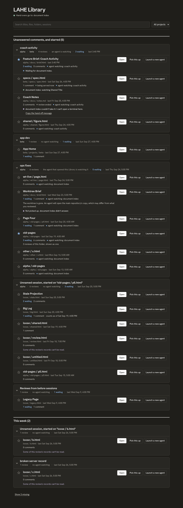

# Phase 2, Task 2.2: the Library page

**Summary.** The Library page is built: a pure view model with 95 unit tests, the page script, the template body and its style, and a browser spec of 12 tests. It is built against `test/fixtures/catalog_list.json` because Task 2.1's routes still answer 501. Results:

- `npm run gate:unit`: 1546 tests, 1544 pass, 0 fail, 2 todo. Both todos are older tests in `anchor_cases.test.js`.
- `npx playwright test test/browser/catalog_page.spec.js`: 12 passed (Chromium).

Branch `task/lib-page`, off `feat/lahe_library` at `6c872d7`.

Both screenshots come from the spec's last test, in the same run as the tests that prove the page. They use the fixture list, the clock fixed at the fixture's `now`, and UTC.

## What was built

- **`src/layer/catalog/view_model.js`** (new). A pure module with no DOM and no clock. It loads in the browser as `LAHE.catalogViewModel` and in node through `module.exports`.
  - `build(list, state, now, opts)` returns the whole view: header, banner, sections, cards, rows, button states, the dialog, and the missing section.
  - `decide(list, state, review, action, options)` says what a click on Open, Pick this up or Launch should do, before anything is sent.
  - State updaters return a new state and never change their input: `withFetch`, `withQuery`, `withNote`, `beginOpen`/`afterOpen`, `afterRequest`, `beginStar`/`afterStar`, and the rest.
  - `isLoopbackHttpUrl` is the Open URL check.
  - Every string in the Page Spec's table is spelled once, in `TEXT`.
- **`src/layer/catalog/page.js`** (replaces the 1.2 placeholder). It owns the network, the DOM and the order of events:
  - It reads the token from the meta tag, and every name and `POLL_MS` from `protocol.js`.
  - It polls every `POLL_MS` whether or not the tab is visible, and again right after each of its own actions.
  - It stops polling for good on a 401.
  - Open's tab sequence: `about:blank`, then `opener = null`, then `location`, but only after the URL check passes. Otherwise it closes the tab.
  - All text goes in through `textContent`, and there is no path to `innerHTML`.
  - One click listener handles every button, so nothing is bound per row.
  - Focus comes back by key after each re-render, so a keyboard user is not sent to the top of the page on every poll.
  - It exposes `window.__laheCatalogPollNow()`.
- **`src/service/catalog_page.js`**:
  - the template body, with fixed landmarks for the header, the tool bar, the banner, `main` and a `<dialog>`
  - the `view_model.js` script tag
  - `PAGE_STYLE`, an inline `<style>` for the page's own look, in light and dark
  - The head's meta tag, the stylesheet link, and the headers are unchanged.
- **`src/shared/manifest.js`**: `planned` is off for `view_model.js`.
- **`test/unit/catalog_view_model.test.js`** (new, 95 tests). It covers every item under "View model (2.2)" in the Test List, plus the extra states the page needed.
- **`test/browser/catalog_page.spec.js`** (new, 12 tests). It covers every item under "Page in the browser (2.2)", plus:
  - a URL-refusal test
  - a Cancel and Escape test
  - a star test
  - the screenshots

## How the browser spec is wired

- **The page is real.** A real helper serves `/catalog` and its assets, on port 0 with a temporary state dir. So the content policy, the meta tag and the script loading are the ones that ship.
- **The list call reaches that real helper first,** through `route.fetch`, so its auth is real. After a restart, the old token really does get a 401. A 200 or a 501 is then answered with the fixture, so the spec keeps working once 2.1 lands.
- **Open, star and request are answered by the test.** The test also checks that the page sent the client header, the token, and the JSON content type.
- **The Open test boots a real rail.** A second helper holds a review, and the app fixture serves a page with the layer. The stubbed Open returns that page's URL. The test catches the new tab and checks three things:
  - `window.opener` is null
  - the tab's URL equals the one returned
  - `window.__lahe.booted` becomes true

## Design decisions

- **Layout follows wireframe B:**
  - the masthead
  - a tool bar that stays on screen (search and the project filter)
  - three sections under the house's hanging rule
  - session cards as `
`, so opening and closing one works with the keyboard for free
- **Buttons:** Open is the one filled button in each row. Pick this up and Launch are outlined. The quiet actions (Hide, Cancel, Copy the hand-off message) are underlined text. A button that is waiting on an agent gets a dashed outline.
- **Honest status:**
  - After Open, the banner does not say "is watching" until the agent's answer arrives.
  - A star changes only when the helper answers.
  - A request shows "Waiting for" at once, because the helper has already queued it by then.
- **Motion only where something is in flight:**
  - a pulsing dot on a waiting row
  - a pulsing star while its save is pending
  - a short arrival on a new banner
  - All three are off under `prefers-reduced-motion`.
- **Badges are dots and words, not pills.** The house rules forbid pills. Green means served, blue means an agent is watching, and grey means ended.
- **Dark mode uses the `--lib-*` names.** They point at the shared tokens, which are never redefined. The dark values are the ones the feature-doc template already uses. The vendored bundle is light only, so the page declares `color-scheme: light dark` itself.
- **Missing rows are left out of cards**, including out of the card's counts and the rule for the top section. So a card never jumps to the top because of a row you cannot see. When the missing section is shown, it lists those rows flat, each with its session's name.
- **A card's search match:** if a search matches a card's own title, the whole card shows. Otherwise only the matching rows show.

## Deviations (Changes from plan)

1. **Strings the Page Spec does not have.** Each one sits beside its constant in `TEXT` with a comment:
   - `"<name>" is open in a new tab. Waiting for <agent> to start watching it.` This fills the gap between the tab opening and the agent's answer. The spec's done banner would have claimed too early that the agent is watching.
   - `"<name>" is open in a new tab.` This is for Just open it to read, and for Open with no hand-over.
   - `<agent> is attached but has stopped watching. ...` This covers an attach with `watching: false`. "No agent attached" would be untrue there.
   - `Reviews from before sessions` is the title of the reader's `legacy` group. "Unnamed session, started on ..." would be wrong for it.
   - `N reviews of this folder, shown as one` appears on a folded row.
   - Six failure lines:
     - a non-401 list error, with the helper's own words
     - a blocked pop-up
     - a URL the check refused
     - copy succeeded, and copy failed
     - a request refused because the queue is full
2. **The stars-unreadable notice is spelled in the view model.** It is not read from `failures.js`, because the asset allowlist is fixed and its test pins it exactly. I did not add `failures.js` to the allowlist; that is 1.2's contract. In the browser, `protocol.js` loads with `failures` undefined, which is harmless, because only `errorBody` uses it.
3. **The hand-off message is always built with `stateDirFlagNeeded: false`.** The list does not say whether the helper runs on a non-default state dir.
4. **Pick this up and Launch are disabled on missing rows,** along with Open. The spec only says Open is unavailable, but an agent cannot pick up a file that is gone.
5. **Open on a row with a request already waiting** opens it to read, with `handoff: false`, rather than asking the agent a second time. On a via-agent row, it says "Already waiting".

## Surprises

- **Playwright's `route.fetch` drops `Sec-Fetch-Site`.** It replays a request without the headers the browser adds at the network layer, so the real helper refused every forwarded list call with `PROTO_CROSS_SITE`. The spec puts back `same-origin`, which is the page's real value. A test also asserts that the real helper accepted the token, with a 501 or a 200 and never a refusal.
- **The house column rule outranks a single class.** Its specificity is (0,2,0), so the `<dialog>` picked up the page column's width and gutter. The style doubles the dialog's class to win.
- **One test expectation was wrong while the code was right.** A search for "old-pages" also shows the whole of `s_old3`, because that unnamed card is titled after `old-pages / p5.html`. I fixed the test, not the rule.

## Matching Task 2.1's real Open answers

The orchestrator passed on two answer shapes from 2.1's `catalog_actions.js`. The page now handles both:

- **`url: null` with a `request_id` on a servable row.** No server could be restarted, so the helper queued a pick-up instead. The page closes the blank tab, shows no "open in a new tab" banner, and shows the row as waiting for the agent. Before this fix, the page treated the null as a bad address and said so. The new browser test failed against the old code and passes against the new.
- **`not_asked: "request_pending"`.** The tab opens, the banner says only that it is open, and the row says "Already waiting for `<agent>`."

## Follow-ups

- **After 2.1 merges:** run this spec once on the integrated branch. The list stub passes a real 200 through as the fixture, so it should stay green.
- **Task 3.2:** once the routes are real, run the end-to-end spec against the real list rather than the fixture. This spec keeps working either way.
- **Possible:** have the list report whether a `--state-dir` flag is needed, so the Library's hand-off message matches the rail's exactly (deviation 3).
- **Design pass for Ken:** every row repeats "agent watching: <name>", as the Page Spec asks. It is quiet, but a card with seven rows says it seven times. The card could carry the name once instead.

## Cleanup needed

- `node_modules` in this worktree is a symlink to the main checkout's `node_modules`, made so the gate and Playwright could run. It is untracked and not committed. Remove it at cleanup, or leave it until the worktree is torn down.
- The scratch screenshots from the design pass are under the session scratchpad in `/tmp`, so they need no removal.
