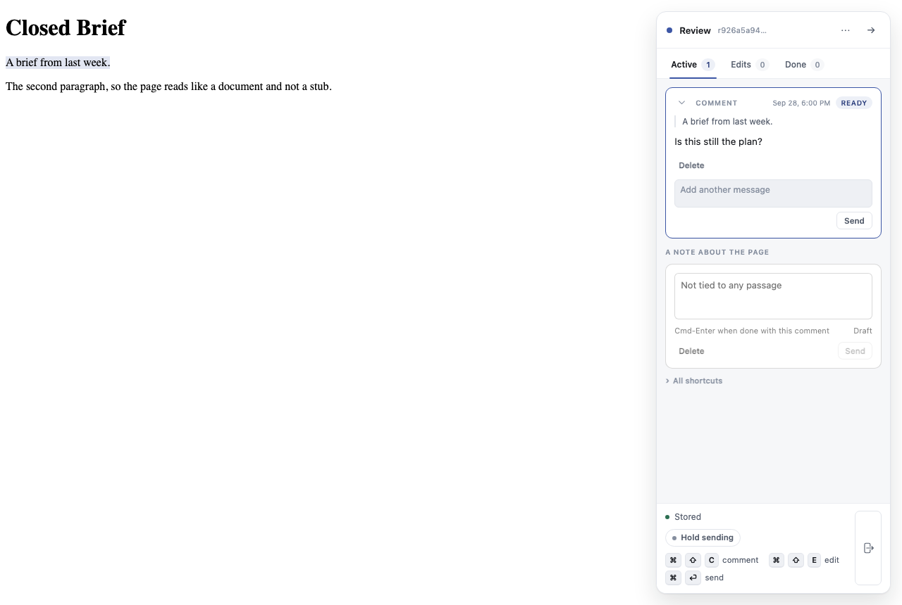
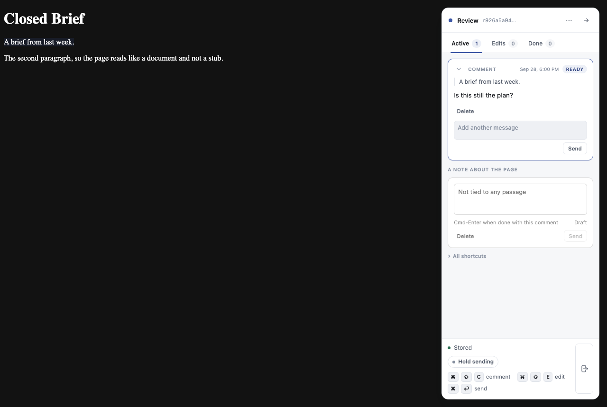

# Phase 3, Task 3.2: end-to-end and cross-site browser specs

**Summary.** Both specs are written and pass. No product bug was found, and nothing in `src/` changed.

- `test/browser/catalog_library.spec.js` on Chromium: 3 passed, 0 failed.
- `test/browser/catalog_cross_site.spec.js`, one lane at a time:
  - Chromium: 2 passed, 0 failed
  - Firefox: 2 passed, 0 failed
  - WebKit: 2 passed, 0 failed
- `npm run gate:unit`: 1587 tests, 1585 pass, 0 fail, 2 todo. The two todos are the older `anchor_cases.test.js` ones.

Branch `task/lib-e2e`, off `feat/lahe_library` at `8b0c544`.

Both screenshots come from the end-to-end spec's first test, in the same run that proves it. The Library opened a review whose session was closed. The comment on the rail was typed in that tab and reached the helper's log. The document declares `color-scheme: light dark`, so it follows dark mode. The rail stays light in the dark shot, because the rail has no dark theme today.

## What was built

- **`test/browser/support/catalog_world.js`** (new). Builds a Library world with the real CLI, on a free port and a temporary state dir:
  - `lahe review` for each document, each in its own session unless the spec names another doc's session
  - `lahe session close` for the ones marked closed
  - `lahe library --session` to attach the stub agent, then one drain
  - the stub agent's two verbs: `drainRequests()` runs `lahe status --session <id> --json --quiet`, and `answer()` runs `lahe library answer`
  - readers for `catalog.json`, `catalog-requests.jsonl`, the helper log, a review's `events.jsonl`, and `lahe session list`
  - `teardown()` closes every session, then stops the helper by its pid. The helper has to be stopped that way: the Library polled recently, so the last `session close` leaves it up, as the lifetime rule says.
- **`test/browser/catalog_library.spec.js`** (new, 3 tests). Nothing on the page's side is stubbed. A real `lahe monitor` runs on one session, so another agent really is watching it.
  1. **Open a closed review.** The new tab has no opener and lands on the reopened server. The rail boots there. `lahe session list` shows the session open again. A comment typed in the tab reaches the review's `events.jsonl`. Open also queued a pick-up for the stub agent, so the banner says it is waiting. The stub agent reads the request from `lahe status` and answers it. The row then shows the answer, and the banner says the agent is watching.
  2. **Pick this up.** The row says it is waiting. The drain entry carries the right session, `kind`, title, path, and hand-off message. A second click sends nothing and says so. The stub agent answers, and the row shows the answer. The answered request leaves the drain, and a second answer is refused.
  3. **The confirm step on a watched session.** The dialog names the session and the attached agent, and lists the other review that moves with it. Nothing is queued before the reader chooses. After "Move the session", the request carries `moves_with`. The stub agent refuses it, and the row shows the refusal.
- **`test/browser/catalog_cross_site.spec.js`** (new, 2 tests, all three lanes). Both attacking pages are the existing `attacker.html`:
  - **another site:** `http://localhost:<port>/attacker.html`. The browser sends `Sec-Fetch-Site: cross-site`.
  - **another loopback port:** `http://127.0.0.1:<port>/attacker.html`. The browser sends `same-site`.

  From each page, every action is tried in every shape:
  - `fetch` in cors mode, with the JSON type, the Library's client header, and the real Library token, as if it had leaked
  - `fetch` in no-cors mode
  - `sendBeacon`
  - an auto-submitted `text/plain` form POST
  - an `` GET on `catalog.list`
  - an `<iframe>` of `/catalog`

## How the specs check their claims

- **Waits.** No fixed timeouts. The page's `window.__laheCatalogPollNow()` hook runs inside `expect.poll`. Node-side waits use `pollUntil`: for a drain entry, a file change, or a helper log line.
- **Cross-site effects.** Each spec checks what changed, not the status code, the same way `harness_second_origin.spec.js` does:
  - `catalog.json` and `catalog-requests.jsonl` are byte-for-byte unchanged.
  - The closed session a forged Open names is still closed, and its review's log has no new line.
  - Health's `catalog_seen_at` does not move.
- **Every attempt is accounted for.** Each attempt that reaches the helper is waited for as a named refusal in the helper log. That log line has to name `sec_fetch_site` as the failed check. So an attempt that never arrived would fail the test instead of passing quietly.
- **Cors attempts** must reject in the page with a `TypeError`. The helper never approves the preflight, so the request itself is never sent.
- **The Library's own control run is in the same test,** on the same lane and state dir. The real Library page lists, which moves `catalog_seen_at`. Its star lands in `catalog.json`, and its pick-up lands in `catalog-requests.jsonl` and the drain. This covers "the Library's own list call succeeds on all three lanes".
- **Sec-Fetch-Site values.** The value each lane sent is recorded on the test as an annotation. All three lanes sent `cross-site` from localhost and `same-site` from the other port.

## Changes from plan

- **The iframe is refused before any page is sent.** The browser's frame navigation carries `cross-site` or `same-site`, and `catalog.page` accepts only `none` or `same-origin`. So the helper answers 403, and `frame-ancestors 'none'` never comes into play. The spec checks three things:
  - the browser saw the 403
  - the helper logged the refusal
  - the same request, replayed from node with the value that lane sent, returns no token and no page

  It does not look inside the frame, for two reasons:
  - Firefox draws a refused JSON answer in its own JSON viewer, and Playwright's evaluate inside that viewer hangs.
  - Firefox and WebKit do not keep the body of a response the frame then navigated away from.
- **Display names in the end-to-end spec are file names, such as `closed / brief.html`.** None of these reviews had been opened in a browser, so no title was recorded. The Library then names a review by its folder and file (R2, file names shown when no title exists). The drain's title for the reopened review is accepted either way, because the rail may have reported the title by the time the drain runs.
- **No per-row "agent watching" text is asserted,** because a parallel fix moves that name onto the session card.

## Surprises

- **`dist/` was stale on the branch.** The opened document's rail loads the bundle, so I rebuilt it locally with `npm run build:layer` for the runs. It is not committed.
- **The rail has no dark theme.** In the dark screenshot the document goes dark and the rail stays light. This is how the rail is today, and it is outside this task. It may be worth a board row.

## Follow-ups

- **Orchestrator:** `gate` and `gate:all` at the checkpoint will pick these specs up. Measured on the last runs: the cross-site spec took 36.4 s on Firefox, 35.6 s on WebKit and 33.4 s on Chromium; the end-to-end spec took 28.8 s.
- **Possible:** a dark theme for the rail, so a document opened from a dark Library does not show a light rail.

## Cleanup needed

- `node_modules` in this worktree is a symlink to the main checkout's `node_modules`, made so the gate and Playwright could run. It is untracked and not committed.
- `dist/lahe-layer.js` is modified locally by the rebuild and not committed. Discard it at cleanup: the orchestrator rebuilds `dist/` once per checkpoint.
- Test state dirs are under the OS temp folder (`lahe-library-world-*`), and a scratch try-out is in the session scratchpad under `/tmp`. Neither needs removal.
