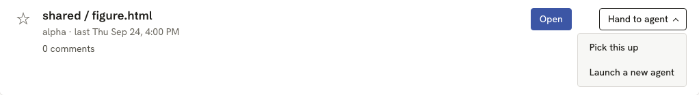
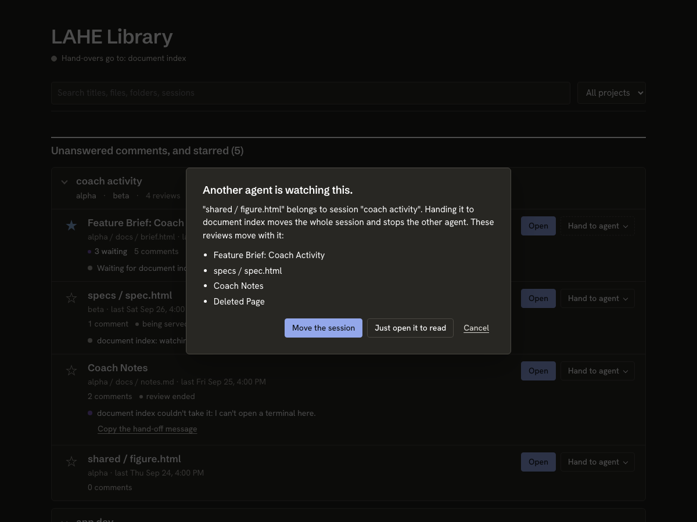
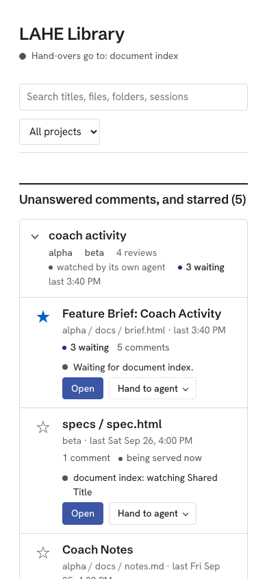

# Phase 7 fix round

Five reviews of the integrated branch (code reviewer, security, code lead, testing, Codex). Each finding below has an owner. Every fix gets a test that fails first. Ids: CR = code reviewer, SEC = security, CL = code lead, T = testing, CX = Codex.

## Builder A: agent-facing safety (`task/lib-fix-agent`)

- **SEC1.** Launch names a session after the page's own title (`session name --from-review`), and `handoffMessage` then puts that name, unfenced, into a new agent's first prompt: a page can inject instructions. Keep page-derived names out of every hand-off message (record `name_source: "page"` and skip such names in `handoffMessage`, or build the Launch prompt from ids only). The rail and the Library may still show the name. Test: a hostile title never appears in the drain's `handoff` or `VM.handoffFor`.
- **SEC2.** The contract and skill tell agents to run `lahe review '<path>'` and `lahe review '<candidate>'`, putting page-derived paths in a shell string; a quote in a file name breaks out. Add a CLI verb that reads the path itself, for example `lahe library serve <request-id> --session <id>`, which looks up the request, re-runs the candidate checks at serve time, and serves it. Remove the exception from the contract and every copy (skill, `test/unit/review_format.test.js`, `docs/CONTRACTS.md`). Also make `worktreeCandidate()` return null for a path with a quote or control character. Tests: a candidate named `a'$(touch pwned)'.md` is served with no `pwned` file; the contract has no `'<path>'` template.
- **SEC4.** The owner check covers only the reviewed and served file. Also stat the server record's root and refuse Open (`PROTO_NOT_OPENABLE`) when another user owns it; treat a missing file as not openable. Test with the existing `uid` injection.
- **SEC5.** `worktreeCandidate` checks the extension of the recorded path, not the real path; a symlink `x.md` to a `.json` passes. Check and return the real path.
- **SEC6.** The page's content policy has only `script-src 'self'`. Add `default-src 'none'` plus self-only connect, image, font and style rules (the inline style needs a hash or `'unsafe-inline'`). Test the full header.
- **CR minor.** Launch opens the new agent in the home folder. Give the skill's Launch steps a `cd` to the document's project folder, passed safely (argv or file, never a shell string).
- **CL minor.** A static review whose `ss_*.json` record was lost is labelled `dev-server`, and the skill tells the agent to refuse it. Base `dev-server` on a registered non-static origin, else mark it `unreadable`. The dev-server refusal text in the architecture names an origin the drain does not carry: add the origin as a helper value or change the text.

## Builder B: service correctness (`task/lib-fix-service`)

- **CX1.** `catalog_reader.js:726-728`: probe callbacks share function-scoped `var row` and `var cover`, so `served_url` lands on the wrong row. Bind per iteration.
- **CX2 and CR4.** A failed Open reopens the session, then `start()` throws before the `reopened` record is written, so the sweep never closes it (a corrupt `catalog.json` leaks the same way). Roll the reopen back on failure, or record it before the restart.
- **CR1.** Two concurrent `catalog.open` on a closed session both spawn a server; one is orphaned and the second origin swap drops the first tab's origin. Serialize Open per server record in the helper. Test two concurrent opens: one `ss_` record, no orphan, both answers on the recorded port, origin still registered. (Builder C adds the page's busy state.)
- **CR2.** A star on a folded row can get stuck: star and unstar act on the lead id only, while the reader treats any starred part as starred. Star and unstar every review in the fold. Test: star via one lead, change the lead, unstar, list shows unstarred.
- **CR5.** Open's origin swap appends events to every sibling review, bumping their "last worked on" time. Take `last` from the newest event that is not an origin event.
- **CL2.** "Another agent is watching" uses only a fresh monitor heartbeat, but the monitor exits while it works a batch, so the confirm step is skipped exactly then. Use `livenessFrom` with activity, the same rule the queue uses. Note it in the architecture.
- **CL3.** `static_servers.js:269-300` (`underServerRoot`, `reviewsServedBy`) is a second copy of the coverage rule that ignores mounts. Make `reopenForCatalog` use `coveragePath` and the review id Open asked for; delete the copy.
- **CL6 and CR6.** The monitor rescans the whole state dir on every poll while a request is pending, before the delivered filter. Filter by the delivered log first; describe only fresh entries on the monitor path. Test: the describe step is not called on the second poll.
- **Minor, service side:**
  - `request()` refuses a missing or unopenable review (`PROTO_NOT_OPENABLE`), as `open()` does.
  - The expired request's `reason` reaches the list (the reader drops it).
  - Torn last line: a file ending in a newline reports it as torn, and each bad line is logged once, not every poll.
  - Remove the reader's dead fallback branches (`catalog_reader.js:642`, `:654-662`); tests use `queueInputs`.
  - One `markDelivered(path, keys)` helper for both delivered logs in `status.js`.
  - `library.js:205` closes the session it just created when `service.json` has no port.
  - Remove stale notes: `manifest.js` ("Planned until", "2.2 writes", "1.2 lands a placeholder"), `catalog_page.js:90`, `routes.js` `notImplemented`.

## Builder C: page and tests (`task/lib-fix-tests`)

- **CR1, page side.** Open shows a busy state and ignores a second click until the first answers. Browser test: a double click sends one request.
- **Expiry wording.** With `reason` now in the list (Builder B), the view model words `attach_changed` and a launch expiry distinctly.
- **T1.** The R10a test passes because the reopened session keeps the helper up, not because of the Library rule. Add the real case: sweep closes the reopened session, the Library polls, then `session close` on the last session prints "left running" and health answers.
- **T2.** Test the worktree candidate's owner check (`uid` option on `createReader`).
- **T3.** Browser specs: refresh the stub agent's activity (`world.drainRequests()`) at the top of each test and before each hand-over click.
- **T4.** "Nothing was sent" checks: record with `page.on("request")`, run one more poll-now round trip, then assert zero.
- **T5.** Remove the stale 501 and 404 allowances in `catalog_page.spec.js` and `catalog_auth.test.js`; require 200.
- **T6.** Screenshots are written only when `LAHE_SHOTS=1` and only on Chromium.
- **T7.** Pin the monitor-dead boundary at exactly `HEARTBEAT_FRESH_MS`.
- **T8.** Torn file: `status.run --json` and `reader.list` both still return the pending request.
- **T9.** Hard-code the top-section session ids in the view-model test.
- **T10.** Cross-site spec: read `seenAt` before `goto` and assert it changed.
- **T11.** `freePort` helpers retry once on `EADDRINUSE`; the reuse-old-port test accepts "a holder took it" when one did.
- **T12.** `review_format.test.js` also parses the contract out of `docs/CONTRACTS.md` and compares it.
- **T13.** The token-leak scan includes one successful Open.
- **SEC3.** Cross-site spec: register the other-port attacker's origin on the target review, then assert the log shows `refused preflight: catalog path` for each POST route.

## Held for Ken

- **CL1 and CR3.** Bare `lahe library` creating and attaching a new session changes the approved design. It is on the progress page under Needs your attention.

## Builder B result

Branch `task/lib-fix-service`. `npm run gate:unit`: 1621 tests, 1619 pass, 0 fail, 2 todo (1599 before). Each fix has a test that failed first, except where noted.

- **CX1.** Did not reproduce. `row` is the forEach parameter and `cover` is declared inside the callback, so each row already has its own. Added a guard test: every probe answers true, out of order, and each row's `served_url` matches its own server (`catalog_reader.test.js`). No code change.
- **CX2 and CR4.** Open records a closed session in the `reopened` map before anything starts. `reopenForCatalog` now starts the server first and reopens the session second, so a failed start leaves the session closed. A `catalog.json` that cannot take the record refuses the Open with `PROTO_CATALOG_UNREADABLE`, before anything is reopened. Tests: a broken server root leaves the session closed; a corrupt `catalog.json` refuses the reopen and leaves the file as it was, and an Open of an already open session still works.
- **CR1.** Open's restart step runs one at a time per server record in the helper. The sweep also skips a session an Open is part way through bringing back. Tests: two concurrent Opens give one `ss_` record, one server process (checked with `pgrep`), both answers on the recorded port, and both reviews keep the live origin; the sweep does not close a session while its Open is in flight.
- **CR2.** Star and unstar act on every review in the fold. `describeReview` gains `fold`, the ids on the row. Test: unstar via the lead, change the lead, star and unstar again, and the list shows unstarred.
- **CR5.** A log that ends in origin events takes `last` from the newest event that is not one. Only the log's tail is read. Test: origin events appended with a new time do not move `last`. The catalog log fixture test now pins event times as well as the modified time.
- **CL2.** "Watching" uses `livenessFrom` with the session's activity stamp, the queue's rule. Test: a stale heartbeat plus a recent lahe command still asks for the confirm step, and the list names the agent.
- **CL3.** `reopenForCatalog` picks the reviews to swap origins on with `coveragePath`, mounts included, plus the review Open asked for. `underServerRoot` is deleted. Test: a review served through a mount gets the new origin.
- **CL6 and CR6.** The monitor's drain reads `catalog-delivered.log` first and describes only fresh requests. Test: the describe step is not called on the second poll.
- **Minor, service side:**
  - `catalog.request` refuses a missing review with `PROTO_NOT_OPENABLE`. Tested.
  - The list's `request` carries `reason` (null unless expired). Tested; `catalog_list.json` regenerated.
  - Torn line: each bad line is logged once per queue. Tested. The "ends in a newline" half did not reproduce: a complete bad line was already reported as unreadable, and only an unterminated tail as torn. A test now pins both.
  - The reader's bare-record fallbacks are gone. The reader tests now feed the queue's own shape, and three attach tests use the real queue.
  - One `readDelivered` and `markDelivered` for both delivered logs. No new test: the behavior did not change, and the existing once-per-delivery tests cover it.
  - `lahe library` closes the session it created when `service.json` names no port. Tested.
  - Stale notes removed from `manifest.js` and `catalog_page.js`. `notImplemented` in `routes.js` is now `missingDependency`, and the helper's 501 mapping is gone. Tested.
- **From the story walk:**
  - A folder review opens on the page its comments are on, else the page `lahe review <folder>` opens, never the bare root. `folderPages` and `folderEntryPage` moved from `add.js` to `static_servers.js`, and `add.js` uses them from there. The recorded page path is page-derived, so it must be a plain `.html` or `.htm` file under the folder by real path. Tests: entry page, commented page, and hostile paths that fall back to the entry page.
  - Open and a Pick up on a served row queue nothing when the attached agent owns the document's session or watches it. A Pick up answers `{request_id: null}`. A via-agent row's pick-up is still queued, since it needs re-serving. Tested.
  - A session watched from another session's monitor stays "watched" right after that agent answers. Its heartbeat names the agent as `primary` on the current handoff rev, and the agent is listening by the same rule. Tested.

Docs: `docs/CONTRACTS.md` and `02_architecture_lahe_library.md` cover the reopen order, the concurrency rule, fold stars, `last`, watching (the CL2 note), origin coverage, request refusal, `reason`, folder Open, and the no-op pick-up. The rendered `02_architecture_lahe_library.html` was not regenerated.

For Builder C: `catalog.request` can now answer `{request_id: null}` for a Pick up the agent already has. `afterRequest` in the view model currently shows "waiting" with no request id in that case.

To delete at cleanup: nothing new.

## Builder C result

Every Builder C item is done, plus the page items the orchestrator added from the story walk and the design review. Branch `task/lib-fix-tests`, with `task/lib-fix-service` merged in.

All five come from the page spec's screenshot test, run with `LAHE_SHOTS=1` on Chromium, after the spec passed.

**Test counts**

- `npm run gate:unit`: 1648 tests, 1646 pass, 0 fail, 2 todo (the older `anchor_cases.test.js` ones).
- `catalog_page.spec.js`, Chromium: 18 passed, 1 skipped (the screenshot test, skipped unless `LAHE_SHOTS=1`).
- `catalog_library.spec.js`, Chromium: 3 passed.
- `catalog_cross_site.spec.js`: Chromium 2 passed, Firefox 2 passed, WebKit 2 passed.

**The fix list**

- **CR1, page side.** A click on Open marks the row as opening. Until the helper answers, the button shows busy and a second click sends nothing. Browser test: a double click, then one more click, sends one request and opens one tab.
- **Expiry wording.** An expired row says what was lost and why:
  - `timeout`: "Not picked up. <agent> didn't answer."
  - `monitor_dead`: "Not picked up. <agent> stopped watching before it answered."
  - `attach_changed`: "Not picked up. A different agent was attached before <agent> answered."
  - A launch starts with "No new agent was launched." instead, and offers the hand-off message so the reader can start one by hand.
- **T1.** New test: the helper's own sweep closes the reopened session, the Library lists, and the last `session close` prints "left running: the Library page polled it" while health still answers. It waits for the sweep's real tick, so it takes about 15 seconds.
- **T2.** The worktree candidate's owner check is tested. The reader has no `uid` option and my edits stay out of service files, so the test swaps `process.getuid` for the length of the test. I proved it fails with the check removed.
- **T3.** The end-to-end spec refreshes the stub agent's activity at the top of each test and before each hand-over click.
- **T4.** Every "nothing was sent" check records requests with `page.on("request")` and runs one more poll before counting.
- **T5.** The 501 allowances are gone. `catalog_auth.test.js` now builds a review that every handler accepts, and requires 200 from all four routes.
- **T6.** Screenshots are written only with `LAHE_SHOTS=1`, and only on Chromium, in both specs.
- **T7.** The queue test pins the boundary: a heartbeat exactly `HEARTBEAT_FRESH_MS` old is still fresh.
- **T8.** With a torn last line, or a bad complete line, both `lahe status --json` and the reader's list still return the pending request.
- **T9.** The top section's session ids are spelled out in the test.
- **T10.** The cross-site control reads `catalog_seen_at` before the page loads and asserts it moved.
- **T11.** New `test/helpers/free_port.js`. A helper start whose port another test took is retried once on a new port, but only when the old port really is held. The two reuse-old-port tests accept a new port only when a holder has the old one.
- **T12.** A separate test parses the contract out of `docs/CONTRACTS.md` and compares it with the test's copy and the module. The restated array is untouched. I proved it fails on a one-word change to the doc.
- **T13.** The token-leak scan now includes one successful Open, so the static server's records are scanned too.
- **SEC3.** The other-port test registers the attacker's origin on a review, and checks that a review route's preflight is then approved. For each POST route it then waits for `refused preflight: catalog path` in the log.

**Added by the orchestrator**

- **Header.** When the attached session is closed, the header says "No agent attached". The view model reads `attached.closed`. **Builder B: the list does not send `closed` yet.** Until it does, a closed attached session still reads as "stopped watching".
- **Hand to agent.** Each row shows Open, plus one "Hand to agent" menu that holds Pick this up and Launch.
  - The menu is hidden where the Library's own agent already watches the session.
  - On a dev-server row the menu is disabled, and the row says why.
  - Escape closes the menu. A poll does not close it.
- **Refusals.** A "couldn't take it" note clears once the agent that refused is no longer the attached, live agent.
- **Pick this up answered with `request_id: null`.** The row says "<agent> already has it. Nothing was sent." It no longer says it is waiting.
- **Watcher label.** When the watcher's name equals the card's title, the card says "watched by its own agent".
- **Path line.** The line under a row's title shows only what the title and the card do not already say.
- **Design.**
  - Two status colors: attention (waiting on you, refused, needs an agent) and quiet. Every dot has a word beside it. "3 waiting" is plain text with an attention dot, so it no longer looks like a link.
  - Open uses the rail's primary color, in light and dark.
  - The dialog's backdrop is darker in both schemes. Its list keeps the bullet beside the text.
  - At phone width the page does not scroll sideways, meta items wrap whole with no stray separators, and the chevron sits on the title's line. A browser test checks all three.

**Changes from the brief**

- The shared fixture `test/fixtures/catalog_list.json` is generated by the reader, so I did not edit it. It comes from Builder B's branch, whose regenerated copy carries `reason: "monitor_dead"`. The view-model tests set their own reasons on copies of it.
- Design CSS lives in `src/service/catalog_page.js` (`PAGE_STYLE`), which is outside `src/layer/catalog/`. I changed only `PAGE_STYLE`. Builder A's content-policy change is in the same file but not in the same lines.

**To delete at cleanup**

- `node_modules` in this worktree: a symlink to the main checkout's, never committed.
