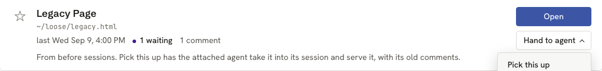
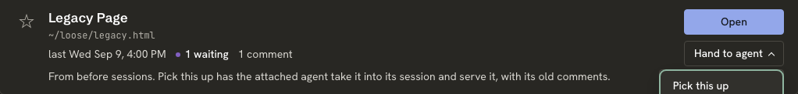

# Phase 7 fix round

Five reviews of the integrated branch (code reviewer, security, code lead, testing, Codex). Each finding below has an owner. Every fix gets a test that fails first. Ids: CR = code reviewer, SEC = security, CL = code lead, T = testing, CX = Codex.

## Builder A: agent-facing safety (`task/lib-fix-agent`)

- **SEC1.** Launch names a session after the page's own title (`session name --from-review`), and `handoffMessage` then puts that name, unfenced, into a new agent's first prompt: a page can inject instructions. Keep page-derived names out of every hand-off message (record `name_source: "page"` and skip such names in `handoffMessage`, or build the Launch prompt from ids only). The rail and the Library may still show the name. Test: a hostile title never appears in the drain's `handoff` or `VM.handoffFor`.
- **SEC2.** The contract and skill tell agents to run `lahe review '<path>'` and `lahe review '<candidate>'`, putting page-derived paths in a shell string; a quote in a file name breaks out. Add a CLI verb that reads the path itself, for example `lahe library serve <request-id> --session <id>`, which looks up the request, re-runs the candidate checks at serve time, and serves it. Remove the exception from the contract and every copy (skill, `test/unit/review_format.test.js`, `docs/CONTRACTS.md`). Also make `worktreeCandidate()` return null for a path with a quote or control character. Tests: a candidate named `a'$(touch pwned)'.md` is served with no `pwned` file; the contract has no `'<path>'` template.
- **SEC4.** The owner check covers only the reviewed and served file. Also stat the server record's root and refuse Open (`PROTO_NOT_OPENABLE`) when another user owns it; treat a missing file as not openable. Test with the existing `uid` injection.
- **SEC5.** `worktreeCandidate` checks the extension of the recorded path, not the real path; a symlink `x.md` to a `.json` passes. Check and return the real path.
- **SEC6.** The page's content policy has only `script-src 'self'`. Add `default-src 'none'` plus self-only connect, image, font and style rules (the inline style needs a hash or `'unsafe-inline'`). Test the full header.
- **CR minor.** Launch opens the new agent in the home folder. Give the skill's Launch steps a `cd` to the document's project folder, passed safely (argv or file, never a shell string).
- **CL minor.** A static review whose `ss_*.json` record was lost is labelled `dev-server`, and the skill tells the agent to refuse it. Base `dev-server` on a registered non-static origin, else mark it `unreadable`. The dev-server refusal text in the architecture names an origin the drain does not carry: add the origin as a helper value or change the text.

## Builder B: service correctness (`task/lib-fix-service`)

- **CX1.** `catalog_reader.js:726-728`: probe callbacks share function-scoped `var row` and `var cover`, so `served_url` lands on the wrong row. Bind per iteration.
- **CX2 and CR4.** A failed Open reopens the session, then `start()` throws before the `reopened` record is written, so the sweep never closes it (a corrupt `catalog.json` leaks the same way). Roll the reopen back on failure, or record it before the restart.
- **CR1.** Two concurrent `catalog.open` on a closed session both spawn a server; one is orphaned and the second origin swap drops the first tab's origin. Serialize Open per server record in the helper. Test two concurrent opens: one `ss_` record, no orphan, both answers on the recorded port, origin still registered. (Builder C adds the page's busy state.)
- **CR2.** A star on a folded row can get stuck: star and unstar act on the lead id only, while the reader treats any starred part as starred. Star and unstar every review in the fold. Test: star via one lead, change the lead, unstar, list shows unstarred.
- **CR5.** Open's origin swap appends events to every sibling review, bumping their "last worked on" time. Take `last` from the newest event that is not an origin event.
- **CL2.** "Another agent is watching" uses only a fresh monitor heartbeat, but the monitor exits while it works a batch, so the confirm step is skipped exactly then. Use `livenessFrom` with activity, the same rule the queue uses. Note it in the architecture.
- **CL3.** `static_servers.js:269-300` (`underServerRoot`, `reviewsServedBy`) is a second copy of the coverage rule that ignores mounts. Make `reopenForCatalog` use `coveragePath` and the review id Open asked for; delete the copy.
- **CL6 and CR6.** The monitor rescans the whole state dir on every poll while a request is pending, before the delivered filter. Filter by the delivered log first; describe only fresh entries on the monitor path. Test: the describe step is not called on the second poll.
- **Minor, service side:**
  - `request()` refuses a missing or unopenable review (`PROTO_NOT_OPENABLE`), as `open()` does.
  - The expired request's `reason` reaches the list (the reader drops it).
  - Torn last line: a file ending in a newline reports it as torn, and each bad line is logged once, not every poll.
  - Remove the reader's dead fallback branches (`catalog_reader.js:642`, `:654-662`); tests use `queueInputs`.
  - One `markDelivered(path, keys)` helper for both delivered logs in `status.js`.
  - `library.js:205` closes the session it just created when `service.json` has no port.
  - Remove stale notes: `manifest.js` ("Planned until", "2.2 writes", "1.2 lands a placeholder"), `catalog_page.js:90`, `routes.js` `notImplemented`.

## Builder C: page and tests (`task/lib-fix-tests`)

- **CR1, page side.** Open shows a busy state and ignores a second click until the first answers. Browser test: a double click sends one request.
- **Expiry wording.** With `reason` now in the list (Builder B), the view model words `attach_changed` and a launch expiry distinctly.
- **T1.** The R10a test passes because the reopened session keeps the helper up, not because of the Library rule. Add the real case: sweep closes the reopened session, the Library polls, then `session close` on the last session prints "left running" and health answers.
- **T2.** Test the worktree candidate's owner check (`uid` option on `createReader`).
- **T3.** Browser specs: refresh the stub agent's activity (`world.drainRequests()`) at the top of each test and before each hand-over click.
- **T4.** "Nothing was sent" checks: record with `page.on("request")`, run one more poll-now round trip, then assert zero.
- **T5.** Remove the stale 501 and 404 allowances in `catalog_page.spec.js` and `catalog_auth.test.js`; require 200.
- **T6.** Screenshots are written only when `LAHE_SHOTS=1` and only on Chromium.
- **T7.** Pin the monitor-dead boundary at exactly `HEARTBEAT_FRESH_MS`.
- **T8.** Torn file: `status.run --json` and `reader.list` both still return the pending request.
- **T9.** Hard-code the top-section session ids in the view-model test.
- **T10.** Cross-site spec: read `seenAt` before `goto` and assert it changed.
- **T11.** `freePort` helpers retry once on `EADDRINUSE`; the reuse-old-port test accepts "a holder took it" when one did.
- **T12.** `review_format.test.js` also parses the contract out of `docs/CONTRACTS.md` and compares it.
- **T13.** The token-leak scan includes one successful Open.
- **SEC3.** Cross-site spec: register the other-port attacker's origin on the target review, then assert the log shows `refused preflight: catalog path` for each POST route.

## Held for Ken

- **CL1 and CR3.** Bare `lahe library` creating and attaching a new session changes the approved design. It is on the progress page under Needs your attention.

## Builder B result

Branch `task/lib-fix-service`. `npm run gate:unit`: 1621 tests, 1619 pass, 0 fail, 2 todo (1599 before). Each fix has a test that failed first, except where noted.

- **CX1.** Did not reproduce. `row` is the forEach parameter and `cover` is declared inside the callback, so each row already has its own. Added a guard test: every probe answers true, out of order, and each row's `served_url` matches its own server (`catalog_reader.test.js`). No code change.
- **CX2 and CR4.** Open records a closed session in the `reopened` map before anything starts. `reopenForCatalog` now starts the server first and reopens the session second, so a failed start leaves the session closed. A `catalog.json` that cannot take the record refuses the Open with `PROTO_CATALOG_UNREADABLE`, before anything is reopened. Tests: a broken server root leaves the session closed; a corrupt `catalog.json` refuses the reopen and leaves the file as it was, and an Open of an already open session still works.
- **CR1.** Open's restart step runs one at a time per server record in the helper. The sweep also skips a session an Open is part way through bringing back. Tests: two concurrent Opens give one `ss_` record, one server process (checked with `pgrep`), both answers on the recorded port, and both reviews keep the live origin; the sweep does not close a session while its Open is in flight.
- **CR2.** Star and unstar act on every review in the fold. `describeReview` gains `fold`, the ids on the row. Test: unstar via the lead, change the lead, star and unstar again, and the list shows unstarred.
- **CR5.** A log that ends in origin events takes `last` from the newest event that is not one. Only the log's tail is read. Test: origin events appended with a new time do not move `last`. The catalog log fixture test now pins event times as well as the modified time.
- **CL2.** "Watching" uses `livenessFrom` with the session's activity stamp, the queue's rule. Test: a stale heartbeat plus a recent lahe command still asks for the confirm step, and the list names the agent.
- **CL3.** `reopenForCatalog` picks the reviews to swap origins on with `coveragePath`, mounts included, plus the review Open asked for. `underServerRoot` is deleted. Test: a review served through a mount gets the new origin.
- **CL6 and CR6.** The monitor's drain reads `catalog-delivered.log` first and describes only fresh requests. Test: the describe step is not called on the second poll.
- **Minor, service side:**
  - `catalog.request` refuses a missing review with `PROTO_NOT_OPENABLE`. Tested.
  - The list's `request` carries `reason` (null unless expired). Tested; `catalog_list.json` regenerated.
  - Torn line: each bad line is logged once per queue. Tested. The "ends in a newline" half did not reproduce: a complete bad line was already reported as unreadable, and only an unterminated tail as torn. A test now pins both.
  - The reader's bare-record fallbacks are gone. The reader tests now feed the queue's own shape, and three attach tests use the real queue.
  - One `readDelivered` and `markDelivered` for both delivered logs. No new test: the behavior did not change, and the existing once-per-delivery tests cover it.
  - `lahe library` closes the session it created when `service.json` names no port. Tested.
  - Stale notes removed from `manifest.js` and `catalog_page.js`. `notImplemented` in `routes.js` is now `missingDependency`, and the helper's 501 mapping is gone. Tested.
- **From the story walk:**
  - A folder review opens on the page its comments are on, else the page `lahe review <folder>` opens, never the bare root. `folderPages` and `folderEntryPage` moved from `add.js` to `static_servers.js`, and `add.js` uses them from there. The recorded page path is page-derived, so it must be a plain `.html` or `.htm` file under the folder by real path. Tests: entry page, commented page, and hostile paths that fall back to the entry page.
  - Open and a Pick up on a served row queue nothing when the attached agent owns the document's session or watches it. A Pick up answers `{request_id: null}`. A via-agent row's pick-up is still queued, since it needs re-serving. Tested.
  - A session watched from another session's monitor stays "watched" right after that agent answers. Its heartbeat names the agent as `primary` on the current handoff rev, and the agent is listening by the same rule. Tested.

Docs: `docs/CONTRACTS.md` and `02_architecture_lahe_library.md` cover the reopen order, the concurrency rule, fold stars, `last`, watching (the CL2 note), origin coverage, request refusal, `reason`, folder Open, and the no-op pick-up. The rendered `02_architecture_lahe_library.html` was not regenerated.

For Builder C: `catalog.request` can now answer `{request_id: null}` for a Pick up the agent already has. `afterRequest` in the view model currently shows "waiting" with no request id in that case.

To delete at cleanup: nothing new.

## Builder A result

Branch `task/lib-fix-agent`. `npm run gate:unit`: lint passed; 1632 tests, 1630 pass, 0 fail, 2 todo. Every test below was run red before the fix. `dist/` was not rebuilt or committed: `protocol.js`, `overlay.js` and the contract changed, so the orchestrator's checkpoint rebuild picks them up. `npm run install-skills` was not run, since the branch is not merged.

- **SEC1 (page-derived name in a hand-off).** `lahe session name --from-review` records `name_source: "page"` on the session. `agent_sessions.handoffName()` returns null for such a name. The drain, the Library panel (the list marks the session `name_from_page`) and the rail (new liveness field `session_name_from_page`) all leave it out of the hand-off message. The rail and Library still show it. A name set any other way clears the mark. Test: `test/unit/handoff_page_names.test.js` (a hostile title never reaches the drain's `handoff`, the panel message, or the rail's hand-off).
- **SEC2 (path in a shell string).** New verb `lahe library serve <request-id> --session <id>`: looks up the pending pickup, re-describes its review at serve time (legacy: the document must be on disk and this user's; worktree: the checked candidate), and runs `lahe review` as a child process with the path as one argv entry. The contract, the skill, `docs/CONTRACTS.md` and the test copy drop the "except a path you pass to lahe review" carve-out and send legacy and worktree pickups to the verb; `docs/CLI.md` lists it. `worktreeCandidate()` returns null for a path with a quote, backtick, backslash or control character. Tests: `test/unit/library_serve.test.js` (a legacy file named `a'$(touch pwned)'.md` is served and no `pwned` file appears; refusals; no `'<path>'` or `'<candidate>'` in any copy), `test/unit/worktree_candidate_safety.test.js`.
- **SEC4 (Open owner check).** Open also stats the server record's root (`server_root`, now in `describeReview`), and a missing file or a record with no root is not openable. Test: `test/unit/catalog_open_owner.test.js` (root owned by another uid is refused before any restart; missing file refused; control case passes).
- **SEC5 (candidate real path).** The candidate's page extension is checked on the real path, and the real path is returned. Test: `test/unit/worktree_candidate_safety.test.js` (symlink `x.md` to a `.json` is null; a symlink to a real page gives the real path).
- **SEC6 (content policy).** `default-src 'none'; script-src 'self'; connect-src 'self'; img-src 'self' data:; font-src 'self'; style-src 'self' 'sha256-<PAGE_STYLE>'` plus the existing four. `data:` images are there because the document style's callout icons are data SVGs. Test: `test/unit/catalog_page_csp.test.js` pins the full header. `test/browser/catalog_page.spec.js` passed once on Chromium with it.
- **CR minor (Launch folder).** The drain entry carries `folder` (the repository holding the document or candidate, else the document's folder; data class). The Launch steps have the agent write `handoff` and `folder` to two files, and the osascript reads the folder with `paragraph 1 of` and runs `cd <quoted form of dir> && <host> <msg>`. Updated in the contract, skill, CONTRACTS.md and the test copy. Test: `test/unit/launch_folder.test.js`.
- **CL minor (dev-server label).** A row is `dev-server` only on a registered origin no static record of its session serves, on a target that is not a page file. Otherwise, with no covering record, it is `static`, unreadable, `via-agent`. The drain and `describeReview` carry `origin`, and every copy of the refusal says "Start the dev server at <origin>, then ask me again." The architecture's drain section says so. Test: `test/unit/catalog_kind_rule.test.js`. The list fixture was regenerated: two already-unreadable rows moved from `dev-server` to `static`.
- **Story walk 1 (name cut mid-word).** `agent_sessions.fitName()` cuts a long title where a word ends and adds an ellipsis, within 80 characters; `--from-review` uses it. Test: in `test/unit/handoff_page_names.test.js`.
- **Story walk 2 (Library hand-off wording).** New `AGENT_LIVENESS.libraryHandoffMessage(session, name, stateDir)`: "take over", no "stopped answering", and the real `--state-dir` in the command. The drain's `handoff` and the Library's copy panel use it; `catalog.list` adds `state_dir` (null for the default). The rail keeps `handoffMessage`. The panel's intro no longer says it is "the same hand-off message the rail already copies", which R14 in the brief states. Test: `test/unit/library_handoff.test.js`.

### For the merge

- `test/fixtures/catalog_list.json` is generated (`LAHE_WRITE_CATALOG_LIST=1`). If Builder B's list changes collide, regenerate it after the merge instead of resolving by hand.
- `catalog.list` now carries one absolute path, `state_dir`, when the state dir is not the default. The reader's list itself still has none.
- Shared files touched locally: `catalog_reader.js` (candidate, kind rule, `server_root`, `origin`, `name_from_page`), `catalog_actions.js` (owner check, `state_dir`), `status.js` (describer fields), `library.js` (the `serve` verb).

## Builder C result

Every Builder C item is done, plus the page items the orchestrator added from the story walk and the design review. Branch `task/lib-fix-tests`, with `task/lib-fix-service` merged in.

All five come from the page spec's screenshot test, run with `LAHE_SHOTS=1` on Chromium, after the spec passed.

**Test counts**

- `npm run gate:unit`: 1648 tests, 1646 pass, 0 fail, 2 todo (the older `anchor_cases.test.js` ones).
- `catalog_page.spec.js`, Chromium: 18 passed, 1 skipped (the screenshot test, skipped unless `LAHE_SHOTS=1`).
- `catalog_library.spec.js`, Chromium: 3 passed.
- `catalog_cross_site.spec.js`: Chromium 2 passed, Firefox 2 passed, WebKit 2 passed.

**The fix list**

- **CR1, page side.** A click on Open marks the row as opening. Until the helper answers, the button shows busy and a second click sends nothing. Browser test: a double click, then one more click, sends one request and opens one tab.
- **Expiry wording.** An expired row says what was lost and why:
  - `timeout`: "Not picked up. <agent> didn't answer."
  - `monitor_dead`: "Not picked up. <agent> stopped watching before it answered."
  - `attach_changed`: "Not picked up. A different agent was attached before <agent> answered."
  - A launch starts with "No new agent was launched." instead, and offers the hand-off message so the reader can start one by hand.
- **T1.** New test: the helper's own sweep closes the reopened session, the Library lists, and the last `session close` prints "left running: the Library page polled it" while health still answers. It waits for the sweep's real tick, so it takes about 15 seconds.
- **T2.** The worktree candidate's owner check is tested. The reader has no `uid` option and my edits stay out of service files, so the test swaps `process.getuid` for the length of the test. I proved it fails with the check removed.
- **T3.** The end-to-end spec refreshes the stub agent's activity at the top of each test and before each hand-over click.
- **T4.** Every "nothing was sent" check records requests with `page.on("request")` and runs one more poll before counting.
- **T5.** The 501 allowances are gone. `catalog_auth.test.js` now builds a review that every handler accepts, and requires 200 from all four routes.
- **T6.** Screenshots are written only with `LAHE_SHOTS=1`, and only on Chromium, in both specs.
- **T7.** The queue test pins the boundary: a heartbeat exactly `HEARTBEAT_FRESH_MS` old is still fresh.
- **T8.** With a torn last line, or a bad complete line, both `lahe status --json` and the reader's list still return the pending request.
- **T9.** The top section's session ids are spelled out in the test.
- **T10.** The cross-site control reads `catalog_seen_at` before the page loads and asserts it moved.
- **T11.** New `test/helpers/free_port.js`. A helper start whose port another test took is retried once on a new port, but only when the old port really is held. The two reuse-old-port tests accept a new port only when a holder has the old one.
- **T12.** A separate test parses the contract out of `docs/CONTRACTS.md` and compares it with the test's copy and the module. The restated array is untouched. I proved it fails on a one-word change to the doc.
- **T13.** The token-leak scan now includes one successful Open, so the static server's records are scanned too.
- **SEC3.** The other-port test registers the attacker's origin on a review, and checks that a review route's preflight is then approved. For each POST route it then waits for `refused preflight: catalog path` in the log.

**Added by the orchestrator**

- **Header.** When the attached session is closed, the header says "No agent attached". The view model reads `attached.closed`. **Builder B: the list does not send `closed` yet.** Until it does, a closed attached session still reads as "stopped watching".
- **Hand to agent.** Each row shows Open, plus one "Hand to agent" menu that holds Pick this up and Launch.
  - The menu is hidden where the Library's own agent already watches the session.
  - On a dev-server row the menu is disabled, and the row says why.
  - Escape closes the menu. A poll does not close it.
- **Refusals.** A "couldn't take it" note clears once the agent that refused is no longer the attached, live agent.
- **Pick this up answered with `request_id: null`.** The row says "<agent> already has it. Nothing was sent." It no longer says it is waiting.
- **Watcher label.** When the watcher's name equals the card's title, the card says "watched by its own agent".
- **Path line.** The line under a row's title shows only what the title and the card do not already say.
- **Design.**
  - Two status colors: attention (waiting on you, refused, needs an agent) and quiet. Every dot has a word beside it. "3 waiting" is plain text with an attention dot, so it no longer looks like a link.
  - Open uses the rail's primary color, in light and dark.
  - The dialog's backdrop is darker in both schemes. Its list keeps the bullet beside the text.
  - At phone width the page does not scroll sideways, meta items wrap whole with no stray separators, and the chevron sits on the title's line. A browser test checks all three.

**Changes from the brief**

- The shared fixture `test/fixtures/catalog_list.json` is generated by the reader, so I did not edit it. It comes from Builder B's branch, whose regenerated copy carries `reason: "monitor_dead"`. The view-model tests set their own reasons on copies of it.
- Design CSS lives in `src/service/catalog_page.js` (`PAGE_STYLE`), which is outside `src/layer/catalog/`. I changed only `PAGE_STYLE`. Builder A's content-policy change is in the same file but not in the same lines.

**To delete at cleanup**

- `node_modules` in this worktree: a symlink to the main checkout's, never committed.

## Adversary fixes

Branch `task/lib-fix2`. Five findings from the final adversarial review. Each has a test that failed first, except finding 4, which did not reproduce.

**Counts** (final run, this branch)

- `npm run lint`: passed.
- `npm run gate:unit`: 1711 tests, 1708 pass, 0 fail, 3 todo (the two older `anchor_cases` ones, plus one new todo below).
- `catalog_page.spec.js`, Chromium: 20 passed, 1 skipped (the screenshot test, which runs only with `LAHE_SHOTS=1`).
- `catalog_library.spec.js`, Chromium: 3 passed.

**1. A page could choose what `lahe library serve` serves and where a launched agent starts.** `review.write` records any `source_path` or `target_path` sent with the review token, and a page can read that token. The Library now takes its locations only from records a page cannot write.

- Static rows: the drain's `folder` comes from the covering server record's root.
- Worktree rows: a row is `worktree` only when the covering server record's root is under `<repo>/.claude/worktrees/<name>/` and the document is under that root. A legacy row is never one.
- Legacy rows: `describeReview` gains `verified_path`, the document only when the file holds this review's own script line. `lahe library serve` refuses otherwise, and the drain's `folder` is null.
- Test: `test/unit/library_trusted_paths.test.js`. It posts `review.write` with a page's `source_path` (and `target_path`) pointing at another repository, on a legacy and a static review, queues a pickup, and runs `lahe library serve`. Serve refuses, and the drain's `folder` is neither that repository nor inside it. A fake worktree `source_path` does not make a static or a legacy row `worktree`.
- `launch_folder.test.js` and the worktree-candidate test in `status_catalog.test.js` now write the server record their rows need.

**2. Launch offered a hand-off on rows with no session to take over.** I chose to refuse, not to write a second hand-off. A new agent then never gets a message that sends it to `lahe session list`.

- API: `catalog.request` refuses a launch on a legacy or worktree row with new code `PROTO_NO_LAUNCH` (409), whose remedy says to choose Pick this up.
- Page: Launch is disabled on those rows, with the reason as its tooltip. The hand-off panel on those rows has no message, and no row offers to copy one.
- Drain: a launch entry for those kinds carries `handoff: null`.
- Contract, skill, `docs/CONTRACTS.md` and the test copy: "A launch request is only for a static row: the Library refuses one on a legacy or worktree row, and if one reaches you anyway its handoff is null, so answer refused."
- Tests: `test/unit/launch_by_kind.test.js` (page, API, drain, contract copies) and a new browser test in `catalog_page.spec.js`. Three view-model tests changed: the legacy panel test now expects no message, and the two expired-launch tests use a static row. A new one pins that a worktree row's expired launch offers no copy.

The reason shows as a tooltip, which a screenshot does not capture.

**3. A failed Open could leave a server running.** `reopenForCatalog` marks an error from `start()` as `stage: "start"`. After the server is up, a throw stops the server it started and closes the session it reopened, then marks the error `after_start`. Open clears its `reopened` record only for a start error, so the sweep still finds a session the undo missed. Test: `test/unit/catalog_open_rollback.test.js`, with the real `createCatalogOps` and a `reviews.registerOrigin` that throws. The session ends closed and no `ss_` process is left (checked with `pgrep`).

**4. `lahe status --quiet` printing the "no reviews" line: did not reproduce.** The parser still refuses `--quiet` without `--json`, as it did before the Library, so that line is never reached. I added a pin test in `status_catalog.test.js`, checked that it goes red when the parse refusal is removed, and added an early return in that branch so the rule holds either way.

**5. The launch folder could be a dotfiles repo in `~`.** `projectFolder` stops walking at the home folder (by path and by real path). Tests in `launch_folder.test.js`: a `.git` in home is never the folder, and a repo below home is still found.

### Needs a decision (settled by Ken in round 2, below)

- **A legacy pickup cannot be served.** A real legacy document holds its review's script line. `lahe review <file> --session <agent>` then refuses: "review r_legacy belongs to agent session legacy". So `lahe library serve` could not serve a real legacy row even before these fixes. The old test passed only because it used a `.md` file with no script line, which a legacy review never is. The quote test now checks that the path reaches `lahe review` as one argument, and a `test.todo` marks the gap. There are two ways to fix it, and both change the design:
  - Serve with `--new`: a fresh review in the agent's session, with the old comments left on the legacy review.
  - Adopt the legacy review into the agent's session.
- **Launch with no folder.** A static row whose server record is gone now has `folder: null`. The Launch steps do not say what to do with a null folder.

### Round 2: Ken's decisions and the Firefox failure

**No full suite ran this round.** `npm run gate` and `npm run gate:all` were not run. The orchestrator runs the full suite once at the end. The runs below are the only ones.

The two open questions above are now settled by Ken, so they are no longer open.

**1. Bare `lahe library` sessions close themselves when idle.** Bare runs still start a fresh session. The CLI marks it `created_by: "library"` in session.json; the helper only reads that field. The helper's sweep (same timer as the reopened-session sweep) closes such a session once it owns no reviews and its agent has been quiet for `CATALOG.LIBRARY_SESSION_IDLE_MS` (30 minutes): no live monitor heartbeat, and no lahe command since then. Quiet counts from the later of the session's start and its last command. A session that gained a review, or was taken over, is left alone.

- Test added: `test/unit/library_session_autoclose.test.js`, 9 tests. The clock is injected. The session closes at exactly the limit and stays open 1 ms under it. A lahe command restarts the count, and a live monitor keeps it open. It is left alone once it owns a review or was taken over. A session nobody marked is never touched. The helper's own timer runs the sweep. The CLI test was green before the constant existed (both sides undefined), so I proved it red by putting `library.js` back to HEAD.
- Docs: the contract and its three copies, `docs/CONTRACTS.md` (a new "Library-session sweep" paragraph), `docs/CLI.md`, and the architecture's Helper lifetime section.
- Commands: `node --test test/unit/library_session_autoclose.test.js`: 8 fail, 1 false pass before; 9 pass after.

**2. Legacy pickups are served as a fresh review.** `lahe library serve` runs `lahe review <file> --session <agent> --new`. The old comments stay on the legacy review. Three places say so:
  - the drain entry: a new helper field, `note`, set on legacy entries only
  - the command's output
  - a line on the legacy row: "Pick this up starts a new review of this page. The old comments stay on the old review."

The contract, the skill and `docs/CLI.md` tell the agent to say so in its answer.

- Tests: the `test.todo` is replaced by a real test in `test/unit/library_serve.test.js`. It serves a real legacy file (with its script line), gets one new review owned by the agent at that path, and every file in the legacy review's folder stays byte for byte the same. Also a drain-note test (`library_serve.test.js`) and a row-notice test (`catalog_view_model.test.js`). The pinned key list in `status_catalog.test.js` now includes `note`.
- Commands: `node --test test/unit/library_serve.test.js test/unit/catalog_view_model.test.js`: 3 fail before; then those plus `status_catalog`, `review_format`, `library_trusted_paths` and `launch_by_kind`: 215 pass, 0 fail, 1.1 s. `LAHE_SHOTS=1 npx playwright test test/browser/catalog_page.spec.js -g "screenshots"`: 1 passed, 2.9 s, which retook the legacy row images:

**3. Launch with `folder: null`.** The Launch steps give a one-file osascript with no `cd`, and the agent says in its answer that the new agent started in its default folder. This is in the contract, the skill, `docs/CONTRACTS.md` and the test copy.

- Test added: in `test/unit/launch_folder.test.js`, every copy carries the null-folder steps.
- Commands: `node --test test/unit/launch_folder.test.js`: 1 fail before; then with `review_format` and `library_serve`: 63 pass, 0 fail, 3.2 s.

**4. The Firefox failure in `catalog_library.spec.js` "Open a closed review".** It was the product, not the test.

- `--project=firefox --repeat-each 5` failed 5 of 5 before the fix, in 95 s. Each time the comment box never took focus in the opened tab.
- Tracing showed what happened. The keystroke opened the box, but no element in that tab could take focus, not even a plain probe textarea. Meanwhile the Library page focused its Open button again on the render right after Open.
- A Library render puts focus back on the control the reader was on. After Open opened a tab, that focus pulled the keyboard back to the Library in Firefox.
- Fix in `src/layer/catalog/page.js`: after Open opens a tab, a render keeps the focus key and does not focus. It focuses again once the reader is back on the Library page (a focus event, or a key or pointer press there). No retry, no sleep.
- An earlier try that checked `document.hasFocus()` did not help: under Playwright both pages report focus. Bringing the tab to the front in the test did not help either.
- Commands after the fix:
  - `npx playwright test test/browser/catalog_library.spec.js -g "Open a closed review" --project=firefox --repeat-each 5`: 5 passed, 84 s.
  - `catalog_library.spec.js`, one run per lane: Chromium 3 passed (40.9 s), Firefox 3 passed (38.1 s), WebKit 3 passed (40.5 s).
  - `npx playwright test test/browser/catalog_page.spec.js` (Chromium, since `page.js` changed), four runs: two were 20 passed with 1 skipped. Two had 1 failure: "a star changes when the helper answers" with `route.fetch: socket hang up` from its own helper. The same test alone with `--repeat-each 10`: 10 passed. This flake is separate from item 4 and I have not tracked down its cause. It shows only when the whole file runs.

**Unit gate, once, at the end:** `npm run gate:unit`: lint passed; 1723 tests, 1721 pass, 0 fail, 2 todo (the two older `anchor_cases` ones), 43 s.

### Not done

- `npm run install-skills` was not run, since the branch is not merged.
- `dist/` was rebuilt locally for the browser runs and not committed.
- The rendered `02_architecture_lahe_library.html` was not regenerated.

To delete at cleanup: nothing new.
