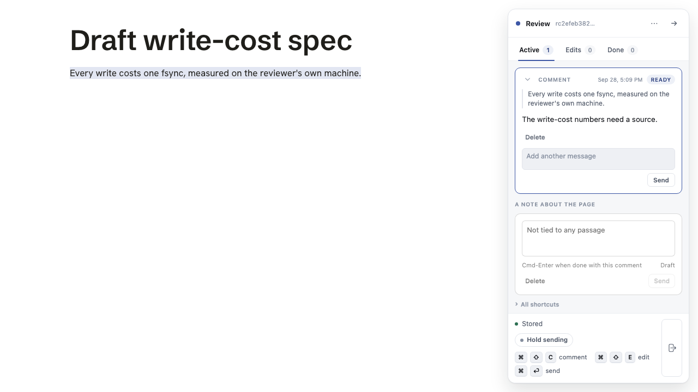

# Keep the editor when you follow a link

## Status

**Shipped. PR #17 merged to main as c2fd735 after its CI run passed.** Last updated 2026-09-28 16:52. It takes effect on this machine after the helper restarts.

- PR: [#17](https://github.com/kenxle/live-agentic-html-editor/pull/17).
- Reviews: code review found nothing real; the security review's three findings are fixed with tests.
- Tests: unit gate green; the full browser suite green on this machine except `install_walk_3b` (this folder has no installed packages; it passes in CI).
- Held up by: main's CI was red on an unrelated Hold test. Fixed and merged as [#18](https://github.com/kenxle/live-agentic-html-editor/pull/18).
- Your calls: both settled, and the Copy button in the missing-review case is fine for now.

## Summary

Clicking a link on a reviewed page to a document in another folder opens it read-only, with no editor. That breaks the rule set on 2026-09-16: anything our own static server serves gets the editor. This spec closes the gap for linked documents. No new review is created by a click. The linked page uses the review the document already has in this session, or else the review of the page you came from.

## Your calls: where the security review narrows your rule

Your rule is that anything our own server serves gets the editor. The security review keeps that for every page you reach by clicking a link, and narrows it in two places. Both are settled; the text below records what was decided.

1. **YES, settled 2026-09-28. Pages you did not click to, sitting in a linked folder, stay without the editor.** When a page links to a file in another folder, the server opens that whole folder so the link works. The review puts the editor only on the files a link actually points to, not on their neighbours. Why: the editor's key would otherwise reach every page in any folder a document happens to link into. Say no, and every page in a linked folder gets the editor.
2. **SETTLED 2026-09-28, and it turned out not to be a real case.** Nothing in LAHE deletes a review. Closing a session or a review keeps all of its history, and the 30-day limit named in the code is not wired to anything. The only way to lose one is to delete the state folder by hand.

   So there is no borrowing, and no silent read-only page. If a linked page finds no review where it expected one, it says so on the page: this document has no review, which should not happen. It offers to open one, and opens it only when Ken asks. That is not the automatic per-click enrollment requirement 3 forbids.

Separately, and not a narrowing: a linked document that already has its own review now takes you to that review's page, instead of opening a copy with its key. You get your earlier comments that way. It also found that hidden files like `.env` in a linked folder could be fetched from the page server. That was refused for a while, then undone on 2026-09-28: hidden files get no special handling anywhere in LAHE, so they can be reviewed like other files.

## Problem

- A reviewed Markdown page can link to a document outside its own folder. The server makes those links work by mounting the target's folder read-only, under `/.lahe-source/<hash>/`.
- Pages under a mount are served on purpose with no editor. The code says so in `src/service/static_servers.js` (`renderMarkdown` and the `roots: ownRoot ? ... : []` line).
- The 2026-09-16 rule in `docs/ongoing/STATIC_SITE_FOLDER.md` says anything our own server serves gets the rail. A mounted page is served by our own server, so it should have the rail.
- Real case: the memory audit hub links to the draft write-cost spec. The spec already had its own review, in the same agent session, on the same server. The click still landed on a read-only copy.

## Requirements

1. **A linked document that has a review in this session opens that review's own page.** Match on the review's `source_path` (for Markdown) or its target paths (for HTML), resolved to real paths. The server answers the mount URL with a redirect to the page that review already serves (for Markdown, its rendered artifact, which lives on the same server as every other Markdown review in the session). It does not inject that review's token into the mount URL. Why:
   - The rail shows a page only the items whose page path matches. Earlier comments were made on the artifact's path, not on `/.lahe-source/<hash>/<file>.md`, so injecting there would show none of them.
   - The mount render adds a read-only note the artifact does not have, so anchors can differ.
   - If that review is served by a different server in this session, injecting its token here would fail the helper's origin check, and making it pass means writing a new origin onto that review. That is a write to the review store, which requirement 3 forbids, and it widens that review's token to this server's whole origin.
   - The artifact already reloads on change, so requirement 7 comes free for this case.
   If the matching review's server is not running, fall through to requirement 2.
2. **A linked document with no review in this session opens with the review of the page that linked to it.** This is the same rule a folder review already uses for pages nobody recorded: no new review, no write to the review store. The item records the linked document's real path on disk, so the agent knows which file to edit. "The page that linked to it" means a review that registered this mount (see Approach). If every one of them is `--only`, the page stays read-only. If none of them exists in this session (reviews are never deleted, so this means something went wrong), the page says so plainly, and offers a button that opens a review for this document only when Ken clicks it. It never falls back to "any newest review on this server", and never creates a review on its own.
3. **Nothing is created by a click.** No new review, no new meta.json, no enrollment. Ken restated this on 2026-09-28 as a hard rule: the empty reviews an earlier round created still make usage numbers hard to read. The 2026-09-16 lesson stands: per-page enrollment made 166 reviews that never got a comment.
4. **Another agent session's review never answers.** A linked document that has a review only in another session gets the linking page's review from this session, never the other session's token.
5. **The existing mount limits stay, and the serve side is made to match them.** The link rules today: only documents the rendered page links to, inside the home folder, at most 16 auto mounts per server. A mount serves the linked file's whole folder, with its subfolders. So "only documents the page links to" is true of the link, not of what the server hands out. Before the rail goes on:
   - Hidden (dot-prefixed) files and folders get no special handling, in a link or under a mount. Settled 2026-09-28: they are served and linked like any other file. An earlier round refused them under a mount; that refusal is gone.
   - Put the rail only on files a render actually translated a link to. Record those real paths with the mount. Other HTML in a mounted folder is served as it is today, with no rail.
   - A review opened with `--only` keeps its linked documents read-only, as today.
6. **The agent can act on it.** An item made on a linked page names the source file on disk, not the `/.lahe-source/` URL, in `review.json` and in the drain. An edit made there lands in the right file when the agent edits and replies. **The helper works out that path; the page never supplies it.** The helper maps the item's page path through this session's static server mount table (read off disk, the same way the static server does), checks the result is inside the mount's folder by real path, and records it. A path in a request body is never used as the file to edit. This is a change to what `review.json` says, so the contract text, `docs/CONTRACTS.md`, the copy in `test/unit/review_format.test.js`, the skill, and the dist bundle change together.
7. **The linked page updates when its source changes**, the same way a reviewed page does, so a handled item shows the change without a manual reload. If that turns out to need more than the existing watcher, say so in progress rather than building a new watcher. Today's poll gets this wrong in a specific way: for a single-page review, `targetForPage` in `src/service/reviews.js` maps any page path to the one recorded target, so a linked page would reload when the hub changes and never when itself changes. Use the same page-path-to-file mapping as requirement 6, and stat only: never heal a script line into a linked file on disk.

## Approach

The design call is which review a linked page uses, and why not a new one.

- **Chosen:** reuse. First the document's own review in this session (requirement 1, by redirect), else the linking page's review (requirement 2). The linking page is known from the mount: a mount is registered by rendering one page, so the server records which review's page registered it. If the mount was registered by more than one reviewed page, the newest of those registering reviews wins. Two registration paths must both record it: the server's own render (`persistAutoMounts`), and `lahe review` calling `registerMount` for a Markdown review's own folder and its links. `registerMount` merges the on-disk metadata before it writes, and the new field needs the same merge, or a later `lahe review` wipes it. A chain (hub links B, B links C) rides the hub's review, since B's render registers C's folder while serving under the hub's review. That is intended, and bounded by the 16-mount cap per server.
- **Read from disk, not from the request.** The linking page is never taken from the `Referer` header or anything else the browser sends.
- **Rejected: open a new review on first click.** It gives every linked document its own comment list, but it means the static server writes to the review store, and it recreates the empty-review pile the folder work removed.
- **Rejected: keep mounted pages read-only.** That is the bug.

Security: the key (token) that lets a page send comments now reaches linked documents. Settled in review:
- **HTML and Markdown are treated the same.** Every page this server hands out shares one web origin (`127.0.0.1:<port>`), mounts included. A script on any of them can already fetch the reviewed page and read the token off it, today, before this change. So keeping the rail off mounted HTML would protect nothing. The real limit is what the server is willing to serve under a mount, which is why requirement 5 tightens that side.
- **Rendered Markdown can carry raw HTML**, including a script tag, so "Markdown only" would not have been a script-free zone either.
- **The token stays on this server's origin.** Requirement 1 redirects instead of carrying another review's token over, so no origin is added to any review.
- **The file an agent edits is worked out by the helper** (requirement 6), never claimed by the page.
- **D11's residual gets one more sentence**: a review's token is also readable on documents its pages link to, in folders mounted for those links. Add it in the same commit as the code.
- **Known gap this makes a little worse, not fixed here:** `review.write` accepts `source_hint`, `target_path`, and `source_path` from anyone holding the token (`src/service/routes.js`), and `source_hint` is what `review.json` tells the agent the source file is. A hostile script on any served page can use it to point the agent at another file. That is true today for every served page. It needs its own board row: refuse those three fields when the request carries a browser `Origin` header, since `add` sends none.

## Tasks

1. `static_servers.js`: when a mount registers, remember which review's render registered it, and the real paths of the files it translated links to. Both registration paths (render and `registerMount`), merged like `auto_mounts`. Tests: a mount registered by review A records A; a mount registered by two reviews keeps both and the newest wins; a `lahe review` run after a render keeps the render's record.
2. `static_servers.js` `renderMarkdown` and the HTML path: for a request under a mount, if a review in this session records this file, redirect to that review's page; else, if the file is a recorded link target, inject the registering review's rail; else serve plain. Tests: requirement 1 redirect, requirement 2 case, other-session review ignored (requirement 4), `--only` stays read-only (requirement 5), registering review gone gives read-only, an unlinked HTML sibling in the mounted folder gets no rail, `/.lahe-source/<hash>/.env` served like any other file, a file outside the mount limits still refused.
3. The helper maps an item's page path to the real file through the mount table (requirement 6). Tests: an item made on a linked Markdown page shows the source path in `review.json` and in `lahe status --json`; a page path naming a mount prefix the server does not hold, or `..` out of a mount, records no file.
4. Reload on source change for linked pages (requirement 7), or a written note of what it would take.
5. Docs: `docs/ongoing/STATIC_SITE_FOLDER.md` (the rule now reaches linked documents), `docs/CLI.md` where `--only` is described, and the skill if an agent's steps change. A browser spec clicking from a reviewed page to a linked one and leaving a comment, with a screenshot of the rail on the linked page.

## Acceptance criteria

- [ ] Clicking from the hub to the draft write-cost spec opens it with the editor and its earlier comments.
- [ ] Clicking to a linked document with no review opens it with the editor, and a comment there lands in the linking page's review with the linked file's path.
- [ ] No review, meta.json, or enrollment is created by a click.
- [ ] Another session's review is never used.
- [ ] `--only` reviews keep linked documents read-only.
- [ ] A hidden file under a mount is served like any other file, and an HTML file in a mounted folder that no page linked to gets no rail.
- [ ] The file named on an item comes from the helper's mount lookup, never from the request body.
- [ ] The drain names the source file for an item made on a linked page.
- [ ] `npm run gate:unit` green; the named browser spec green; screenshot on this page.

## Progress

**2026-09-28: built on branch `linked-docs-rail`, tests first. `npm run gate:unit` green; `test/browser/linked_docs_rail.spec.js` green (Chromium). Not yet reviewed, not merged.**

The screenshot is from the browser spec's own run: the hub's rail on the draft spec reached by clicking its link, with the comment just made there.

### What was built, file by file

- `src/service/markdown_links.js`: the render registry now lists the real path of every file a link points at (`registry.linked`). That covers links translated into another folder's mount and relative links under the document's own folder.
- `src/service/markdown.js`: `writeArtifact` returns `linked`. `render` takes a `note` override. `missingReviewNote` builds the note for a linked page whose linking review is gone.
- `src/service/static_servers.js`:
  - `linked_files` on the server's metadata: each linked file's real path, and the reviews whose pages linked to it. `recordLinks` writes it, read-merge-write.
  - `registerMount` merges it from disk, and a restart keeps it.
  - A request under a mount goes through `serveLinked`. A document with its own review in this session gets a 302 to that review's page on its live server. Otherwise a recorded link target gets the newest linking review's rail. Anything else is served as before.
  - `--only` linking reviews keep links read-only. A linking review missing from the session gives the note, one log line, and nothing created.
  - `linkedFileForPage` maps an item's page path to the real file. It checks the mount, containment by real path, is a file, and that this review is recorded against that file.
- `src/cli/commands/review.js`: after `add` has made the review, records its render's links against it (`recordedReviewFor`).
- `src/service/rebuild.js`: the helper's re-render records the links the new render has.
- `src/shared/review_format.js` and `src/service/projection.js`: a page under `/.lahe-source/` gets `linked_file` and `source_hint` from the helper's lookup. The page's own claim is ignored, and an unmapped page reads as unknown. Every other page carries `linked_file: null`. One contract line added.
- `src/cli/commands/status.js`: a drain line carries `page.linked_file` when set, and only then.
- `src/service/reviews.js`: `targetMtime` stats the linked file for a linked page. It uses stat only and never heals.
- `src/service/handled_check.js`: a handled check for an item on a linked page reads that linked file (rendered, for Markdown), not the hub.
- Docs: the D11 residual sentence, `docs/CONTRACTS.md` (contract copy and a paragraph on `linked_file`), `docs/CLI.md` (`--only`), `skills/lahe/SKILL.md`, `docs/ongoing/STATIC_SITE_FOLDER.md`, `docs/ongoing/SERVING_ARCHITECTURES.md`.
- Tests: `test/unit/linked_docs_rail.test.js` (new, 24 tests), `test/unit/markdown_linked_docs.test.js` (now expects the rail hop to hop and no new review), `test/unit/review_format.test.js` (contract copy and count), `test/browser/linked_docs_rail.spec.js` (new).

### Deviations from the spec

- **The "open a review" button copies a command instead of opening one.** When a linked page's linking review is gone, the page says so and shows `lahe review <file> --session <id>` with a Copy button. A button that really opened a review would need a new route that creates a review from a browser click with no token. That is a new write path into the review store, and the security review never looked at one. Ken's call if he wants the real button.
- **Links are recorded per file, not per mount.** `linked_files` is keyed by the linked file's real path. A folder linked from two hubs, to two different files, gives each file its own hub rather than the newest hub for both.
- **Requirement 1 matches exact targets only**, as the spec says. A linked HTML file inside a folder review's folder is not redirected to that folder review; it rides the linking review.
- **Items on a linked page get a stricter file check.** The helper names a file only if this very review is recorded as linking to it. The spec asked for the mount and real-path checks; this adds one more.

### Surprises

- A third registration path the spec did not name: `rebuild.js` re-renders a Markdown review when its source changes. It now records links too.
- The handled check (`handled_check.js`) would have flagged every handled edit on a linked page as not on the page, because it read the hub. Fixed in the same change.
- `lahe review` registers mounts before `add` creates the review, so the review id is not known at `registerMount` time. The links are recorded after `add` returns instead.

### Follow-ups

- `npm run install-skills` was not run from this branch, since the skill change is unmerged. Run it after merge.
- The `review.write` source-hint gap stays open, as the spec says. It needs its own board row.
- The Markdown served at a server's own root (not under a mount) still renders read-only, as before.

### Fix round, 2026-09-28

Each fix has a test in `test/unit/linked_docs_rail.test.js`, written red first. `gate:unit` green, the browser spec green.

- **Only pages are named as the file to edit.** A linked `.sh` or `.json` is served as bytes and is never in `linked_files` or returned by `linkedFileForPage`. `markdown_links.isPage` is the one check, and the Markdown extensions are now spelled only in `markdown_links.js`.
- **One spelling for a mount.** A request whose raw path does not literally start with `/.lahe-source/` but decodes to it gets a 404. The helper maps only the literal spelling. `review_format.isLinkedPage` treats any spelling that decodes under the prefix as a linked page, so an encoded one reads as unknown and never takes the hub's source. The projection, the reload and the handled check all use that one predicate.
- **The copy-the-command button quotes for a POSIX shell.** `markdown.missingReviewNote(path, session)` builds the command itself and single-quotes both values, turning each `'` into `'\''`.
- **Test gap closed:** a symlink inside a mount that points outside it names no file. The test passed on the existing code.

Left for the board, not this round: `linked_files` never shrinks when a link is removed; the read-modify-write race on the server metadata file; caching the lookup done on every poll.

### To delete at cleanup

- Nothing.

## Security review, 2026-09-22

Accepted the reuse design, with four changes: redirect to a document's own review instead of injecting its token; make the serve side of a mount match its link rules (no hidden files, rail only on linked files; the hidden-file part was undone on 2026-09-28); the helper, not the page, names the file to edit; the reload uses that same mapping and never heals.
Rejected "Markdown only" as protection that does nothing, since every served page shares one origin; the `review.write` source-hint gap is recorded as its own row rather than fixed here.
