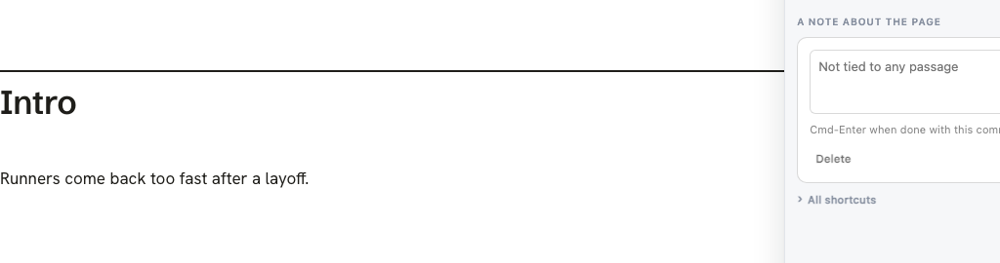

# Italics that came back after a reload

Report, review r88dec64b8451: "using the italics button still doesn't stick after the reload."

## Cause

The Intro paragraph was `
<em>A</em>
`: every word inside one `<em>`. When the page reloads, replay finds each edit's paragraph again by its words. The search picks the innermost element that holds those words. Here the `<em>` and the `
` hold the same words, so it picked the `<em>`.

Replay then writes the edit's new words into the element it found. Plain words written inside the `<em>` give `
<em>...</em>
`, and the paragraph turns italic again.

In the real review:

- The reviewer's plain rewrite of the Intro was still waiting for the agent.
- The page reloaded onto the source that still said `*A*`.
- Replay wrote the plain rewrite inside the `<em>`.
- The italics-button record that followed shows exactly that shape: its before is `<em>It's never been...</em>`.

The italics button alone fails the same way. Take italics off `
<em>words</em>
` and reload before the agent rebuilds. Replay binds the `<em>`, sees its inside already reads "words", and writes nothing. The italic stays.

## Fix

`src/layer/anchor.js`, `mintedElementFor`, called from `resolve`. Each saved region records the tag it was made on (`fingerprint.tag`). When the words bind a different tag, the search climbs through ancestors that hold exactly the same words. It takes the first one with the recorded tag. An ancestor holding any other words stops the climb, and the bind stays where it was.

## Tests

- `test/browser/italic_sticks.spec.js`: the real `lahe review file.md` walk, two cases.
  - The reported sequence: edit, reload onto `*A*`, agent answers, then two reloads.
  - The italics button alone: a reload before the agent answers, then two more after it.
  - Both cases failed before the fix and pass after it.
- `test/unit/anchor_engine.test.js`: three cases.
  - A region saved on a `
` binds the `
`.
  - A region saved on the `<em>` still binds the `<em>`.
  - The climb stops at an ancestor that holds other words.
- These also pass, all run with `--workers=1`:
  - `formatting_survives`
  - `formatting_toggle`
  - `inline_reword`
  - `replay_branches`
  - `replay_human_and_agent`
  - `reword_rev`
  - `anchor_engine`
- `npm run gate:unit` passes.

## Known gap

Nested elements of the SAME tag still bind the wrong one: `

A

`, with the record made on the outer `div`, still binds the inner `div`. The climb in `mintedElementFor` only runs when the bound tag differs from the saved tag, so two elements sharing a tag never trigger it. A later fix could use `fingerprint.chain` as a tie-breaker.

