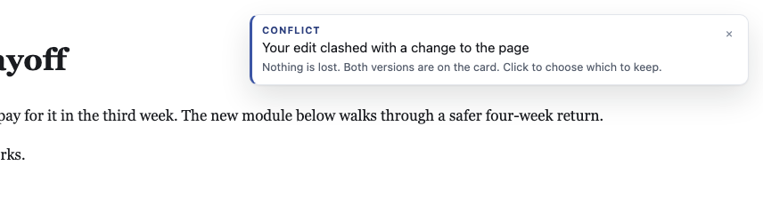
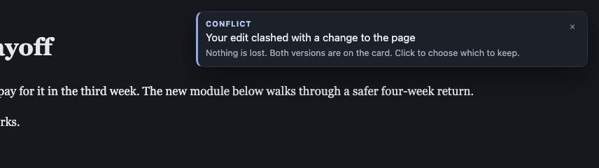

# Conflict toast: tell the reviewer their edit is safe on a card

Summary: when replay finds that the reviewer's edit and the page's own change
collide, a sticky toast now says so and opens the conflict card on click. It
shows once per conflict, even across reloads, and goes away when the conflict
is resolved.

## Problem

Ken asked the agent to add a module to his article. While it worked, he kept
writing two or three paragraphs in the same spot. When he committed, the page
reloaded onto the agent's version. Replay's fourth branch ("matches none of
these") flagged a conflict and wrote nothing, so his paragraphs disappeared
from the page.

They were safe on the conflict card in the rail, with "Keep mine" and "Take
theirs". Nothing told him that, and he thought he had lost his writing. His
ask: use the toasts to say there was a conflict and he just needs to resolve it.

## Requirements

1. When replay flags a new conflict on a record, raise a toast. Title: "Your
   edit clashed with a change to the page". Body: "Nothing is lost. Both
   versions are on the card. Click to choose which to keep." Use the existing
   toast look.
2. Clicking it opens the rail on that conflict card, the same way a reply toast
   opens its card.
3. It stays until one of these happens:
   - it is clicked
   - it is swiped or closed
   - the conflict is resolved (resolving removes it)

   It never times out.
4. Once per conflict, not once per replay pass. A repaint or a reload that
   finds the same open conflict raises nothing new.
5. Several conflicts at once make one toast that names the count ("2 of your
   edits clashed with changes to the page"). Clicking it opens the first.
6. While the tool is hidden for presenting, the toast is held and shown on
   return.

## What was built

- `src/layer/conflict_toast.js` (new) decides when a conflict is news, what the
  toast says, and where a click goes. It draws nothing itself; it calls the
  rail's existing `showToast`.
- **Once per conflict:** the key is the record id plus the rev that
  conflicted. Keys already told are kept in `sessionStorage` (per review),
  the same place the rail keeps its overdue notices. So a reload in the same
  browser tab does not repeat it, and a new tab starts fresh. Resolving a
  conflict forgets its key, so the same record colliding again later is told
  again.
- **One toast:** a new conflict while one stands replaces it with a count toast
  naming all still-open conflicts. When every conflict it names is resolved,
  the toast is removed.
- **Click:** opens the rail, selects the card's tab (Edits), unfolds the card,
  scrolls to the "Which version stands?" block and focuses the card.
- **Presenting and read-only windows:** nothing is raised or remembered while
  hidden. The return from presenting runs the check again.
- `src/layer/replay.js` gained two optional hooks: `onPass` (after every pass)
  and `onResolved` (after "Keep mine" or "Take theirs" succeeds).
  `src/layer/index.js` wires both to the conflict toast.
- The new file is listed in `src/shared/manifest.js`, after `tab_edits.js`.
- The multi-conflict body reads "Both versions are on each card" instead of
  "on the card".

## Tests

- `test/unit/conflict_toast.test.js` (15 tests, red before the module existed)
  covers:
  - the wording
  - once per pass and once after dismissal
  - reload with the conflict open, and a new rev counting as a new conflict
  - the count toast, both at once and one arriving while another stands
  - removal on resolve, partial resolve, and a conflict coming back
  - held while presenting
  - click opens the Edits tab
  - no storage
- `test/browser/conflict_toast.spec.js` (3 tests, red against the old bundle)
  runs Ken's case: the reviewer edits a block with the rail closed, the page
  source changes that block, the page reloads, and replay flags the conflict.
  It then checks:
  - the toast appears with the agreed words, sticky
  - another pass raises nothing new, and a reload with the conflict still open
    raises no second toast
  - clicking the toast opens the rail on the Edits tab with the card focused
  - pressing Keep mine on the card resolves the conflict, puts the reviewer's
    words back, and removes the toast
- Related specs, run with `--workers=1` (42 passed with the new spec):
  - `replay_branches`
  - `replay_human_and_agent`
  - `reply_toast`
  - `reword_rev`
  - `inline_reword`
  - `keep_mine_live_page`
- `npm run gate:unit`: lint passed, 1250 tests, 0 failed.

## Screenshots

Taken by the browser spec (`LAHE_SCREENSHOT_DIR=...`), from the passing run.

Light:

Dark:

Note: the existing toast style has a 3px accent stripe on its left edge. This
change reuses that style as asked and does not touch it. Removing the stripe
from all toasts would be a separate change.
