# Side stripes: when they mean something, and when they are just noise

## The rule

A rule down one edge of a block is a signal, and the signal is **"you have not
looked at this yet"** or **"this one is new."** Where an element is saying one
of those two things, the stripe stays. Where it is saying nothing, or where
something louder is already saying it, the stripe goes.

Two things follow from that:

- A stripe is not banned. Overusing it is the problem. A rail where everything
  wears one is a rail where the stripe means nothing.
- Traditional quote styling is not a stripe in this sense. A rule beside a
  quoted passage is how a quote has been set since print. It is decoration, it
  says "these are the page's words, not the reviewer's," and it never claims
  anything is new.

Ken's own words, reviewing the first sweep:

> the issue that we should have thought of here is when are these actually
> semantic. there is a case where these things do make sense which are the ones
> that are trying to get my attention because they need to be seen because they
> haven't been looked at yet. So those are okay, but like the pop-up toast
> should not have it because that's gonna be seen already by virtue of its
> movement, its animation. ... Also, block quote styling is fine. Block quote
> styling is a traditional styling choice. I'm just trying to get us to not
> overuse it.

## Element by element

Each row says what the element MEANS, what it HAS now, and why.

| Element | What it means | What it has | Why |
| --- | --- | --- | --- |
| `tab_done.js` asking block | Attention | 3px accent rule, plus the accent wash | The layer is asking the reviewer a question. Nothing moves until they answer, and the block does not animate, so the rule is the only thing pulling the eye. |
| `overlay.js` `.agent.is-loud` | Attention | 3px accent rule, plus the accent wash | A loud agent reply is one the reviewer has not dealt with. Same reasoning as the asking block. |
| `tab_edits.js` row pairs | New vs old | 2px rule per pair; accent on `data-kind='edit'`, neutral on the rest | Scanning a column of rows, the accent is what separates the reviewer's own typed edits from a deletion or a formatting-only change. |
| `replay.js` conflict sides | New vs old | 2px rule per side; accent on "Your version", neutral on "On the page now" | The two halves are the same length in the same type. The rule is what makes them read as two panes rather than four paragraphs. |
| `overlay.js` `.toast` | Nothing left to say | Full 1px border, no stripe | **Removed.** A toast slides in. Movement is the loudest attention signal the layer has, so the stripe was saying a thing the animation had already said. |
| `overlay.js` `.card__quote` | Decoration | 2px neutral rule beside the quote | Quote styling. Back to what it was. |
| `comments.js` `.lahe-comment-quote` | Decoration | 2px accent rule beside the quote | Quote styling. Back to what it was. |
| `tab_active.js` `.lahe-rail-quote` | Decoration | 2px amber rule beside the quote | Quote styling. Back to what it was. |
| `tab_active.js` panel edge | Neither | 1px neutral divider | Unchanged throughout. This is where the docked panel meets the page, the same job a `border-bottom` does between list rows. |

### One thing kept from the first sweep, besides the toast

`.agent.is-loud` was re-declaring `color`, `font-size` and `line-height`
identically to `.agent` above it: three lines that changed nothing. Those stay
dropped. The rule is now just the wash and the accent rule.

## The pictures

The first sweep shot each element cropped to its own few pixels, which is what
made the new-versus-old cases impossible to judge:

> without showing the other things around them I can't really say if we'll
> still have enough visibility to show things that were new.

So the two new-versus-old cases are shot as the whole rail, several rows or
cards on screen at once, mixed states. **Stripeless** is what the first sweep
shipped. **Shipping** is what this branch ships.

### The Edits tab: four typed edits, one deletion, one formatting-only change

| Stripeless (first sweep) | Shipping (stripe restored) |
| --- | --- |
| 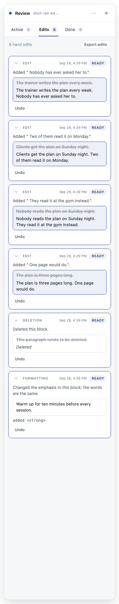 | 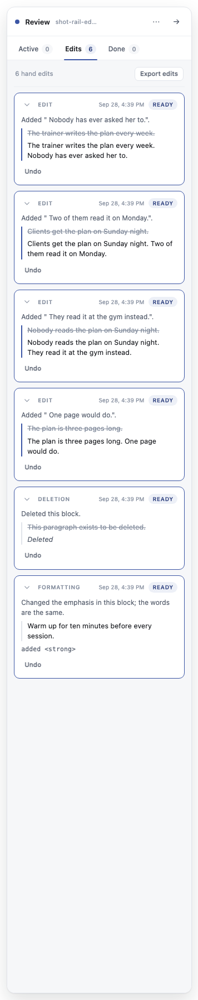 |
| 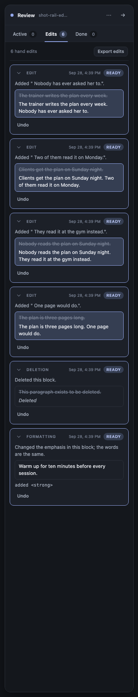 | 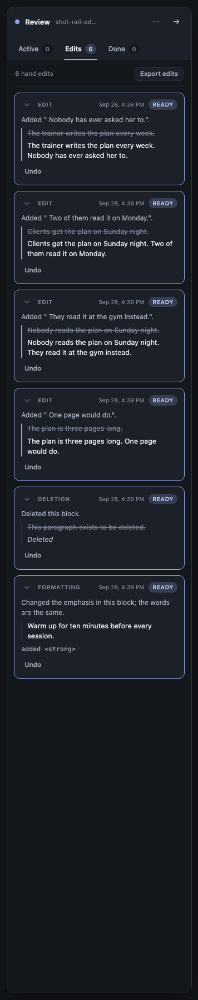 |

What the pair shows: with no stripe, the first sweep gave every pair a full
bordered box and gave edit rows a wash inside it. That is a box inside a card,
six times down the column, and the wash reads as "selected" more than as "new."
With the rule back, an edit row's accent and a deletion's neutral grey separate
at a glance and nothing is boxed twice.

### The conflict block: a conflict card next to an ordinary edit card

| Stripeless (first sweep) | Shipping (stripes restored) |
| --- | --- |
| 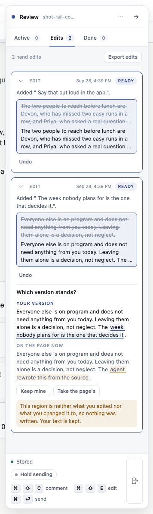 | 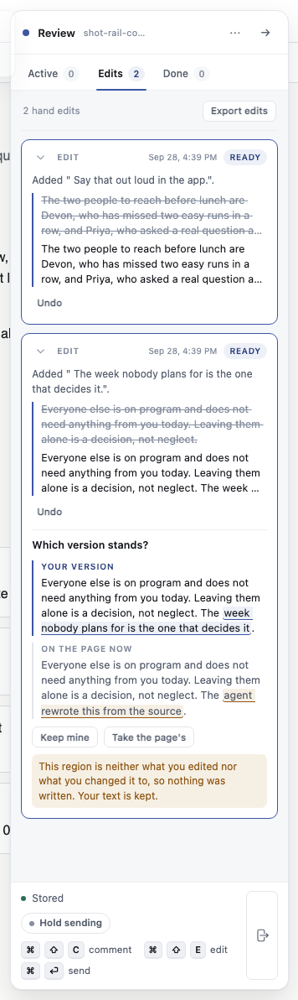 |
| 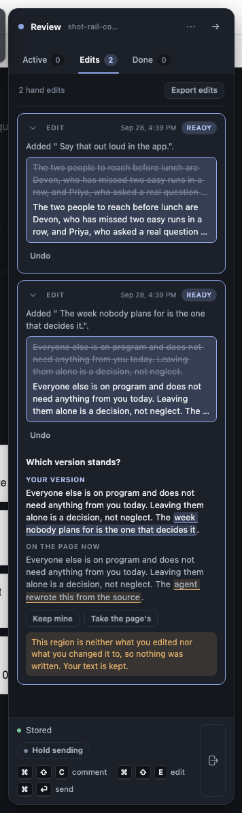 | 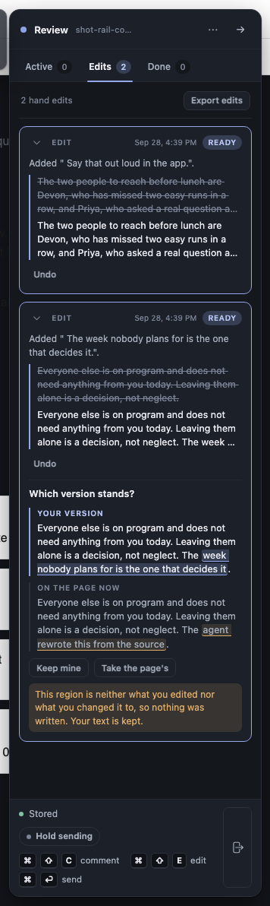 |

What the pair shows: this is the case the crops hid. Stripeless, "Your version"
and "On the page now" are two paragraphs of identical type running straight
into each other, and only two small eyebrow labels tell them apart. With the
rules back, the accent one marks the reviewer's own text and the pair reads as
a pair.

### The toast, cropped

A crop is the honest frame here: a toast sits on an otherwise empty corner, so
there is nothing around it to show.

| Before (with stripe) | After (stripe removed) |
| --- | --- |
| 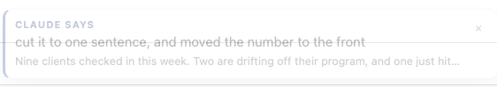 | 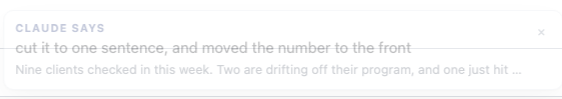 |
| 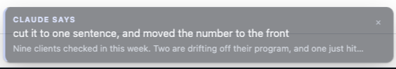 | 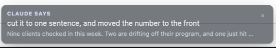 |

## Tests

Every signal has a test that goes red when it is deleted. All five were checked
red by breaking the CSS, then green again with it restored.

- `agent_replies.spec.js`, the asking-block test: asserts BOTH signals, the 3px
  rule and the wash. The wash check is pinned to `var(--accent-wash)` read off a
  probe element, not to "differs from the card": a deleted wash falls back to
  transparent, which also differs from the card's paper and would pass a weaker
  check for the wrong reason.
- `agent_replies.spec.js`, "a loud agent message wears an accent rule an
  ordinary one does not, in light mode": new test. `.agent.is-loud` is not
  reached by the current question flow (`tab_done.js` nulls the agent message
  for a question and draws its own ask block), so it drives
  `rail.setAgentMessage` directly. Asserts the rule's width and that its colour
  is `var(--accent)`, and that an ordinary agent message has no rule at all.
- `edits_tab.spec.js`, "an edit row's pair wears the accent rule, and the other
  kinds wear the neutral one": new test. Runs the real six-edit session and
  compares an `edit` row's pair against a `delete` or `format_only` one. Goes
  red if either the rule or the accent override is dropped.
- `rail_design.spec.js`, the conflict-sides test: the two rules differ, both are
  really drawn at 2px or more, and the reviewer's is `var(--accent)`. The width
  and accent checks matter because a deleted rule falls back to the element's
  own colour, which could still differ side to side.
- `reply_toast.spec.js`, the flagged-answer test: new assertion that the toast's
  four edges match each other in weight and colour. Putting the stripe back
  turns it red.

`docs/ongoing/FINGERPRINTING.md`'s worked examples are back to the original
quote markup, which is what ships.

### Runs

- `npm run gate:unit`: 1259 pass, 0 fail.
- `npx playwright test --workers=1` on `agent_replies`, `rail_design`,
  `reply_toast`, `edits_tab`: all pass, including `rail_design`'s pixel-diff
  visual-regression tests.

## To delete at cleanup

Per the no-`rm`-mid-task rule, listed rather than removed:

- `test/browser/zz_rail_context_shots.spec.js` in this worktree: the rig that
  took the whole-rail shots. Not part of the shipped suite.
- `test/browser/zz_stripes_shots.spec.js` in this worktree and in the main
  working tree: the first sweep's cropped-shot rig. Superseded.
- The cropped before/after images for the elements that went back to their
  original styling, which now show a change that is not happening. All of them
  under `docs/features/20260922.05_no_side_stripes/img/`:
  `before__card_quote_*`, `after__card_quote_*`,
  `before__comment_quote_*`, `after__comment_quote_*`,
  `before__active_tab_quote_*`, `after__active_tab_quote_*`,
  `before__asking_block_*`, `after__asking_block_*`,
  `before__agent_is_loud_*`, `after__agent_is_loud_*`,
  `before__card_full_*`, `after__card_full_*`,
  `before__conflict_sides_*`, `after__conflict_sides_*`,
  `before__edit_row_pair_*`, `after__edit_row_pair_*`.
  The toast pair stays: it is the one element that really changed.
- `.claude-commit*` scratch files in this worktree. Gitignored already.
- `dist/lahe-layer.js` changes in the main working tree, rebuilt there only to
  take the first sweep's "before" shots. Safe to `git checkout` back.

## Open question, unchanged from the first sweep

`vendor/stclair-doc-style/document.css` line 109 sets
`blockquote{border-left:3px solid var(--border)}`. Under the rule above this is
fine: it is quote styling, which Ken called a traditional choice. Nothing to do.
Noted only because the first sweep raised it as a question.
