# No side stripes

Ken's rule: a single-side colored border (a stripe on one edge, usually the
left) is banned in this repo. This sweep found every remaining site the layer
draws and fixed it.

## What changed, element by element

**overlay.js `.card__quote`** (the quoted passage on a card)
Had: `border-left:2px solid var(--line)`.
Has: no border. Italic marks it as quoted text, matching how the comment
box's own quote is styled.

| Before | After |
| --- | --- |
| 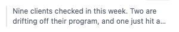 | 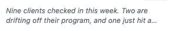 |
| 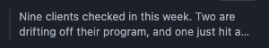 | 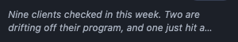 |

**overlay.js `.agent.is-loud`** (a loud agent reply's own block)
Had: `background:var(--accent-wash)` plus a 3px accent stripe on the left.
Round one dropped the stripe and kept only the wash. Review caught that the
wash alone barely reads in light mode (about six levels darker than the
card's own surface) and that `.agent.is-loud` was re-declaring `color`,
`font-size`, `line-height` identical to `.agent`, three dead lines.
Has now: the wash, plus a full 1px border in `var(--accent)` (the same move
`.card[data-state='ready']` makes for its own emphasis), and the three dead
declarations are gone.

| Before | After |
| --- | --- |
| 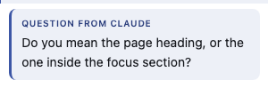 | 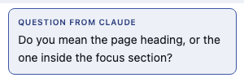 |
| 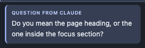 | 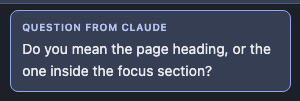 |

Note: this class is not reached by the current question flow (tab_done.js
nulls the agent message for a question and draws its own ask block
instead), so the screenshots and the new test both set it directly through
`rail.setAgentMessage`. The CSS rule is real and shipped either way.

**overlay.js `.toast`** (the corner notification)
Had: `border:1px solid var(--line)` plus a 3px accent stripe on the left,
borrowed from the old ask block.
Has: just the full 1px border. The border and the drop shadow already say
"this is floating above the page"; the stripe was redundant.

| Before | After |
| --- | --- |
|  |  |
|  |  |

**tab_done.js's asking block (`ASK_CLASS`)** (the "claude is asking" block)
Had: `background:var(--accent-wash)` plus a 3px accent stripe on the left.
Has: the wash only, full bleed to the card's own padding.

| Before | After |
| --- | --- |
| 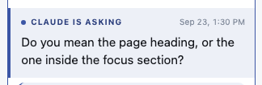 | 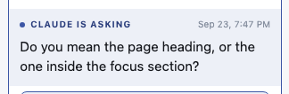 |
| 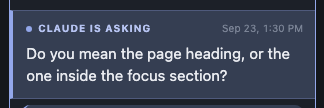 | 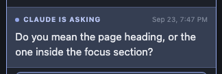 |

**replay.js conflict sides** (`[data-lahe-conflict-side]`, "Your version" /
"On the page now")
Had: `border-left:2px solid var(--line)`, with the "yours" side overridden
to `var(--accent)`.
Has: no rule on either side. The eyebrow label text ("Your version" / "On
the page now") plus the ink-colour difference (accent ink vs. the default)
already say which side is which.

| Before | After |
| --- | --- |
| 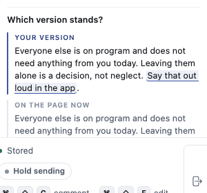 | 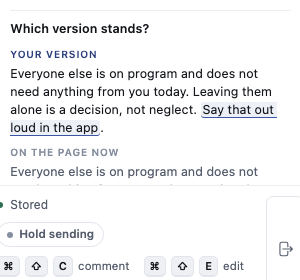 |
| 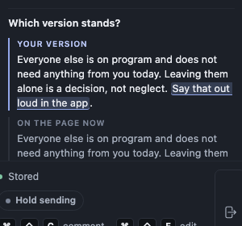 | 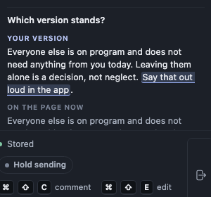 |

**tab_edits.js edit-row pairs** (`.lahe-edits__pair`, the before/after text
in the Edits tab)
Had: `border-left:2px solid var(--line)`, with `data-kind='edit'` rows
overridden to `var(--accent)`.
Has: a full 1px border box. `data-kind='edit'` rows get `border-color:
var(--accent)` plus `background:var(--accent-wash)`, the same wash pattern
the rest of the rail uses for "this is the emphasized one."

| Before | After |
| --- | --- |
| 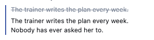 | 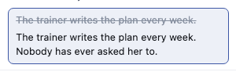 |
| 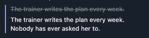 | 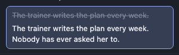 |

**comments.js `.lahe-comment-quote`** (the quoted passage in the floating
comment box)
Had: `border-left:2px solid rgba(60,86,165,.75)`.
Has: no border, italic instead. Same treatment as `card__quote`.

| Before | After |
| --- | --- |
| 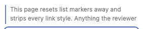 |  |
|  | 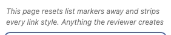 |

**tab_active.js `.lahe-rail-quote`** (the quoted passage on an Active-tab
row, standalone-panel mode)
Had: `border-left:2px solid rgba(255,178,26,.9)` (amber).
Has: no border, italic instead.
Note: this element only ever draws in tab_active's STANDALONE mode (no
`host` passed to `createActiveTab`). In the real boot, `host:
rail.tabBody("active")` is always passed, so `hosted` is true and the
`if (!hosted)` guard around this paragraph skips building it entirely —
overlay.js's own `card__quote` carries the quote instead (see above), and
this file's own comment says so: "The rail's card already carries the
quote and the lifecycle chip, so a hosted row would say both of them
twice." The screenshots were taken by mounting the module the way its own
comment says it is "scoreable alone," which is the only way to reach this
code path.

| Before | After |
| --- | --- |
| 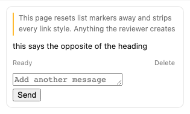 | 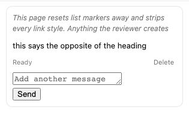 |
|  |  |

## Left as is

**tab_active.js's panel edge** (`.lahe-rail{border-left:1px solid
rgba(17,17,17,.12)}`, ~line 83)
This is the docked standalone panel's own left edge, where it meets the
page. It is a neutral, low-opacity divider doing the same job a
`border-bottom` does between list rows (the brief's own "fine" case), not
a colored accent stripe. Left alone; noted in the CSS with a comment
explaining the judgment call.

## Question for Ken

**vendor/stclair-doc-style/document.css line 109**, the `blockquote` rule:
`border-left:3px solid var(--border)`. This is the St. Clair AI document
style, copied verbatim from the personal repo, not code this repo owns.
Whether it counts as a banned stripe (and whether the source of truth
changes in the personal repo or here) is a call for Ken, not something a
builder should silently "fix" by editing a vendored file. Left untouched.

## Tests

- `test/browser/agent_replies.spec.js`: the asking-block test's
  `ruleWidth >= 3` assertion (the old border-left width check) is replaced
  by `askBackground === accentWash`, where `accentWash` is read off the
  same `var(--accent-wash)` custom property through a real probe element,
  not compared as `var()` text. This was tightened once already after
  review: the first version only checked "differs from the card," which
  passes even with the wash deleted (a deleted background falls back to
  transparent, which also differs from white). Verified red with the wash
  rule removed, green restored.
- `test/browser/agent_replies.spec.js`: new test, "a loud agent message
  wears a border an ordinary one does not, in light mode." Drives
  `rail.setAgentMessage` directly (see the tab_active note above for why
  the real question flow can't reach this class) and asserts the border
  color equals `var(--accent)` and differs from an ordinary agent
  message's border. Verified red without the border, green with it.
- `test/browser/rail_design.spec.js`: the conflict-sides test's
  `yoursRule !== theirsRule` (border-left-color) assertion is replaced by
  `yoursLabelColor !== theirsLabelColor`, checking the same ink-colour
  signal that now carries the "which side" distinction.

`npm run gate:unit` passes. Named browser specs pass `--workers=1`:
agent_replies, reply_toast, conflict_toast, replay_branches,
comments_highlights, edits_tab, edits_undo_rows, rail_design (including
the pixel-diff visual-regression tests, 0 pixels differ).

## To delete at cleanup

Per the no-`rm`-mid-task rule, these are left in place for the
orchestrator's one batch cleanup:

- `test/browser/zz_stripes_shots.spec.js` in this worktree
  (`.claude/worktrees/no-side-stripes/test/browser/zz_stripes_shots.spec.js`):
  the temporary Playwright script used to take every before/after
  screenshot in this doc. Not part of the shipped test suite.
- `test/browser/zz_stripes_shots.spec.js` in the main working tree
  (`/Users/kennethstclair/Documents/workspace/live-agentic-html-editor/test/browser/zz_stripes_shots.spec.js`):
  the same file, copied there to take the "before" shots against
  unmodified `main`. Also not part of the shipped suite.
- `.claude-commit202609230001-stripes` and `.claude-commit202609230015-stripes`
  in this worktree: commit-message scratch files, already gitignored, but
  listed per the "batch, don't ask" convention.
- `dist/lahe-layer.js` changes in the main working tree (uncommitted,
  rebuilt there only to run the "before" screenshots against real source):
  safe to `git checkout` back to its committed state, or leave, since it
  is gitignored from diffs that matter (main's own working tree, not this
  branch).
