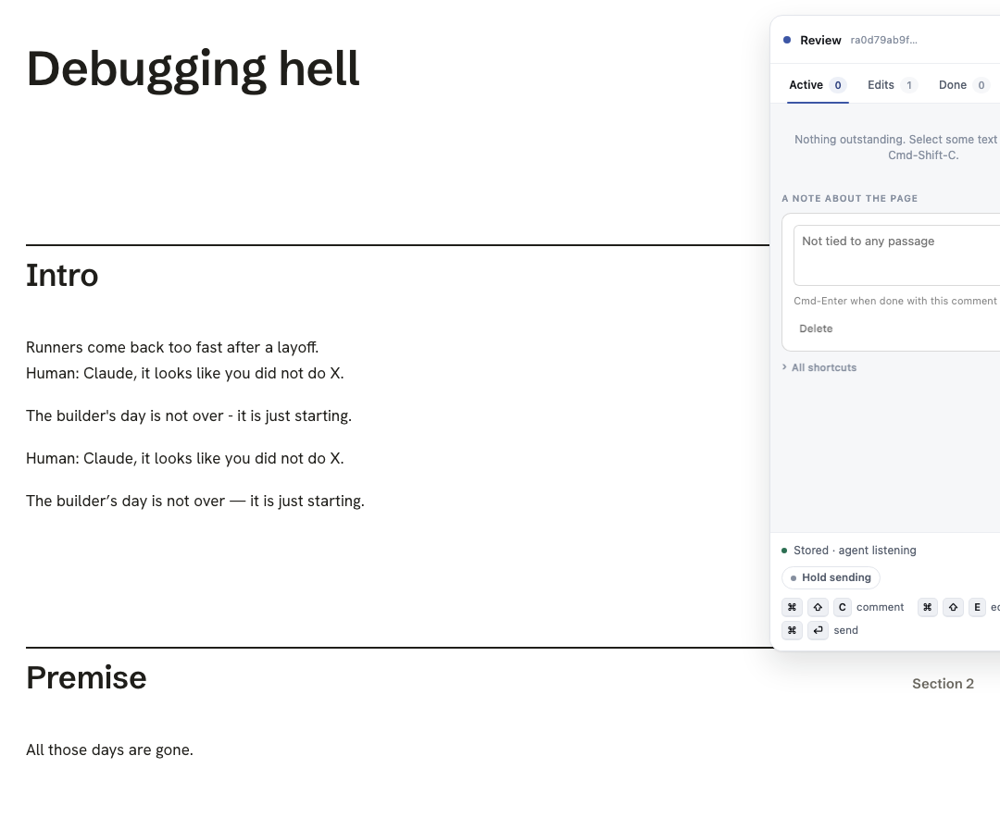
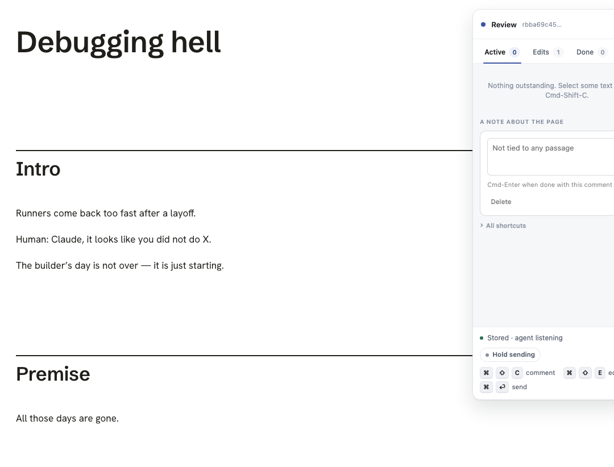

# The reviewer's words, once

Summary: replay was writing every paragraph of a multi-paragraph edit into the
one block it anchors, while the rebuilt page already carried those paragraphs
as blocks of its own. The reviewer's words then stood twice, and a reload put
it right. Two changes stop it: the split compare now reads past typography, and
no write happens that the page's own blocks would double.

Not one of today's merges. The same walk duplicates text at `e4346f1`, before
the anchor climb, the conflict toast, and the split-counts-as-applied change.

## The report

2026-09-22: "multiple agents have now duplicated my written text. i highlight
and write what i want, and they just write it again above or below. i think
after refresh it might fix, but that's not an ok ux." No source file on disk
carried a duplicated paragraph, so the second copy was drawn in the page.

## Cause

The shape that duplicates:

- The reviewer keeps a paragraph and types more under it, so the record's
  `after` is several paragraphs and its `before` is the first one.
- The agent writes them into the Markdown as separate paragraphs, which is
  right, and the rebuilt page has one `
` per paragraph.
- The split check (`splitApplied`, 2026-09-22) asks whether the anchored block
  plus the blocks right after it spell the after. It compares strings exactly,
  so a curly apostrophe or an em dash the Markdown came back with is a miss.
- With the split missed, the anchored block still reads as the `before`. That
  is branch two, re-apply, and the write puts all of the after into that one
  block. The page then says the second and third paragraphs twice: merged into
  the first block, and still standing below it.

A reload did fix it, for one pass: the page renders from its own source again,
and the duplicate only comes back when replay next writes.

## Fix

All in `src/layer/replay.js`. One rule underneath them: write only the pieces
the page is missing, and never a block this record does not own.

- **The split compare reads past typography.** `samePiece` compares two
  paragraphs through `normalize.foldTypography` when the strict compare misses,
  and `splitApplied`, `runAt` and `splitRegion` try strict first and folded
  only after. The question a piece answers is "are these words already on the
  page, in a block of their own", and a curled quote does not change that
  answer.
- **Unless typography IS the edit.** `mayFold` says no to the folded compare
  when the record's before and after fold to the same string. A reviewer who
  went through three paragraphs and curled the quotes would otherwise have
  their edit read as already applied and taken away with nothing said. Folding
  is also never used to decide that a SINGLE block already says the after, so a
  punctuation fix to one paragraph re-applies exactly as before.
- **A write is only what this block is missing.** `splitWritePlan` runs before
  every write of a multi-paragraph after, on the ordinary pass and on "Keep
  mine" alike. When the block right after the anchored one already says the
  after's second paragraph:
  - the anchored block does not yet say the first paragraph: that much is
    written, alone, and the blocks below are left as they are
  - the anchored block already says it: nothing is written and the clash is
    flagged, because every missing piece lives in a block this record does not
    own, and picking which of the page's blocks to replace is a guess (D9)

  "Keep mine" following the same rule matters twice over: writing the whole
  after there doubled the paragraphs AND the next pass then read branch one and
  cleared the conflict, so the doubling stood until a reload.
- **One fold per string.** `folded` memoizes `foldTypography`, which runs four
  regexes, so the folded pass over a container re-reads what the strict pass
  already folded. The memo is dropped whole at 500 entries.

`counters.regionsRefusedDuplicate` counts the refusals and
`counters.regionsWroteMissingPiece` the partial writes.

## Known limit

A record whose words span several blocks binds the container that holds them
all. "Keep mine" on such a record still writes the whole after into that
container, which flattens the page's own blocks inside it. That is older than
this branch and it is a flatten rather than a duplicate, so it is left as its
own change.

## Tests

- `test/browser/no_duplicate_text.spec.js`, the real `lahe review post.md`
  walk, six cases. The typography one was red before the fix and is the
  reported bug:
  - a single paragraph replacement
  - a multi-paragraph replacement the source carries as separate paragraphs
  - a replacement whose first paragraph comes back curled
  - paragraphs appended under an unchanged one
  - the same, where the rebuild curled a quote and lengthened a dash (red
    before the fix: the second and third paragraphs were each on the page
    twice)
  - the same, where the agent reworded the last paragraph
- `test/unit/replay_pass.test.js`, six cases, each red before its fix:
  - a folded split is applied
  - one block is still compared strictly
  - an edit whose only change is quotes and dashes is not swallowed
  - a first paragraph the page is missing is written, and only that
  - "Keep mine" writes only the piece the page is missing
  - a write the page's blocks would double is refused and flagged
- `npm run gate:unit`: 1282 passed, 0 failed.
- Browser, `--workers=1`, 39 passed: `split_not_conflict`, `replay_branches`,
  `replay_human_and_agent`, `conflict_toast`, `italic_sticks`, `inline_reword`,
  `reword_rev`, `paragraph_break`, `keep_mine_live_page`, `no_duplicate_text`: 40 passed.
