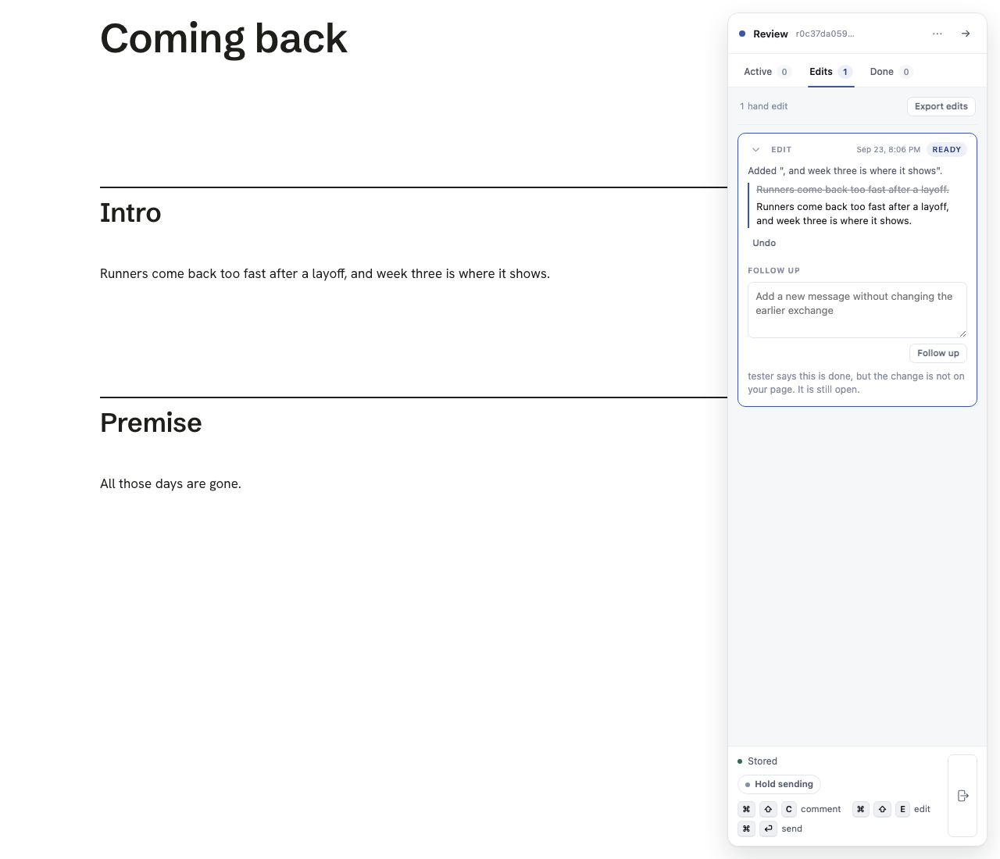

# The rebuild is not the agent's job

Two changes, shipped together, so an agent forgetting to rebuild stops costing
the reviewer their work.

1. LAHE re-renders a Markdown review's page itself when the `.md` moves.
2. A `handled` reply for a hand edit is checked against the built page before
   it retires anything.

Both are done, tested, and green on `npm run gate:unit` plus the browser specs
named below.

---

## The problem, in the owner's words

> i just had a really annoying set of edits where i made the same edit like 3
> times and every refresh reverted it, and when i asked about it the ai said the
> browser had some kind of cache issue because they did a source edit. but i
> think they're just not doing the rebuild. this needs to not be a failure mode
> at all. we cannot rely on the llm to remember to rebuild.

He was right, and it was not a cache.

## What was actually happening

Confirmed by reading the code and then reproducing it in a test:

- `lahe review notes.md` renders the Markdown into an artifact HTML file under
  the session's `review-artifacts` folder. The review's `target_path` is that
  artifact; `source_path` is the `.md`.
- The reload trigger stats the TARGET only
  (`targetMtime` in `src/service/reviews.js`).
- An agent that edits the `.md` and does not rerun `lahe review` leaves the
  artifact byte for byte as it was. Nothing the helper watches has moved, so the
  page never reloads.
- The agent replies `handled` anyway. The item retires.
- Replay only re-applies OUTSTANDING items, so a retired item is no longer put
  back over a reload.
- The reviewer refreshes. Their edit is gone. They make it again. It goes again.

Two failures, and either one alone still loses the work, which is why both are
fixed here.

## Requirements

**R1. LAHE re-renders the page.** When a review has a `source_path` that LAHE
renders, the helper notices the source is newer than the artifact and renders it
again before reporting the modification time the page polls. The page then
reloads onto the new render with no agent action.

**R2. Same shape as the stat it rides on.** A stat when asked, not a watcher,
sharing the mtime cache window.

**R3. Fail soft.** A source that is gone, unreadable, or fails to render must
never break the poll route the page depends on: it logs and answers as before.

**R4. Same render as `lahe review`.** The re-render calls
`markdown.writeArtifact`, the function the CLI calls, so the Mermaid script, the
fonts, the asset prefix and the translated local links are whatever that
function does. Nothing is copied.

**R5. Never someone else's page.** Only Markdown, and only when the target is
the exact artifact LAHE minted for that source in that session. A review whose
target is the reviewer's own build output is never rewritten.

**R6. A handled claim is checked.** When a `handled` reply folds for an EDIT
item, the helper checks whether the item's `after_full` is in the page the
reviewer sees, normalized the way the rest of the tool normalizes text and
tolerant of typography differences.

**R7. A failed check does not retire the item.** It stays outstanding and
carries a field saying the agent said it was handled and the page does not show
it.

**R8. Everyone says the same thing.** The rail says it on the card in the
reviewer's words, with no tool mechanics; `review.json` and `lahe status --json`
carry the same fact, so the agent sees it on its next drain.

**R9. Only edits.** A comment is not checked: there is nothing to look for.

**R10. Cannot tell is not a failure.** A page that cannot be read answers
"cannot tell", and cannot tell is treated as present. The tool does not hold an
item open on a guess.

**R11. The contract travels.** The change to what `handled` means lands in
`review_format.js`, its restated copy in the unit test, `docs/CONTRACTS.md` and
`skills/lahe/SKILL.md`.

## Approach

### R1 to R5: `src/service/rebuild.js`

A new module. `createRebuilder({dir, log, clock, ttlMs})` returns `refresh(review)`,
which is called by `targetMtime` in `src/service/reviews.js` immediately before
the stat, inside the same TTL window, wrapped in a try so nothing in it can cost
the poll.

`renderableOf` is the whole safety rule in one function: a Markdown source, a
session id, and a target that resolves to exactly
`markdown.artifactPath(dir, session, source)`. Anything else answers null and
nothing is written.

When a re-render produces a link mount the session's static server does not
have, the mount is merged into that server's metadata and the server is sent a
SIGHUP, mirroring what the server already does for itself when it renders a
linked document. Best effort: a mount that does not land is a link that reads as
a 404, and a throw there would be the reviewer's poll.

### R6 to R10: `src/service/handled_check.js`

`createHandledCheck({dir, log, rebuild}).pageShows(reviewId, item)` returns true,
false, or null. It refreshes the page first, so an agent that edits the source
and replies in the same breath is judged against the render its edit produces.

The comparison is `normalize.textOf` for the page's words, then entity decoding,
then `normalize.foldTypography`, which is the shared function replay's second
pass already uses. There is no second normalizer. The entity step is new and
necessary: marked writes an apostrophe as `&#39;`, so without it every sentence
with an apostrophe failed the check. Both sides go through the same function, so
it cannot make the two disagree.

`src/service/replies.js` asks the check for a handled line and passes
`page_shows_change: false` into `lifecycle.applyReply` when it comes back false.
`lifecycle.applyReply` then accepts the reply, leaves the item's state where it
was, and returns `not_on_page: true`. That is the same shape a `question` reply
already has: the agent's words reach the card, the work stays outstanding.

### The field

`handled_not_on_page`, one name everywhere: the record field, the fold event
payload, the projection, `review.json`, and `lahe status --json`.
`record.isUnansweredReady` was widened for it, because an item carrying a reply
would otherwise drop off the drain list and the agent would never hear that its
change did not arrive.

### The wording

On the card: `"<agent> says this is done, but the change is not on your page. It
is still open."` No rebuild, no render, no reply file. The reviewer is looking at
a document.

One thing that turned up only in the screenshot: the rail's wordless fallback
for a handled reply says "<agent> carried this change into the source", which sat
directly above a notice saying it had not arrived. An agent that wrote real
words still gets them drawn; the invented confirmation is suppressed when the
check failed.

## Tasks

| # | Task | State |
| --- | --- | --- |
| T1 | `src/service/rebuild.js`, wired into `targetMtime` | done |
| T2 | `src/service/handled_check.js` | done |
| T3 | `lifecycle.applyReply` takes the page's verdict | done |
| T4 | The field: record, fold event, projection, review.json, status | done |
| T5 | The card notice, and suppressing the contradicting fallback | done |
| T6 | Contract text in all four copies, `install-skills` run | done |
| T7 | Unit tests, red first | done |
| T8 | Browser spec through the real `lahe review file.md` walk | done |
| T9 | Screenshot | done |

## Acceptance criteria

| # | Criterion | Where it is proven |
| --- | --- | --- |
| A1 | A source newer than the artifact re-renders it | unit: "a Markdown source newer than the page re-renders it" |
| A2 | An unchanged source does not | unit: "an unchanged source is not re-rendered" |
| A3 | A failing render still answers the poll | unit: "a source that cannot be rendered still answers the poll" |
| A4 | A non-LAHE target is never rewritten | unit: "a review whose page is not LAHE's own render is never rewritten" |
| A5 | After text present retires the item | unit: "a handled edit whose words are on the page retires" |
| A6 | Absent keeps it outstanding with the field | unit: "a handled edit the page does not show stays open, and says why" |
| A7 | A typography-only difference counts as present | unit: "a typography-only difference counts as the change having arrived" |
| A8 | A comment is unaffected | unit: "a comment is not checked against the page" |
| A9 | The page reloads on the agent's `.md` edit alone, and the reviewer's edit survives | browser: "the agent edits the Markdown and reruns nothing, and the page follows" |
| A10 | The card, `review.json` and the drain all say it | browser: "a handled reply the page does not bear out leaves the item open, and says so" |

## Progress

Everything above is built and green.

- `npm run gate:unit`: 1296 pass, 0 fail (lint, no jsdom, manifest complete,
  1298 tests with 2 pre-existing todos).
- `npx playwright test test/browser/rebuild_not_the_agents_job.spec.js --workers=1`:
  2 passed.
- `npx playwright test test/browser/markdown_render.spec.js
  test/browser/auto_reload.spec.js test/browser/no_duplicate_text.spec.js
  test/browser/agent_replies.spec.js --workers=1`: 34 passed.

Verified red first: with `src/` stashed, the new unit file is 7 failing, 5
passing, and the 5 are its negative controls.

Not done, and deliberately:

- `dist/lahe-layer.js` was rebuilt locally for the browser specs and is not
  committed, per the repo's builder rule.
- Nothing is pushed or merged.
- No dark screenshot. Neither the rail nor the vendored document style has a
  `prefers-color-scheme` rule, so a dark capture is the light one under another
  filename.

### To delete at cleanup

- `docs/features/20260923.01_rebuild_not_the_agents_job/card_not_on_page_light.png`
  and `card_not_on_page_dark.png`: the first two captures, before the spec
  settled on one file. `card_not_on_page.png` is the one the spec embeds.
- `.claude-commit202609232359-rebuild` and the other `.claude-commit*-rebuild`
  files in the worktree root: commit-message scratch pads, gitignored.

## Screenshot

The reviewer's card after an agent replied handled without touching the file.
The item still says READY, the reviewer's own edit is still on the card, and the
last line says what happened.

