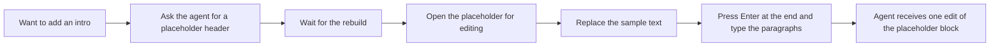

# Feature Brief: Free writing

## Context

Lahe is a co-authoring tool. A reviewer reads a page an agent produced, comments on it, and edits text in place. Editing an existing block works well for small changes. What is missing is the other half of co-authoring: the reviewer writing their own text.

Today the only way to add text is to open an existing block for editing, press Enter at its end, and keep typing. The new paragraphs are recorded as a change to that neighbor block. There is no way to make a header. There is no way to start on an empty page. To add an introduction, Ken asks the agent for a placeholder header with sample text, waits for it, then edits it.

Prior work: the crucible in this folder (`00_crucible.md`) and the questions page Ken answered (`00_crucible_questions.md`). The original Lahe brief's editing requirements assume the text already exists.

## Goal / Problem

Let a reviewer write new text on a Lahe page the way they edit existing text: without asking the agent for a place to type, with headers as well as paragraphs, and with each piece of new text reaching the agent as its own record. Cover three jobs:

- **Writing to publish.** Blog posts and articles, written by hand, with the agent proofreading afterward.
- **Writing notes.** A blank document the reviewer can type into and look back at, with the agent organizing it later.
- **Editing.** Word-for-word and formatting changes that stay exactly as made.

The key design question, left to the architecture: whether new writing runs on Lahe's own editing code or on a vendored editor library (Tiptap). The crucible records both as open.

## Non-Goals

::: callout-nongoal
- Not a new mode. Writing must feel like the edit mode the reviewer already has.
- Not an editor library added to `dependencies`. The zero-runtime-dependency rule holds; a vendored file is allowed.
- Not lists, tables, images, or links in the first cut. Paragraphs and headers first.
- Not agent-written text. This is the reviewer's own writing; the agent proofreads and suggests, it does not compose.
- Not a change to how comments work.
- Not mobile. The job happens on a laptop.
:::

## User & Context

Ken today, and later anyone co-writing a document with an agent. No defined ideal customer yet.

The scene is a document on a laptop with the rest of Lahe running. The agent may be working at the same time, so the page can reload while the reviewer is typing. The reviewer is writing several paragraphs, sometimes a whole section with its own header, sometimes a blank page of notes from the first line.

## User Stories

- **As a writer publishing a post**, I want to add a header and several paragraphs anywhere on the page so that I can draft my own section without asking the agent for a placeholder.
- **As a writer publishing a post**, I want the agent to proofread what I wrote and suggest fixes so that I get a second read without losing my wording.
- **As someone taking notes**, I want to open a blank document and start typing so that I can see what I have already written instead of scrolling a chat log.
- **As someone taking notes**, I want the agent to organize my notes afterward when I ask so that the raw page becomes a usable document.
- **As an editor**, I want a bold or italic change to reach the agent correctly and stay on the page so that formatting edits are not lost or misread.
- **As any reviewer**, I want each piece of new text to reach the agent as its own item so that the agent knows what is new and where it goes.

## Solution Outline

The reviewer enters editing the way they do now. From there they can write new text where there is none: after a block, at the end of the page, or on an empty page. As they type, Enter makes a new paragraph, and a header is one step away. What they write in one sitting reaches the agent as new text with a place on the page, separate from any change to existing blocks. The page looks right while they write: the new blocks use the page's own styling, so spacing and type match the rest of the document.

A blank document can be started from the command line and served like any other review, so notes begin on an empty page with the rail already there.

Bold and italic changes to existing text are fixed so they arrive at the agent as the reviewer made them and survive the rebuild.

After a long hand-written block lands, the agent proofreads it and offers suggestions on the card. It does not change the reviewer's words unless asked.

## Requirements

### Writing new text

::: callout-req
**R1:** A reviewer can write new text where none exists: after any block, at the end of the page, and on an empty page. No existing block is needed to start.
:::

::: callout-req
**R2:** Entering writing uses the same gesture family as entering an edit. It does not feel like a separate mode.
:::

::: callout-req
**R3:** While writing, Enter starts a new paragraph, and the reviewer can make a block a header without leaving the keyboard or the page.
:::

::: callout-req
**R4:** New blocks use the page's own styling. Spacing, type, and header sizes match the surrounding document while writing and after commit.
:::

::: callout-req
**R5:** Every keystroke of new text is saved, the same as an edit today. A reload, a page repaint, or a helper restart loses nothing.
:::

::: callout-req
**R6:** The reviewer's words are kept exactly as typed. Nothing rewrites them on the page, in the record, or in the source.
:::

### Reaching the agent

::: callout-req
**R7:** New text reaches the agent as its own item, with the place on the page it belongs. It is not recorded as a change to a neighboring block.
:::

::: callout-req
**R8:** The item carries the block structure the reviewer wrote: which lines are paragraphs and which are headers, and any bold or italic inside them.
:::

::: callout-req
**R9:** The agent contract and the skill say how to place new text in the source, for HTML and for Markdown, and how to reply. An agent that reads only `review.json` has everything it needs.
:::

::: callout-req
**R10:** A `handled` reply for new text is checked against the built page the same way a hand edit is: the words must be on the page before the item retires.
:::

### A blank document

::: callout-req
**R11:** A reviewer can start a blank document from the command line and have it served with the rail, so notes begin on an empty page.
:::

::: callout-req
**R12:** Text written on a blank document is saved to a source file on disk that the reviewer named, so notes are a file the reviewer owns, not only a review record.
:::

### Formatting edits

::: callout-req
**R13:** A bold or italic change to existing text reaches the agent as the reviewer made it, is applied to the source, and is still on the page after the rebuild. The current failure has to be reproduced and named before this is built.
:::

### Undo and delete

::: callout-req
**R14:** New text can be undone by the reviewer like any other edit. Undoing new text removes it and, if the agent already placed it, asks the agent to take it back out.
:::

## AI Behavior

- After a hand-written block longer than a short paragraph lands, the agent proofreads it and offers suggestions on the card as a question. It does not change the reviewer's words unless the reviewer says yes.
- On a notes document, the agent organizes only when asked. Unasked, it places the text and stops.
- The agent never composes new prose in a region the reviewer wrote. A suggestion is a suggestion on the card, not a rewrite in the source.
- When the agent cannot tell where new text belongs, it asks rather than guessing.

## Success Metrics

::: callout-metric
- Ken drafts a blog post section, header and paragraphs, on a Lahe page without asking the agent for a placeholder, and the agent's placement matches what he wrote block for block.
- Ken takes a page of notes on a blank document and can read the whole page back without leaving it.
- Ten bold or italic edits in a row reach the source and survive the rebuild, with zero lost or misread.
- No new-text item arrives at the agent as a change to a neighboring block.
:::

## UX Notes

The wireframe phase decides what the reviewer sees. Two constraints from the crucible: it must feel like the existing edit mode, and the new blocks must look like the rest of the page while being written. Screenshots ship with the build, light and dark.

## Analytics / Logging

Every new-text item is an event in the review log like any other item. No new analytics.

## Rollout / Flags

None. The record shape gains a new item kind, and the contract text changes. Existing reviews keep working: an old page with no new-text items is unaffected.

## Open Questions

::: callout-question
**Q1:** Tiptap or Lahe's own editing code as the engine for new writing? Architecture decides, after a spike. The brief holds either way.
:::

::: callout-question
**Q2:** What is the formatting bug, exactly? R13 (bold and italic reach the agent and survive the rebuild) needs a reproduction before it can be built. Assigned as the crucible's first action.
:::

::: callout-question
**Q3:** Is "proofread and suggest" triggered by length, by the reviewer asking, or always? The AI Behavior section assumes length; Ken should confirm.
:::

## PM Review

| # | Finding | Disposition | Rationale |
|---|---------|-------------|-----------|
| | Review pending | | |
