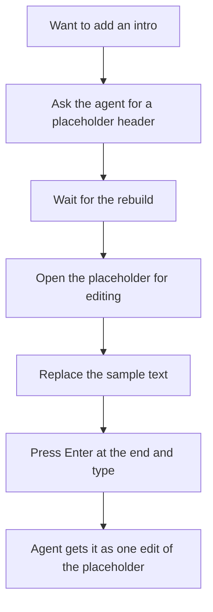

# Feature Brief: Free writing

## Context

Lahe is a co-authoring tool. A reviewer reads a page an agent produced, comments on it, and edits text in place. Editing an existing block works well for small changes. What is missing is the other half of co-authoring: the reviewer writing their own text, or even starting the doc from scratch.

Today the only way to add text is to open an existing block for editing, press Enter at its end, and keep typing. The new paragraphs are recorded as a change to that neighbor block. There is no way to make a header, and no way to start on an empty page. To add an introduction, Ken asks the agent for a placeholder header and edits it when it arrives.

Prior work: the crucible in this folder (`00_crucible.md`) and the questions page Ken answered (`00_crucible_questions.md`). The original Lahe brief's editing requirements assume the text already exists. One formatting bug is already on the board as `LAHE-lone-paragraph-loses-markup`: a paragraph written on its own loses its bold and italic when the page already carries the rest of the edit. It is recorded in `docs/features/20260922.08_no_duplicate_text/NOTES.md`. This feature absorbs that row.

## Goal / Problem

Let a reviewer write new text on a Lahe page the way they edit existing text. That means:

- no asking the agent for a place to type
- headers as well as paragraphs
- new text reaches the agent as new text

Cover three jobs:

1. **Writing to publish.** Blog posts and articles, written by hand, with the agent proofreading afterward.
2. **Writing notes.** A blank document the reviewer can type into and look back at, with the agent organizing it later when asked.
3. **Editing.** Word-for-word and formatting changes that stay exactly as made.

## Non-Goals

::: callout-nongoal
- A new mode. While the existing edit mode can be updated, there should not be a difference between edit and write new, in terms of what the users sees in the editor.
- An editor library added to `dependencies`. The zero-runtime-dependency rule holds. A vendored file is allowed.
- Tables, images, or links in the first cut.
- Keeping rich formatting from a paste, unless the editor engine gives it for free. Board row `LAHE-rich-paste`.
- Agent-written text. The reviewer writes; the agent proofreads and suggests.
- A change to how comments work.
- Mobile. The job happens on a laptop.
:::

## User & Context

Ken today, and later anyone co-writing a document with an agent. No defined ideal customer yet.

The scene is a document on a laptop with the rest of Lahe running. The agent may be working at the same time, so the page can reload while the reviewer is typing. The reviewer is writing one of:

- several paragraphs
- a section with its own header
- a blank page of notes, from the first line

## User Stories

- **As a writer publishing a post**, I want to add a header and several paragraphs anywhere on the page so that I can draft my own section without asking the agent for a placeholder.
- **As a writer publishing a post**, I want the agent to proofread what I wrote and suggest fixes so that I get a second read without losing my wording.
- **As someone taking notes**, I want to open a blank document and start typing so that I can see what I have already written instead of scrolling a chat log.
- **As someone taking notes**, I want the agent to organize my notes afterward when I ask so that the raw page becomes a usable document.
- **As an editor**, I want a bold or italic change to reach the agent correctly and stay on the page so that formatting edits are not lost or misread.
- **As any reviewer**, I want the agent to know which text is new and where it goes so that it lands in the right place in the source.

## Solution Outline

The reviewer starts writing the way they start an edit today, and can do it where there is no text yet. They make paragraphs, headers, and lists themselves. The new blocks look like the rest of the page while they write. The agent can tell new text from a change to existing text, and knows where it belongs.

A blank document can be started from the command line and served like any other review, so notes begin on an empty page with the rail already there.

Bold and italic changes to existing text arrive at the agent as the reviewer made them and survive the rebuild.

After a long hand-written block lands, the agent proofreads it and offers suggestions on the card. It does not change the reviewer's words unless asked.

The wireframe and the architecture decide:

- how the reviewer gets into writing
- what they see while writing
- how the record is shaped

## Requirements

### Writing new text

::: callout-req
**R1:** A reviewer can write new text where none exists. No existing block is needed to start. That covers:
- after any block
- at the end of the page
- on an empty page
:::

::: callout-req
**R2:** Starting to write feels like the edit the reviewer already knows. There is no separate mode to learn.
:::

::: callout-req
**R3:** The reviewer can make paragraphs, headers, and lists themselves, without asking the agent. This holds while editing an existing block as well as while writing new text.
:::

::: callout-req
**R4:** New blocks, and blocks the reviewer splits or reshapes while editing, use the page's own styling, while writing and after commit. That means:
- spacing
- type
- header sizes
:::

::: callout-req
**R5:** New text is saved as the reviewer types, the same as an edit draft today. It survives a reload and a repaint of the page. After a reload, the unfinished section is still there to keep writing.
:::

::: callout-req
**R6:** The words stay as typed. Nothing rewrites them on the page, in the record, or in the source. The renderer's typography (curly quotes, dashes) is not a rewrite.
:::

::: callout-req
**R7:** A page reload while the reviewer is writing does not:
- move the cursor
- hide what they have written
- show their new text twice
:::

### Reaching the agent

::: callout-req
**R8:** The agent can tell new text apart from a change to existing text. For new text it also knows:
- where on the page it goes
- which lines are headers
- any bold or italic inside them
:::

::: callout-req
**R9:** The agent contract and the skill say how to place new text in the source, for HTML and for Markdown, and how to reply. An agent that reads only `review.json` has everything it needs.
:::

::: callout-req
**R10:** A `handled` reply for new text is checked against the built page the same way a hand edit is. The words must be on the page before the item is closed.
:::

::: callout-req
**R11:** After the agent places a hand-written block longer than a threshold, it replies with proofreading suggestions as a question on the card and leaves the words unchanged. The threshold is a number the plan sets.
:::

### A blank document

::: callout-req
**R12:** A reviewer can start a blank document from the command line and have it served with the rail, so notes begin on an empty page.
:::

::: callout-req
**R13:** Notes end up in a source file on disk that the reviewer named, so the reviewer owns the file. The agent writes it, placing each piece of new text the same way it does on any other page.
:::

### Formatting edits

::: callout-req
**R14:** A bold or italic change to existing text:
- reaches the agent as the reviewer made it
- is applied to the source
- is still on the page after the rebuild

Known cases that must pass:
- a paragraph written on its own loses its bold and italic (board row `LAHE-lone-paragraph-loses-markup`)
- a new line typed after a header comes out doubled. Steps: open a header for editing, press Enter, type a line, leave the editor. Result: the new line appears twice, once still inside the header and once as a normal line below it. Not yet confirmed whether the agent's rebuild plays a part.
- bold two words in a Markdown page, commit, rebuild (the crucible's assignment)
:::

### Undo and delete

::: callout-req
**R15:** The reviewer can undo new text like any other edit. Undo removes the text from the page. If the agent already placed it, undo also asks the agent to take it back out.
:::

## AI Behavior

- After a hand-written block longer than the R11 threshold (proofreading) lands, the agent offers suggestions on the card as a question. It changes the reviewer's words only when the reviewer says yes.
- On a notes document, the agent organizes only when asked. Unasked, it places the text and stops.
- The agent does not write prose in a region the reviewer wrote. Suggestions go on the card; the source keeps the reviewer's words.
- When the agent cannot tell where new text belongs, it asks.

## Success Metrics

::: callout-metric
- Over the next posts Ken writes in Lahe, zero asks to the agent for a placeholder header or section.
- Notes for a session live on a Lahe page, not in the terminal, and Ken reads them back from the page.
- Every case in the R14 list (bold and italic edits) passes: the edit reaches the source and is on the page after the rebuild.
- On every new-text item, the agent's placement matches what Ken wrote block for block, header included.
:::

## UX Notes

The wireframe phase decides what the reviewer sees, within R2 (feels like today's edit) and R4 (new blocks match the page). Screenshots ship with the build, light and dark.

## Analytics / Logging

Every new-text item is an event in the review log like any other item. No new analytics.

## Rollout / Flags

None. The contract text changes. Existing reviews keep working, since an old page has no new-text items. An agent on an older copy of the skill either can still act on new text or is told to update. The architecture decides which.

## Open Questions

::: callout-question
**Q1:** Tiptap (a vendored editor library) or Lahe's own editing code as the engine for new writing? Ken leans toward Tiptap: it should bring a lot of editing features for free, if it can be made to fit. The architecture tests that fit with a spike and makes the call. The brief holds either way.
:::

::: callout-question
**Q2:** Are there formatting failures beyond the three cases in R14 (bold and italic edits)? The header case now has steps; the architecture confirms whether the agent's rebuild plays a part.
:::

::: callout-question
**Q7 (wireframe):** When a reviewer is editing an existing block and presses Enter at its end, is the new paragraph part of that edit or new text? One consistent rule, and the reviewer should be able to see which it is.
:::

## Decisions (Resolved)

- **Who writes the notes file:** the agent, like any other new text. Lahe is an agentic editor, so notes with no agent attached are not a design case.
- **Lists:** in the first cut, alongside paragraphs and headers.
- **Pasting with its formatting:** not in this feature. If Tiptap brings it for free, keep it. Otherwise the architecture notes what it would cost, and it waits on board row `LAHE-rich-paste`.
- **Larger edits to existing text:** they fail the same way new writing does: new lines, headers, and basic formatting. So the same requirements cover them (R3, making paragraphs, headers, and lists; R4, matching the page's styling; R14, bold and italic surviving). No separate row.

## PM Review

| # | Finding | Disposition | Rationale |
|---|---------|-------------|-----------|
| RF1 | R13 stated before its reproduction; missed the board row and the under-a-header case | Accepted | Now R14 with three named cases; board row absorbed; Q2 narrowed to unknown causes |
| RF2 | Brief pre-decided one record per sitting, header by keyboard, and the item shape | Accepted | R2, R3, R7, R8 rewritten as outcomes; "in one sitting" and the record-kind line removed |
| RF3 | Proofreading had no requirement; Q3 reopened a settled trigger | Accepted | Now R11; threshold left to the plan |
| RF4 | Notes: who writes the file, and does it work with no agent | Accepted | Put to Ken; he chose the agent. R13 updated, recorded under Decisions |
| RF5 | Enter at the end of an existing block: same edit or new text? | Accepted | Q7 for the wireframe; metric reworded |
| RF6 | No requirement for a rebuild landing mid-writing | Accepted | Now R7 |
| RF7 | Metrics were one-off demos | Accepted | Rewritten against the status-quo costs |
| RF8 | Lists cut silently; paste and larger edits unsaid | Accepted | Put to Ken as Q4, Q5, Q6. Lists: in. Rich paste: out, to the board. Larger edits: same failures, folded into R3 and R4 |
| RF9 | "Word for word" fails on renderer typography | Accepted | R6 carve-out |
| RF10 | Tiptap said three times; old agents not covered in Rollout | Accepted | Goal paragraph cut; Rollout line added |
| RF11 | R5 overstated draft saving | Accepted | R5 reworded to match today's saving and to say what a reload shows |
